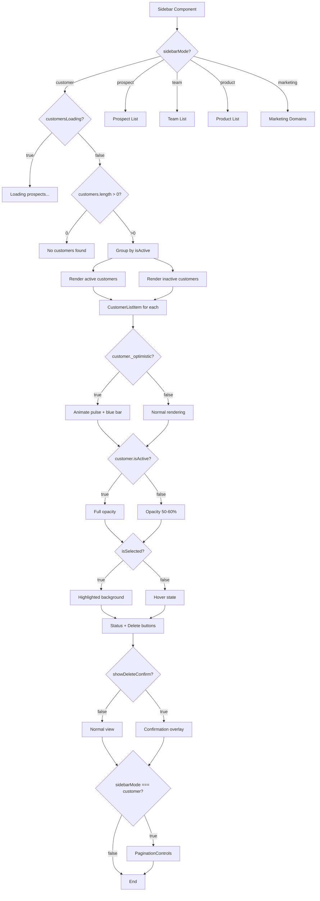

# Customer Backend Integration - UI Workflows

This document describes the conditional rendering patterns and state-dependent UI workflows for the customer backend integration feature.

---

## 1. Render Decision Tree

### Customer List Sidebar Flow

### Customer Details View Flow

```mermaid
flowchart TD
    DetailsStart[CustomerDetails] --> ProspectCheck{isProspect?}

    ProspectCheck -->|true| ProspectHeader[Show Prospect: prefix]
    ProspectCheck -->|false| CustomerHeader[Show customer name]

    ProspectHeader --> IndustryCheck{customer.Industry exists?}
    CustomerHeader --> StatsCheck{stats exist?}

    IndustryCheck -->|true| ShowIndustry[Industry badge]
    IndustryCheck -->|false| VapiCheck

    ShowIndustry --> VapiCheck{vapiTesting?}
    StatsCheck -->|true| Show3Stats[Active Projects, Unbilled Hours, Total Sales]
    StatsCheck -->|false| VapiCheck

    VapiCheck -->|true| ShowVapiBadge[VAPI Testing badge]
    VapiCheck -->|false| ContactInfo
    Show3Stats --> VapiCheck

    ShowVapiBadge --> ContactInfo[Load contact information]
    ContactInfo --> ContactSource{nestedContacts.loading?}

    ContactSource -->|true| WaitForContacts[Wait...]
    ContactSource -->|false| HasNested{Has nested emails/phones?}

    HasNested -->|true| ShowPrimary[Display primary + count badges]
    HasNested -->|false| FallbackFlat[Display flat FileMaker fields]

    ShowPrimary --> NoContact{No contact at all?}
    FallbackFlat --> NoContact

    NoContact -->|true| ShowEmpty[No contact information message]
    NoContact -->|false| ActionButtons

    ShowEmpty --> ActionButtons{isProspect?}

    ActionButtons -->|true| ProspectActions[Convert to Customer + Edit]
    ActionButtons -->|false| CustomerActions[Activity Report + New Project]

    ProspectActions --> ProjectForm{showNewProjectInput?}
    CustomerActions --> ProjectForm

    ProjectForm -->|true AND not prospect| ShowProjectForm[ProjectCreationForm]
    ProjectForm -->|false| ProspectFormCheck

    ShowProjectForm --> ProspectFormCheck{showProspectForm AND isProspect?}
    ProspectFormCheck -->|true| ShowProspectForm[ProspectForm modal]
    ProspectFormCheck -->|false| ActivityCheck

    ShowProspectForm --> ActivityCheck{showActivityReport AND not prospect?}
    ActivityCheck -->|true| ShowActivity[ActivityReportModal]
    ActivityCheck -->|false| ErrorCheck

    ShowActivity --> ErrorCheck{groupingError AND not prospect?}
    ErrorCheck -->|true| ShowError[Error banner with message]
    ErrorCheck -->|false| TabsCheck

    ShowError --> TabsCheck{isProspect?}
    TabsCheck -->|true| ProspectTabs[Touch History + Email Campaign tabs]
    TabsCheck -->|false| ProjectTabs[ProjectTabs + CustomerTabs]

    ProspectTabs --> TabContent{activeProspectTab?}
    TabContent -->|touch-history| TouchPlaceholder[Coming soon message]
    TabContent -->|email-campaign| EmailPlaceholder[Coming soon message]

    ProjectTabs --> End[End]
    TouchPlaceholder --> End
    EmailPlaceholder --> End
```

### Customer Form Flow

```mermaid
flowchart TD
    FormStart[CustomerForm] --> EditCheck{customer prop exists?}

    EditCheck -->|true| EditMode[isEditMode = true]
    EditCheck -->|false| CreateMode[isEditMode = false]

    EditMode --> InitializeForm[Load customer data into state]
    CreateMode --> BlankForm[Initialize blank form]

    InitializeForm --> EmailCheck{customer.emails array exists?}
    BlankForm --> DefaultContacts[1 email, 1 phone, 1 address]

    EmailCheck -->|true| LoadEmails[Map to emails state with IDs]
    EmailCheck -->|false| FlatEmailCheck{customer.Email exists?}

    FlatEmailCheck -->|true| SingleEmail[1 email from flat field]
    FlatEmailCheck -->|false| DefaultContacts

    LoadEmails --> PhoneCheck{customer.phones array?}
    SingleEmail --> PhoneCheck

    PhoneCheck -->|true| LoadPhones[Map to phones state]
    PhoneCheck -->|false| FlatPhoneCheck{customer.Phone?}

    FlatPhoneCheck -->|true| SinglePhone[1 phone from flat]
    FlatPhoneCheck -->|false| DefaultContacts

    LoadPhones --> AddressCheck{customer.addresses array?}
    SinglePhone --> AddressCheck

    AddressCheck -->|true| LoadAddresses[Map to addresses state]
    AddressCheck -->|false| FlatAddressCheck{customer.Address?}

    FlatAddressCheck -->|true| SingleAddress[1 address from flat]
    FlatAddressCheck -->|false| DefaultContacts

    LoadAddresses --> RenderSections[Render form sections]
    SingleAddress --> RenderSections
    DefaultContacts --> RenderSections

    RenderSections --> BasicInfo[Business Name + Primary Contact + Type + Active]
    BasicInfo --> EmailSection[Email section with Add button]

    EmailSection --> EmailLoop{For each email}
    EmailLoop --> EmailRow[Email input + Type dropdown + Primary checkbox + Remove]
    EmailRow --> EmailValidation{errors email_index?}
    EmailValidation -->|true| ShowEmailError[Show validation error]
    EmailValidation -->|false| PhoneSection

    ShowEmailError --> PhoneSection[Phone section with Add button]
    PhoneSection --> PhoneLoop{For each phone}
    PhoneLoop --> PhoneRow[Phone input + Type dropdown + Primary checkbox + Remove]
    PhoneRow --> PhoneValidation{errors phone_index?}
    PhoneValidation -->|true| ShowPhoneError[Show validation error]
    PhoneValidation -->|false| AddressSection

    ShowPhoneError --> AddressSection[Address section with Add button]
    AddressSection --> AddressLoop{For each address}
    AddressLoop --> AddressCard[Address lines + City + State + Postal + Country + Primary + Remove]
    AddressCard --> AddressValidation{errors address_index_field?}
    AddressValidation -->|true| ShowAddressError[Show validation error]
    AddressValidation -->|false| EnvCheck

    ShowAddressError --> EnvCheck{env.type === FILEMAKER?}
    EnvCheck -->|true| ShowLegacy[Additional Info + Database Info sections]
    EnvCheck -->|false| SubmitButtons

    ShowLegacy --> SubmitButtons[Cancel + Create/Update buttons]
    SubmitButtons --> SubmitClick{User clicks submit}

    SubmitClick --> ValidateForm{validateForm passes?}
    ValidateForm -->|false| HighlightErrors[Show errors array]
    ValidateForm -->|true| PrepareData

    HighlightErrors --> WaitForFix[Wait for user to fix]
    WaitForFix --> SubmitClick

    PrepareData --> SubmitEnvCheck{env.type === WEBAPP?}
    SubmitEnvCheck -->|true| BackendPayload[Nested arrays with IDs]
    SubmitEnvCheck -->|false| FileMakerPayload[Flat primary-only payload]

    BackendPayload --> SubmitModeCheck{isEditMode?}
    FileMakerPayload --> SubmitModeCheck

    SubmitModeCheck -->|true| UpdateCustomer[updateCustomer API]
    SubmitModeCheck -->|false| CreateCustomer[createCustomer API]

    UpdateCustomer --> Success[Show success + Refresh list + Close]
    CreateCustomer --> AutoSelect[Auto-select new customer after delay]
    AutoSelect --> Success

    Success --> End[End]
```

---

## 2. Render Branch Table

| Condition | Component Rendered | Key Props | File:Line |
|-----------|-------------------|-----------|-----------|
| `sidebarMode === 'customer'` | Customer list with pagination | `customers`, `pagination`, `onCustomerPageChange` | Sidebar.jsx:761-797, 839-847 |
| `sidebarMode === 'prospect'` | Prospect list | `prospects`, `onProspectSelect` | Sidebar.jsx:662-692 |
| `sidebarMode === 'team'` | Team list | `teams`, `onTeamSelect` | Sidebar.jsx:798-821 |
| `sidebarMode === 'product'` | Product list | `sortedProducts`, `handleProductSelect` | Sidebar.jsx:823-834 |
| `sidebarMode === 'marketing'` | Marketing domains list | `marketingContext.marketingDomains` | Sidebar.jsx:693-760 |
| `customers.length === 0` | Empty state message | "No customers found" | Sidebar.jsx:789-796 |
| `customer._optimistic === true` | Animated customer item with pulse | `animate-pulse`, blue bar indicator | Sidebar.jsx:137, 141-146 |
| `customer.isActive === false` | Dimmed customer item | `opacity-50` or `opacity-60` | Sidebar.jsx:134-137 |
| `showDeleteConfirm === true` | Delete confirmation overlay | Modal with Cancel/Delete buttons | Sidebar.jsx:217-255 |
| `isProspect === true` | Prospect header with industry badge | "Prospect: " prefix, industry tag | CustomerHeader.jsx:99-111 |
| `isProspect === false` | Customer header with stats | 3-stat grid: Active Projects, Unbilled Hours, Total Sales | CustomerHeader.jsx:223-259 |
| `vapiTesting === true` | VAPI Testing badge | Green badge in header | CustomerHeader.jsx:112-123 |
| `nestedContacts.loading === true` | Contact info loading state | Wait for Supabase queries | CustomerHeader.jsx:132 |
| `nestedContacts.emails.length > 0` | Primary email with +N badge | Tooltip with count | CustomerHeader.jsx:132-160 |
| `nestedContacts.phones.length > 0` | Primary phone with +N badge | Tooltip with count | CustomerHeader.jsx:132, 162-177 |
| `!displayEmail && !displayPhone && !loading` | No contact info message | Gray text message | CustomerHeader.jsx:178-182 |
| `isProspect === true` (actions) | Convert + Edit buttons | Green Convert, Blue Edit | CustomerHeader.jsx:204-218 |
| `isProspect === false` (actions) | Activity Report + New Project | Blue buttons | CustomerHeader.jsx:189-203 |
| `showNewProjectInput && !isProspect` | Project creation form | `ProjectCreationForm` with customer | CustomerDetails.jsx:127-133 |
| `showProspectForm && isProspect` | Prospect edit modal | `ProspectForm` with prospect data | CustomerDetails.jsx:136-142 |
| `showActivityReport && !isProspect` | Activity report modal | `ActivityReportModal` | CustomerDetails.jsx:145-151 |
| `groupingError && !isProspect` | Error banner | Red background with error message | CustomerDetails.jsx:154-164 |
| `isProspect === true` (tabs) | Prospect tabs: Touch History, Email Campaign | Tab navigation with placeholders | CustomerDetails.jsx:177-231 |
| `isProspect === false` (tabs) | ProjectTabs + CustomerTabs | Active/closed projects, customer info | CustomerDetails.jsx:167-174, 233-234 |
| `activeProspectTab === 'touch-history'` | Touch history placeholder | "Coming soon" message | CustomerDetails.jsx:217-221 |
| `activeProspectTab === 'email-campaign'` | Email campaign placeholder | "Coming soon" message | CustomerDetails.jsx:223-228 |
| `customer prop exists` (form) | Edit mode form | `isEditMode = true`, pre-filled fields | CustomerForm.jsx:30, 69-138 |
| `customer prop is null` (form) | Create mode form | `isEditMode = false`, blank fields | CustomerForm.jsx:30, 34-63 |
| `customer.emails array exists` | Load nested emails with IDs | Map to emails state preserving IDs | CustomerForm.jsx:88-94 |
| `customer.Email exists but no array` | Single email from flat field | Create emails array from FileMaker field | CustomerForm.jsx:95-98 |
| `env.type === FILEMAKER` | Show legacy fields section | Additional Info + Database Info sections | CustomerForm.jsx:826-992 |
| `env.type === WEBAPP` | Hide legacy fields | Only show standard customer fields | CustomerForm.jsx:826 (conditional render) |
| `emails.length > 1` | Show Remove button on email rows | Enabled Remove buttons | CustomerForm.jsx:636-644 |
| `phones.length > 1` | Show Remove button on phone rows | Enabled Remove buttons | CustomerForm.jsx:703-711 |
| `addresses.length > 1` | Show Remove button on address cards | Enabled Remove buttons | CustomerForm.jsx:810-818 |
| `errors[field_name]` | Show validation error | Red border + error message below field | CustomerForm.jsx:526-531, 609-613, 677-679, etc. |
| `loading === true` (pagination) | Disabled pagination controls | Opacity 50%, cursor not-allowed | PaginationControls.jsx:89-96, 124-133 |
| `canGoPrevious === false` | Disabled Previous/First buttons | Opacity 30%, cursor not-allowed | PaginationControls.jsx:128-133, 147-152 |
| `canGoNext === false` | Disabled Next/Last buttons | Opacity 30%, cursor not-allowed | PaginationControls.jsx:176-181, 196-201 |
| `total === 0` | No records message | "No records" text | PaginationControls.jsx:112-114 |
| `loading === true` (pagination indicator) | Loading message | "Loading..." text below controls | PaginationControls.jsx:211-217 |

---

## 3. Derived State

| Variable Name | Computation Logic | Controls | Source | File:Line |
|---------------|-------------------|----------|--------|-----------|
| `isEditMode` | `Boolean(customer)` | Form title, button text, initialization | `customer` prop | CustomerForm.jsx:30 |
| `env` | `getEnvironmentContext()` | Data formatting, API routing, legacy fields visibility | Environment detection service | CustomerForm.jsx:31 |
| `activeCustomers` | `customers.filter(c => c.isActive)` | Which items render in active section | `customers` array | Sidebar.jsx:468-474 |
| `inactiveCustomers` | `customers.filter(c => !c.isActive)` | Which items render in inactive section | `customers` array | Sidebar.jsx:468-474 |
| `stats.active` | `activeCustomers.length` | Display count in sidebar header | `activeCustomers` derived state | Sidebar.jsx:482 |
| `stats.monthlyBillableHours` | `monthlyBillableHours.toFixed(1)` | Billables display in sidebar header | Supabase query result | Sidebar.jsx:483 |
| `sortedProducts` | `products.sort((a,b) => a.name.localeCompare(b.name))` | Product list order | `products` array | Sidebar.jsx:489-493 |
| `isSelected` (customer item) | `selectedCustomer?.id === customer.id` | Background color, text color | `selectedCustomer` state | Sidebar.jsx:768 |
| `isOptimistic` | `customer._optimistic === true` | Pulse animation, blue bar, disabled buttons | `customer._optimistic` flag | Sidebar.jsx:93 |
| `displayEmail` | `extractPrimaryContact(nestedContacts.emails, 'email')` or fallback to `customer.Email` | Email text displayed in header | `nestedContacts.emails` or flat field | CustomerHeader.jsx:134-141 |
| `displayPhone` | `extractPrimaryContact(nestedContacts.phones, 'phone')` or fallback to `customer.Phone` | Phone text displayed in header | `nestedContacts.phones` or flat field | CustomerHeader.jsx:135-141 |
| `additionalEmailsCount` | `nestedContacts.emails.length > 1 ? length - 1 : 0` | +N badge display | `nestedContacts.emails.length` | CustomerHeader.jsx:136 |
| `additionalPhonesCount` | `nestedContacts.phones.length > 1 ? length - 1 : 0` | +N badge display | `nestedContacts.phones.length` | CustomerHeader.jsx:137 |
| `stats` (customer details) | `useMemo(() => calculateRecordsUnbilledHours(...))` | Active projects count, unbilled hours, total sales | `projects`, `projectRecords`, `sales` | CustomerDetails.jsx:37-60 |
| `activeProjects` | `projects.filter(p => p.status === 'Open')` | Active projects tab content | `projects` array | CustomerDetails.jsx:63-88 |
| `closedProjects` | `projects.filter(p => p.status !== 'Open')` | Closed projects tab content | `projects` array | CustomerDetails.jsx:63-88 |
| `currentPage` | `Math.floor(offset / limit) + 1` | Page indicator display | `pagination.offset`, `pagination.limit` | PaginationControls.jsx:28 |
| `totalPages` | `Math.ceil(total / limit)` | Page indicator, last page calculation | `pagination.total`, `pagination.limit` | PaginationControls.jsx:29 |
| `canGoPrevious` | `offset > 0` | Previous/First button enabled state | `pagination.offset` | PaginationControls.jsx:34 |
| `canGoNext` | `has_more || (offset + limit < total)` | Next/Last button enabled state | `pagination.has_more`, `offset`, `limit`, `total` | PaginationControls.jsx:35 |
| `processedCustomers` (hook) | `env.type === FILEMAKER ? processCustomerData(result) : processBackendCustomerList(result).customers` | Customer list data format | `env.type`, API response | useCustomer.js:113-126 |
| `validationFormat` (hook) | `env.type === FILEMAKER ? 'filemaker' : 'backend'` | Which validation rules to apply | `env.type` | useCustomer.js:191-192 |

---

## 4. Loading & Error States

### Loading States

| State | Pattern | Visual Feedback | File:Line |
|-------|---------|-----------------|-----------|
| **Prospects loading** | `prospectsLoading === true` | "Loading prospects..." text in gray | Sidebar.jsx:665-671 |
| **Customers loading** | `customersLoading === true` | Passed to PaginationControls, "Loading..." text | Sidebar.jsx:845, PaginationControls.jsx:211-217 |
| **Contact data loading** | `nestedContacts.loading === true` | Delays contact info rendering until Supabase queries complete | CustomerHeader.jsx:23, 132, 178 |
| **Customer list loading** | `loading === true` in useCustomer | Set during all CRUD operations, blocks UI interactions | useCustomer.js:31, 98, 140, 153, etc. |
| **Search loading** | `isSearching === true` | Indicates search query is in flight | useCustomer.js:44, 406 |
| **Pagination loading** | `loading` prop on PaginationControls | Disables all pagination buttons, shows "Loading..." | PaginationControls.jsx:23, 89, 211-217 |
| **Optimistic customer** | `customer._optimistic === true` | Pulse animation + blue left bar + disabled action buttons | Sidebar.jsx:137, 141-146, 161 |

### Error States

| State | Pattern | Visual Feedback | File:Line |
|-------|---------|-----------------|-----------|
| **Customer list error** | `error` state in useCustomer | Error message stored, formatted error object available | useCustomer.js:32-33, 64-73 |
| **Formatted error** | `formattedError` state with `{ message, code, status, details, field }` | Structured error for UI display | useCustomer.js:33, 66 |
| **Validation errors** | `errors` object with field keys | Red border on inputs, error text below fields | CustomerForm.jsx:66, 526-531, 609-613 |
| **Project grouping error** | `groupingError` state | Red banner with error message and details | CustomerDetails.jsx:33, 78-83, 154-164 |
| **Field-level errors** | `errors[field_name]` (e.g., `errors.business_name`) | Red border + error message below specific field | CustomerForm.jsx:526-531 |
| **Nested field errors** | `errors[email_${index}]`, `errors[phone_${index}]`, `errors[address_${index}_field]` | Red border + error message for nested array items | CustomerForm.jsx:296-298, 303-308, 313-330 |

### Empty States

| State | Pattern | Visual Feedback | File:Line |
|-------|---------|-----------------|-----------|
| **No customers** | `customers.length === 0` | "No customers found" in gray text | Sidebar.jsx:789-796 |
| **No prospects** | `prospects.length === 0` | "No prospects found" in gray text | Sidebar.jsx:672-678 |
| **No teams** | `teams.length === 0` | "No teams found" in gray text | Sidebar.jsx:813-820 |
| **No contact info** | `!displayEmail && !displayPhone && !nestedContacts.loading` | "No contact information" message in gray | CustomerHeader.jsx:178-182 |
| **No pagination records** | `total === 0` | "No records" in pagination footer | PaginationControls.jsx:112-114 |
| **Touch history placeholder** | `activeProspectTab === 'touch-history'` | "Touch History tracking coming soon..." | CustomerDetails.jsx:217-221 |
| **Email campaign placeholder** | `activeProspectTab === 'email-campaign'` | "Email Campaign management coming soon..." | CustomerDetails.jsx:223-228 |

---

## 5. User Role Variations

**Note:** This feature does not currently implement role-based access control. All UI variations are based on **data state** and **environment type**, not user roles.

### Environment-Based Variations

| Environment | Differences | File:Line |
|-------------|-------------|-----------|
| **FileMaker (`ENVIRONMENT_TYPES.FILEMAKER`)** | Shows legacy fields section (OBSI Client No, Charge Rate, Currency flags, DB credentials) | CustomerForm.jsx:826-992 |
| **Web App (`ENVIRONMENT_TYPES.WEBAPP`)** | Hides legacy fields, shows only modern customer fields | CustomerForm.jsx:826 (conditional) |
| **FileMaker** | Uses flat data model (single Email, Phone, Address) | CustomerForm.jsx:95-98, 109-111, 125-136 |
| **Web App** | Uses nested relational model (arrays of emails, phones, addresses with IDs) | CustomerForm.jsx:88-94, 101-107, 114-124 |
| **FileMaker** | Client-side filtering for search if backend unavailable | useCustomer.js:418-420 |
| **Web App** | Backend search endpoint with pagination | useCustomer.js:422-425 |

### Data State Variations

| State | UI Variation | File:Line |
|-------|--------------|-----------|
| **Customer vs Prospect** (`isProspect` prop) | Different header actions (Convert + Edit vs Activity Report + New Project) | CustomerHeader.jsx:189-218 |
| **Customer vs Prospect** | Different tabs (Touch History + Email Campaign vs Projects + Customer Info) | CustomerDetails.jsx:167-234 |
| **Active vs Inactive customer** | Dimmed appearance (opacity 50-60%) for inactive | Sidebar.jsx:134-137 |
| **With vs without stats** | Stats grid shown only for customers (not prospects) | CustomerHeader.jsx:223-259 |

---

## 6. Re-render Triggers

### Component-Level Re-renders

| Component | Triggers | Source | File:Line |
|-----------|----------|--------|-----------|
| **Sidebar** | `customers`, `teams`, `products`, `prospects`, `selectedCustomer`, `selectedTeam`, `selectedProduct`, `sidebarMode`, `pagination`, `customersLoading` props change | Parent index.jsx via props | Sidebar.jsx:405-430 |
| **Sidebar** | `darkMode`, `showFinancialActivity`, `showCustomerForm`, `showTeamForm`, etc. context changes | AppLayout theme, AppStateContext | Sidebar.jsx:431-434 |
| **Sidebar** | `monthlyBillableHours` state changes | Supabase query result via useEffect | Sidebar.jsx:447-462 |
| **CustomerListItem** | `customer`, `isSelected`, `darkMode` props change | Sidebar maps over customers | Sidebar.jsx:81-88, 765-774 |
| **CustomerListItem** | `showDeleteConfirm` local state changes | Local useState | Sidebar.jsx:90 |
| **CustomerHeader** | `customer`, `stats`, `isProspect`, `darkMode` props change | CustomerDetails parent | CustomerHeader.jsx:8-16 |
| **CustomerHeader** | `vapiTesting`, `nestedContacts` local state changes | Supabase queries via useEffect | CustomerHeader.jsx:18-24, 27-88 |
| **CustomerDetails** | `customer`, `projects`, `isProspect` props change | Parent component | CustomerDetails.jsx:17-23 |
| **CustomerDetails** | `stats`, `activeProjects`, `closedProjects` derived state changes | useMemo recalculation when dependencies change | CustomerDetails.jsx:37-60, 63-88 |
| **CustomerDetails** | `showNewProjectInput`, `showActivityReport`, `showProspectForm`, `activeProspectTab` local state changes | Local useState | CustomerDetails.jsx:30-34 |
| **CustomerForm** | `customer`, `darkMode` props change | Parent modal trigger | CustomerForm.jsx:25 |
| **CustomerForm** | `formData`, `emails`, `phones`, `addresses`, `errors` local state changes | User input via onChange handlers | CustomerForm.jsx:34-66 |
| **PaginationControls** | `pagination`, `darkMode`, `loading` props change | Sidebar parent | PaginationControls.jsx:18-24 |

### Hook Re-renders (useCustomer)

| State Change | Triggers | Downstream Effects | File:Line |
|--------------|----------|-------------------|-----------|
| **`loading` state change** | Any CRUD operation start/end | UI loading indicators, disabled buttons | useCustomer.js:98, 140, 153, etc. |
| **`customers` state change** | `loadCustomers`, `handleCustomerCreate`, `handleCustomerUpdate`, `handleCustomerStatusToggle`, `handleCustomerDelete` | Re-renders customer list, updates stats | useCustomer.js:135, 211, 258-264, 301-307, 346-352 |
| **`selectedCustomer` state change** | `handleCustomerSelect`, `handleCustomerUpdate`, `handleCustomerStatusToggle`, `handleCustomerDelete` | Re-renders CustomerDetails with new data | useCustomer.js:170, 267-275, 310-319, 354-359 |
| **`stats` state change** | `customers` change via useEffect | Updates sidebar header stats | useCustomer.js:81-85 |
| **`pagination` state change** | `loadCustomers` result | Updates PaginationControls display | useCustomer.js:136 |
| **`searchResults` state change** | `handleCustomerSearch` debounced execution | Updates search results UI | useCustomer.js:432 |
| **`isSearching` state change** | `handleCustomerSearch` start/end | Shows/hides search loading indicator | useCustomer.js:406, 446 |
| **`searchQuery` state change** | `handleCustomerSearch` immediate | Updates search input value | useCustomer.js:389 |
| **`error` / `formattedError` state change** | Any operation failure | Displays error messages in UI | useCustomer.js:66-67 |

### Context Re-renders

| Context | Triggers | Affected Components | Source |
|---------|----------|-------------------|--------|
| **AppStateContext** | `selectedCustomer`, `showCustomerForm`, `showFinancialActivity`, `sidebarMode` changes | Sidebar, MainContent, Modal visibility | index.jsx, AppStateContext.jsx |
| **ThemeContext** | `darkMode` toggle | All styled components, color classes re-evaluate | AppLayout.jsx, useTheme hook |
| **MarketingContext** | `marketingDomains`, `selectedMarketingDomain` changes | Marketing sidebar list | Sidebar.jsx:438, 696-759 |
| **ProjectContext** | `projects`, `projectRecords` changes | CustomerDetails stats calculation | CustomerDetails.jsx:26 |
| **SnackBarContext** | `showError`, `showSuccess` calls | Snackbar notifications appear | CustomerDetails.jsx:27, CustomerForm.jsx:6 |

---

## Key Observations

### Conditional Rendering Patterns

1. **Environment-aware rendering**: Forms and data processing branch based on `env.type` (FileMaker vs Web App)
2. **Mode-based rendering**: Sidebar content switches entirely based on `sidebarMode` (customer/prospect/team/product/marketing)
3. **State-based overlays**: Modals, confirmation dialogs, and error banners conditionally render on top of main content
4. **Data-driven visibility**: Empty states, loading states, and placeholders appear when data is absent or loading
5. **Nested data fallbacks**: Contact info displays nested backend data if available, falls back to flat FileMaker fields

### State Management Strategy

1. **Local state for UI**: Component-level state for form inputs, modal visibility, delete confirmations
2. **Hook state for data**: `useCustomer` hook manages customer data, pagination, search results
3. **Context for global UI**: App-level modals, sidebar mode, theme in AppStateContext and ThemeContext
4. **Derived state via useMemo**: Stats, grouped customers, sorted products computed from props/state
5. **Ref-based state**: Pagination ref to avoid stale closures, search timeout ref for debouncing

### Performance Optimizations

1. **React.memo**: All list item components (CustomerListItem, TeamListItem, ProductListItem) wrapped
2. **useMemo**: Expensive calculations (stats, grouping, sorting) memoized with dependency arrays
3. **useCallback**: Event handlers memoized to prevent unnecessary re-renders
4. **Debouncing**: Search queries debounced 300ms to reduce API calls
5. **Request cancellation**: Search requests invalidated via requestId to ignore stale responses

---

## Related Files

### Components
- `src/components/customers/CustomerDetails.jsx` - Main customer view orchestrator
- `src/components/customers/CustomerHeader.jsx` - Customer header with stats and contact info
- `src/components/customers/CustomerForm.jsx` - Create/edit customer modal form
- `src/components/layout/Sidebar.jsx` - Customer list sidebar with pagination
- `src/components/common/PaginationControls.jsx` - Reusable pagination UI

### Hooks
- `src/hooks/useCustomer.js` - Customer state management and CRUD operations

### Services
- `src/services/dataService.js` - Environment detection and API routing
- `src/services/customerService.js` - Data transformation utilities

### APIs
- `src/api/customers.js` - Customer API client with environment-aware routing
