# Customer Backend Integration Workflows

This document provides visual workflows for the customer backend integration implementation.

## Implementation Flow

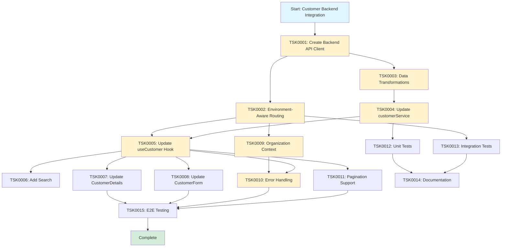

## Data Flow: Web App Environment

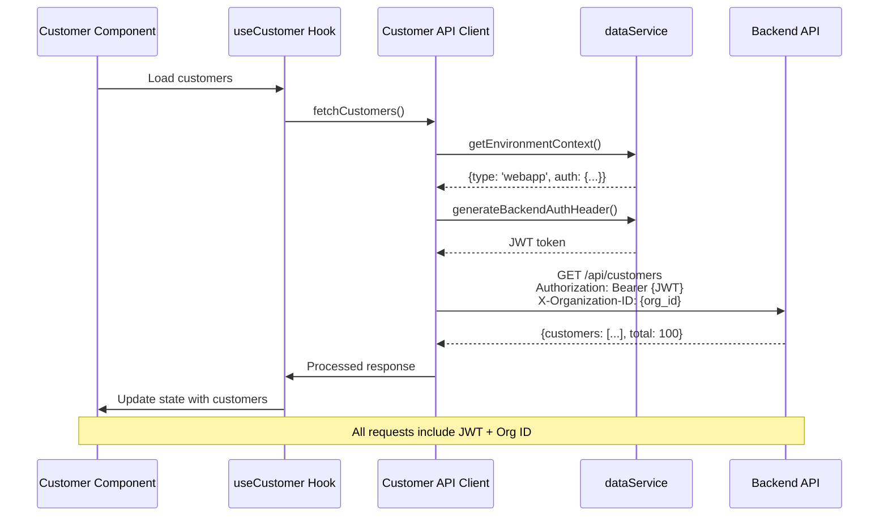

## Data Flow: FileMaker Environment

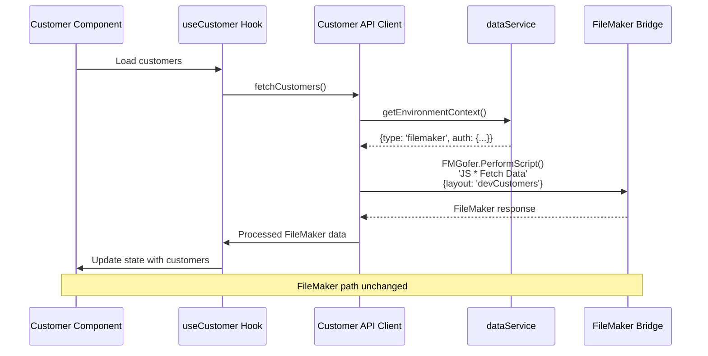

## Data Transformation Flow

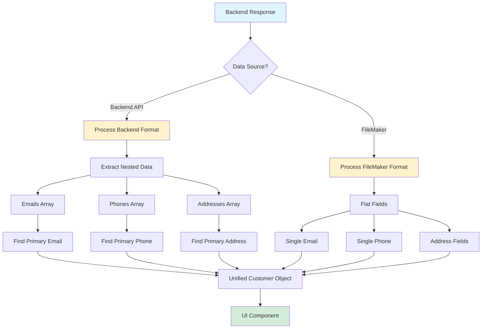

## Customer Create Workflow

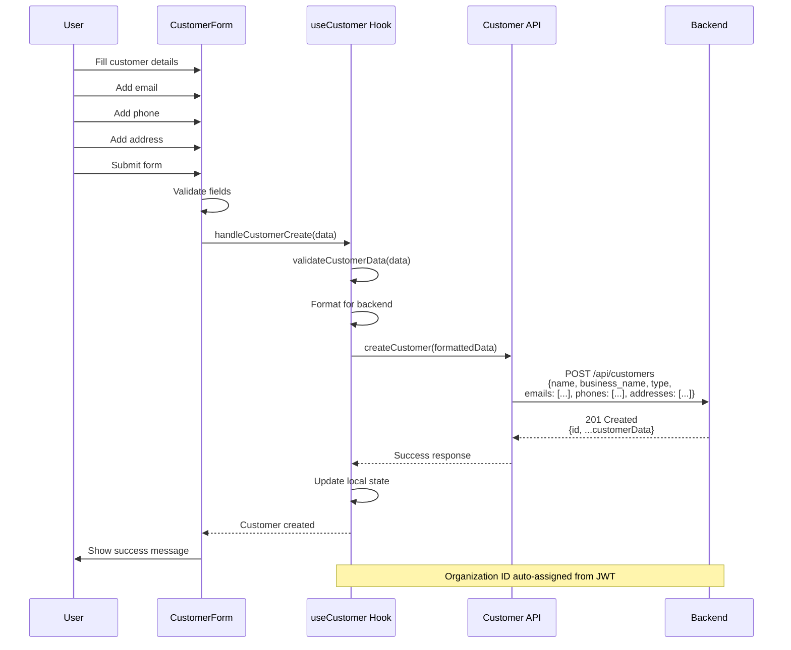

## Customer Update Workflow

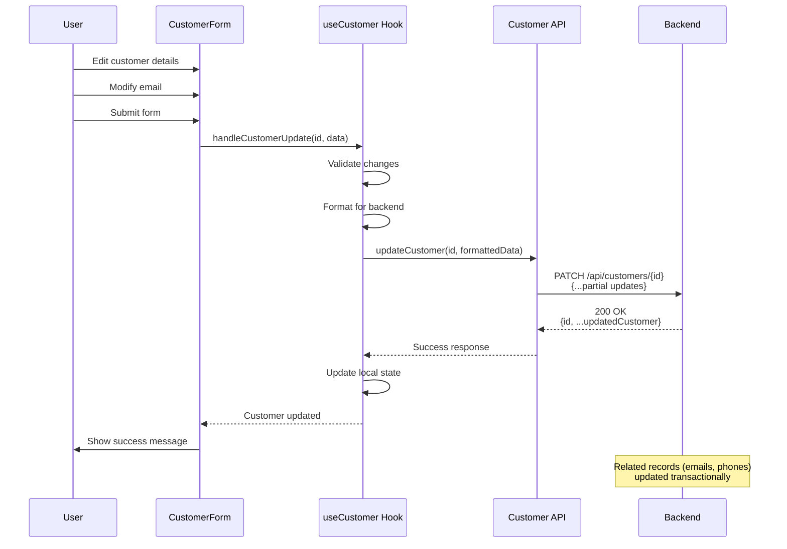

## Error Handling Flow

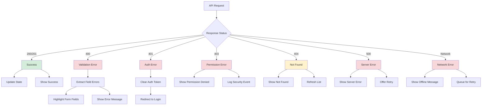

## Environment Detection Flow

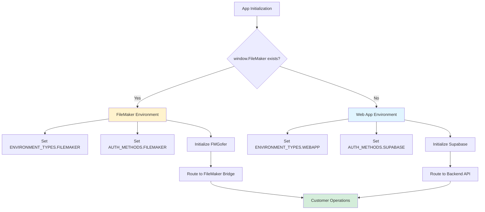

## Pagination Flow

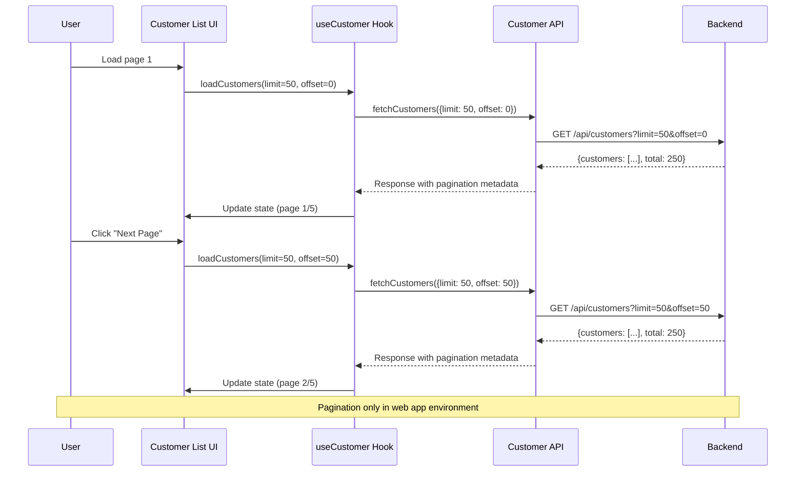

## Search Flow

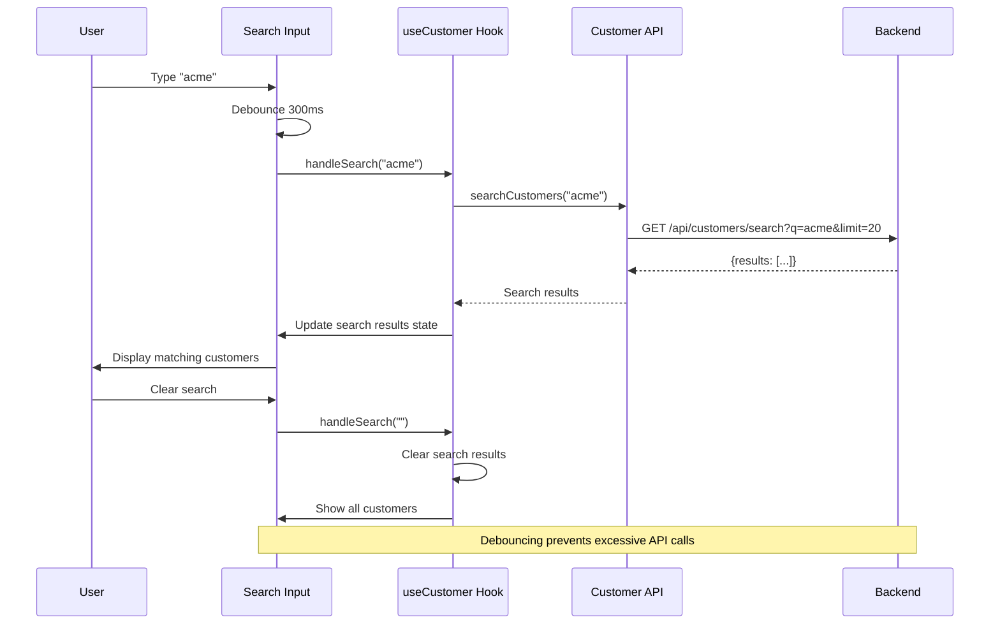

## Testing Strategy Flow

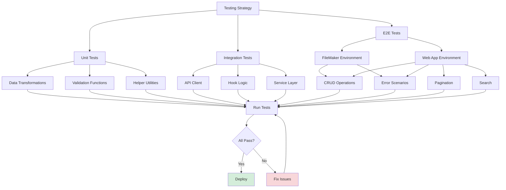
