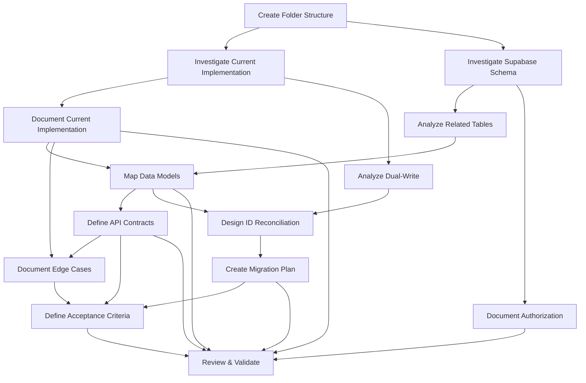
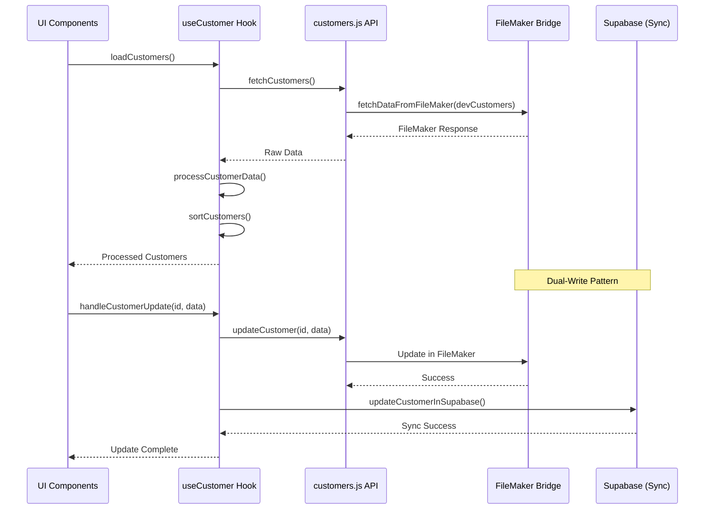
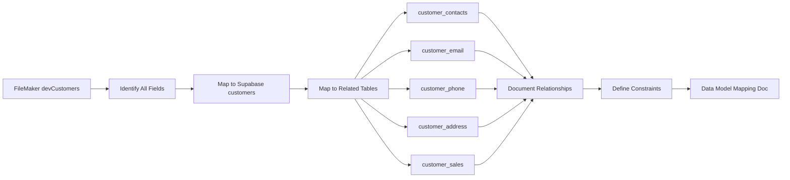
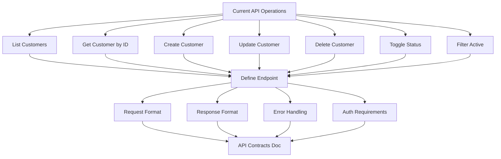
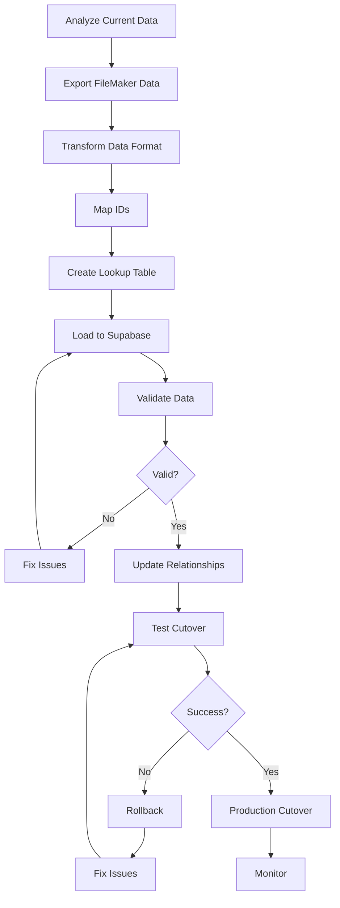
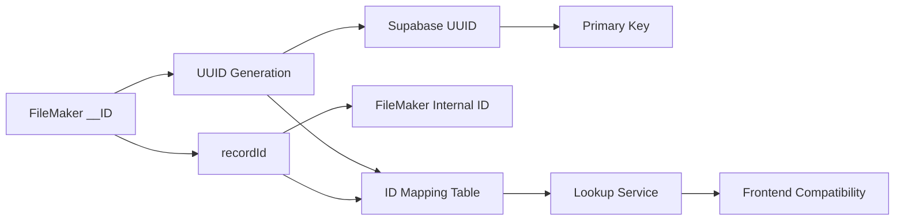
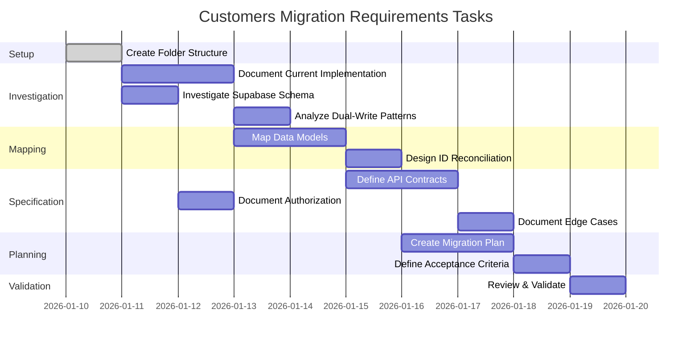
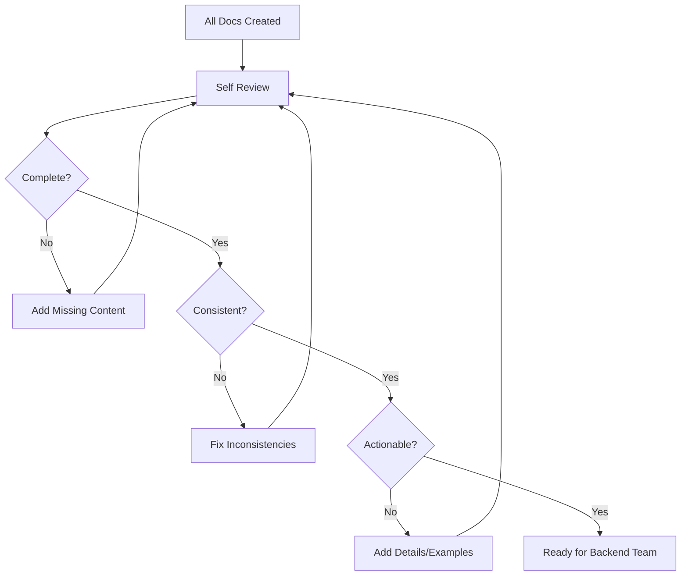

# Customers Migration Requirements Workflows

## Documentation Creation Flow

## Current Implementation Analysis

## Data Model Mapping Process

## API Contract Definition

## Migration Strategy

## ID Reconciliation Flow

## Task Dependencies

## Documentation Review Process

