# FileMaker Frontend Removal - Workflows

## Overview Workflow

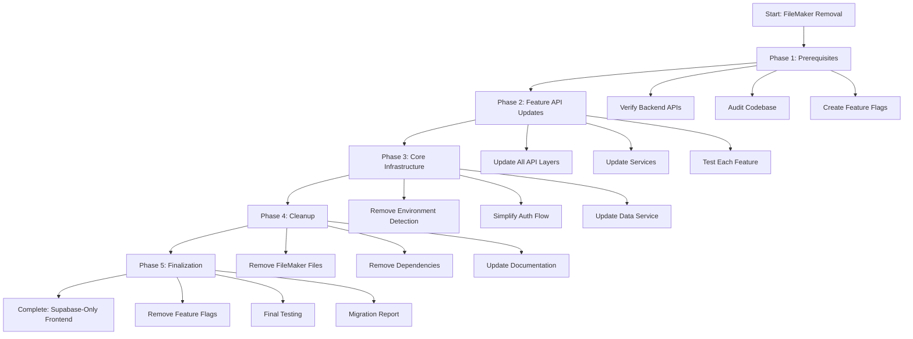

## Phase 1: Prerequisites & Planning

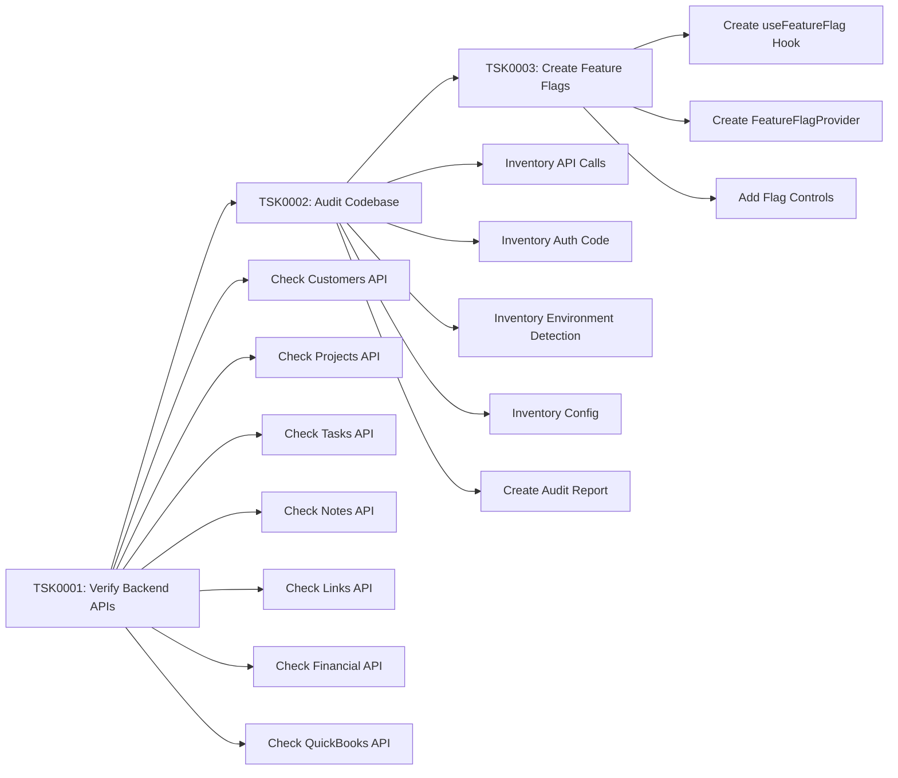

## Phase 2: Feature API Migration

```mermaid
graph TD
    A[Feature API Updates] --> B[TSK0004: Customers API]
    A --> C[TSK0005: Projects API]
    A --> D[TSK0006: Tasks API]
    A --> E[TSK0007: Notes API]
    A --> F[TSK0008: Links API]
    A --> G[TSK0009: Financial Records API]
    A --> H[TSK0010: QuickBooks API]

    B --> B1[Replace fetchCustomers]
    B --> B2[Replace fetchCustomerById]
    B --> B3[Replace createCustomer]
    B --> B4[Replace updateCustomer]
    B --> B5[Add Feature Flag]
    B --> B6[Test Customers Flow]

    D --> D1[Replace Task CRUD]
    D --> D2[Replace Timer Operations]
    D --> D3[Update Financial Record Creation]
    D --> D4[Add Feature Flag]
    D --> D5[Test Tasks & Timer]

    H --> H1[Remove FM Script Calls]
    H --> H2[Add Backend QB Endpoints]
    H --> H3[Update Financial UI]
    H --> H4[Test QB Integration]
```

## Phase 3: Core Infrastructure Removal

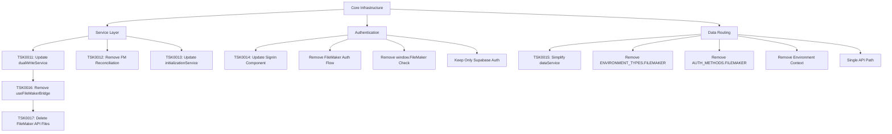

## Phase 4: Dependencies & Documentation

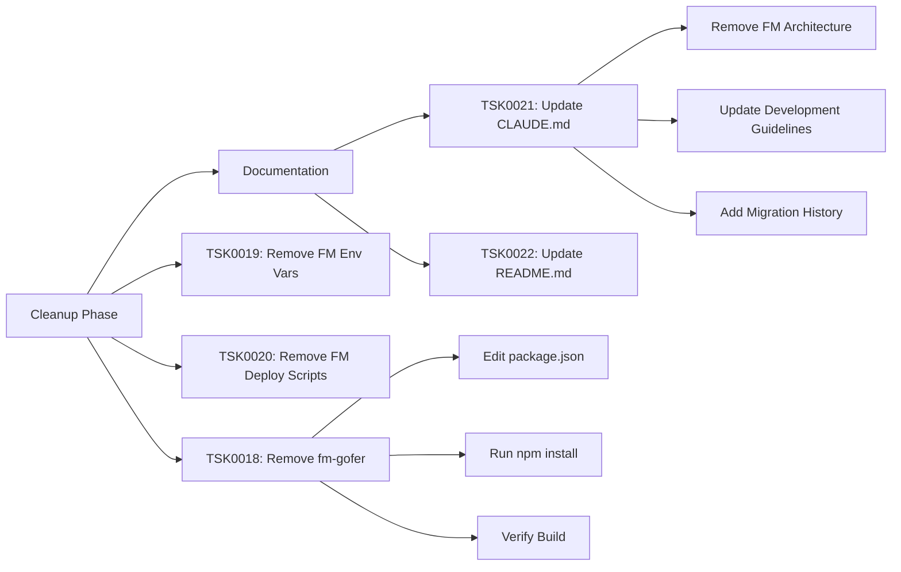

## Phase 5: Testing & Finalization

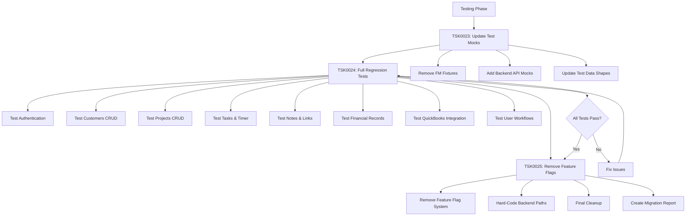

## Data Flow: Before vs After

### Before (Dual Environment)
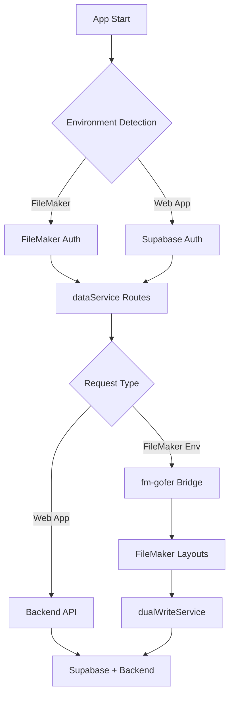

### After (Supabase-Only)
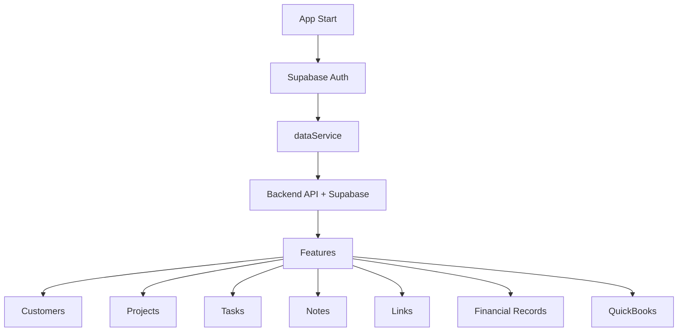

## API Migration Pattern

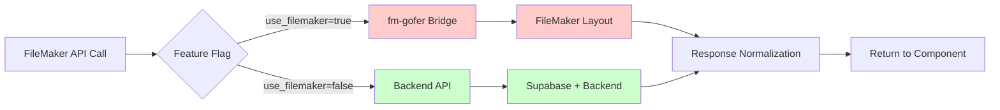

## Authentication Flow: Before vs After

### Before
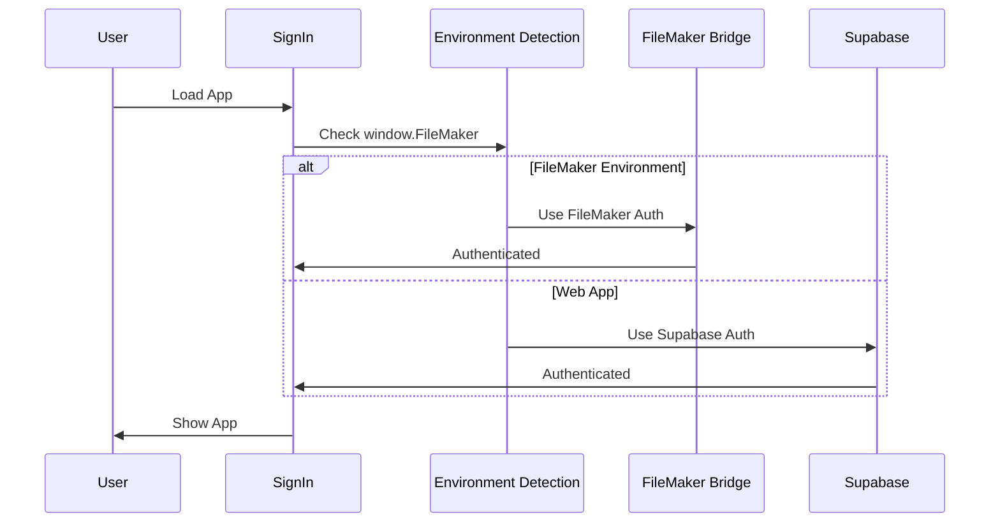

### After
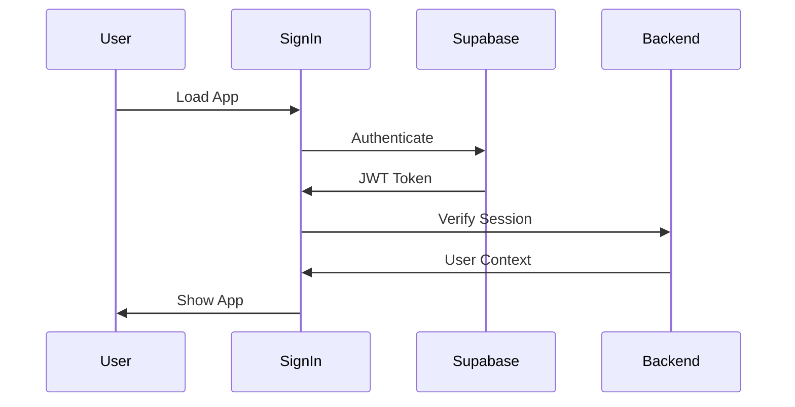

## Service Layer Refactoring

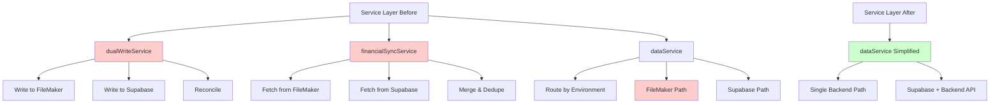

## Dependency Graph

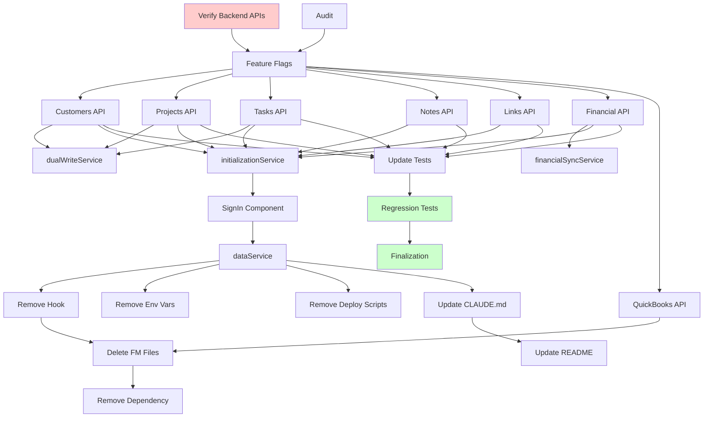
