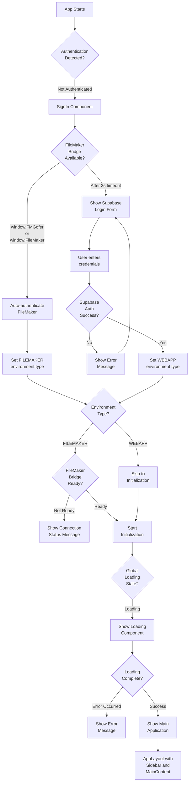

# FileMaker Removal Requirements - UI Workflows

## Overview

This document analyzes the UI rendering patterns for the FileMaker removal requirements feature, focusing on how the application's authentication and environment detection logic determines what users see at different stages of initialization.

## 1. Render Decision Tree



## 2. Render Branch Table

| Condition | Component Rendered | Key Props | File:Line |
|-----------|-------------------|-----------|-----------|
| `!appState.authentication.isAuthenticated` | `SignIn` | `onFileMakerDetected`, `onSupabaseAuth`, `onDetectionComplete` | src/index.jsx:451-458 |
| FileMaker detected (`window.FMGofer` or `window.FileMaker`) | Auto-authentication flow (silent) | N/A - internal logic | src/components/auth/SignIn.jsx:24-66 |
| No FileMaker after 3s timeout | Supabase login form | `email`, `password`, `isLoading`, `error` | src/components/auth/SignIn.jsx:101-184 |
| `appState.environment.type === FILEMAKER && !fmReady` | FileMaker connection status | `fmStatus`, `fmError` | src/index.jsx:462-473 |
| `appState.error` (truthy) | Error message | `appState.error` | src/index.jsx:475-481 |
| `globalLoadingState.isLoading` | `Loading` component | `message` from loading state | src/index.jsx:483-485 |
| Combined errors from hooks | Error message | `customerError`, `projectError`, `taskError`, `teamError` | src/index.jsx:488-495 |
| Authenticated && initialization complete | `AppLayout` with `Sidebar` and `MainContent` | Processed customers, teams, selected entities | src/index.jsx:515-558 |
| Supabase auth error | Error banner in login form | `error` state variable | src/components/auth/SignIn.jsx:151-155 |
| Loading during login | Disabled form with spinner | `isLoading` state | src/components/auth/SignIn.jsx:158-174 |

## 3. Derived State

| Variable | Computation Logic | Controls | Source |
|----------|------------------|----------|--------|
| `shouldUseFileMakerBridge` | `appState.environment.type === ENVIRONMENT_TYPES.FILEMAKER` | Whether to call `useFileMakerBridge()` hook or use mock values | src/index.jsx:27-30 |
| `fileMakerBridge` | Conditional based on `shouldUseFileMakerBridge`: real hook or `{ isReady: true, error: null, status: 'Web app mode' }` | FileMaker connection status checks | src/index.jsx:28-30 |
| `projectCustomerId` | `appState.selectedProspect?.id \|\| appState.selectedCustomer?.id` | Which customer/prospect ID to use for project queries | src/index.jsx:73 |
| `processedCustomers` | Maps customers array, normalizing `id`, `Name`, `Email`, `isActive` from FileMaker or Supabase format | What customer data is displayed in Sidebar | src/index.jsx:498-504 |
| `processedSelectedCustomer` | Same normalization as `processedCustomers` but for single selected customer | Which customer is highlighted in UI | src/index.jsx:507-513 |
| `error` (combined) | `customerError \|\| projectError \|\| taskError \|\| teamError` | Whether to show error state | src/index.jsx:488 |
| `customerStats` | Computed from `customers` array: `total`, `active`, `inactive`, `activePercentage` | Stats displayed in Sidebar | src/index.jsx:531-536 |
| `currentEnvironment` (dataService.js) | Set by `setEnvironmentContext()` based on detection | All axios request routing decisions | src/services/dataService.js:28-54 |
| `authHeader` (dataService.js) | Generated via `generateBackendAuthHeader()` for WEBAPP environment | HMAC authentication for backend API calls | src/services/dataService.js:61-105 |

## 4. Loading & Error States

### Loading States

| State | Display | Trigger | File:Line |
|-------|---------|---------|-----------|
| **Initial Load** | `Loading` component with dynamic message | `globalLoadingState.isLoading === true` | src/index.jsx:483-485 |
| **SignIn Loading** | Disabled form inputs + spinner in button | `isLoading === true` during auth | src/components/auth/SignIn.jsx:163-173 |
| **FileMaker Connection** | Status message: `fmStatus` | `fmReady === false` in FileMaker environment | src/index.jsx:462-473 |
| **Initialization Phases** | Loading messages via `loadingStateManager`: <br/>- "Initializing application..."<br/>- "Connecting to FileMaker..."<br/>- "Loading user context..."<br/>- "Retrieving Supabase user ID..."<br/>- "Loading products..."<br/>- "Loading sales..."<br/>- "Loading initial data..." | Various stages in initialization effect | src/index.jsx:174-251 |
| **Project Selection** | `setLoading(true)` during project detail load | `onProjectSelect` handler | src/index.jsx:343 |

### Error States

| State | Display | Trigger | File:Line |
|-------|---------|---------|-----------|
| **SignIn Error** | Red banner in login form | Supabase auth failure | src/components/auth/SignIn.jsx:151-155 |
| **FileMaker Connection Error** | Red text below status message | `fmError` is set | src/index.jsx:466-470 |
| **App Initialization Error** | Red text: "Error: {appState.error}" | `appState.error` is truthy | src/index.jsx:475-481 |
| **Combined Hook Errors** | Red text: "Error: {error}" | Any of `customerError`, `projectError`, `taskError`, `teamError` | src/index.jsx:488-495 |
| **FileMaker Bridge Unavailable** | Thrown error from dataService | FileMaker environment detected but no bridge available | src/services/dataService.js:119-121 |
| **Environment Not Set** | Thrown error from dataService | API call attempted before environment detection | src/services/dataService.js:210 |

### Empty States

| State | Display | File Context |
|-------|---------|--------------|
| **No Customers** | Sidebar with empty customer list, stats show 0 | Handled by Sidebar component |
| **No User Context** | Initialization fails with error message | src/index.jsx:254-257 |
| **No Supabase User ID** | Logged warnings, products/sales not loaded | src/services/initializationService.js:62-66 |

## 5. User Role Variations

### Environment-Based Variations

The application does not vary by user role, but by **environment type**:

#### FileMaker Environment (`ENVIRONMENT_TYPES.FILEMAKER`)

**What's Different:**
- **No login form shown** - Authentication is silent via FileMaker bridge detection
- **FileMaker bridge readiness check** - Shows connection status if bridge not ready
- **Uses FMGofer.PerformScript** for all data operations
- **Requires user context from FileMaker** - Calls `JS * Fetch Data` script to get user info
- **Waits for bridge initialization** - Uses retry logic with exponential backoff

**Implementation:**
- Detected via `window.FMGofer` or `window.FileMaker` presence (src/components/auth/SignIn.jsx:29-30)
- Environment set in `handleFileMakerDetected` (src/index.jsx:117-139)
- Request routing via axios interceptor flag `_isFileMakerRequest` (src/services/dataService.js:186-196)

#### Web App Environment (`ENVIRONMENT_TYPES.WEBAPP`)

**What's Different:**
- **Shows Supabase login form** - Email/password authentication required
- **No FileMaker bridge checks** - Skips all FileMaker-related logic
- **Uses HMAC-authenticated backend API** - All requests include `Authorization: Bearer {signature}.{timestamp}` header
- **User context from Supabase auth** - User object comes from Supabase authentication response
- **Faster initialization** - No FileMaker connection waiting period

**Implementation:**
- Detected after 3-second FileMaker detection timeout (src/components/auth/SignIn.jsx:45-62)
- Environment set in `handleSupabaseAuth` (src/index.jsx:141-155)
- Request routing via axios interceptor adds HMAC auth (src/services/dataService.js:198-207)

### Authentication Method Variations

| Auth Method | UI Flow | Data Access | File:Line |
|-------------|---------|-------------|-----------|
| `AUTH_METHODS.FILEMAKER` | Silent auto-detection → Direct to initialization | FileMaker scripts via bridge | src/index.jsx:117-139 |
| `AUTH_METHODS.SUPABASE` | Login form → Email/password → Initialization | Backend API with HMAC auth | src/index.jsx:141-155 |

## 6. Re-render Triggers

### AppStateContext Subscriptions

**Components re-render when these state values change:**

| State Property | Causes Re-render Of | Trigger Source |
|----------------|---------------------|----------------|
| `authentication.isAuthenticated` | Entire app (switches between SignIn and AppContent) | `setAuthentication()` calls | src/index.jsx:451, 163, 262 |
| `environment.type` | Environment-specific initialization logic | `setEnvironment()` calls | src/index.jsx:163, 269 |
| `selectedCustomer` | Sidebar, MainContent, CustomerDetails | `setSelectedCustomer()` in customer select handler | src/index.jsx:290 |
| `selectedProject` | MainContent, ProjectDetails, task lists | `setSelectedProject()` in project select handler | src/index.jsx:381 |
| `selectedTask` | MainContent, TaskDetails | `setSelectedTask()` in task select handler | src/index.jsx:392 |
| `selectedTeam` | Sidebar, MainContent, TeamDetails | `setSelectedTeam()` in team select handler | src/index.jsx:309 |
| `loading` | Global loading state check | `setLoading()` calls | src/index.jsx:251, 343, 383, 386 |
| `error` | Error display branches | `setError()` calls | src/index.jsx:256 |
| `user` | User context-dependent features | `setUser()` calls | src/index.jsx:183, 217 |

### Props Changes

| Component | Re-renders On | Source Hook/State |
|-----------|---------------|-------------------|
| `SignIn` | Never re-renders (unmounts on auth) | Unmounts when `isAuthenticated` becomes true |
| `Sidebar` | `customers`, `teams`, `selectedCustomer`, `selectedTeam`, `products`, `selectedMarketingDomain` changes | Memoized with React.memo | src/index.jsx:518-539 |
| `MainContent` | `selectedCustomer`, `selectedProject`, `selectedTask`, `selectedTeam`, `tasks`, `projects`, `handlers` changes | Not memoized, re-renders on any parent update | src/index.jsx:540-556 |
| `Loading` | `globalLoadingState.message` changes | `useGlobalLoadingState()` subscription | src/index.jsx:483-485 |
| `AppLayout` | Theme changes | `ThemeProvider` context | Parent of all main UI |

### Local State Changes

| Component | Local State | Re-render Trigger |
|-----------|-------------|-------------------|
| `SignIn` | `email`, `password`, `isLoading`, `error` | User input, auth state changes | src/components/auth/SignIn.jsx:18-21 |
| `AppContent` | `selectedMarketingDomain` | Marketing domain selection | src/index.jsx:109-114 |

### Hook Dependencies

**Initialization Effect** (src/index.jsx:163-279):
- Triggers on: `appState.authentication.isAuthenticated`, `appState.environment.type`, `fmReady`
- Causes: Full app initialization flow
- Results in: Multiple state updates, triggering cascading re-renders

**FileMaker Detection Effect** (src/components/auth/SignIn.jsx:69-72):
- Triggers on: Component mount
- Causes: Polling for FileMaker bridge with 100ms intervals for up to 3 seconds
- Results in: `onFileMakerDetected` callback or `onDetectionComplete` callback

### DataService Request Interceptor

**Not a render trigger, but affects data flow:**

All axios requests pass through environment-aware interceptor (src/services/dataService.js:176-216):
- Reads `currentEnvironment.type` from module-level state
- Routes FileMaker requests via `_isFileMakerRequest` flag
- Routes web app requests with HMAC auth header
- Does **not** cause React re-renders directly

## 7. Critical Conditional Rendering Patterns

### Authentication Gate

```javascript
// src/index.jsx:451-459
if (!appState.authentication.isAuthenticated) {
    return <SignIn ... />;
}
```

**Impact:** Entire app UI blocked until authentication succeeds

### Environment Detection Gate

```javascript
// src/index.jsx:462-473
if (appState.environment.type === ENVIRONMENT_TYPES.FILEMAKER && !fmReady) {
    return <div>FileMaker connection status...</div>;
}
```

**Impact:** FileMaker users wait for bridge initialization before seeing main UI

### Loading State Gate

```javascript
// src/index.jsx:483-485
if (globalLoadingState.isLoading) {
    return <Loading message={globalLoadingState.message} />;
}
```

**Impact:** Users see loading screen during initialization phases

### Error State Gates

```javascript
// src/index.jsx:475-481, 488-495
if (appState.error) { return <div>Error: {appState.error}</div>; }
if (error) { return <div>Error: {error}</div>; }
```

**Impact:** Errors short-circuit main UI rendering

### FileMaker Bridge Hook Conditional

```javascript
// src/index.jsx:27-30
const shouldUseFileMakerBridge = appState.environment.type === ENVIRONMENT_TYPES.FILEMAKER;
const fileMakerBridge = shouldUseFileMakerBridge
    ? useFileMakerBridge()
    : { isReady: true, error: null, status: 'Web app mode' };
```

**Impact:** Web app users skip FileMaker bridge entirely, avoiding unnecessary checks

## 8. State Transitions and Side Effects

### Authentication Flow State Transitions

```
Initial State:
  authentication: { isAuthenticated: false, method: null, user: null }
  environment: { type: null, detectionComplete: false }

FileMaker Path:
  1. SignIn mounts → FileMaker detection starts
  2. window.FMGofer detected → onFileMakerDetected()
  3. environment.type = 'filemaker'
  4. authentication.isAuthenticated = true, method = 'filemaker'
  5. Wait for fmReady
  6. Load user context from FileMaker
  7. Fetch Supabase user ID
  8. Load products/sales/customers/teams
  9. Render main app

Web App Path:
  1. SignIn mounts → FileMaker detection starts
  2. 3-second timeout → Show login form
  3. User submits credentials → Supabase auth
  4. onSupabaseAuth() → environment.type = 'webapp'
  5. authentication.isAuthenticated = true, method = 'supabase', user = {supabase user}
  6. Load user context from Supabase auth
  7. Fetch Supabase user ID
  8. Load products/sales/customers/teams
  9. Render main app
```

### DataService Request Flow State Transitions

```
Request Initiated:
  1. Component calls dataService.get('/api/endpoint')
  2. Axios request interceptor checks currentEnvironment.type

FileMaker Environment:
  3. Set config._isFileMakerRequest = true
  4. Response interceptor catches request
  5. Calls convertToFileMakerCall()
  6. FMGofer.PerformScript('JS * Fetch Data', JSON params)
  7. FileMaker returns result
  8. Parse and return as axios response

Web App Environment:
  3. Generate HMAC auth header
  4. Add Authorization: Bearer {signature}.{timestamp}
  5. Send to backend API
  6. Backend validates HMAC
  7. Return response
```

## 9. Migration Impact on UI Workflows

### Current Dual-Path Complexity

The UI currently has **branching logic at multiple levels**:

1. **Component Level:** SignIn component has FileMaker auto-detection + Supabase form
2. **Hook Level:** Conditional `useFileMakerBridge()` call based on environment
3. **Service Layer:** DataService axios interceptors route based on environment
4. **API Layer:** All API modules use `fetchDataFromFileMaker()` wrapper

### Post-Migration Simplified Flow

After FileMaker removal, the flow simplifies to:

```
App Starts
  ↓
Show Supabase Login Form
  ↓
User Authenticates
  ↓
Load User Context (from Supabase)
  ↓
Initialize App (Backend API only)
  ↓
Render Main App
```

**Components Affected:**
- `SignIn.jsx` - Remove FileMaker detection logic (lines 24-66)
- `index.jsx` - Remove `shouldUseFileMakerBridge` conditional (lines 27-30)
- `index.jsx` - Remove FileMaker-specific initialization (lines 176-205)
- `index.jsx` - Remove FileMaker readiness check (lines 462-473)
- `dataService.js` - Remove axios interceptor FileMaker routing (lines 186-196, 222-240)
- `dataService.js` - Remove `convertToFileMakerCall()` function (lines 114-161)

**State Properties Removed:**
- `environment.type` - No longer needed (always web app)
- `authentication.method` - No longer needed (always Supabase)
- `shouldUseFileMakerBridge` - No longer needed
- `fmReady`, `fmError`, `fmStatus` - No longer needed

**Net Result:**
- ~150 lines removed from SignIn.jsx
- ~100 lines removed from index.jsx
- ~200 lines removed from dataService.js
- ~500 lines removed from fileMaker.js (entire file)
- Simpler component logic, faster initialization, fewer edge cases
