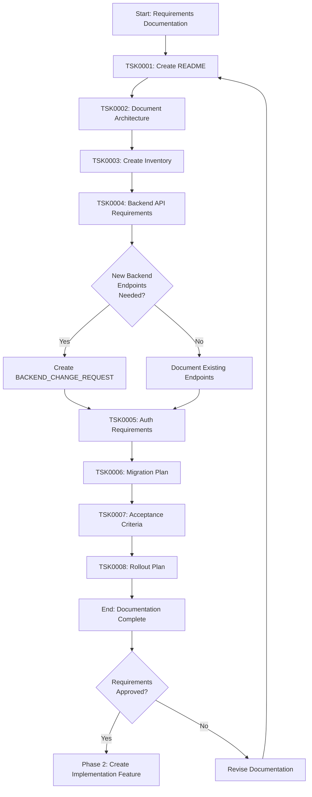
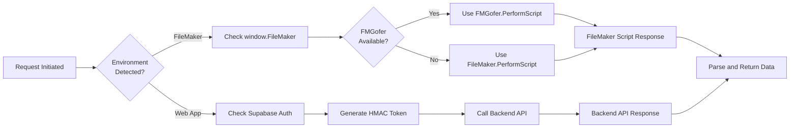
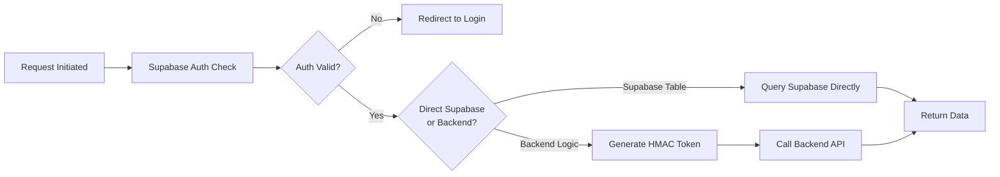
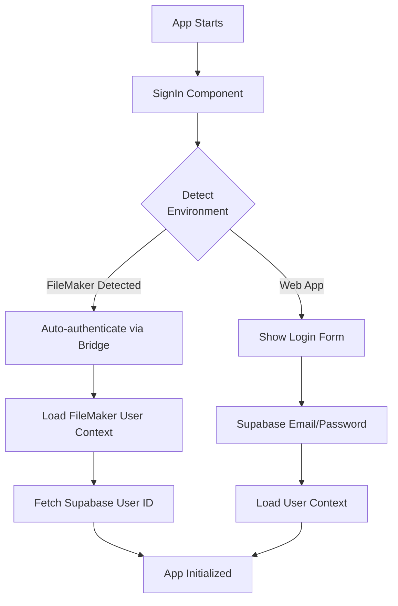
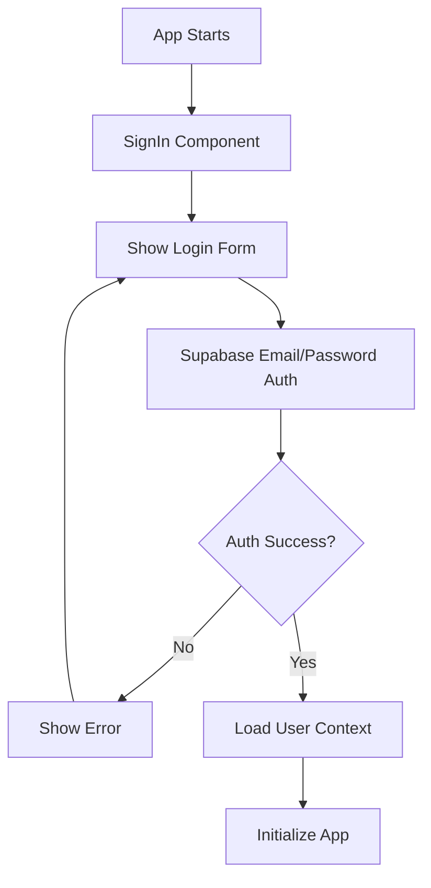
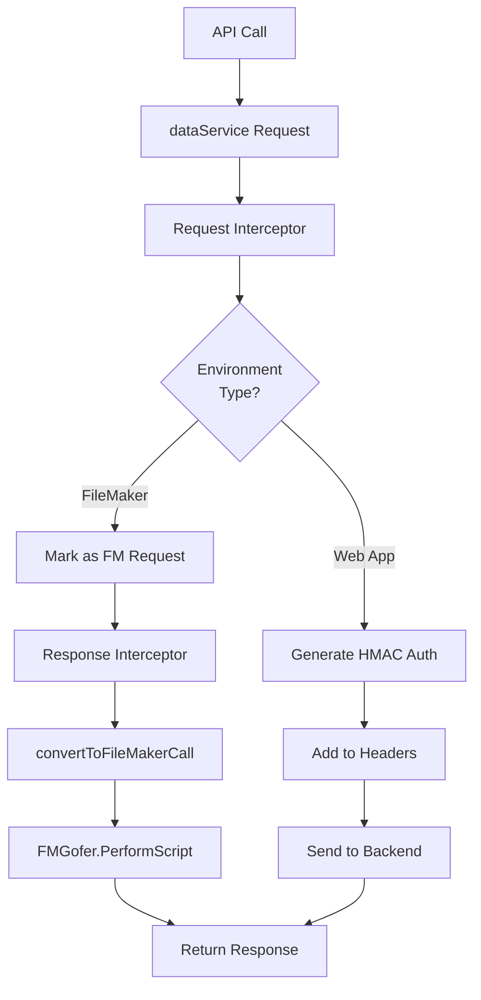
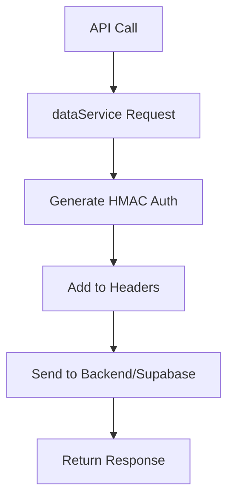
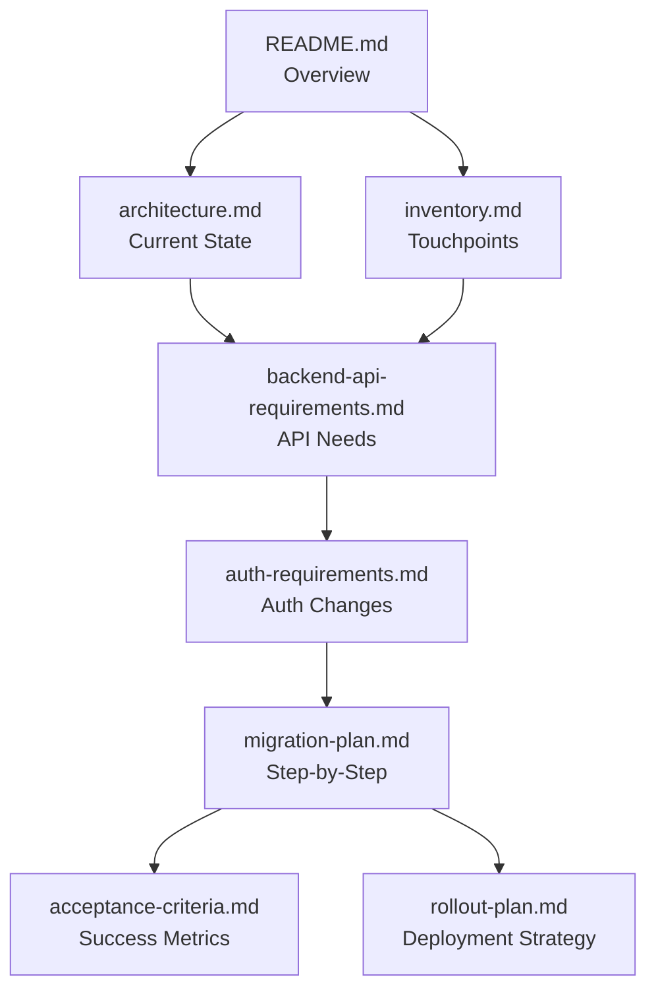

# FileMaker Removal Requirements - Workflows

## Overview

This document describes the workflow for documenting FileMaker removal requirements. This is Phase 1 of a two-phase process - Phase 2 will be the actual implementation.

## Task Execution Flow

## Current Architecture Analysis Flow

## Target Architecture (Post-Migration)

## Authentication Flow Changes

### Current (Dual Authentication)

### Target (Supabase-Only)

## Data Service Simplification

### Current (Environment-Aware Routing)

### Target (Simplified Backend-Only)

## Documentation Dependencies

## Task Workflow Details

### TSK0001-0003: Foundation Documentation
**Purpose**: Understand and document what exists today

1. Analyze current codebase
2. Map environment detection logic
3. Document routing mechanisms
4. Create comprehensive inventory
5. Reference actual code with file:line patterns

### TSK0004: Backend API Requirements
**Purpose**: Define what backend must support

**Critical Decision Point**: If new backend endpoints are needed, create a `BACKEND_CHANGE_REQUEST` document per CLAUDE.md protocol.

Workflow:
1. Review all `fetchDataFromFileMaker` operations
2. Map FileMaker layouts to backend endpoints
3. Document CRUD operations needed
4. Check if endpoints exist (review OpenAPI spec)
5. If gaps found → Create BACKEND_CHANGE_REQUEST
6. If complete → Document existing endpoint usage

### TSK0005-0006: Planning Documentation
**Purpose**: Define how to execute the migration

1. Document authentication changes
2. Create step-by-step migration plan
3. Identify risks and mitigation strategies
4. Define rollback procedures

### TSK0007-0008: Success Criteria
**Purpose**: Define "done" and safe deployment

1. Write acceptance tests requirements
2. Define deployment phases
3. Create monitoring requirements
4. Plan user communication

## Handoff to Phase 2 Implementation

Once all documentation is complete and approved:

1. **Create new feature**: `filemaker-removal-implementation`
2. **Reference this documentation**: All implementation tasks reference requirements docs
3. **Follow migration plan**: Execute steps from migration-plan.md
4. **Validate against criteria**: Use acceptance-criteria.md for testing
5. **Deploy per rollout plan**: Follow rollout-plan.md strategy

## Critical Success Factors

- **Thoroughness**: Don't miss any FileMaker references
- **Backend Protocol**: Follow BACKEND_CHANGE_REQUEST process
- **Code References**: Use file:line format for all references
- **Risk Documentation**: Identify all risks before implementation
- **User Impact**: Consider how changes affect users
