# Financial Records Backend Integration - Workflows

## Overview

This document describes the data flow and integration workflows for migrating financial records from FileMaker to Supabase backend APIs.

## Current State: FileMaker-Primary

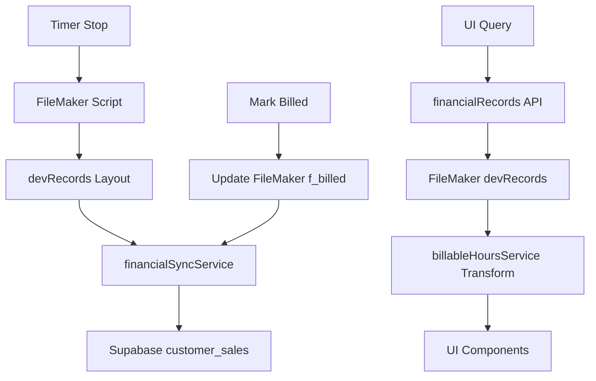

**Problems:**
- FileMaker is single source of truth (bottleneck)
- Dual-write synchronization is complex and error-prone
- No direct aggregation queries (must fetch all records and compute in JS)
- Date format conversions required at multiple layers

## Target State: Supabase-Native

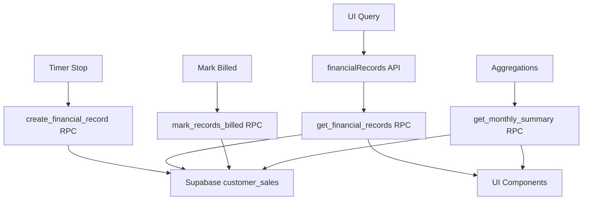

**Benefits:**
- Supabase is single source of truth
- No synchronization needed
- Database-level aggregations for better performance
- Consistent date format (YYYY-MM-DD)
- RLS enforcement at database level

## Migration Workflow

### Phase 1: API Layer Replacement

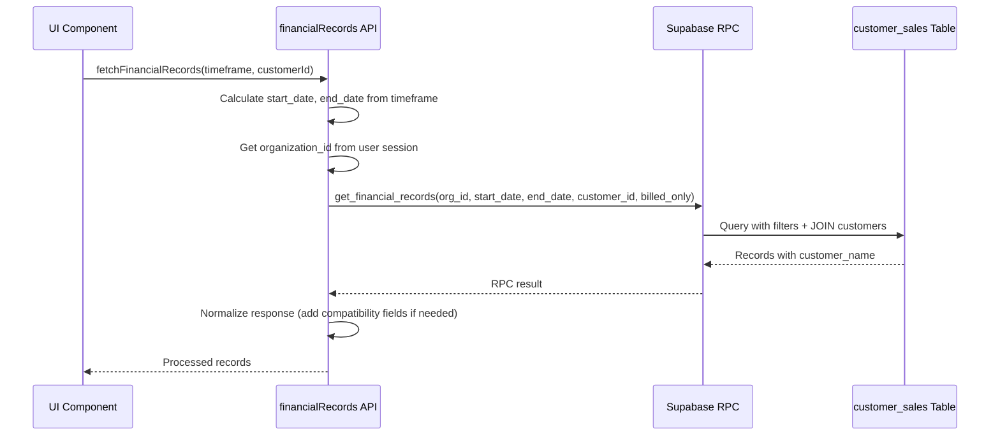

**Key Changes:**
1. API translates timeframe to date range
2. RPC call includes organization_id for RLS
3. Response includes customer_name already joined
4. Dates are in YYYY-MM-DD format

### Phase 2: Record Creation

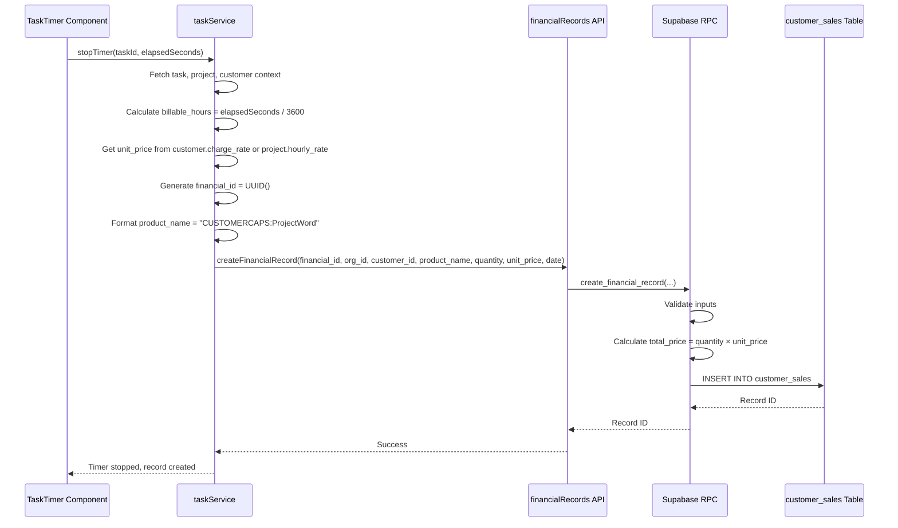

**Key Changes:**
1. Timer directly calls Supabase RPC (no FileMaker script)
2. Validation happens at database level
3. total_price calculated automatically by RPC
4. No dual-write synchronization needed

### Phase 3: Marking Records Billed

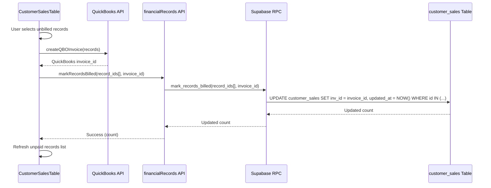

**Key Changes:**
1. Bulk update in single RPC call
2. Sets inv_id instead of f_billed flag
3. Automatic updated_at timestamp
4. Returns count of updated records

### Phase 4: Aggregation Queries

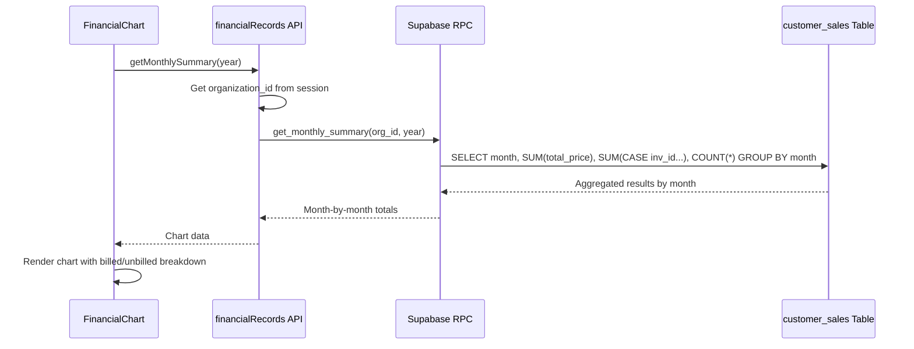

**Benefits:**
- Database-level aggregation (much faster than JS reduce)
- Single query returns all needed data
- No need to fetch all records and compute totals in frontend

## Data Flow Comparison

### FileMaker Approach (Old)

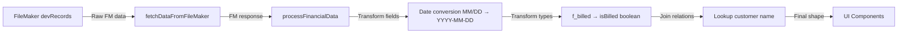

**Problems:**
- Multiple transformation steps
- Expensive relation lookups
- Inconsistent field names across layers

### Supabase Approach (New)

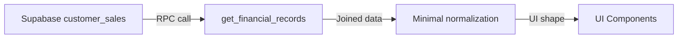

**Benefits:**
- Customer name pre-joined by RPC
- Dates already in correct format
- Minimal transformation needed
- Consistent field names

## Error Handling Workflow

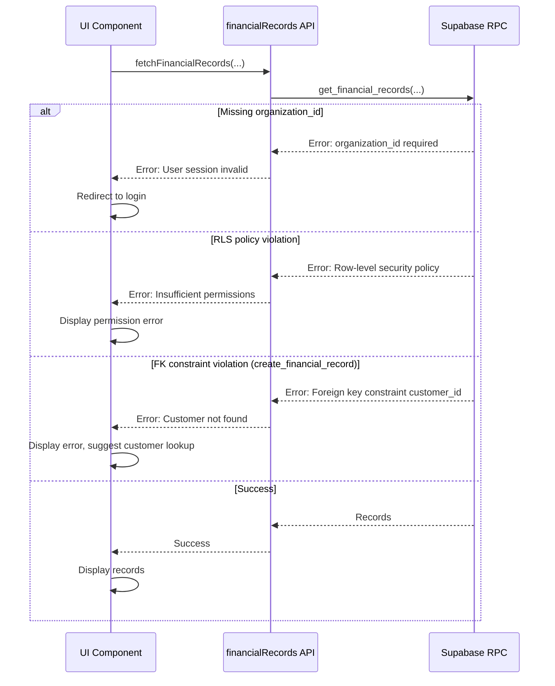

## Testing Workflow

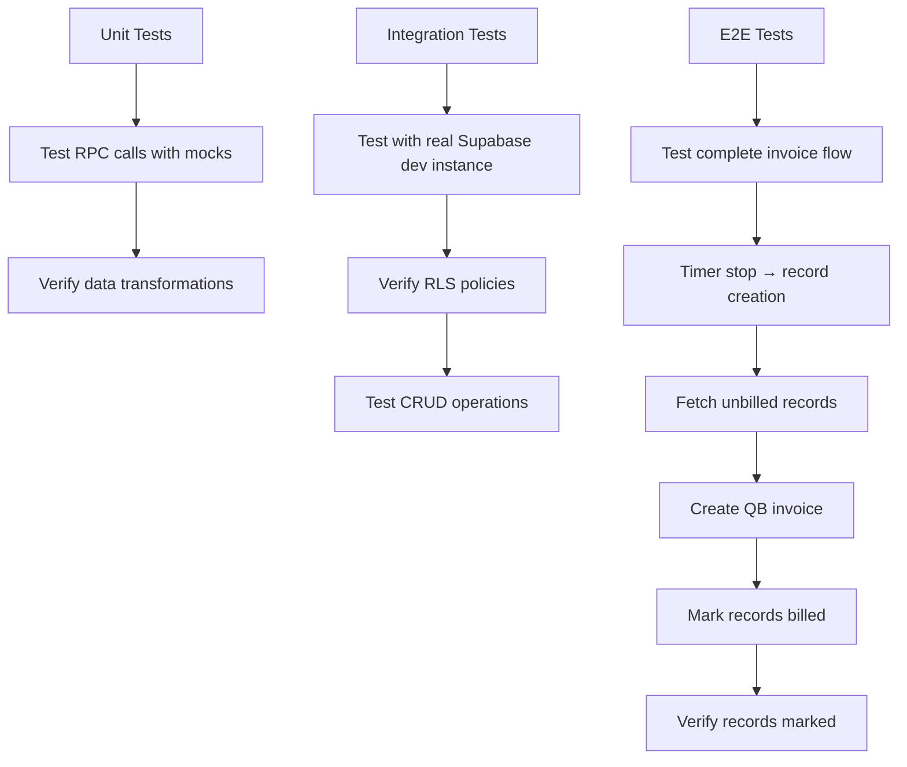

## Rollback Workflow (If Needed)

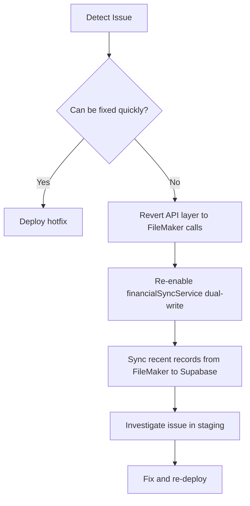

**Rollback Strategy:**
- Keep FileMaker code commented (don't delete immediately)
- Supabase data remains intact (no data loss)
- Can fall back to FileMaker reads while keeping Supabase writes
- Re-enable sync service if needed for consistency

## Performance Optimization

### Query Performance

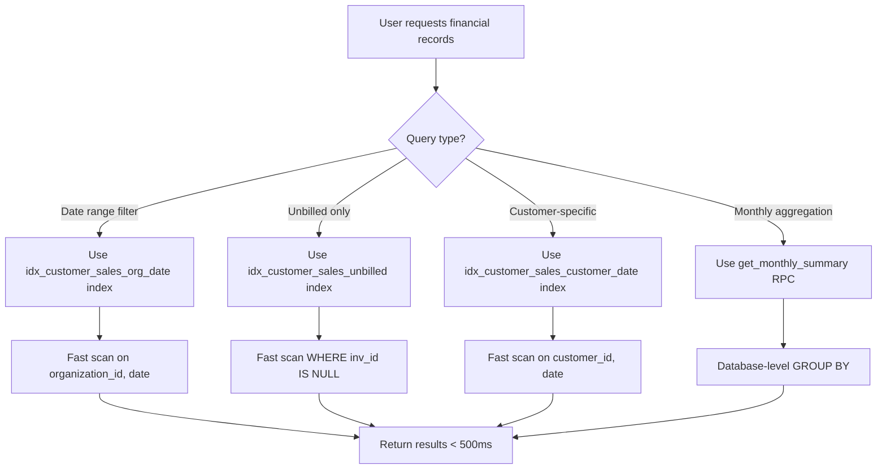

**Backend Indexes (Already Deployed):**
- `idx_customer_sales_org_date` - Primary query pattern
- `idx_customer_sales_customer_date` - Customer-specific queries
- `idx_customer_sales_unbilled` - Unpaid records queries
- `idx_customer_sales_date_month_year` - Aggregation support

## Security & Authorization

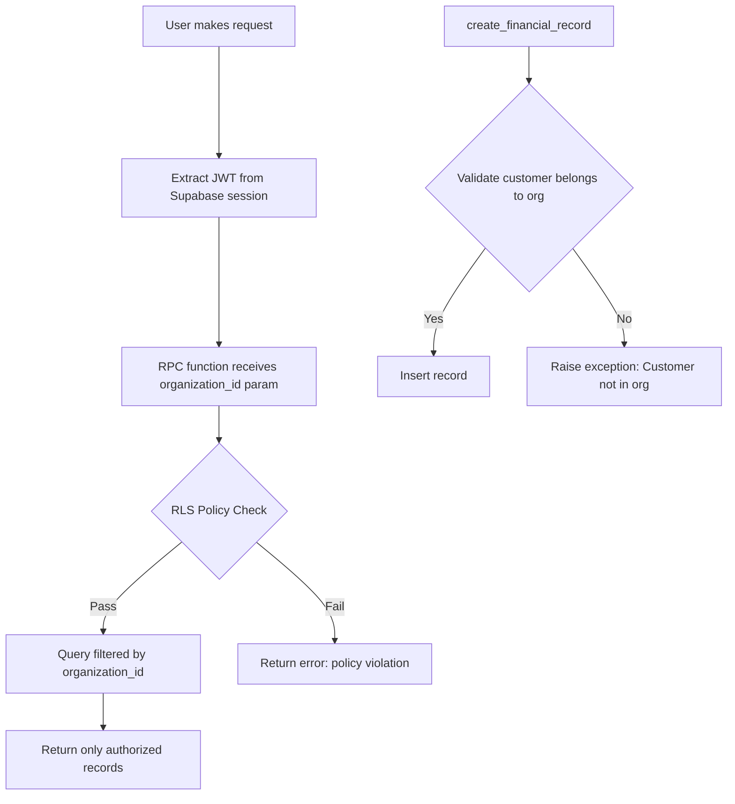

**RLS Policies (Backend):**
- All queries automatically filtered by organization_id
- Users can only see records for their organization
- Cross-organization access prevented at database level
