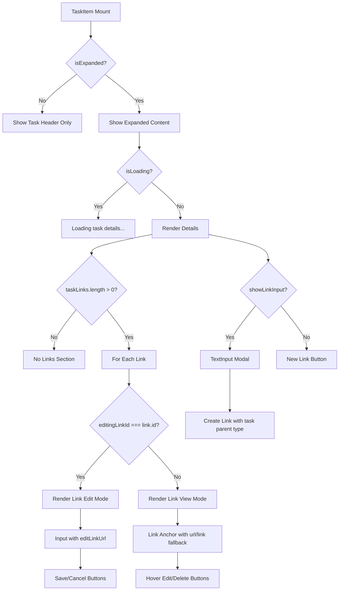

# Links Feature - UI Workflows Documentation

This document describes how the Links feature renders differently based on state, user interactions, and data conditions across React components.

## 1. Render Decision Tree

### ProjectLinksTab Component Flow

```mermaid
flowchart TD
    Start[ProjectLinksTab Mount] --> CheckProject{project exists?}
    CheckProject -->|No| Error[Error State]
    CheckProject -->|Yes| ResolveID[Resolve projectId: project.id || project.__ID]

    ResolveID --> CheckLinks{links.length > 0?}
    CheckLinks -->|No| EmptyState[Render Empty State Message]
    CheckLinks -->|Yes| RenderGrid[Render ResourceGrid]

    RenderGrid --> IterateLinks[For Each Link]
    IterateLinks --> CheckEditing{editingLinkId === link.id?}

    CheckEditing -->|Yes| EditMode[Render Edit Mode UI]
    CheckEditing -->|No| ViewMode[Render View Mode UI]

    EditMode --> EditInput[Input field with editingUrl]
    EditInput --> EditButtons[Save/Cancel Buttons]

    ViewMode --> LinkAnchor[Clickable Link Anchor]
    LinkAnchor --> HoverActions[Hover-Revealed Edit/Delete Buttons]

    Start --> CheckNewInput{showNewLinkInput?}
    CheckNewInput -->|Yes| TextInputModal[TextInput Modal]
    CheckNewInput -->|No| NewLinkButton[New Link Button]

    TextInputModal --> ValidateURL{Valid URL?}
    ValidateURL -->|No| ShowError[Show Error]
    ValidateURL -->|Yes| CheckGitHub{Is GitHub URL?}

    CheckGitHub -->|Yes| CheckRepoExists{Repo Exists?}
    CheckRepoExists -->|No| GitHubModal[GitHubRepositoryModal]
    CheckRepoExists -->|Yes| CreateLink[Create Link via API]

    CheckGitHub -->|No| CreateLink
    CreateLink --> OptimisticUpdate[Add Temporary Link to UI]
    OptimisticUpdate --> BackendCall[Backend API Call]
    BackendCall --> Success{Success?}
    Success -->|Yes| RefreshData[Refresh Project Details]
    Success -->|No| RevertUI[Revert Optimistic Update]
```

### TaskList Component Flow



## 2. Render Branch Table

### ProjectLinksTab Branches

| Condition | Component Rendered | Key Props | File:Line |
|-----------|-------------------|-----------|-----------|
| `!items?.length` | Empty state message | `emptyMessage`, `darkMode` | ProjectLinksTab.jsx:18-23 |
| `items?.length > 0` | ResourceGrid with links | `items`, `renderItem`, `darkMode` | ProjectLinksTab.jsx:26-33 |
| `editingLinkId === link.id` | Edit mode input | `editingUrl`, `darkMode`, `linkLoading` | ProjectLinksTab.jsx:116-169 |
| `editingLinkId !== link.id` | View mode link | `linkUrl`, `linkTitle`, `darkMode` | ProjectLinksTab.jsx:172-234 |
| `showNewLinkInput` | TextInput modal | `onSubmit`, `onCancel` | ProjectLinksTab.jsx:249-335 |
| `!showNewLinkInput` | New Link button | `disabled={linkLoading}` | ProjectLinksTab.jsx:241-247 |
| `repoModalOpen` | GitHubRepositoryModal | `isOpen`, `onCreate`, `onClose`, `initialOwner`, `initialRepo` | ProjectLinksTab.jsx:350-374 |
| `pendingUrl !== ''` | GitHub repo check flow | - | ProjectLinksTab.jsx:260-274 |

### TaskList/TaskItem Branches

| Condition | Component Rendered | Key Props | File:Line |
|-----------|-------------------|-----------|-----------|
| `!isExpanded` | Collapsed task header | `task.title`, `darkMode` | TaskList.jsx:56-104 |
| `isExpanded && isLoading` | Loading message | `darkMode` | TaskList.jsx:111-117 |
| `isExpanded && taskLinks?.length > 0` | Links section | `taskLinks`, `darkMode` | TaskList.jsx:251-370 |
| `editingLinkId === link.id` | Link edit mode | `editLinkUrl`, `darkMode` | TaskList.jsx:265-313 |
| `editingLinkId !== link.id` | Link view mode | `linkUrl`, `displayText`, `darkMode` | TaskList.jsx:316-368 |
| `showLinkInput` | TextInput modal | `onSubmit`, `onCancel` | TaskList.jsx:444-459 |
| `!showLinkInput` | New Link button | `darkMode` | TaskList.jsx:404-414 |
| `notesPagination?.hasMore` | Load More button | `notesLoading`, `darkMode` | TaskList.jsx:231-247 |
| `!task.isCompleted` | Start Timer button | - | TaskList.jsx:89-103 |

## 3. Derived State

### ProjectLinksTab

| Variable | Computation | Controls | Source |
|----------|-------------|----------|--------|
| `projectId` | `project?.id \|\| project?.__ID` | All API calls, dual-environment support | ProjectLinksTab.jsx:56 |
| `linkUrl` | `link.url \|\| link.link` | Link display and actions | ProjectLinksTab.jsx:112 |
| `linkTitle` | `link.title \|\| linkUrl` | Link anchor text | ProjectLinksTab.jsx:113 |
| `isEditing` | `editingLinkId === link.id` | Edit mode vs view mode rendering | ProjectLinksTab.jsx:114 |
| `ghMeta[key]` | Async GitHub API fetches per repo | GitHub metadata display | ProjectLinksTab.jsx:59-107 |
| `tempLink` | `{ id: 'temp-{timestamp}', url, title }` | Optimistic UI update | ProjectLinksTab.jsx:286-290 |

### TaskList/TaskItem

| Variable | Computation | Controls | Source |
|----------|-------------|----------|--------|
| `effectiveCustomerId` | `customerId \|\| selectedProject?.customer_id \|\| selectedProject?._custID` | Task creation | TaskList.jsx:614 |
| `linkUrl` | `link.url \|\| link.link` | Link display and actions | TaskList.jsx:261 |
| `displayText` | `link.title \|\| linkUrl` | Link anchor text | TaskList.jsx:262 |
| `isEditingLink` | `editingLinkId === link.id` | Edit mode vs view mode rendering | TaskList.jsx:263 |
| `loading` | `taskLoading \|\| noteLoading \|\| linkLoading` | Global loading state | TaskList.jsx:652 |
| `notesPagination` | `selectedTask ? getPagination('task', selectedTask.id) : null` | Load More visibility | TaskList.jsx:655 |

## 4. Loading & Error States

### Loading States

#### ProjectLinksTab
- **Link Loading**: `linkLoading` from `useLink` hook
  - Disables "New Link" button: `disabled={linkLoading}` (line 244)
  - Changes button text: `{linkLoading ? 'Adding...' : 'New Link'}` (line 246)
  - Disables Save button in edit mode: `disabled={!editingUrl.trim() || linkLoading}` (line 148)

- **GitHub Metadata Loading**: `ghMeta[key].loading`
  - Fetches repository info asynchronously (lines 59-107)
  - Each repo tracked individually in `ghMeta` state
  - No blocking UI - metadata enhances links passively

#### TaskList/TaskItem
- **Task Loading**: `isLoading` prop from parent
  - Shows "Loading task details..." message (lines 111-117)
  - Prevents expanded content from rendering

- **Link Loading**: `linkLoading` from `useLink` hook
  - No visible indicator (operations are fast)
  - Error handling via SnackBar notifications

- **Notes Loading**: `notesLoading` prop
  - Shows "Loading..." in Load More button (line 245)
  - Disables Load More button: `disabled={notesLoading}` (line 235)

### Error States

#### Error Handling Pattern
Both components use **SnackBar notifications** for errors:
- Link creation errors: `showError('Error creating link')` (via `useLink` hook)
- Link update errors: `showError('Error updating link')` (TaskList.jsx:289)
- Link delete errors: `showError('Error deleting link')` (TaskList.jsx:351)
- No inline error messages in UI
- Errors revert optimistic updates (ProjectLinksTab.jsx:308-330)

#### URL Validation Errors
- **TextInput component** validates input
  - Empty input shows: "Please enter some text" (TextInput.jsx:41)
  - Max length exceeded shows character limit error (TextInput.jsx:26)

- **Service layer validation**
  - Invalid URL format throws: "Invalid URL format" (linkService.js:61, 156)
  - Missing required fields throws: "ID and link URL are required" (linkService.js:54)

### Empty States

#### ProjectLinksTab
- **No Links**: Shows centered message "No links added yet" (lines 345-347)
- **ResourceGrid Empty**: Shows `emptyMessage` prop (lines 18-23)

#### TaskList
- **No Links in Expanded Task**: Links section not rendered if `taskLinks?.length === 0` (line 251)
- **No Active Tasks**: Shows "No active tasks" in empty TaskSection (line 869)
- **No Completed Tasks**: Shows "No completed tasks" in empty TaskSection (line 910)

## 5. User Role Variations

### No Role-Based Variations Detected

The Links feature does **not** implement role-based access control at the UI level. All users can:
- View all links
- Create new links
- Edit existing links
- Delete links

**Security Enforcement**: Backend API handles authorization via:
- Organization scope validation (all link operations scoped to user's org)
- RLS policies on Supabase database
- JWT-based authentication

### Permission-Based UI States

#### Required Context for Operations
- **Project ID Required**: New Link button disabled if `!projectId || !effectiveCustomerId` (TaskList.jsx:814)
- **Organization Context Required**: All API calls check `env.authentication.user.supabaseOrgID` (not visible in UI, enforced in api/links.js)

## 6. Re-render Triggers

### ProjectLinksTab

| Trigger | What Re-renders | Source |
|---------|-----------------|--------|
| `localProject?.links` changes | Entire link grid | useEffect line 107 |
| `project?.links` changes | Entire link grid | useEffect line 107 |
| `editingLinkId` changes | Individual link (edit ↔ view mode) | useState line 52 |
| `editingUrl` changes | Edit input field | useState line 53 |
| `showNewLinkInput` changes | TextInput modal visibility | useState line 45 |
| `linkLoading` changes | Button disabled states, text | useLink hook line 46 |
| `repoModalOpen` changes | GitHubRepositoryModal visibility | useState line 48 |
| `ghMeta` changes | GitHub metadata display (passive) | useState line 51 |
| `setLocalProject()` called | Optimistic UI updates | Passed prop |
| `loadProjectDetails()` completes | Full project refresh | useProject hook line 47 |

### TaskList/TaskItem

| Trigger | What Re-renders | Source |
|---------|-----------------|--------|
| `isExpanded` changes | Collapse ↔ expand transition | useState line 37 |
| `editingLinkId` changes | Individual link (edit ↔ view mode) | useState line 42 |
| `editLinkUrl` changes | Link edit input field | useState line 43 |
| `showLinkInput` changes | TextInput modal visibility | useState line 39 |
| `taskLinks` changes | Links section re-renders | Props from useTask |
| `taskNotes` changes | Notes section re-renders | Props from useTask |
| `allTaskNotes` changes | Notes list updates | useState line 611 |
| `notesPagination` changes | Load More button visibility | getPagination call |
| `selectedTask` changes | Entire expanded content | useTask hook |
| `loading` changes | Loading message visibility | Derived state line 652 |
| `handleTaskSelect()` completes | Task expansion + data fetch | useTask hook line 617 |

### Hook-Level Re-render Triggers

#### useLink Hook
| Trigger | What Changes | File:Line |
|---------|--------------|-----------|
| `handleLinkCreate()` called | `loading` → true → false | useLink.js:33, 82 |
| `handleLinkUpdate()` called | `loading` → true → false | useLink.js:134, 161 |
| `handleLinkDelete()` called | `loading` → true → false | useLink.js:178, 189 |
| API error | `error` state set, SnackBar shown | useLink.js:77-79, 156-158, 184-186 |

#### Component Memoization
- **ProjectLinksTab**: Wrapped in `React.memo()` (line 395)
- **TaskList**: Wrapped in `React.memo()` via HOC (line 938)
- **TaskItem**: Wrapped in `React.memo()` (line 16)
- **TaskSection**: Wrapped in `React.memo()` (line 500)
- **ResourceGrid**: Wrapped in `React.memo()` (line 11)
- **TextInput**: Wrapped in `React.memo()` (TextInput.jsx:127)

**Memoization prevents re-renders** when props don't change, critical for performance with large task/link lists.

## 7. Data Flow Summary

### Create Link Flow
```
User Click → showNewLinkInput → TextInput Modal
  ↓
User Submit → Validate URL → Check GitHub
  ↓
GitHub? → checkRepositoryExists
  ↓ (if not exists)
  GitHubRepositoryModal → createRepository
  ↓
handleLinkCreate(projectId, url, parentType)
  ↓
linkService.createNewLink → api/links.createLink
  ↓
Backend API POST /links → Supabase DB
  ↓
Transform Response → Augment GitHub Metadata
  ↓
Optimistic UI Update (temp link added)
  ↓
Success → loadProjectDetails() → Full Refresh
Failure → Revert Optimistic Update
```

### Edit Link Flow
```
Hover Link → Edit Button Visible
  ↓
Click Edit → setEditingLinkId(link.id)
  ↓
editingLinkId === link.id → Render Edit Mode
  ↓
User Edit → setEditingUrl(value)
  ↓
Click Save → handleLinkUpdate(linkId, { url })
  ↓
linkService.updateExistingLink → api/links.updateLink
  ↓
Backend API PATCH /links/:id → Supabase DB
  ↓
Success → loadProjectDetails() or onExpand(taskId)
  ↓
setEditingLinkId(null) → Return to View Mode
```

### Delete Link Flow
```
Hover Link → Delete Button Visible
  ↓
Click Delete → window.confirm('Delete this link?')
  ↓
Confirm → handleLinkDelete(linkId)
  ↓
linkService.deleteLinkById → api/links.deleteLink
  ↓
Backend API DELETE /links/:id → Supabase DB
  ↓
Success → loadProjectDetails() or onExpand(taskId)
  ↓
Link Removed from UI
```

## 8. Conditional Rendering Patterns

### Dual-Schema Support
Both components support **FileMaker legacy** and **Backend API** formats:

```javascript
// ProjectLinksTab.jsx:56
const projectId = project?.id || project?.__ID;

// ProjectLinksTab.jsx:112
const linkUrl = link.url || link.link;

// TaskList.jsx:261
const linkUrl = link.url || link.link;
```

**Why**: Migration period requires backward compatibility during transition from FileMaker to Backend API.

### Optimistic Updates
ProjectLinksTab implements **optimistic UI updates** for better UX:

```javascript
// Add temporary link immediately (line 286-297)
const tempLink = { id: `temp-${Date.now()}`, url: trimmed, title: tempTitle };
setLocalProject({ ...localProject, links: [...links, tempLink] });

// Revert on failure (line 310-316)
const revertedLinks = links.filter(link => link.id !== tempLink.id);
setLocalProject({ ...localProject, links: revertedLinks });
```

**Why**: Provides instant feedback while backend processes the request. Reverts if API call fails.

### GitHub Integration Flow
ProjectLinksTab has **special handling for GitHub URLs**:

1. **Parse URL**: Extract owner/repo from GitHub URL (line 260)
2. **Check Existence**: Call GitHub API to verify repo exists (line 263)
3. **If Not Exists**: Open modal to create new repo (line 267)
4. **Create Repo**: Call GitHub API to create repository (line 356)
5. **Create Link**: Add link to created repo (line 358)

**Why**: Prevents broken links by ensuring GitHub repositories exist before linking.

### Hover-Revealed Actions
Both components use **CSS hover states** for edit/delete buttons:

```javascript
// ProjectLinksTab.jsx:193
<div className="opacity-0 group-hover:opacity-100 transition-opacity">

// TaskList.jsx:329
<div className="opacity-0 group-hover:opacity-100 transition-opacity">
```

**Why**: Reduces visual clutter while keeping actions accessible. Common pattern for list item actions.

## 9. Performance Considerations

### Memoization Strategy
- **All list components memoized**: Prevents unnecessary re-renders when parent state changes
- **Callbacks memoized**: `useCallback` for all event handlers to maintain referential equality
- **Conditional renders**: Empty states checked early to short-circuit expensive renders

### Async Operations
- **Non-blocking GitHub fetches**: GitHub metadata fetched in background (ProjectLinksTab.jsx:59-107)
- **Cancellation tokens**: `cancelled` flag prevents state updates after unmount (line 88, 104)
- **Pagination support**: Notes use pagination to limit initial data load (TaskList.jsx:655)

### State Management
- **Local state prioritized**: `localProject` used over `project` for faster updates (ProjectLinksTab.jsx:60)
- **Per-entity pagination**: Notes pagination tracked separately per task (TaskList.jsx:655)
- **Derived state**: Computed values cached to avoid recalculation (e.g., `effectiveCustomerId`)

---

## Key Takeaways

1. **Dual-Environment Support**: All components handle both FileMaker and Backend API schemas during migration
2. **Optimistic UI**: ProjectLinksTab provides instant feedback with rollback on error
3. **GitHub Integration**: Special workflow for GitHub URLs with existence checks and repo creation
4. **Error Handling**: SnackBar notifications used consistently; no inline error states
5. **Performance**: Heavy use of React.memo and useCallback to prevent unnecessary re-renders
6. **Accessibility**: Hover-revealed actions, loading states, disabled buttons follow UX best practices
7. **No Role-Based UI**: Authorization enforced at backend/RLS level, not in React components
