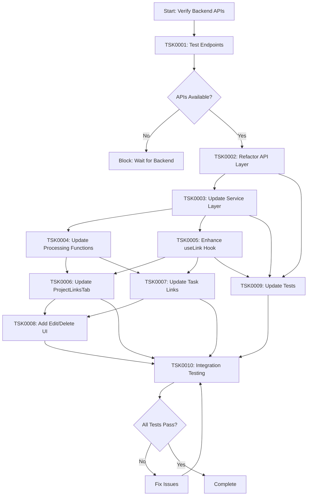
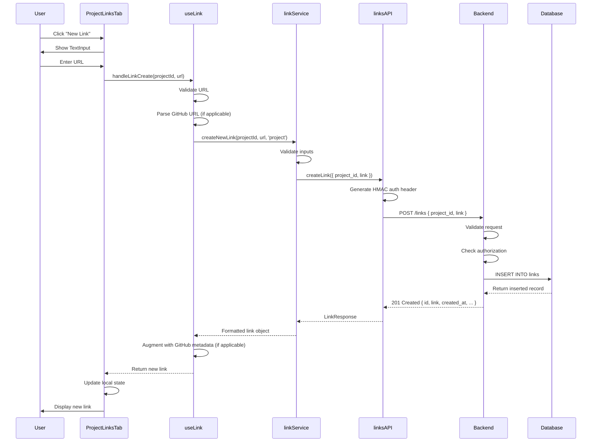
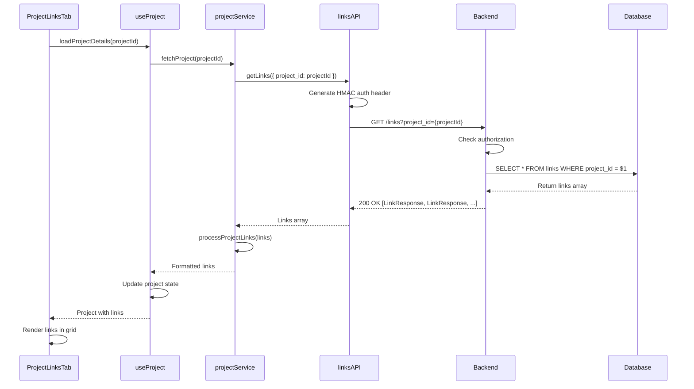
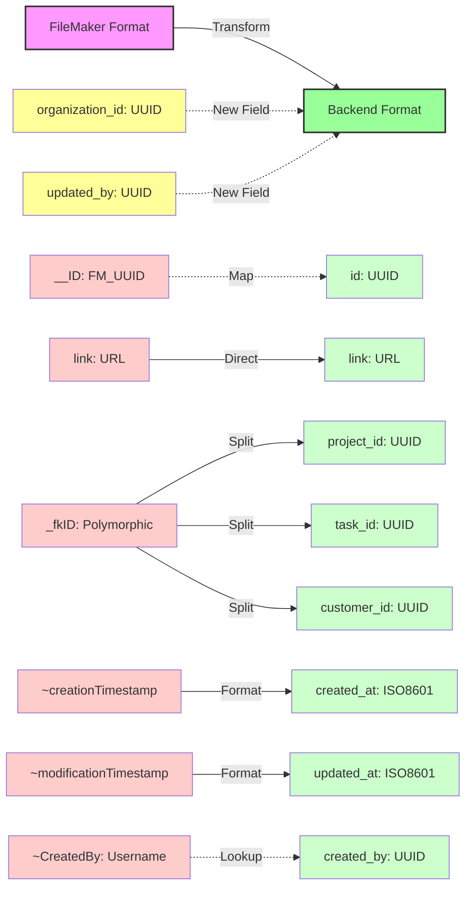
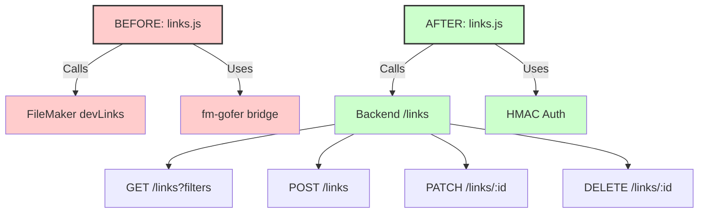
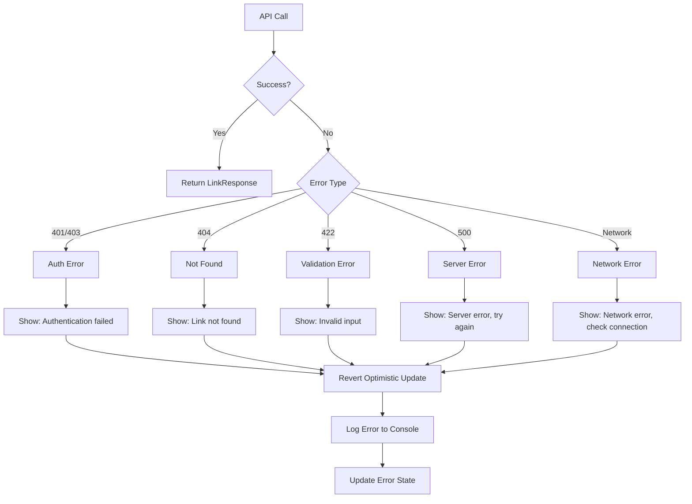
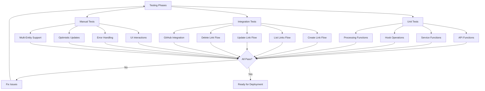
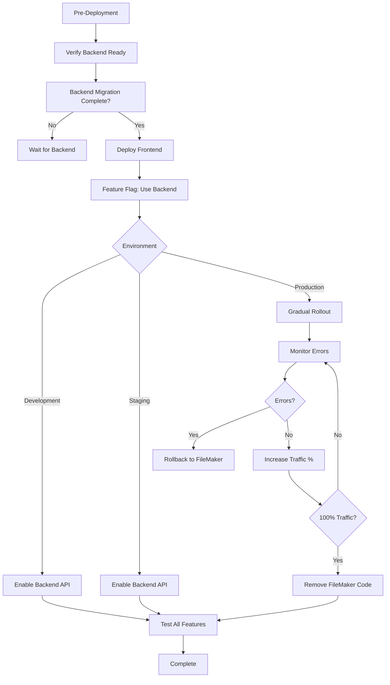

# Links Backend Integration - Workflows

## Implementation Flow

## Data Flow: Create Link (New Backend)

## Data Flow: List Links (New Backend)

## Schema Migration Flow

## API Layer Refactor

## Error Handling Flow

## Testing Strategy

## Deployment Strategy

