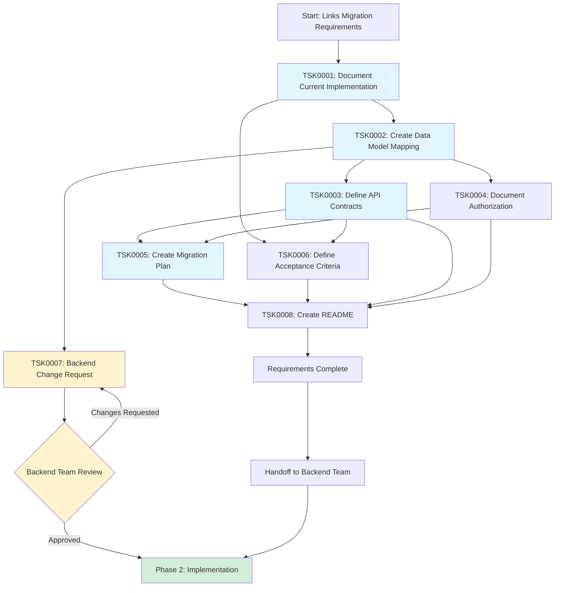
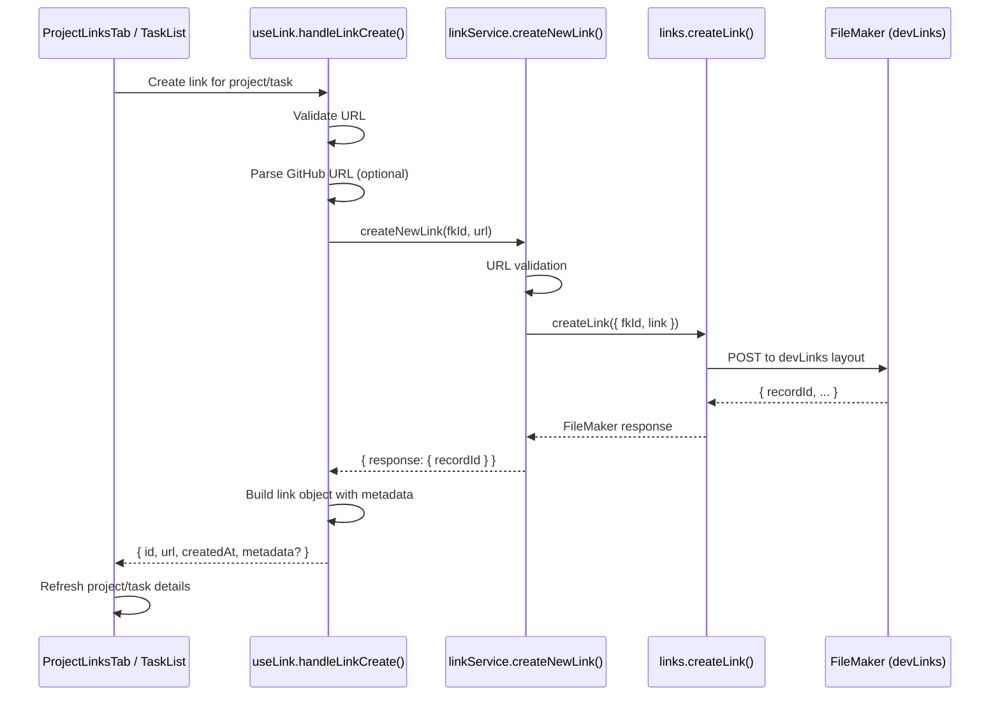
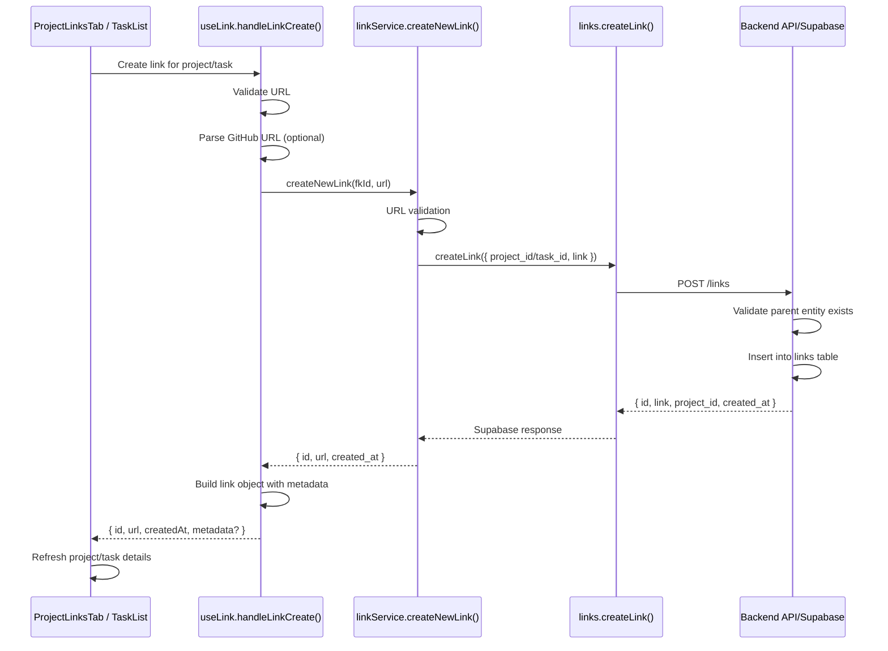
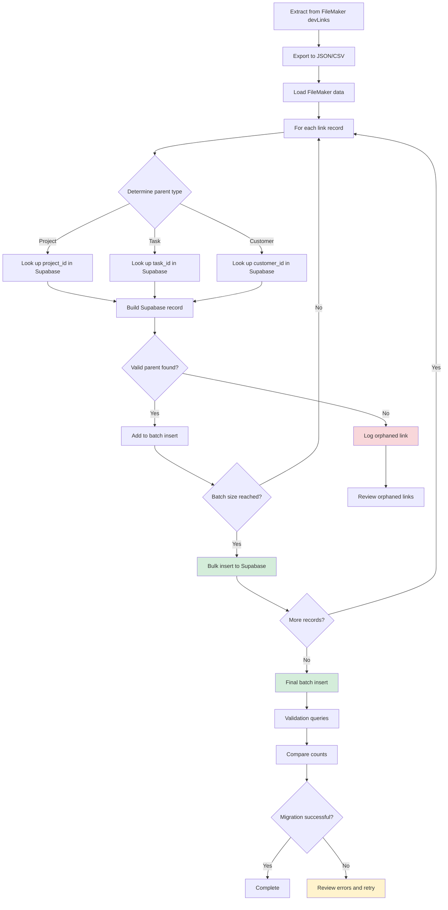
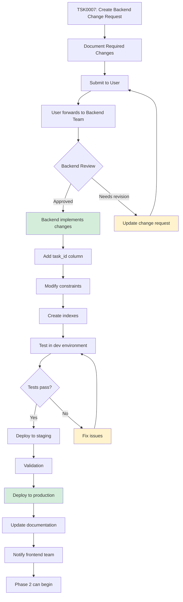

# Links Migration Requirements - Workflows

## Overview

This document outlines the workflow for documenting Links migration requirements from FileMaker to Supabase.

## Requirements Documentation Workflow

## Current Links Implementation Flow

## Proposed Supabase Implementation Flow

## Data Migration Workflow

## Schema Change Workflow

## Implementation Phases

### Phase 1: Requirements Documentation (Current)

1. **TSK0001**: Document current FileMaker implementation
   - API calls and data flow
   - UI components and user workflows
   - Service layer processing

2. **TSK0002**: Map FileMaker to Supabase data model
   - Field mappings
   - Identify schema gaps
   - Document required changes

3. **TSK0003**: Define API contracts
   - Endpoint specifications
   - Request/response formats
   - Validation rules

4. **TSK0004**: Document authorization requirements
   - RLS policies
   - Organization scoping
   - Access control

5. **TSK0005**: Create migration plan
   - Data export process
   - ID mapping strategy
   - Import and validation

6. **TSK0006**: Define acceptance criteria
   - Test cases
   - Edge cases
   - Success metrics

7. **TSK0007**: Backend change request
   - Schema modifications
   - Migration impact
   - Rollback plan

8. **TSK0008**: Create overview README
   - Quick reference
   - Link all documentation

### Phase 2: Backend Implementation (Future)

1. **Backend Team**: Review and approve requirements
2. **Backend Team**: Implement schema changes
3. **Backend Team**: Create API endpoints/RPCs
4. **Backend Team**: Implement RLS policies
5. **Backend Team**: Create migration scripts
6. **Backend Team**: Test in dev environment
7. **Backend Team**: Deploy to staging
8. **Backend Team**: Validate migration
9. **Backend Team**: Deploy to production

### Phase 3: Frontend Implementation (Future)

1. **Frontend Team**: Update `src/api/links.js` to use Supabase
2. **Frontend Team**: Update environment detection logic
3. **Frontend Team**: Test UI workflows
4. **Frontend Team**: Validate data integrity
5. **Frontend Team**: Deploy and monitor

## Key Decision Points

1. **Schema Design**: Single table with nullable FKs vs. junction tables
   - Decision: Use existing `links` table with added `task_id` column
   - Rationale: Simpler, matches current Supabase pattern

2. **API Style**: REST endpoints vs. PostgreSQL functions
   - Decision: To be determined by backend team
   - Recommendation: REST for consistency with other features

3. **Migration Strategy**: One-time bulk import vs. incremental
   - Decision: One-time bulk import after cutover
   - Rationale: Cleaner, ensures data consistency

4. **Constraint Enforcement**: Database-level vs. application-level
   - Decision: Database-level check constraint
   - Rationale: Data integrity guarantee

## Success Metrics

- All FileMaker links migrated to Supabase
- Zero orphaned links (all have valid parent associations)
- UI functionality unchanged (transparent to users)
- No downtime during migration
- Backend API response times < 200ms
- All acceptance criteria passing
