# Notes Backend Integration - Workflows

## High-Level Migration Flow

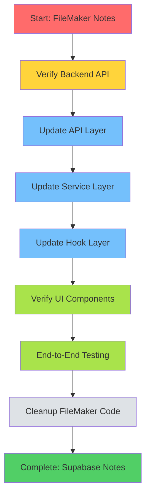

## Create Note Flow (Before Migration)

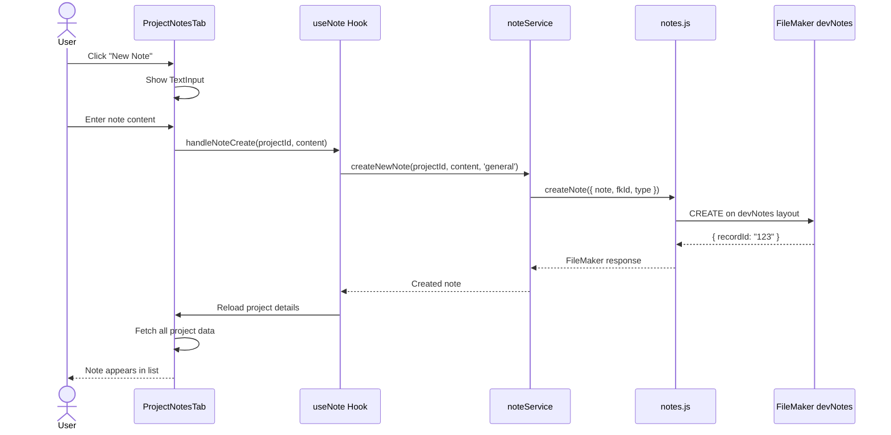

## Create Note Flow (After Migration)

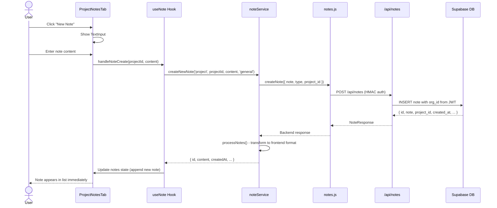

## List Notes Flow (After Migration)

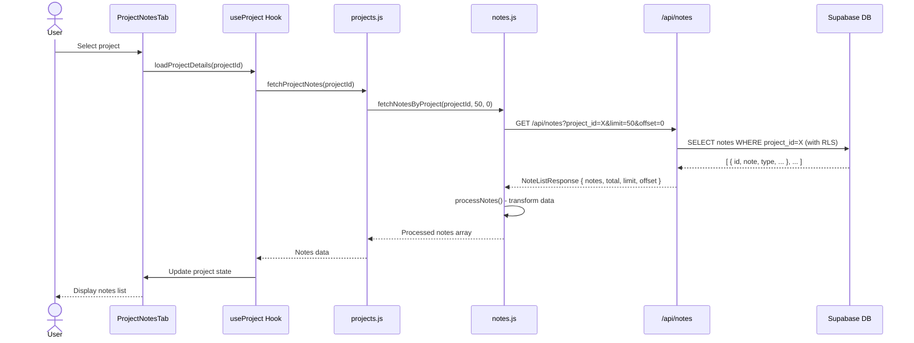

## Update Note Flow (New Capability)

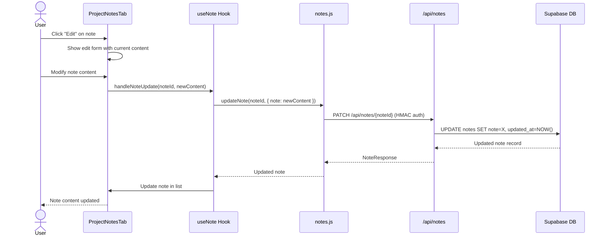

## Delete Note Flow (New Capability)

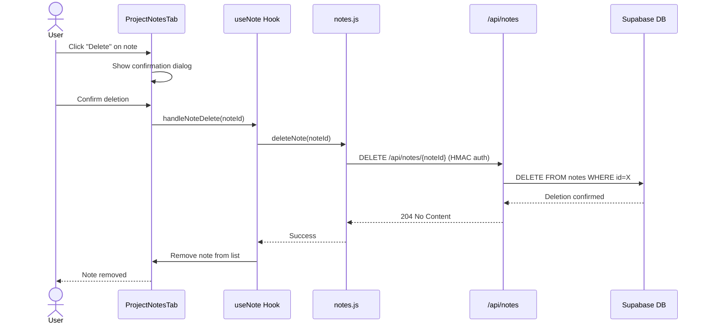

## Pagination Flow (New Capability)

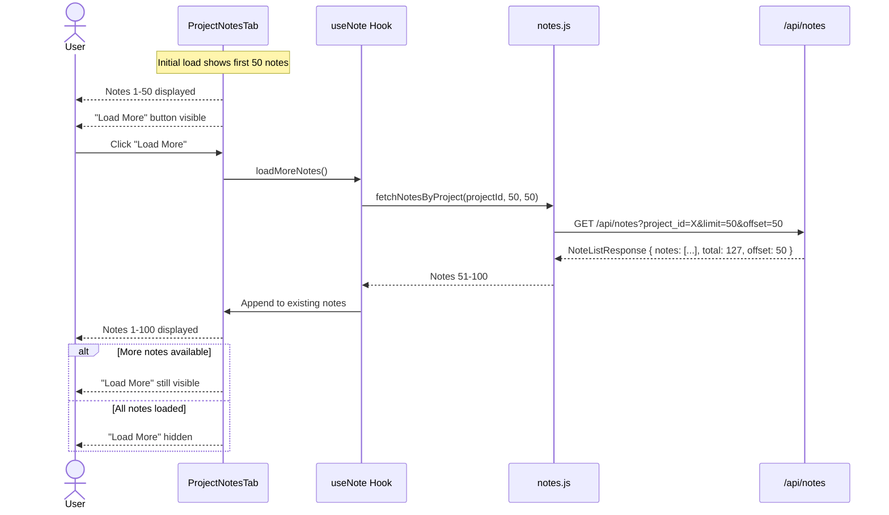

## Error Handling Flow

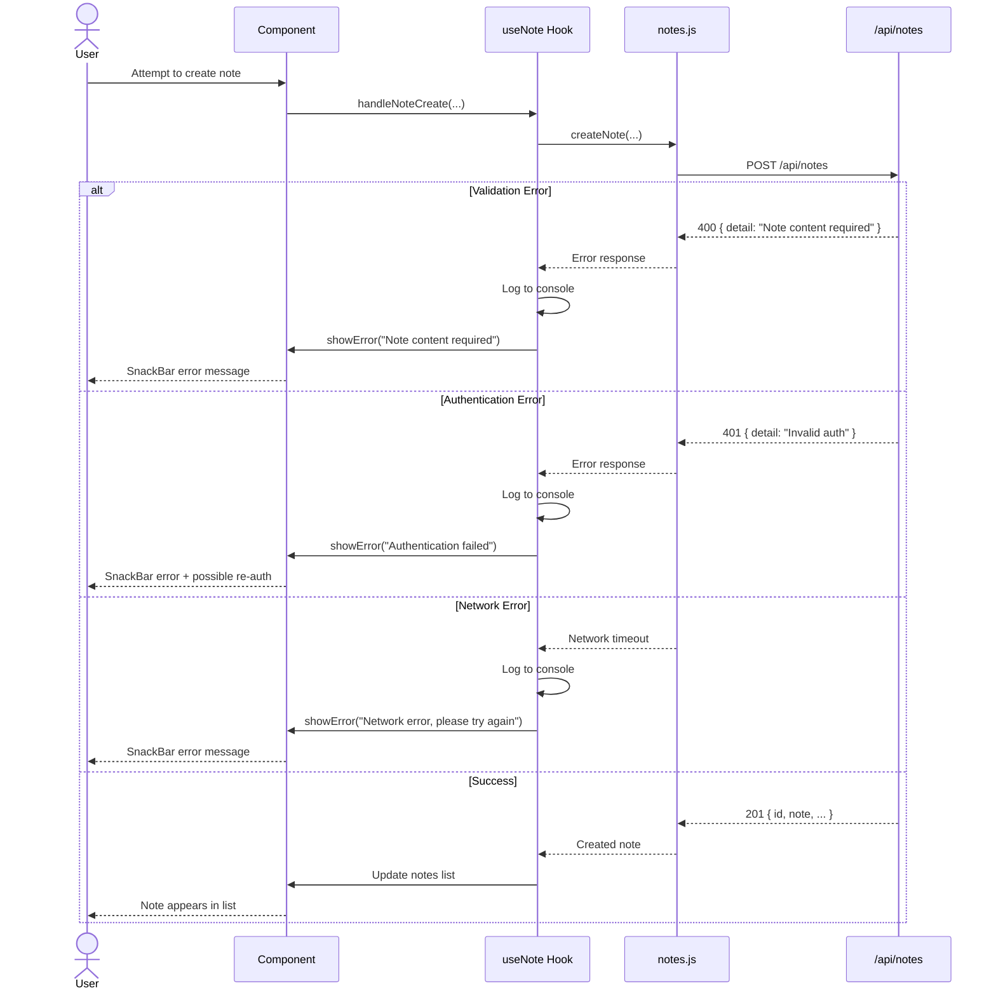

## Data Transformation Flow

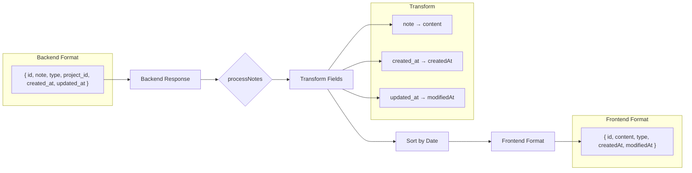

## Task Sequence

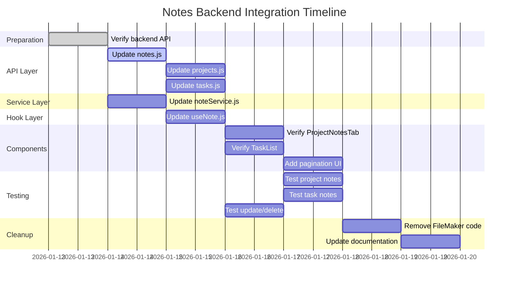

## Critical Path Dependencies

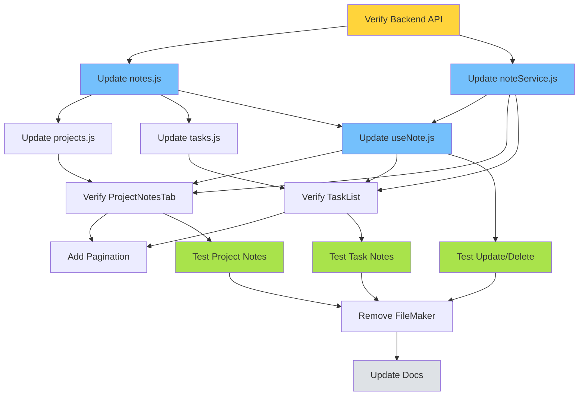
