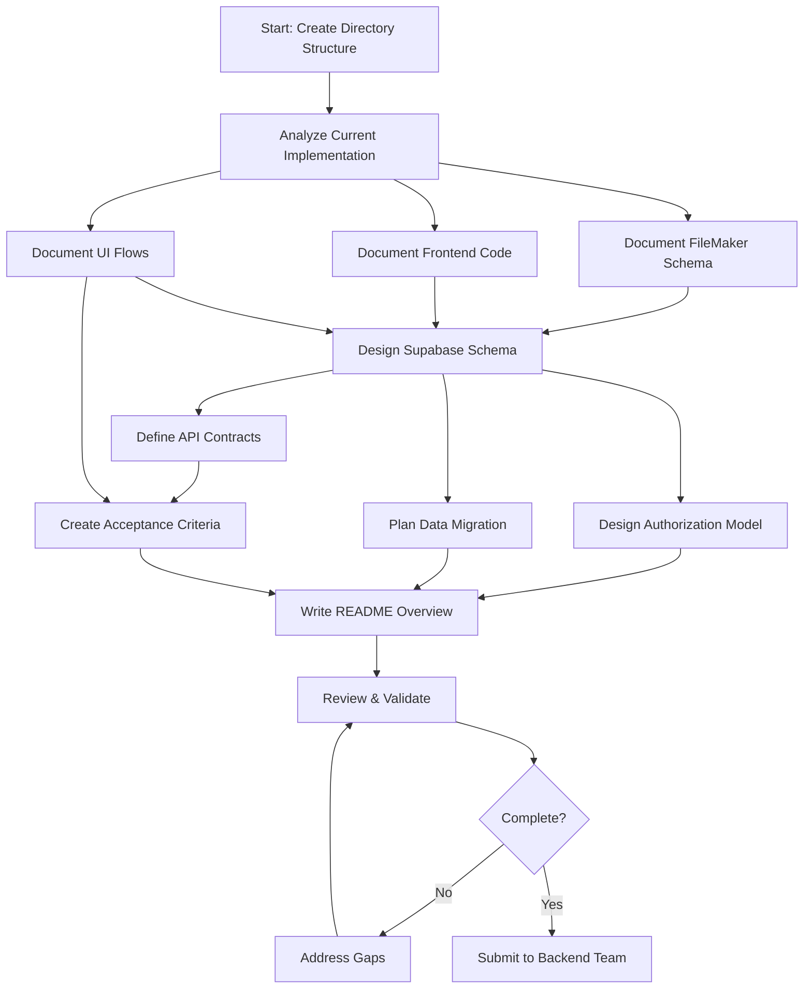
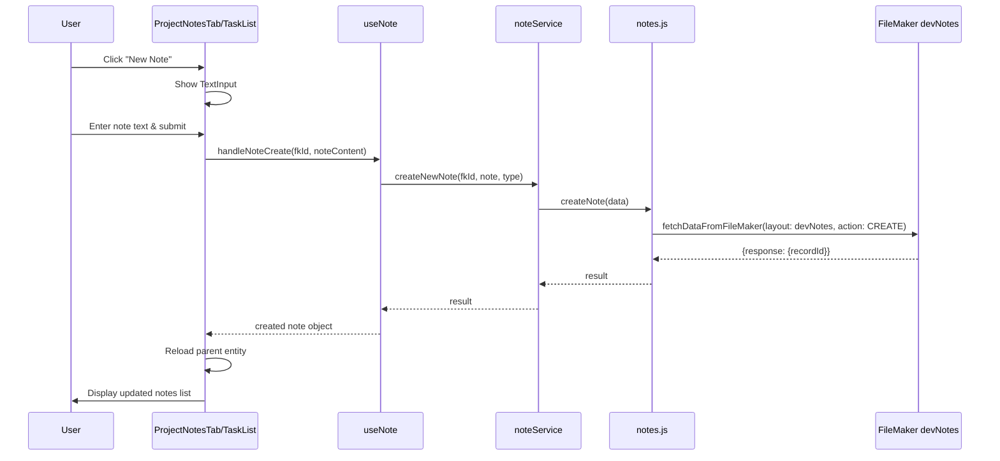
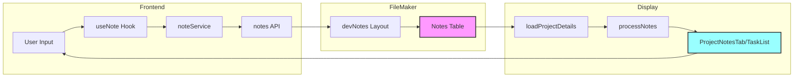
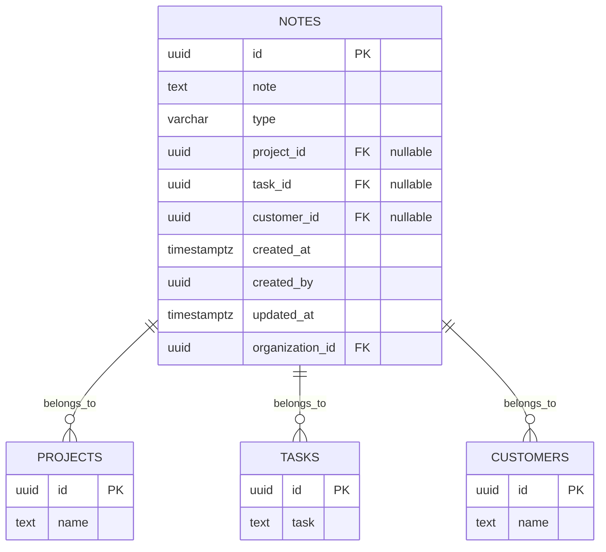
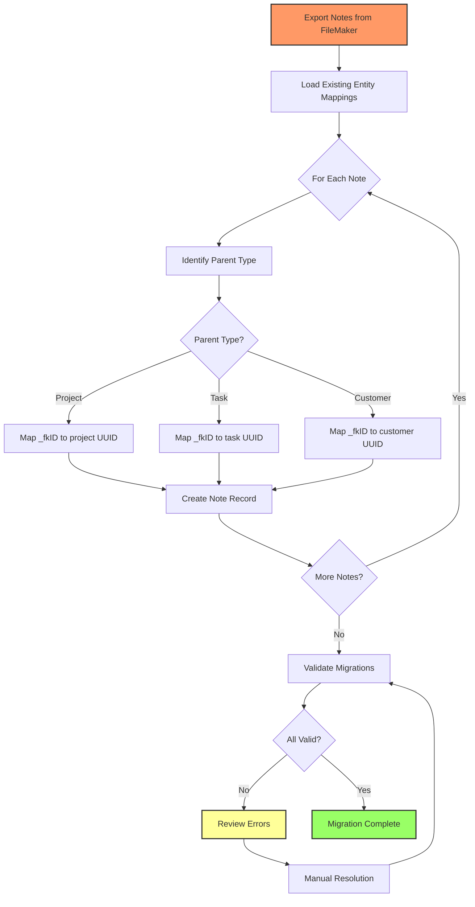
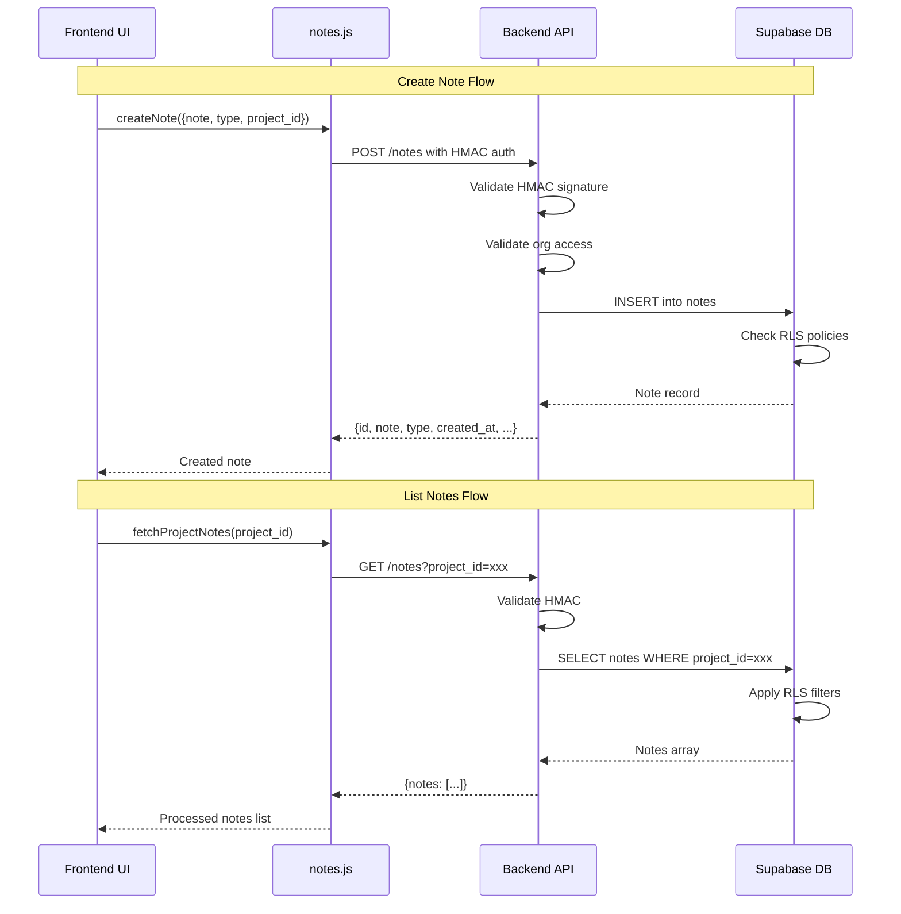

# Notes Migration Requirements - Workflows

## Documentation Creation Workflow

## Current Notes Implementation Flow

## Notes Data Flow (Current)

## Proposed Supabase Architecture

## Migration Workflow

## Backend Implementation Dependencies

```mermaid
graph LR
    A[Notes Requirements Docs] --> B[Backend Reviews]
    B --> C[Schema Design Approval]
    B --> D[API Contract Agreement]

    C --> E[Create Supabase Migration]
    D --> F[Implement Backend Endpoints]
    E --> G[Apply Migration to Dev]
    F --> G

    G --> H[Create RLS Policies]
    H --> I[Backend Testing]
    I --> J{Tests Pass?}
    J -->|No| K[Fix Issues]
    K --> I
    J -->|Yes| L[Deploy to Staging]

    L --> M[Data Migration Scripts]
    M --> N[Migrate Historical Data]
    N --> O[Validate Migration]
    O --> P{Valid?}
    P -->|No| Q[Rollback & Fix]
    Q --> M
    P -->|Yes| R[Backend Ready for Frontend]

    R --> S[Frontend Phase 2: Update notes.js API calls]

    style A fill:#9cf,stroke:#333,stroke-width:2px
    style R fill:#9f6,stroke:#333,stroke-width:2px
    style Q fill:#f96,stroke:#333,stroke-width:2px
```

## API Request Flow (Proposed)

## Task Execution Order

The tasks should be executed in the following optimal order:

1. **Foundation** (TSK0001): Create directory structure
2. **Analysis Phase** (TSK0002, TSK0003): Document current implementation and UI flows
3. **Design Phase** (TSK0004, TSK0005, TSK0006): Data model, API contracts, authorization
4. **Migration Phase** (TSK0007): Plan data migration
5. **Validation Phase** (TSK0008): Acceptance criteria
6. **Documentation Phase** (TSK0009): README overview
7. **Review Phase** (TSK0010): Final validation

Tasks TSK0004, TSK0005, TSK0006 can be worked on in parallel after TSK0002 is complete.
