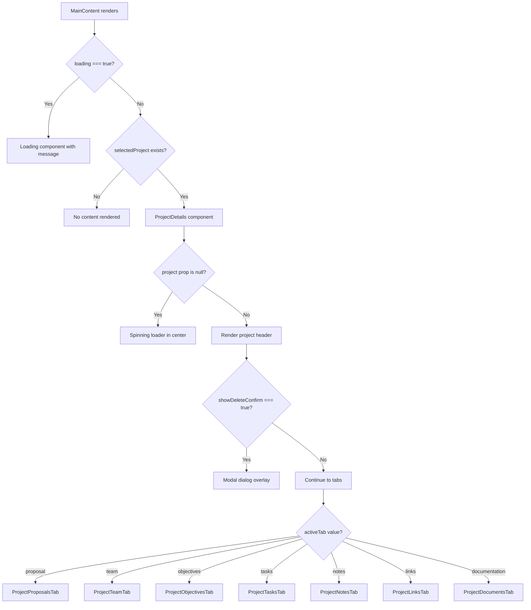
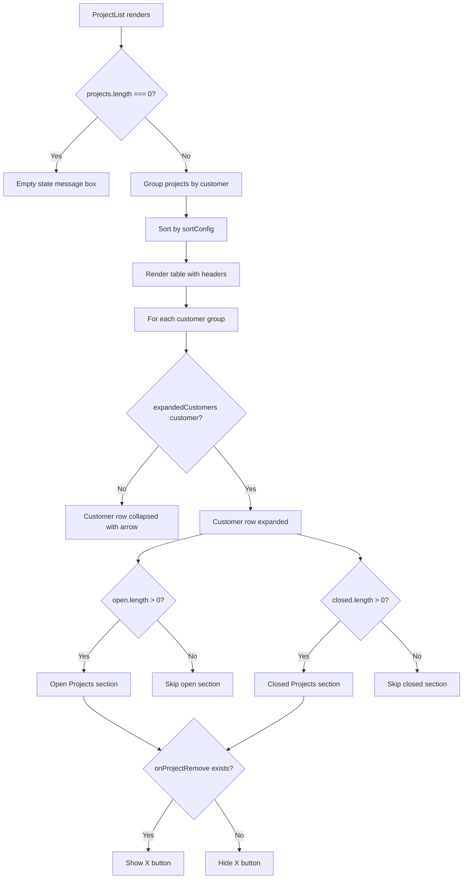
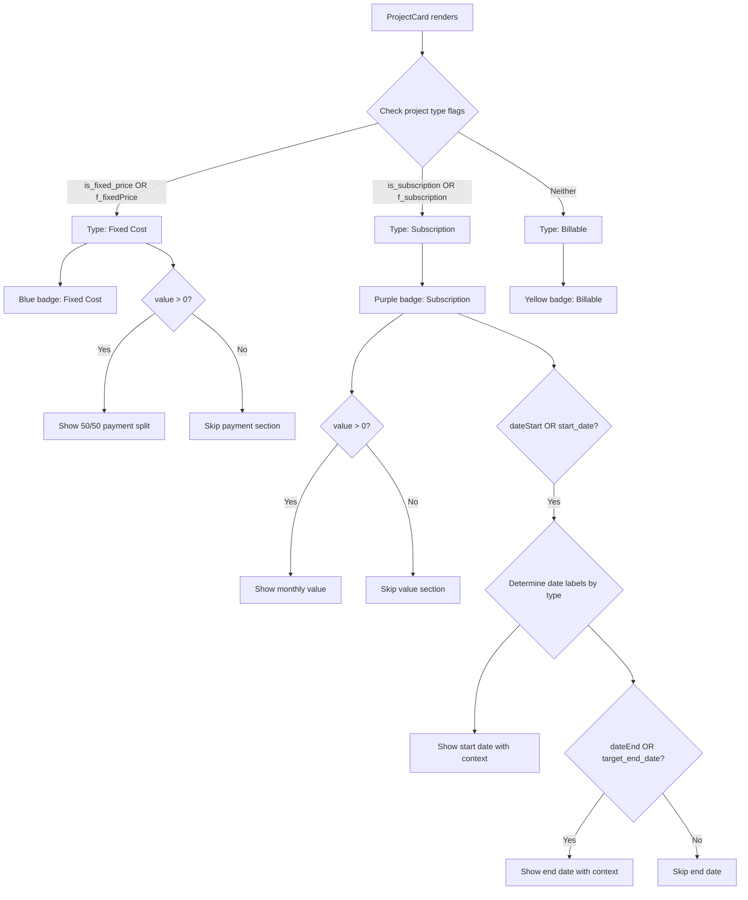
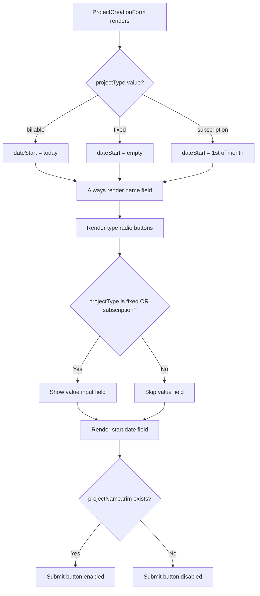
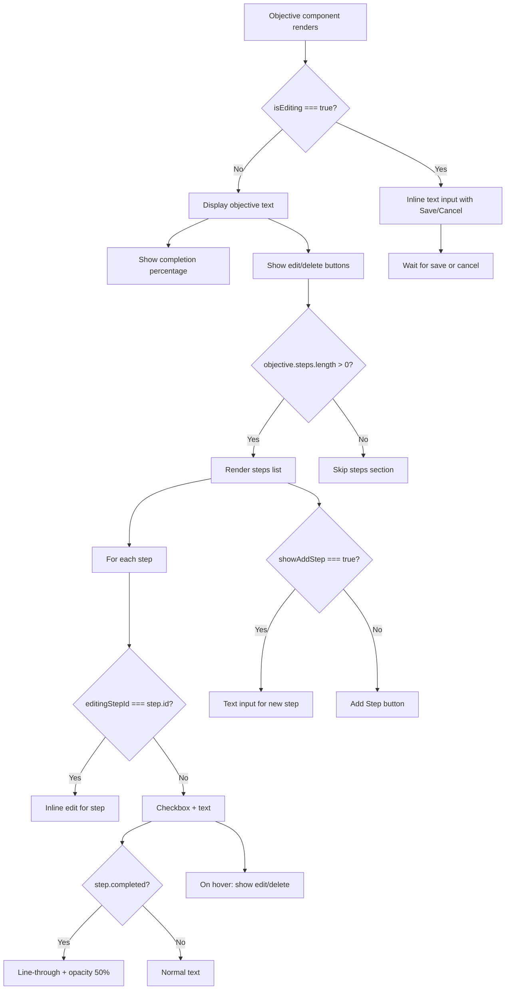
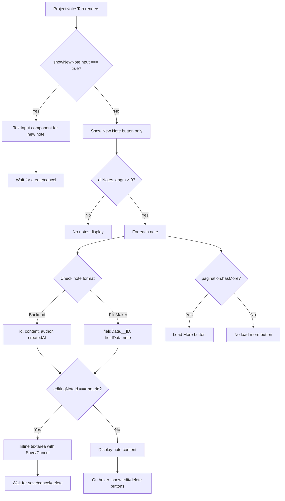

# Projects Feature - UI Workflows Documentation

This document maps how the Projects feature renders differently based on state, user context, and data conditions.

## 1. Render Decision Tree

### Entry Point: MainContent Component

### ProjectList Component Decision Tree

### ProjectCard Component Decision Tree

### ProjectCreationForm Decision Tree

### ProjectObjectivesTab Decision Tree

### ProjectNotesTab Decision Tree

## 2. Render Branch Table

| Condition | Component Rendered | Key Props | File:Line |
|-----------|-------------------|-----------|-----------|
| `loading === true` | `Loading` | `message="Loading project details..."` | src/components/MainContent.jsx:225 |
| `selectedProject === null` | None | - | src/components/MainContent.jsx:223 |
| `!project` (null project prop) | Spinning loader div | - | src/components/projects/ProjectDetails.jsx:57-63 |
| `showDeleteConfirm === true` | Modal dialog | `darkMode`, delete handlers | src/components/projects/ProjectDetails.jsx:144-179 |
| `activeTab === 'proposal'` | `ProjectProposalsTab` | `project`, `darkMode`, `localProject`, `setLocalProject` | src/components/projects/ProjectDetails.jsx:342-349 |
| `activeTab === 'team'` | `ProjectTeamTab` | `project`, `darkMode`, `localProject`, `setLocalProject`, `onTeamChange` | src/components/projects/ProjectDetails.jsx:397-405 |
| `activeTab === 'objectives'` | `ProjectObjectivesTab` | `project`, `darkMode`, objective/step handlers | src/components/projects/ProjectDetails.jsx:364-376 |
| `activeTab === 'tasks'` | `ProjectTasksTab` | `projectId`, `tasks`, task handlers | src/components/projects/ProjectDetails.jsx:352-361 |
| `activeTab === 'notes'` | `ProjectNotesTab` | `project`, `darkMode` | src/components/projects/ProjectDetails.jsx:379-384 |
| `activeTab === 'links'` | `ProjectLinksTab` | `project`, `darkMode`, `localProject`, `setLocalProject` | src/components/projects/ProjectDetails.jsx:387-394 |
| `activeTab === 'documentation'` | `ProjectDocumentsTab` | `project`, `darkMode`, `localProject`, `setLocalProject` | src/components/projects/ProjectDetails.jsx:408-415 |
| `projects.length === 0` | Empty state div | - | src/components/projects/ProjectList.jsx:106-116 |
| `expandedCustomers[customer]` | Expanded customer row | Projects grouped by status | src/components/projects/ProjectList.jsx:201-319 |
| `customer.open.length > 0` | Open Projects section | Green header | src/components/projects/ProjectList.jsx:206-259 |
| `customer.closed.length > 0` | Closed Projects section | Red header | src/components/projects/ProjectList.jsx:262-315 |
| `onProjectRemove exists` | Remove button (X) | Red hover state | src/components/projects/ProjectList.jsx:237-254 |
| `projectType === 'fixed'` | Fixed Cost badge | Blue styling | src/components/customers/ProjectCard.jsx:22-23 |
| `projectType === 'subscription'` | Subscription badge | Purple styling | src/components/customers/ProjectCard.jsx:24-25 |
| `projectType === 'billable'` | Billable badge | Yellow styling | src/components/customers/ProjectCard.jsx:26-27 |
| `is_fixed_price && value > 0` | Fixed payment breakdown | 50/50 split display | src/components/customers/ProjectCard.jsx:77-89 |
| `is_subscription && value > 0` | Monthly value display | Monthly label | src/components/customers/ProjectCard.jsx:92-98 |
| `dateStart OR start_date` | Start date row | Context-aware label | src/components/customers/ProjectCard.jsx:102-108 |
| `dateEnd OR target_end_date` | End date row | Context-aware label | src/components/customers/ProjectCard.jsx:110-116 |
| `projectType === 'fixed' OR 'subscription'` | Value input field | Required validation | src/components/customers/ProjectCreationForm.jsx:176-200 |
| `!projectName.trim()` | Disabled submit button | Opacity 50%, no pointer | src/components/customers/ProjectCreationForm.jsx:240-244 |
| `isEditing === true` (objective) | Inline text input | Save/Cancel buttons | src/components/projects/ProjectObjectivesTab.jsx:62-93 |
| `objective.steps.length > 0` | Steps list section | Left border, nested | src/components/projects/ProjectObjectivesTab.jsx:122-200 |
| `editingStepId === step.id` | Step inline editor | Save/Cancel, Enter/Esc handlers | src/components/projects/ProjectObjectivesTab.jsx:130-167 |
| `step.completed === true` | Strikethrough step text | Opacity 50% | src/components/projects/ProjectObjectivesTab.jsx:176-178 |
| `showAddStep === true` | New step input field | Add/Cancel buttons | src/components/projects/ProjectObjectivesTab.jsx:201-227 |
| `showNewNoteInput === true` | TextInput for new note | Create/Cancel handlers | src/components/projects/ProjectNotesTab.jsx:110-131 |
| `editingNoteId === noteId` | Note inline editor | Textarea with Save/Cancel | src/components/projects/ProjectNotesTab.jsx:141 |
| `pagination.hasMore === true` | Load More button | Calls handleLoadMore | src/components/projects/ProjectNotesTab.jsx:41-50 |

## 3. Derived State

### useProject Hook

| Variable | Computation Logic | Controls | Source |
|----------|------------------|----------|--------|
| `activeProjects` | `projects.filter(p => p.status === 'Open')` | Filter to only open projects | src/hooks/useProject.js:938 |
| `pagination.has_more` | Extracted from backend response or false | Load More button visibility | src/hooks/useProject.js:130 |
| `pagination.total` | Response metadata or array length | Total count display | src/hooks/useProject.js:127 |
| `pagination.offset` | Current page offset for API calls | Next page position | src/hooks/useProject.js:129 |
| `processedProjects` | `processProjectData(rawData, {}, source)` | Normalized project structure | src/hooks/useProject.js:114, 125, 134 |

### ProjectDetails Component

| Variable | Computation Logic | Controls | Source |
|----------|------------------|----------|--------|
| `localProject` | Synced from `project` prop via useEffect | Optimistic UI updates for status/team | src/components/projects/ProjectDetails.jsx:34, 52-54 |
| `activeTab` | useState with default 'proposal' | Which tab content renders | src/components/projects/ProjectDetails.jsx:33 |
| `showDeleteConfirm` | Boolean toggle state | Delete confirmation modal visibility | src/components/projects/ProjectDetails.jsx:35 |

### ProjectList Component

| Variable | Computation Logic | Controls | Source |
|----------|------------------|----------|--------|
| `groupedProjects` | Group by customer name, then by status | Customer rows and nested projects | src/components/projects/ProjectList.jsx:28-64 |
| `sortedCustomers` | Sort groups by sortConfig (name/count) | Customer row order | src/components/projects/ProjectList.jsx:67-81 |
| `expandedCustomers` | Object map of customer → boolean | Which customer rows show projects | src/components/projects/ProjectList.jsx:18, 98-103 |
| `sortConfig` | `{key, direction}` state | Sort arrow indicator and order | src/components/projects/ProjectList.jsx:14-17, 92-95 |

### ProjectCard Component

| Variable | Computation Logic | Controls | Source |
|----------|------------------|----------|--------|
| `projectType` | Check `is_fixed_price`, `is_subscription`, or default to 'Billable' | Badge text and color | src/components/customers/ProjectCard.jsx:12-17 |
| `typeColor` | Map project type to dark/light color classes | Badge background color | src/components/customers/ProjectCard.jsx:20-29 |

### ProjectCreationForm Component

| Variable | Computation Logic | Controls | Source |
|----------|------------------|----------|--------|
| `dateStart` | Auto-set based on projectType (today/empty/1st of month) | Default date value | src/components/customers/ProjectCreationForm.jsx:19-33 |
| `errors` | Validation result from `validate()` | Error message display, border colors | src/components/customers/ProjectCreationForm.jsx:35-57 |

### ProjectObjectivesTab Component

| Variable | Computation Logic | Controls | Source |
|----------|------------------|----------|--------|
| `completion` | `Math.round((completed steps / total steps) * 100)` | Completion percentage display | src/components/projects/ProjectObjectivesTab.jsx:22-26 |
| `isEditing` | Boolean state per objective | Edit mode vs view mode | src/components/projects/ProjectObjectivesTab.jsx:15 |
| `editingStepId` | Step ID or null | Which step is in edit mode | src/components/projects/ProjectObjectivesTab.jsx:18 |
| `showAddStep` | Boolean toggle | New step input visibility | src/components/projects/ProjectObjectivesTab.jsx:20 |

### ProjectNotesTab Component

| Variable | Computation Logic | Controls | Source |
|----------|------------------|----------|--------|
| `allNotes` | Initialized from `project.notes`, appended on load more | Notes list display | src/components/projects/ProjectNotesTab.jsx:9, 27-38 |
| `pagination` | `getPagination('project', project.id)` from hook | Load More button, hasMore flag | src/components/projects/ProjectNotesTab.jsx:24 |
| `editingNoteId` | Note ID or null | Which note is being edited | src/components/projects/ProjectNotesTab.jsx:10 |
| `noteId` | `note.id || note.fieldData?.__ID` | Dual-format support | src/components/projects/ProjectNotesTab.jsx:136 |
| `noteContent` | `note.content || note.fieldData?.note` | Dual-format support | src/components/projects/ProjectNotesTab.jsx:137 |

## 4. Loading & Error States

### Loading States

| State | Component | Behavior | File:Line |
|-------|-----------|----------|-----------|
| Global loading | `MainContent` | Full-screen `Loading` component with message | src/components/MainContent.jsx:224-226 |
| Project not loaded | `ProjectDetails` | Centered spinning loader (12x12 border spinner) | src/components/projects/ProjectDetails.jsx:57-63 |
| Note creation | `ProjectNotesTab` | Button text changes to "Adding...", button disabled | src/components/projects/ProjectNotesTab.jsx:105-108 |
| Project selection | `ProjectList` | `setLoading(true)` before `onProjectSelect` call | src/components/projects/ProjectList.jsx:222-224 |
| Card selection | `ProjectCard` | `setLoading(true)` before `onSelect` call | src/components/customers/ProjectCard.jsx:37-38 |
| Team loading | `ProjectDetails` | `loadTeams()` called on mount (error logged only) | src/components/projects/ProjectDetails.jsx:43-49 |
| Hook loading | `useProject` | `loading` state returned by hook, managed per operation | src/hooks/useProject.js:42 |
| Pagination loading | `useProject` | `noteLoading` from useNote hook | src/components/projects/ProjectNotesTab.jsx:19 |

### Error States

| State | Component | Behavior | File:Line |
|-------|-----------|----------|-----------|
| Validation errors | `ProjectCreationForm` | Red border on input, error message text below field | src/components/customers/ProjectCreationForm.jsx:124, 128-130 |
| Team load error | `ProjectDetails` | Console.error, no UI feedback | src/components/projects/ProjectDetails.jsx:45-47 |
| Note create error | `ProjectNotesTab` | Console.error, no UI feedback | src/components/projects/ProjectNotesTab.jsx:125 |
| Note update error | `ProjectNotesTab` | Console.error, no UI feedback | src/components/projects/ProjectNotesTab.jsx:77 |
| Note delete error | `ProjectNotesTab` | Console.error, no UI feedback | src/components/projects/ProjectNotesTab.jsx:94 |
| Load more error | `ProjectNotesTab` | Console.error, no UI feedback | src/components/projects/ProjectNotesTab.jsx:48 |
| Hook error state | `useProject` | `error` state stored, `setError(null)` on success | src/hooks/useProject.js:43, 86, 154, 214, 240, 262, etc. |
| Project selection error | `useProject` | `setError(err.message)`, logged to console | src/hooks/useProject.js:240-242 |
| Status change error | `ProjectDetails` | Optimistic update reverted, console.error | src/components/projects/ProjectDetails.jsx:100-104 |
| Error boundary | `MainContent` | Wraps ProjectDetails with reset handler | src/components/MainContent.jsx:228-250 |

### Empty States

| State | Component | Display | File:Line |
|-------|-----------|---------|-----------|
| No projects | `ProjectList` | Centered gray box: "No projects assigned to this team" | src/components/projects/ProjectList.jsx:106-116 |
| No open projects | `ProjectList` | Section skipped | src/components/projects/ProjectList.jsx:206 |
| No closed projects | `ProjectList` | Section skipped | src/components/projects/ProjectList.jsx:262 |
| No notes | `ProjectNotesTab` | Implied: no notes render, list is empty | src/components/projects/ProjectNotesTab.jsx:132 |
| No steps | `ProjectObjectivesTab` | Steps section skipped | src/components/projects/ProjectObjectivesTab.jsx:122 |
| No stats | `ProjectDetails` | Stats grid not rendered | src/components/projects/ProjectDetails.jsx:189 |
| No estimated time | `ProjectDetails` | Span not rendered | src/components/projects/ProjectDetails.jsx:182 |
| No created date | `ProjectDetails` | Span not rendered | src/components/projects/ProjectDetails.jsx:184 |

## 5. User Role Variations

**Note**: The Projects feature does NOT currently implement user role-based rendering differences. All authenticated users see the same UI. Role-based access control is handled at the backend API level via JWT claims and RLS policies, not at the UI level.

### Organization Scoping (Primary Access Control)

| Context | Behavior | Implementation |
|---------|----------|----------------|
| Organization ID in JWT | All API requests scoped to user's organization | Handled by dataService interceptor adding `X-Organization-ID` header |
| Missing organization ID | Backend returns 401/403 errors | Hook logs warnings and shows errors to user |
| Multi-org users | Only one organization active per session | Selected during login, stored in JWT claims |

### UI Elements Always Visible

- Project create/edit buttons
- Project delete button
- Status toggle
- Team assignment
- Objectives and steps CRUD
- Notes CRUD
- Links CRUD
- All project tabs

### Potential Future Role-Based Features

Areas where role-based UI could be added in future:

1. **Project Creation**: Restrict to admin/manager roles
2. **Project Deletion**: Restrict to admin roles only
3. **Budget/Value Editing**: Hide from regular staff
4. **Team Assignment**: Restrict to managers
5. **Status Changes**: Limit who can close projects
6. **Financial Data**: Hide stats/value from non-managers

Current implementation relies on backend validation for these actions, not frontend hiding.

## 6. Re-render Triggers

### AppStateContext Changes

| State Change | Components Re-rendered | File:Line |
|--------------|----------------------|-----------|
| `SET_SELECTED_PROJECT` | `MainContent` → `ProjectDetails` and all children | src/context/AppStateContext.jsx:131-138 |
| `SET_SELECTED_CUSTOMER` | Clears project selection, full re-render | src/context/AppStateContext.jsx:102-113 |
| `SET_LOADING` | `MainContent` loading conditional | src/context/AppStateContext.jsx:83-88 |
| `SET_ERROR` | Error display components | src/context/AppStateContext.jsx:89-95 |

### useProject Hook Updates

| Action | State Changed | Re-renders Triggered | File:Line |
|--------|---------------|---------------------|-----------|
| `loadProjects()` | `projects`, `pagination`, `loading` | ProjectList, any component displaying project arrays | src/hooks/useProject.js:83-159 |
| `handleProjectSelect()` | `selectedProject`, `loading`, `error` | ProjectDetails and all tabs | src/hooks/useProject.js:210-249 |
| `handleProjectStatusChange()` | `projects`, `selectedProject` | Status toggle, project cards, lists | src/hooks/useProject.js:463-500 |
| `handleProjectCreate()` | `projects` (via reload), `loading` | ProjectList, customer project displays | src/hooks/useProject.js:255-351 |
| `handleProjectUpdate()` | `projects`, `selectedProject` | ProjectDetails, ProjectCard, ProjectList | src/hooks/useProject.js:357-455 |
| `handleProjectDelete()` | `projects`, `selectedProject` | Full project list refresh | src/hooks/useProject.js:514-546 |
| `handleObjectiveCreate()` | `selectedProject` (via reload) | ObjectivesTab only | src/hooks/useProject.js:600-629 |
| `handleObjectiveUpdate()` | `selectedProject`, `projects` | ObjectivesTab only | src/hooks/useProject.js:635-682 |
| `handleObjectiveDelete()` | `selectedProject`, `projects` | ObjectivesTab only | src/hooks/useProject.js:689-725 |
| `handleStepCreate()` | `selectedProject` (via reload) | ObjectivesTab steps list | src/hooks/useProject.js:731-760 |
| `handleStepUpdate()` | `selectedProject`, `projects` | ObjectivesTab step item | src/hooks/useProject.js:766-818 |
| `handleStepDelete()` | `selectedProject`, `projects` | ObjectivesTab steps list | src/hooks/useProject.js:824-861 |
| `handleStepToggle()` | `selectedProject`, `projects` | ObjectivesTab checkbox/text | src/hooks/useProject.js:867-908 |
| `loadMoreProjects()` | `projects` (append), `pagination` | ProjectList with new rows | src/hooks/useProject.js:914-926 |

### useNote Hook Updates

| Action | State Changed | Re-renders Triggered | File:Line |
|--------|---------------|---------------------|-----------|
| `handleNoteCreate()` | `allNotes` (via project reload) | NotesTab list | src/components/projects/ProjectNotesTab.jsx:116-127 |
| `handleNoteUpdate()` | `allNotes` (via project reload) | NotesTab item | src/components/projects/ProjectNotesTab.jsx:65-80 |
| `handleNoteDelete()` | `allNotes` (via project reload) | NotesTab list | src/components/projects/ProjectNotesTab.jsx:83-96 |
| `handleFetchNotes()` | `allNotes` (append), `pagination` | NotesTab with Load More | src/components/projects/ProjectNotesTab.jsx:41-50 |
| `updatePagination()` | `pagination` state in hook | Load More button visibility | src/components/projects/ProjectNotesTab.jsx:31-37 |

### ProjectDetails Local State

| State Change | Components Re-rendered | File:Line |
|--------------|----------------------|-----------|
| `activeTab` | Unmounts previous tab, mounts new tab | src/components/projects/ProjectDetails.jsx:33, 232-333 |
| `localProject` | Header status toggle, stats display | src/components/projects/ProjectDetails.jsx:34, 83-96 |
| `showDeleteConfirm` | Delete modal overlay | src/components/projects/ProjectDetails.jsx:35, 144 |

### ProjectList Local State

| State Change | Components Re-rendered | File:Line |
|--------------|----------------------|-----------|
| `sortConfig` | Full table re-sort and re-render | src/components/projects/ProjectList.jsx:14-17, 84-89 |
| `expandedCustomers` | Customer row expansion/collapse | src/components/projects/ProjectList.jsx:18, 98-103, 201-319 |

### ProjectObjectivesTab Local State

| State Change | Components Re-rendered | File:Line |
|--------------|----------------------|-----------|
| `isEditing` | Objective view ↔ edit mode | src/components/projects/ProjectObjectivesTab.jsx:15, 62-117 |
| `editingStepId` | Step view ↔ edit mode | src/components/projects/ProjectObjectivesTab.jsx:18, 130-196 |
| `showAddStep` | New step input toggle | src/components/projects/ProjectObjectivesTab.jsx:20, 201-227 |
| `newStepText` | Add step input value | src/components/projects/ProjectObjectivesTab.jsx:17, 35-41 |
| `editText` | Objective edit input value | src/components/projects/ProjectObjectivesTab.jsx:16, 28-33 |
| `editingStepText` | Step edit input value | src/components/projects/ProjectObjectivesTab.jsx:19, 44-49 |

### ProjectNotesTab Local State

| State Change | Components Re-rendered | File:Line |
|--------------|----------------------|-----------|
| `showNewNoteInput` | New note input toggle | src/components/projects/ProjectNotesTab.jsx:8, 110-131 |
| `allNotes` | Notes list display | src/components/projects/ProjectNotesTab.jsx:9, 27-38, 132-150 |
| `editingNoteId` | Note view ↔ edit mode | src/components/projects/ProjectNotesTab.jsx:10, 141 |
| `editContent` | Note edit textarea value | src/components/projects/ProjectNotesTab.jsx:11, 53-80 |

### ProjectCreationForm Local State

| State Change | Components Re-rendered | File:Line |
|--------------|----------------------|-----------|
| `projectName` | Input value, submit button enable/disable | src/components/customers/ProjectCreationForm.jsx:12, 113-130, 240-244 |
| `projectType` | Value field visibility, date defaults, labels | src/components/customers/ProjectCreationForm.jsx:13, 19-33, 138-173, 176-222 |
| `value` | Value input display | src/components/customers/ProjectCreationForm.jsx:14, 181-198 |
| `dateStart` | Date input display | src/components/customers/ProjectCreationForm.jsx:15, 207-221 |
| `errors` | Error message and border color display | src/components/customers/ProjectCreationForm.jsx:16, 35-57, 124, 128-130, 193-198, 216-221 |

### Theme Context Changes

| State Change | Components Re-rendered | Effect |
|--------------|----------------------|--------|
| `darkMode` toggle | All project components | CSS class changes for colors/backgrounds |

### Props Changes (Parent → Child)

| Prop Change | Child Component | File:Line |
|-------------|----------------|-----------|
| `project` prop | `ProjectDetails` → all tabs | src/components/projects/ProjectDetails.jsx:30, 52-54 |
| `tasks` prop | `ProjectTasksTab` | src/components/projects/ProjectDetails.jsx:355 |
| `projects` prop | `ProjectList` | src/components/projects/ProjectList.jsx:7 |
| `customer` prop | `ProjectCreationForm` | src/components/customers/ProjectCreationForm.jsx:7 |

### Effect Dependencies

| useEffect Dependency | Triggered Action | File:Line |
|---------------------|-----------------|-----------|
| `customerId` change | `loadProjects()` call | src/hooks/useProject.js:64-71 |
| `project` prop change | `setLocalProject()` update | src/components/projects/ProjectDetails.jsx:52-54 |
| `loadTeams` change | `loadTeams()` call | src/components/projects/ProjectDetails.jsx:43-49 |
| `projectType` change | Date defaults recalculated | src/components/customers/ProjectCreationForm.jsx:19-33 |
| `project.notes` change | `allNotes` and pagination update | src/components/projects/ProjectNotesTab.jsx:27-38 |
| `pagination` state change | `paginationRef.current` sync | src/hooks/useProject.js:59-61 |

### Memoization Preventing Re-renders

| Memoized Component | Prevents Re-render When | File:Line |
|-------------------|------------------------|-----------|
| `React.memo(ProjectDetails)` | Props unchanged | src/components/projects/ProjectDetails.jsx:465 |
| `React.memo(ProjectList)` | Props unchanged | src/components/projects/ProjectList.jsx:345 |
| `React.memo(ProjectCard)` | Props unchanged | src/components/customers/ProjectCard.jsx:146 |
| `React.memo(Objective)` | Objective object unchanged | src/components/projects/ProjectObjectivesTab.jsx:5 |
| `useMemo(groupedProjects)` | Projects array unchanged | src/components/projects/ProjectList.jsx:28-64 |
| `useMemo(sortedCustomers)` | Grouped projects or sortConfig unchanged | src/components/projects/ProjectList.jsx:67-81 |
| `useMemo(completion)` | Objective steps unchanged | src/components/projects/ProjectObjectivesTab.jsx:22-26 |
| `useCallback(loadProjects)` | Dependencies unchanged | src/hooks/useProject.js:83 |
| `useCallback(handleProjectSelect)` | Dependencies unchanged | src/hooks/useProject.js:210 |

---

## Summary

The Projects feature uses a **hierarchical state architecture**:

1. **Global State** (AppStateContext) determines if projects render at all
2. **Hook State** (useProject) manages data loading and CRUD operations
3. **Component State** (local useState) controls UI interactions (tabs, edit modes, toggles)
4. **Derived State** (useMemo) optimizes expensive computations (grouping, sorting, completion %)

**Key Render Patterns**:
- **Conditional tabs**: Only active tab content renders, others unmount
- **Optimistic updates**: Status toggle updates immediately, reverts on error
- **Dual-format support**: Components handle both backend (snake_case) and FileMaker (camelCase) data
- **Inline editing**: Edit modes toggle between view/edit without navigation
- **Pagination**: Load More pattern for notes, full list for projects
- **Empty states**: Graceful messaging when no data exists
- **Loading states**: Spinners and disabled buttons during async operations

**Performance Optimizations**:
- React.memo on all major components
- useMemo for expensive grouping/sorting
- useCallback for stable handler references
- requestId gating prevents race conditions in project selection
