# Projects Backend Integration Workflows

## Implementation Flow

This document visualizes the implementation workflow for migrating projects from FileMaker to the new backend API.

## Overall Architecture Flow

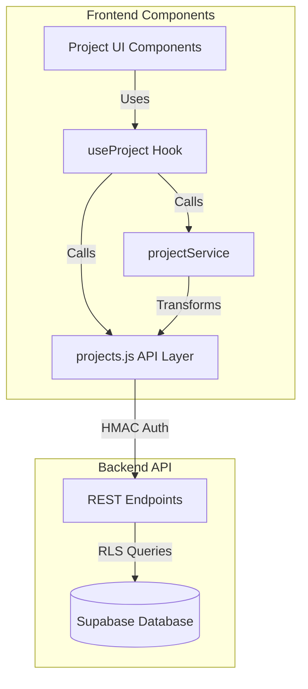

## Data Flow: List Projects

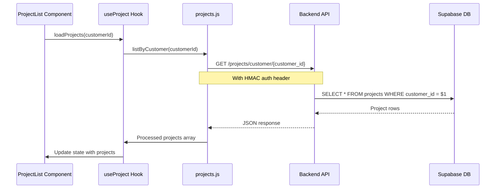

## Data Flow: Load Project Details

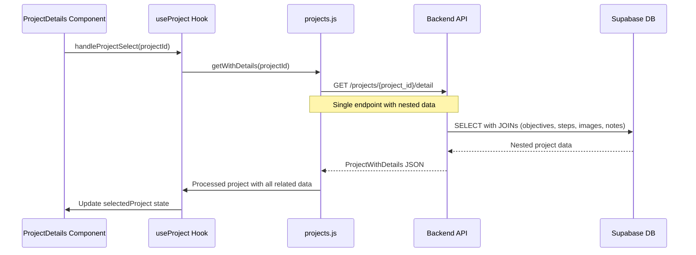

## Data Flow: Create Project

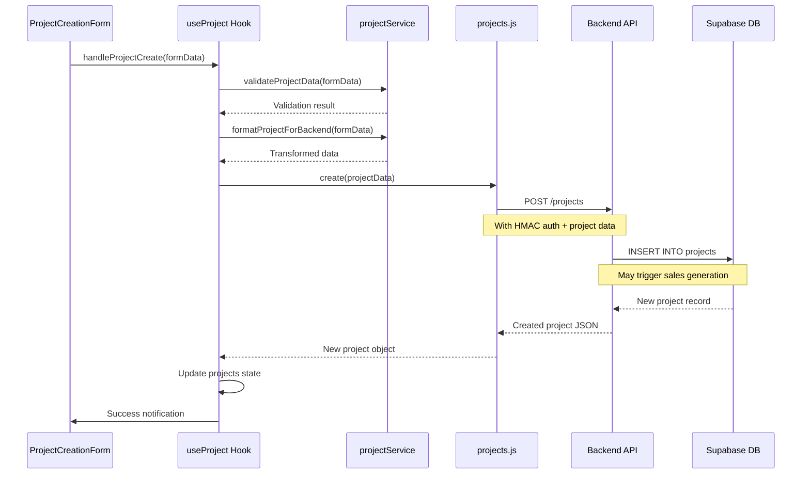

## Data Flow: Update Project Status

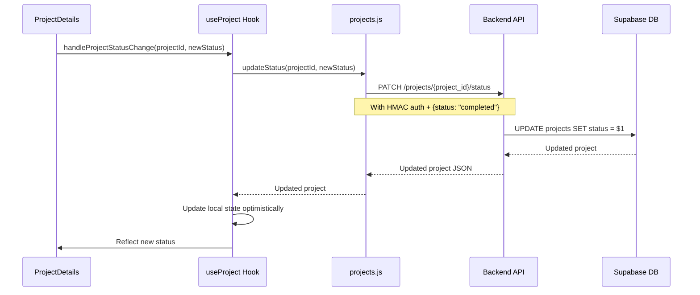

## Data Flow: Manage Objectives

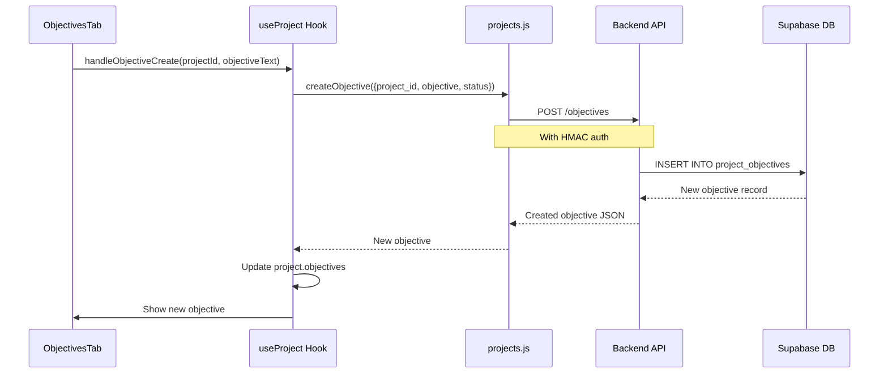

## Implementation Task Flow

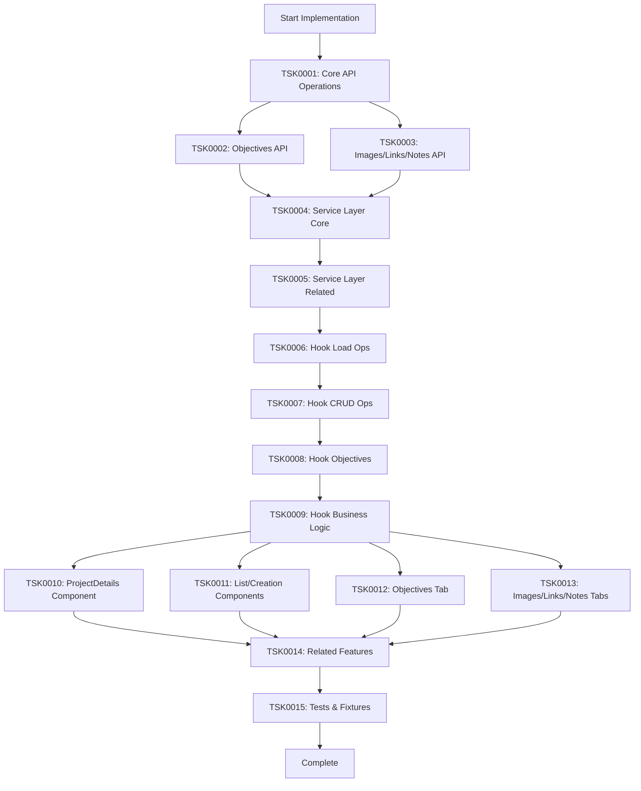

## Field Mapping Reference

### FileMaker → Backend Schema

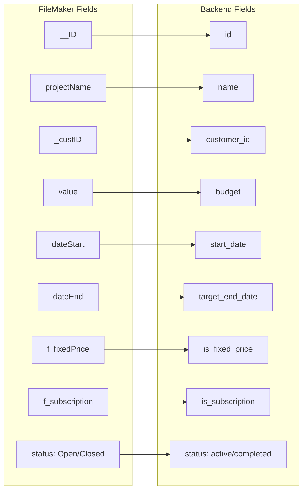

## Testing Flow

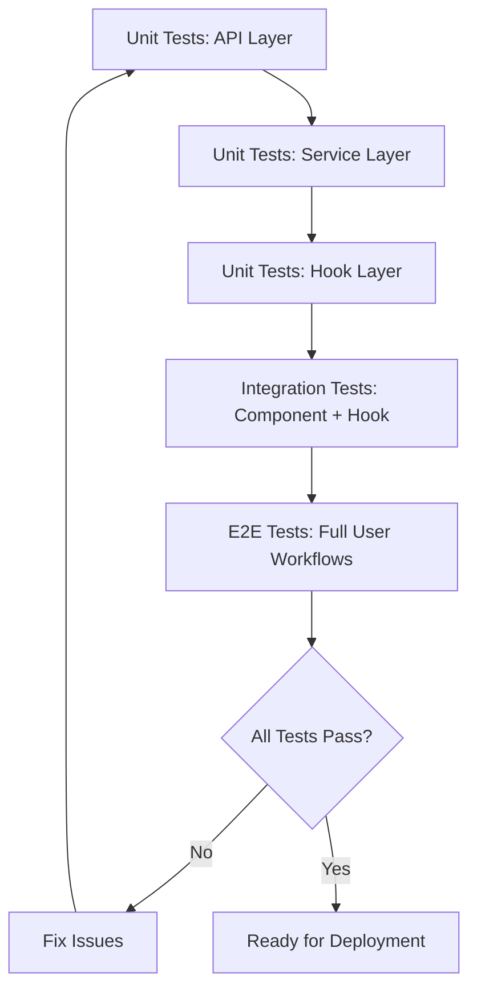

## Error Handling Flow

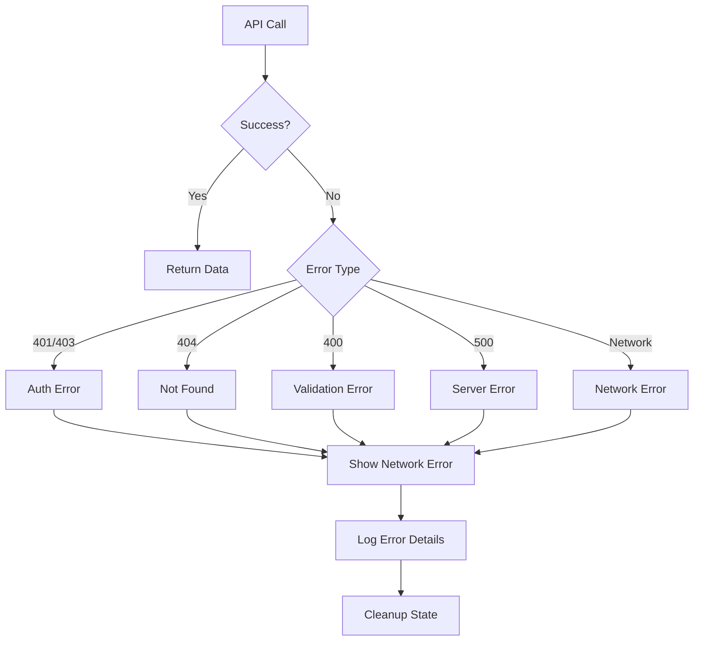

## Rollback Strategy

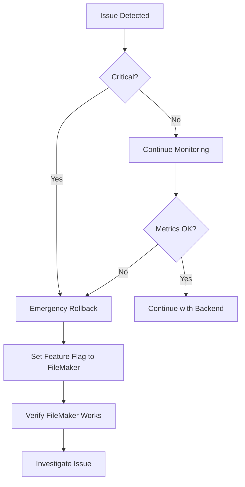

## Notes

- All API calls use HMAC authentication via `dataService.generateBackendAuthHeader()`
- Backend endpoints return standardized JSON responses
- Error handling should be consistent across all operations
- Loading states should be managed at hook level
- Optimistic updates for better UX (update local state immediately, rollback on error)
- The `/projects/{project_id}/detail` endpoint may return nested data, reducing number of API calls
- Business logic (fixed-price, subscription sales generation) may be backend-side - verify with backend team
