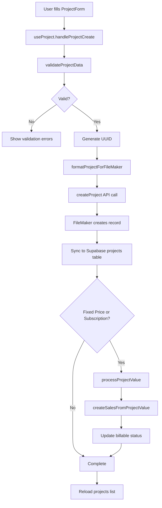
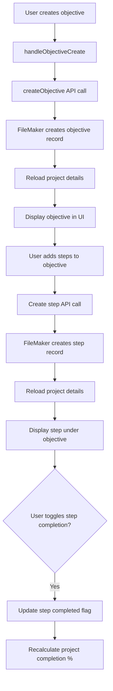
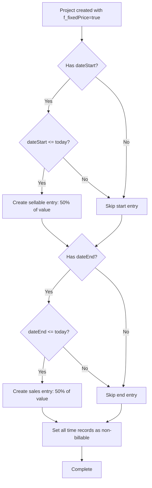
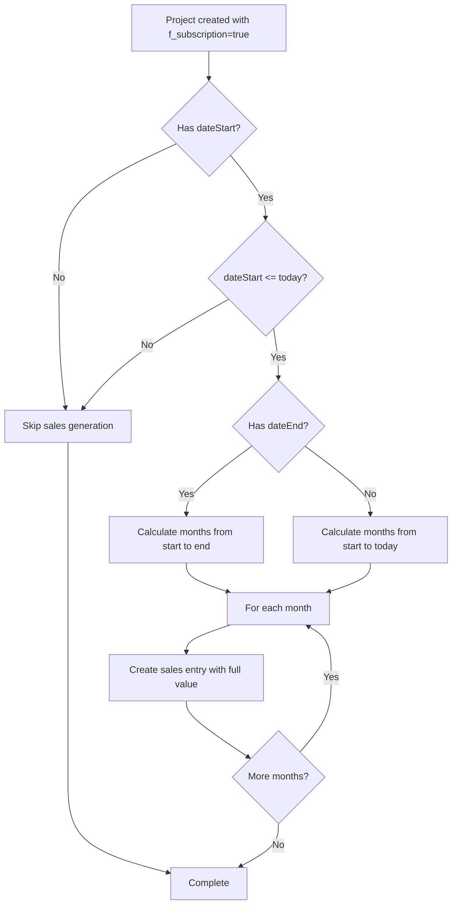
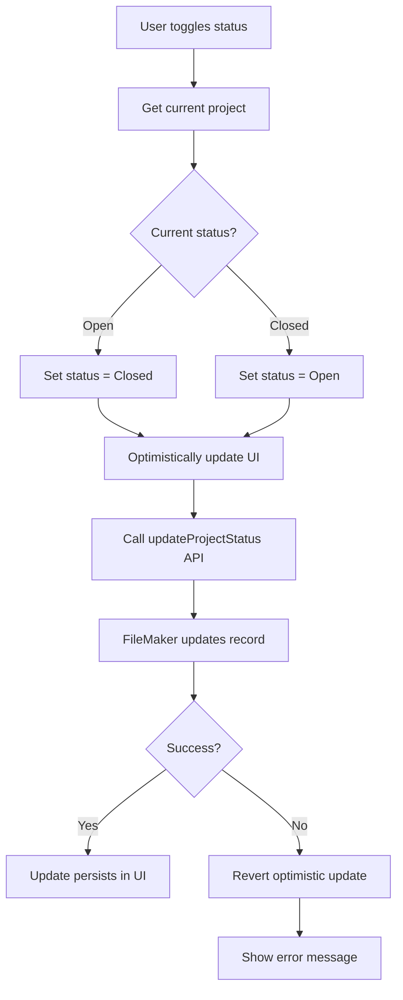
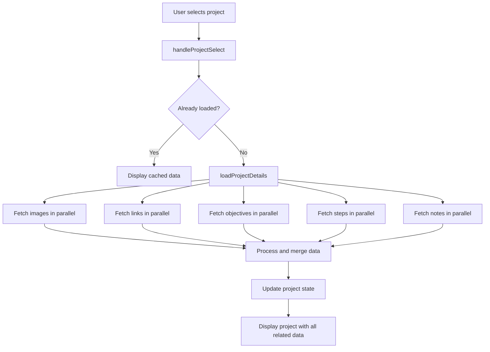
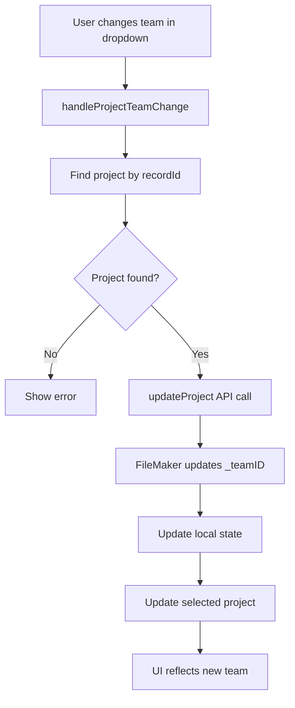
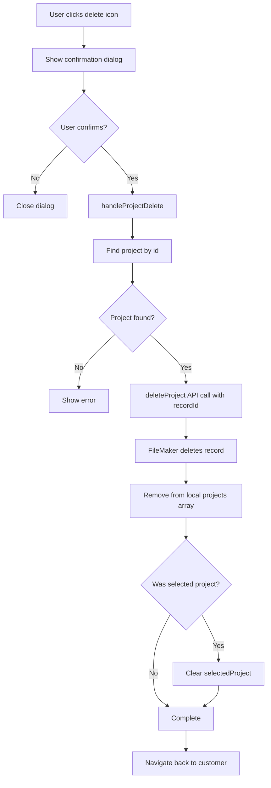
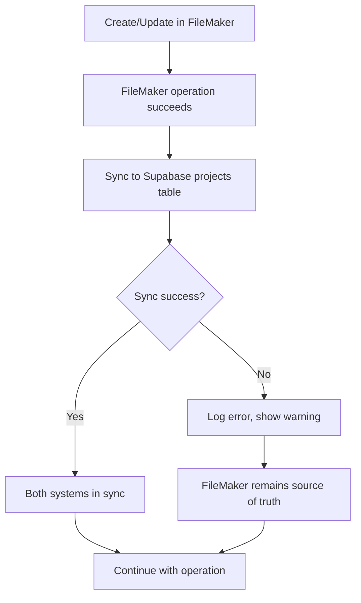
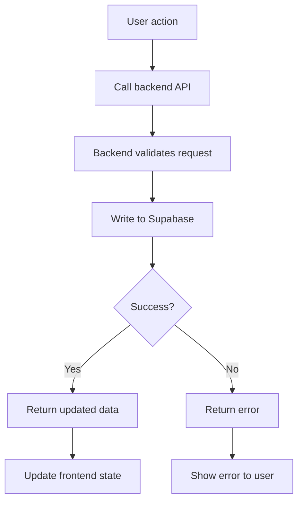

# Projects Migration Workflows

## Project Creation Flow

## Objective and Steps Management Flow

## Fixed Price Project Value Processing

## Subscription Sales Generation Flow

## Project Status Change Flow

## Related Data Loading Flow

## Team Assignment Flow

## Project Deletion Flow

## Data Synchronization Pattern (Current)

## Target Migration Pattern (Future)

