# QuickBooks Backend Integration Workflows

This document visualizes the key workflows for integrating the Clarity CRM frontend with the new backend QuickBooks API infrastructure.

## Table of Contents

1. [OAuth Connection Flow](#oauth-connection-flow)
2. [Invoice Creation from Financial Records](#invoice-creation-from-financial-records)
3. [Financial Record Synchronization](#financial-record-synchronization)
4. [Connection Status Check](#connection-status-check)
5. [Admin Configuration Flow](#admin-configuration-flow)

---

## OAuth Connection Flow

**User Action**: Connect to QuickBooks

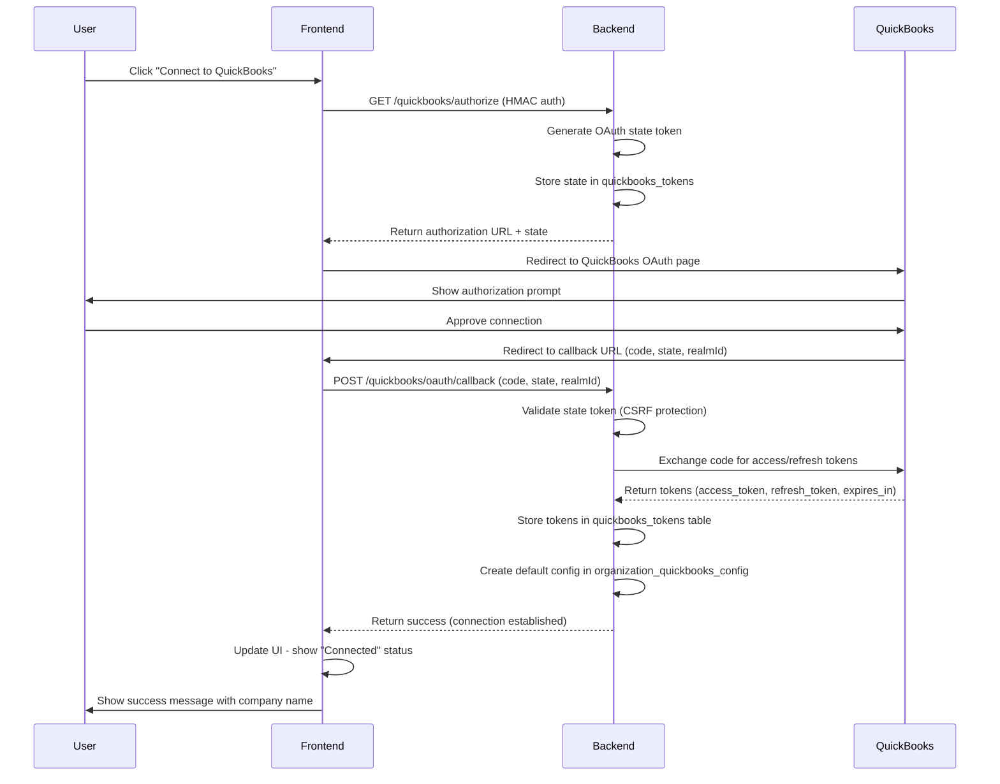

**Key Points**:
- HMAC authentication used for all backend requests
- Backend handles token storage (frontend never sees raw tokens)
- CSRF protection via state token validation
- Default QuickBooks config created automatically on first connection
- Frontend displays connection status and company name

---

## Invoice Creation from Financial Records

**User Action**: Generate QuickBooks invoice from unbilled financial records

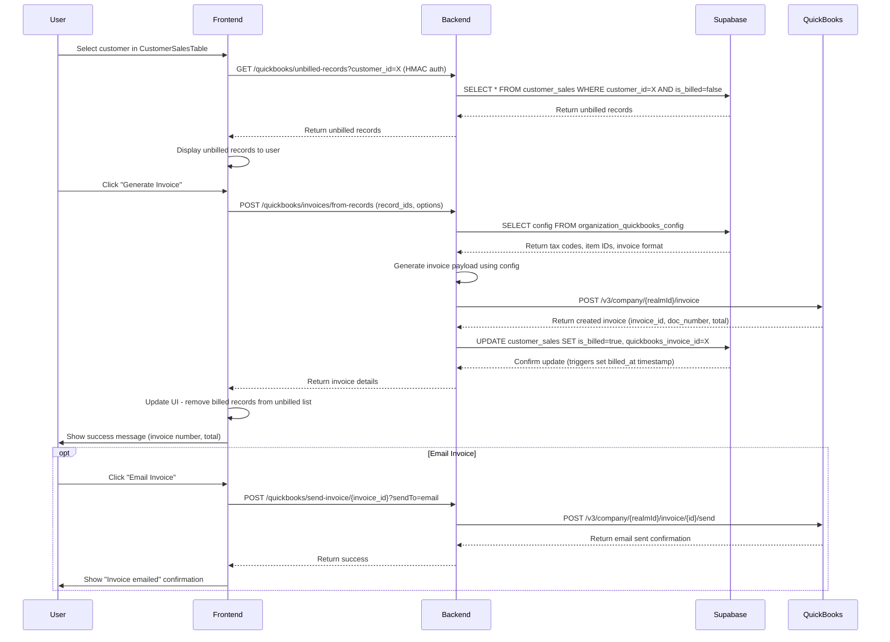

**Key Points**:
- Backend generates invoice payload using organization-specific config (tax codes, item IDs)
- customer_sales.is_billed updated automatically after successful invoice creation
- Triggers set billed_at and quickbooks_synced_at timestamps
- Optional email delivery integrated in same flow
- Frontend shows real-time status and invoice details

---

## Financial Record Synchronization

**User Action**: Sync QuickBooks invoices with customer_sales table

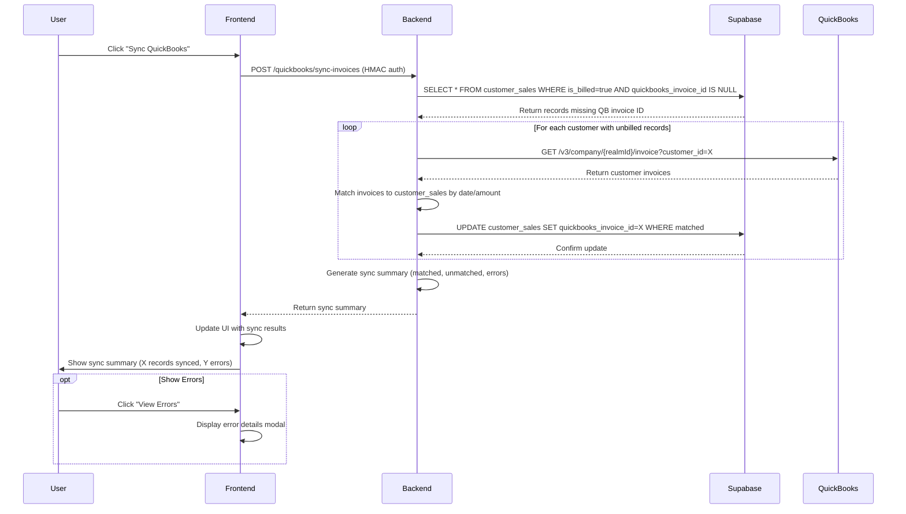

**Key Points**:
- Syncs customer_sales records with QuickBooks invoices
- Matches invoices by customer ID, date range, and amount
- Updates quickbooks_invoice_id for matched records
- Returns summary with matched/unmatched/error counts
- Frontend displays progress and final results

---

## Connection Status Check

**System Action**: Periodic check of QuickBooks connection health

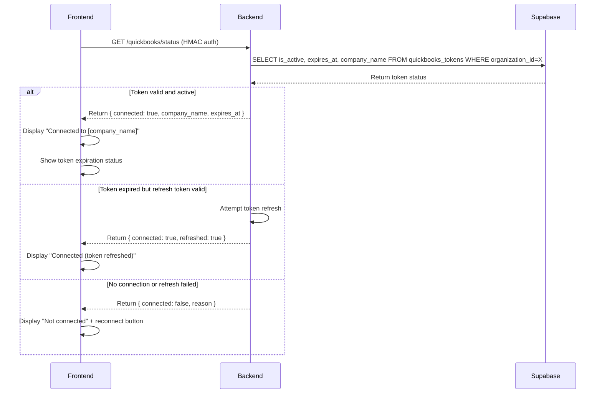

**Key Points**:
- Frontend calls periodically (e.g., on page load, every 10 minutes)
- Backend checks token expiration and validity
- Automatic token refresh if expired but refresh token valid
- Frontend displays connection status in UI
- No raw tokens exposed to frontend (security)

---

## Admin Configuration Flow

**User Action**: Configure QuickBooks account mappings (admin only)

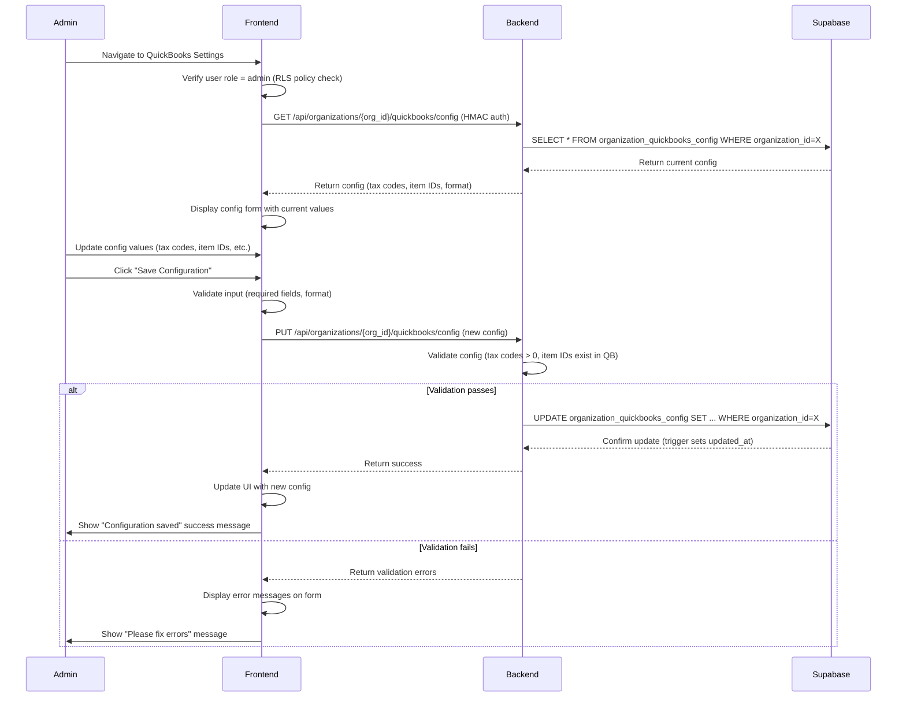

**Key Points**:
- Admin-only access enforced by RLS policies
- Configuration affects invoice generation (tax codes, item IDs)
- Backend validates config before saving
- Frontend shows current values and allows updates
- Changes take effect immediately for new invoices

---

## Error Handling Workflows

### Token Refresh Failure

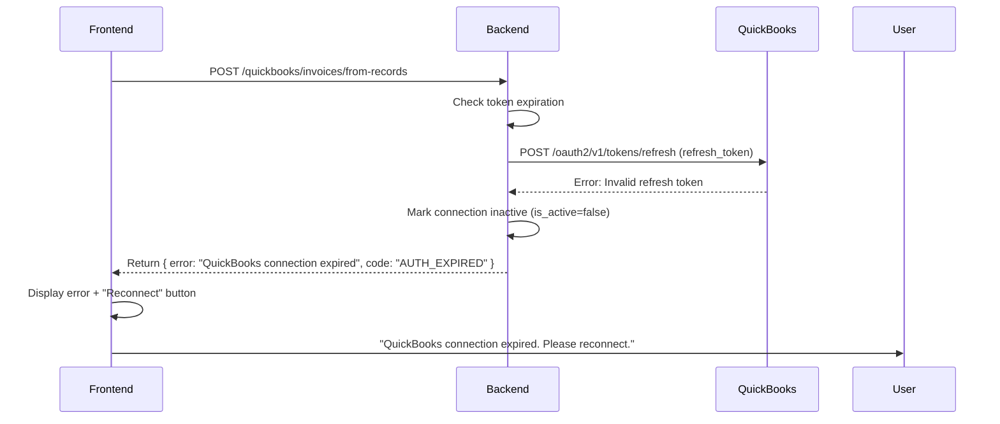

### Invoice Creation Failure

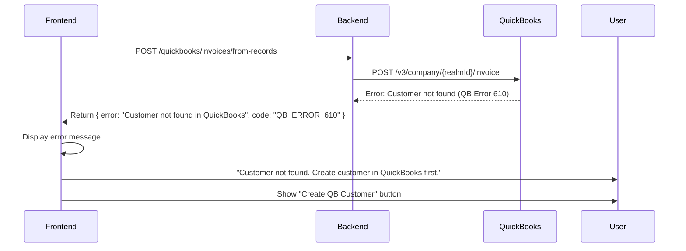

---

## State Machine: QuickBooks Connection Status

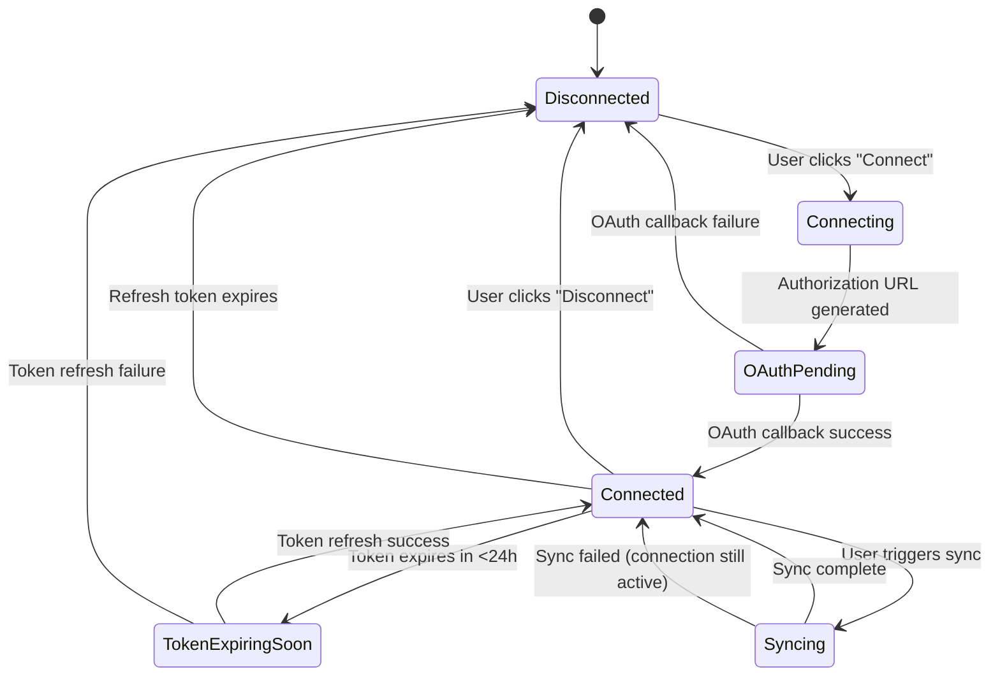

**State Descriptions**:
- **Disconnected**: No QuickBooks connection, show "Connect" button
- **Connecting**: OAuth flow initiated, waiting for user authorization
- **OAuthPending**: User redirected to QuickBooks, waiting for callback
- **Connected**: Active connection with valid tokens, show company name
- **TokenExpiringSoon**: Connection valid but token expires <24h, show warning
- **Syncing**: Sync operation in progress, show spinner
- **Disconnected**: Connection lost or manually disconnected, show "Reconnect" button

---

## Data Flow Diagram

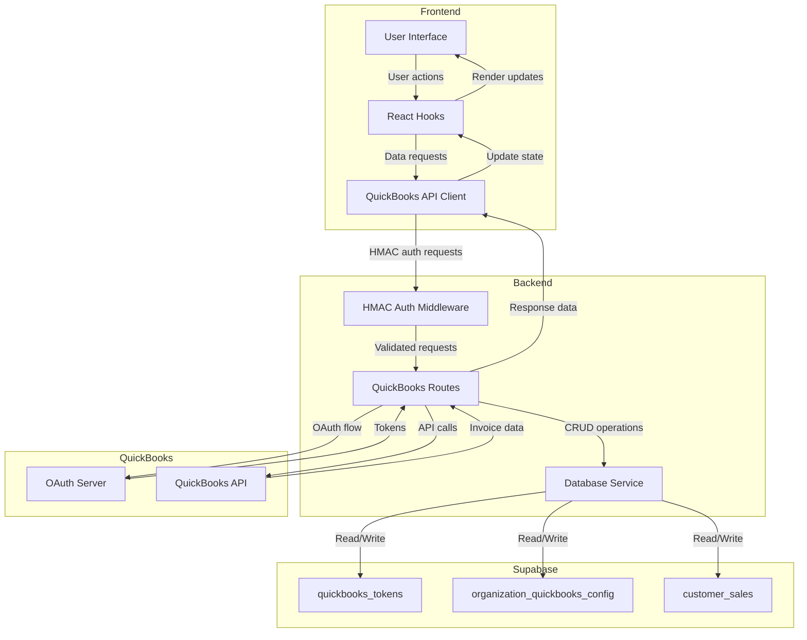

---

## Testing Workflow

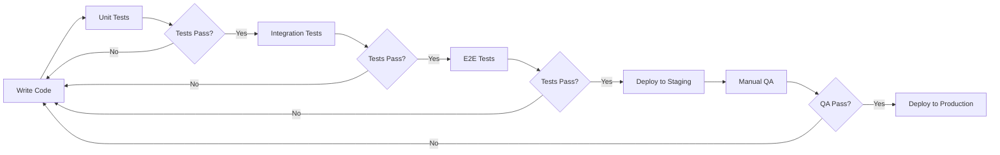

**Test Levels**:
1. **Unit Tests**: Individual function tests (API client, utils)
2. **Integration Tests**: Multi-component interactions (API + hooks + UI)
3. **E2E Tests**: Complete user workflows (OAuth flow, invoice creation)
4. **Manual QA**: User acceptance testing in staging environment
5. **Production**: Monitored deployment with rollback plan

---

## Deployment Workflow

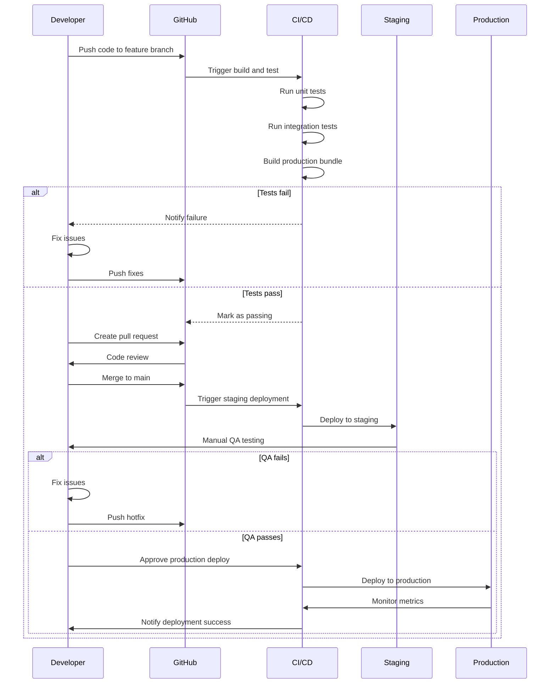

---

## Rollback Workflow

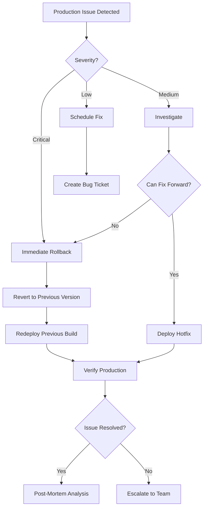

**Rollback Criteria**:
- **Critical**: System down, data corruption, security breach → Immediate rollback
- **Medium**: Feature broken, high error rate → Investigate, then decide
- **Low**: UI bug, minor issue → Schedule fix for next release

---

## Summary

These workflows provide a comprehensive view of:
- **User Journeys**: OAuth connection, invoice generation, sync operations
- **System Interactions**: Frontend ↔ Backend ↔ Supabase ↔ QuickBooks
- **State Management**: Connection status state machine
- **Data Flow**: Request/response patterns and data persistence
- **Testing Strategy**: Unit → Integration → E2E → Manual QA
- **Deployment Process**: Development → Staging → Production
- **Error Handling**: Token refresh failures, invoice creation errors
- **Rollback Procedures**: Production issue response

All workflows follow the same pattern:
1. User initiates action in frontend
2. Frontend calls backend API with HMAC authentication
3. Backend processes request (database operations, QuickBooks API calls)
4. Backend returns response to frontend
5. Frontend updates UI and shows user feedback

This ensures consistent, secure, and testable integration across all QuickBooks operations.
