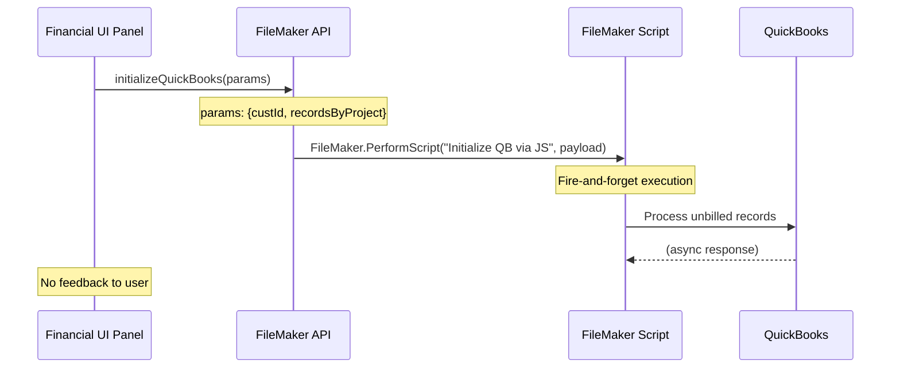
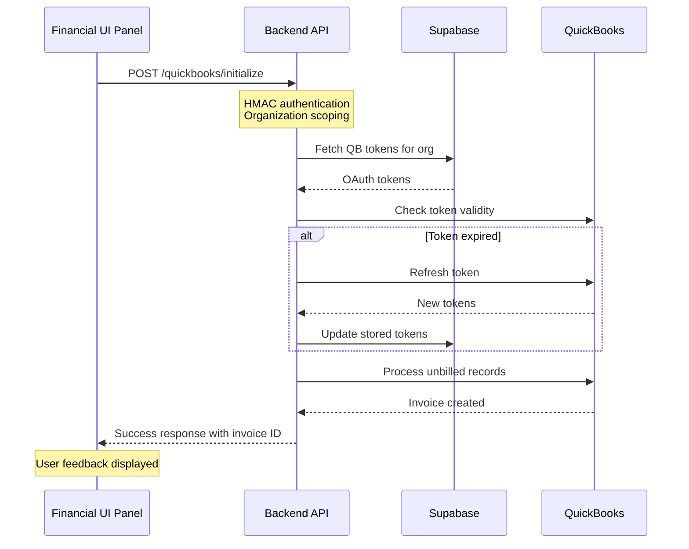
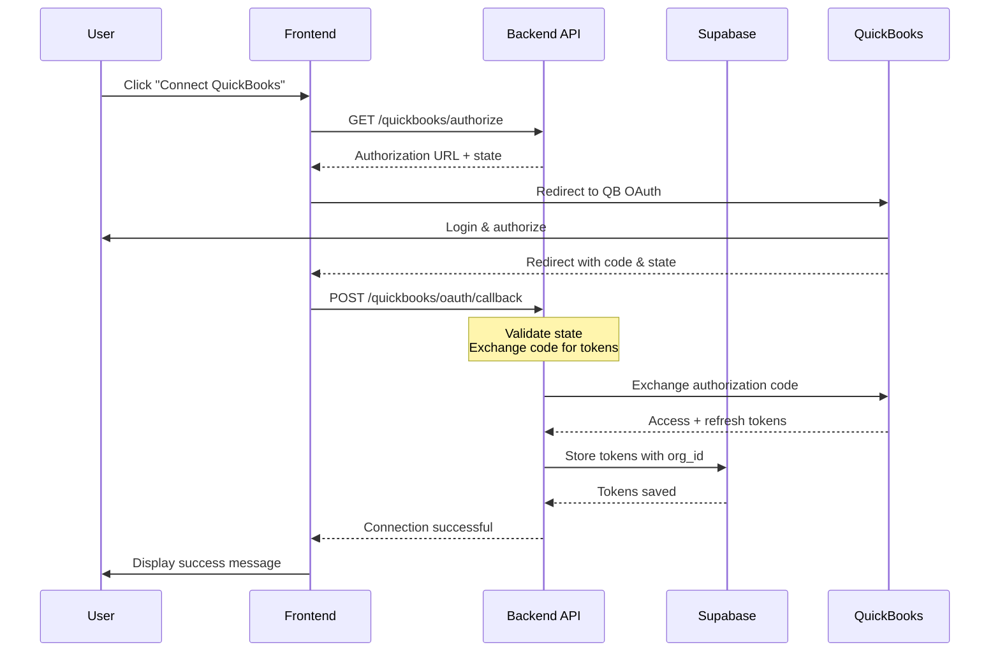
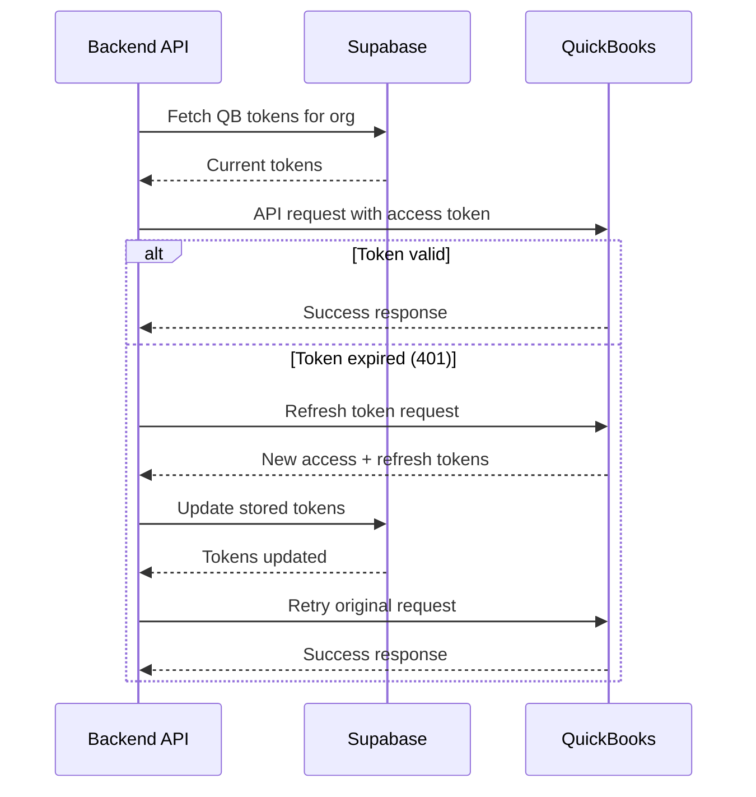
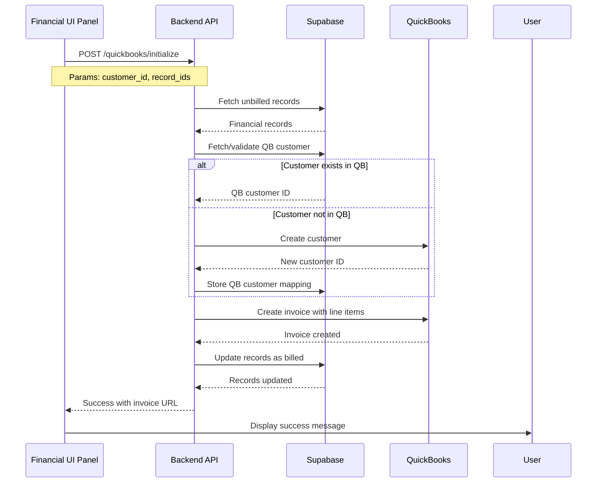
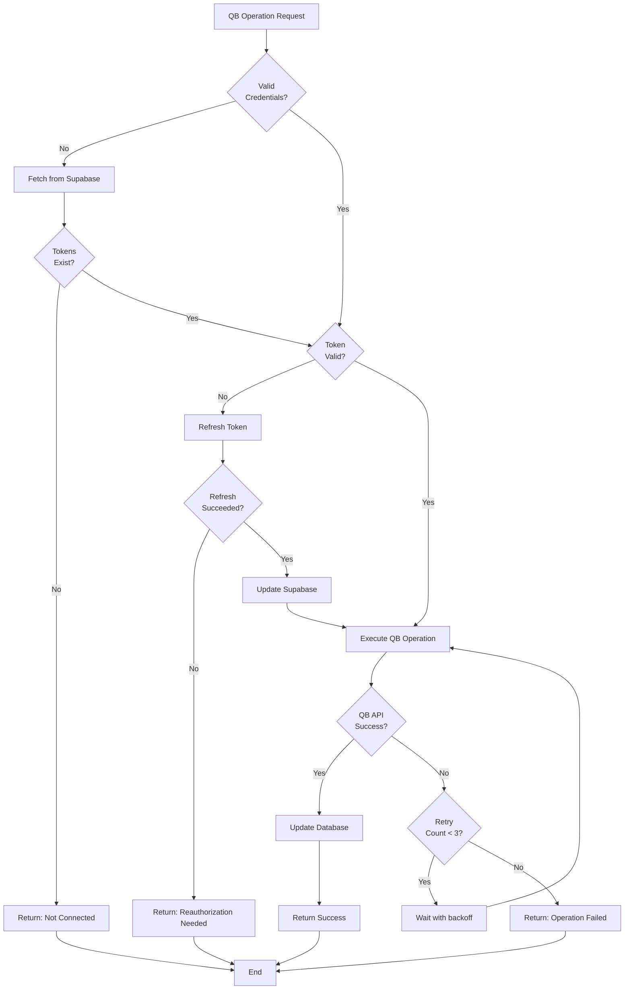
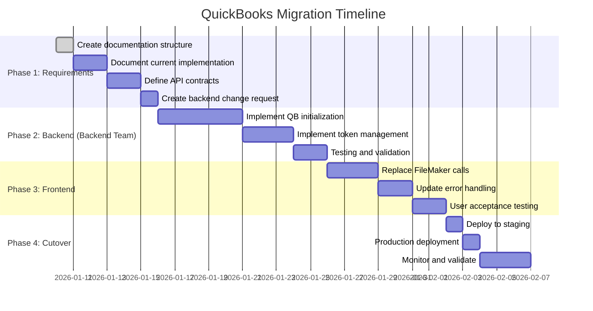

# QuickBooks Migration Requirements - Workflows

## Current QuickBooks Flow (FileMaker-Dependent)

## Target QuickBooks Flow (Backend-Driven)

## OAuth Flow

## Token Refresh Flow

## Invoice Generation Flow

## Error Handling Flow

## Implementation Phases

