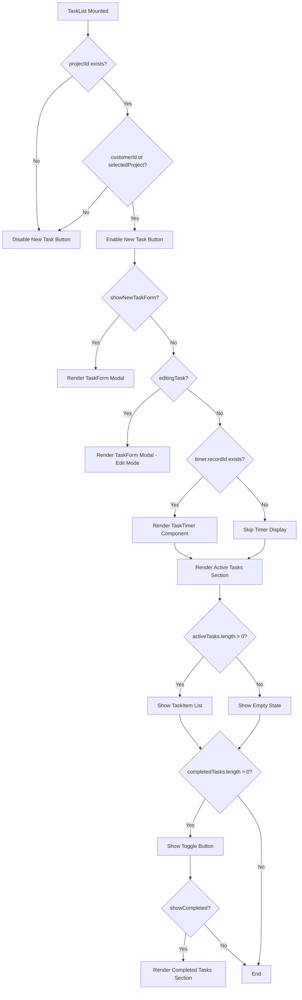
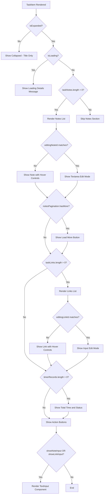
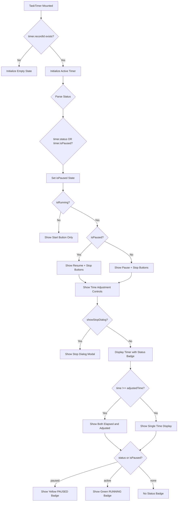
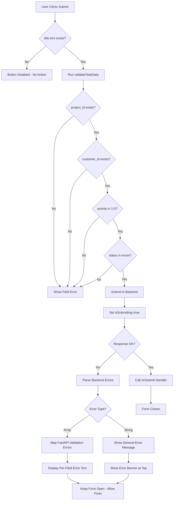

# Tasks Feature - UI Workflow Documentation

**Feature:** tasks-backend-integration
**Date:** 2026-01-24
**Purpose:** Document how the Tasks/Timer UI renders based on state, user roles, and data conditions

---

## 1. Render Decision Tree

### Task List Component Flow



### TaskItem Expansion Flow



### TaskTimer State Flow



### TaskForm Validation Flow



---

## 2. Render Branch Table

| Condition | Component Rendered | Key Props | File:Line |
|-----------|-------------------|-----------|-----------|
| `showNewTaskForm && projectId && customerId` | `<TaskForm>` (create mode) | `projectId`, `customerId`, `staffId`, `onSubmit=handleNewTask` | TaskList.jsx:821-828 |
| `editingTask && projectId && customerId` | `<TaskForm>` (edit mode) | `task={editingTask}`, `onSubmit=handleEditTask` | TaskList.jsx:832-840 |
| `timer?.recordId && selectedTask` | `<TaskTimer>` | `task={selectedTask}`, `timer={timer}`, `onStart`, `onPause`, `onStop`, `onAdjust` | TaskList.jsx:843-855 |
| `activeTasks?.length > 0` | `<TaskSection>` (Active) | `title="Active Tasks"`, `tasks={activeTasks}` | TaskList.jsx:857-881 |
| `activeTasks?.length === 0` | Empty state div | `"No active tasks"` | TaskSection.jsx:524-534 |
| `completedTasks?.length > 0` | Toggle button + section | `tasks={completedTasks}` when `showCompleted=true` | TaskList.jsx:884-923 |
| `!task.isCompleted` | Start Timer button | `onClick={handleTimerStart}` | TaskItem.jsx:89-103 |
| `isExpanded && isLoading` | Loading message | `"Loading task details..."` | TaskItem.jsx:111-117 |
| `isExpanded && taskNotes?.length > 0` | Notes section | `taskNotes`, `editingNoteId` controls render mode | TaskItem.jsx:120-249 |
| `editingNoteId === note.id` | Textarea + Save/Cancel buttons | `value={editContent}` | TaskItem.jsx:132-177 |
| `editingNoteId !== note.id` | Note display + hover edit/delete | Group hover shows controls | TaskItem.jsx:178-227 |
| `notesPagination?.hasMore` | Load More Notes button | `onClick={handleLoadMoreNotes}`, `disabled={notesLoading}` | TaskItem.jsx:231-248 |
| `isExpanded && taskLinks?.length > 0` | Links section | `taskLinks`, `editingLinkId` controls render mode | TaskItem.jsx:251-370 |
| `editingLinkId === link.id` | Input + Save/Cancel buttons | `value={editLinkUrl}` | TaskItem.jsx:266-313 |
| `editingLinkId !== link.id` | Link anchor + hover edit/delete | Group hover shows controls | TaskItem.jsx:316-368 |
| `timerRecords?.length > 0` | Timer stats display | Shows total time + active/paused status | TaskItem.jsx:372-391 |
| `timerRecords.some(r => r.status === 'active')` | Green "● Timer Running" badge | Active status indicator | TaskItem.jsx:381-386 |
| `timerRecords.some(r => r.status === 'paused')` | Yellow "⏸ Timer Paused" badge | Paused status indicator | TaskItem.jsx:386 |
| `isExpanded` | New Note/Link + Toggle Status buttons | Action button row | TaskItem.jsx:392-426 |
| `showNoteInput` | `<TextInput>` for note | `title="Add Note"`, `onSubmit={handleCreateNote}` | TaskItem.jsx:427-442 |
| `showLinkInput` | `<TextInput>` for link | `title="Add Link"`, `onSubmit={handleCreateLink}` | TaskItem.jsx:444-459 |
| `!isRunning` | Start button only | Green start button | TaskTimer.jsx:71-77 |
| `isRunning && isPaused` | Resume + Stop buttons | Blue resume, red stop | TaskTimer.jsx:80-100 |
| `isRunning && !isPaused` | Pause + Stop buttons | Yellow pause, red stop | TaskTimer.jsx:87-100 |
| `isRunning` | Time adjustment controls | +/- 6 minute buttons with tooltips | TaskTimer.jsx:280-311 |
| `time !== adjustedTime` | Dual time display | Shows both adjusted and total elapsed | TaskTimer.jsx:37-40 |
| `status === 'paused' OR isPaused` | Yellow "PAUSED" status badge | Displayed above timer | TaskTimer.jsx:23-24, 42-45 |
| `status === 'active'` | Green "RUNNING" status badge | Displayed above timer | TaskTimer.jsx:26-27, 42-45 |
| `showStopDialog` | Stop dialog modal overlay | Textarea for work description + Save/Cancel | TaskTimer.jsx:315-355 |
| `errors.general` (TaskForm) | Error banner | Red background with error message | TaskForm.jsx:184-188 |
| `errors[fieldName]` (TaskForm) | Field-level error text | Red text below input field | TaskForm.jsx:212-214 (example) |
| `isSubmitting` (TaskForm) | Disabled form + button text change | "Saving..." instead of "Create Task" | TaskForm.jsx:398 |
| `!formData.title.trim()` (TaskForm) | Disabled submit button | Opacity 50%, cursor not-allowed | TaskForm.jsx:392-396 |

---

## 3. Derived State

| Variable | Computation Logic | Controls | Source |
|----------|-------------------|----------|--------|
| `activeTasks` | `groupTasksByStatus(tasks).active` | Which tasks appear in Active Tasks section | useTask.js:478-486 |
| `completedTasks` | `groupTasksByStatus(tasks).completed` | Which tasks appear in Completed Tasks section (when toggled) | useTask.js:478-486 |
| `effectiveCustomerId` | `customerId \|\| selectedProject?.customer_id \|\| selectedProject?._custID` | Whether New Task button is enabled | TaskList.jsx:614 |
| `loading` | `taskLoading \|\| noteLoading \|\| linkLoading` | Whether loading indicators appear | TaskList.jsx:652 |
| `notesPagination` | `getPagination('task', selectedTask.id)` | Whether Load More Notes button appears | TaskList.jsx:655 |
| `isEdit` (TaskForm) | `!!task` | Form title ("Edit Task" vs "Create New Task"), submit button text | TaskForm.jsx:22 |
| `formData.priority` | Defaults to `task?.priority \|\| 3` | Priority dropdown pre-selection | TaskForm.jsx:29 |
| `formData.status` | Defaults to `task?.status \|\| 'pending'` | Status dropdown pre-selection | TaskForm.jsx:30 |
| `isRunning` (TaskTimer) | `timer?.recordId` exists in effect | Which button set renders (Start vs Pause/Resume/Stop) | TaskTimer.jsx:136, 71-102 |
| `isPaused` (TaskTimer) | `timer.status === 'paused' \|\| timer.isPaused` | Whether Resume or Pause button shows | TaskTimer.jsx:139, 80-93 |
| `adjustedTime` (TaskTimer) | `elapsedTime - pauseTime + adjustmentTime` | Displayed time value (with pause/adjustments applied) | TaskTimer.jsx:179-190 |
| `statusDisplay` (TimerDisplay) | Checks `status` and `isPaused` flags | Which status badge renders (RUNNING/PAUSED/none) | TaskTimer.jsx:22-30 |
| `formattedTime` (TimerDisplay) | `Math.floor(seconds / 3600):MM:SS` format | Timer display text | TaskTimer.jsx:7-19 |

---

## 4. Loading & Error States

### Loading States

| State | Pattern | Location |
|-------|---------|----------|
| **Task List Loading** | `"Loading task details..."` text in gray | TaskItem.jsx:111-117 (when expanded) |
| **Notes Loading** | `notesLoading` disables Load More button, changes text to "Loading..." | TaskItem.jsx:235, 245 |
| **Form Submitting** | Button disabled, text changes to "Saving...", form inputs disabled | TaskForm.jsx:169, 210, 232, 260, 291, 317, 340, 365, 386, 392, 398 |
| **General Loading** | `loading` flag from useTask controls button disabled states | Passed to TaskSection components |

### Error States

| Error Type | Display Pattern | Location | Recovery |
|------------|-----------------|----------|----------|
| **API Errors (Task Operations)** | SnackBar error toast via `showError()` | useTask.js:127, 154, 192, 250 | User dismisses toast, can retry |
| **Timer Start Concurrency** | SnackBar: "You already have an active timer running..." + auto-fetch existing timer | useTask.js:296-345 | Existing timer restored to UI |
| **Form Validation (Client)** | Red border on field + red text below field | TaskForm.jsx:207, 212-214 | User fixes field, error clears on change |
| **Form Validation (Backend)** | FastAPI array of errors → mapped to field-specific errors OR general banner | TaskForm.jsx:148-167 | User fixes fields, resubmits |
| **Note Create/Update/Delete** | SnackBar: "Error [action] note" | TaskItem.jsx:96, 154, 212, 289, 349, 438, 455 | User can retry action |
| **Link Create/Update/Delete** | SnackBar: "Error [action] link" | TaskItem.jsx:96, 154, 212, 289, 349, 438, 455 | User can retry action |
| **Timer Operations** | SnackBar via `showError(err.message)` | useTask.js:343, 352, 386, 439 | User can retry timer action |

### Empty States

| Condition | Display | Location |
|-----------|---------|----------|
| **No Active Tasks** | Gray rounded box: "No active tasks" | TaskSection.jsx:524-534 |
| **No Completed Tasks** | Gray rounded box: "No completed tasks" | TaskSection.jsx:524-534 |
| **No Timer** | Timer component not rendered | TaskList.jsx:844 (conditional render) |
| **No Notes** | Notes section skipped entirely | TaskItem.jsx:120 (conditional render) |
| **No Links** | Links section skipped entirely | TaskItem.jsx:251 (conditional render) |
| **No Timer Records** | Timer stats section skipped | TaskItem.jsx:372 (conditional render) |

### Error Boundaries

| Component | Boundary | Location |
|-----------|----------|----------|
| **TaskList** | Wrapped in `<ErrorBoundary>` | TaskList.jsx:938-943 |

---

## 5. User Role Variations

### Staff-Based Variations

| Role/Condition | UI Difference | Location | Notes |
|----------------|---------------|----------|-------|
| **Staff has active timer** | Timer component visible at top of task list | TaskList.jsx:843-855 | Timer state loaded from localStorage on mount and restored via backend API |
| **Staff has no active timer** | Timer component hidden | TaskList.jsx:844 (conditional) | No active timer section renders |
| **Task not assigned to current user** | Start Timer button still visible (any staff can start) | TaskItem.jsx:89-103 | No role restriction on timer start |
| **Completed tasks** | Start Timer button hidden | TaskItem.jsx:89 | `!task.isCompleted` condition |
| **User with no projectId or customerId** | New Task button disabled | TaskList.jsx:814 | `disabled={!projectId || !effectiveCustomerId}` |

### Permission-Based Variations

**Note:** Current implementation does NOT check explicit user permissions. All operations are allowed if:
- User is authenticated (has `user.userID`)
- User has access to the project (via AppState context)

No role-based restrictions like "admin only" or "manager only" are present in the task/timer UI components.

### Data-Driven Variations

| Data Condition | UI Difference | Location |
|----------------|---------------|----------|
| **Fixed-price project** | Timer stop does NOT create sales record (backend logic) | taskService.js:stopTimer (backend handles) |
| **Time-based project** | Timer stop creates sales record automatically (backend logic) | taskService.js:stopTimer (backend handles) |
| **Timer with pause history** | Displays "Total:" line showing elapsed time before adjustments | TaskTimer.jsx:37-40 |
| **Timer with manual adjustments** | Shows adjusted vs total time | TaskTimer.jsx:37-40 |

---

## 6. Re-render Triggers

### Global State Changes (via useTask hook)

| Trigger | Causes Re-render In | Source |
|---------|---------------------|--------|
| `tasks` array updated | TaskList, TaskSection, TaskItem | useTask.js:125, 187, 208, 239 |
| `selectedTask` changes | TaskList (timer display), TaskItem (details) | useTask.js:149, 216, 245 |
| `timer` state updated | TaskTimer component | useTask.js:89, 289, 383, 409, 467 |
| `timerRecords` updated | TaskItem (timer stats section) | useTask.js:147, 372 |
| `taskNotes` updated | TaskItem (notes section) | useTask.js:148 |
| `taskLinks` updated | TaskItem (links section) | useTask.js:148 |
| `loading` flag changes | TaskList, TaskSection, TaskItem | useTask.js:119, 130, 157, 196, 224, 254 |

### Local Component State Changes

| State Variable | Triggers Re-render In | Location |
|----------------|----------------------|----------|
| `showCompleted` | TaskList (completed section visibility) | TaskList.jsx:608, 887 |
| `showNewTaskForm` | TaskList (TaskForm modal visibility) | TaskList.jsx:609, 812, 821, 827 |
| `editingTask` | TaskList (TaskForm edit modal visibility) | TaskList.jsx:610, 832, 839 |
| `isExpanded` | TaskItem (detail sections visibility) | TaskItem.jsx:37, 46, 108 |
| `showNoteInput` | TaskItem (TextInput modal for notes) | TaskItem.jsx:38, 394, 427, 441 |
| `showLinkInput` | TaskItem (TextInput modal for links) | TaskItem.jsx:39, 405, 444, 458 |
| `editingNoteId` | TaskItem (note edit mode) | TaskItem.jsx:40, 131, 164, 191 |
| `editingLinkId` | TaskItem (link edit mode) | TaskItem.jsx:42, 263, 298, 332 |
| `isRunning` (TaskTimer) | TaskTimer (button set changes) | TaskTimer.jsx:127, 71, 280 |
| `isPaused` (TaskTimer) | TaskTimer (pause vs resume button) | TaskTimer.jsx:128, 80 |
| `elapsedTime` (TaskTimer) | TaskTimer (timer display updates every second) | TaskTimer.jsx:129, 172 |
| `showStopDialog` (TaskTimer) | TaskTimer (stop dialog modal visibility) | TaskTimer.jsx:132, 230, 315 |
| `formData` (TaskForm) | TaskForm (input fields) | TaskForm.jsx:25-33 |
| `errors` (TaskForm) | TaskForm (error messages display) | TaskForm.jsx:36, 58-64, 184 |
| `isSubmitting` (TaskForm) | TaskForm (disabled states, button text) | TaskForm.jsx:36, 169, 210, 392, 398 |

### Effect-Driven Re-renders

| Effect Hook | Re-render Trigger | Location |
|-------------|-------------------|----------|
| `useEffect(() => loadTasks(projectId), [projectId])` | Project change loads new tasks | useTask.js:104-108 |
| `useEffect(() => setStats(...), [tasks, timerRecords])` | Task or timer data changes update stats | useTask.js:111-113 |
| `useEffect(() => restoreActiveTimer(), [])` | Mount: fetches active timer from backend | useTask.js:58-101 |
| `useEffect(() => interval, [isRunning, isPaused])` | Timer tick: increments elapsedTime every second | TaskTimer.jsx:159-176 |
| `useEffect(() => setAdjustedTime(...), [elapsedTime, timer])` | Timer changes recalculate adjusted time | TaskTimer.jsx:179-190 |
| `useEffect(() => { setIsRunning, setIsPaused }, [timer, task?.id])` | Timer prop changes initialize timer state | TaskTimer.jsx:135-156 |
| `useEffect(() => updatePagination, [taskNotes, selectedTask])` | Notes load updates pagination state | TaskList.jsx:658-669 |

### Memoization Optimizations

| Component | Memoization | Purpose |
|-----------|-------------|---------|
| `TaskItem` | `React.memo(TaskItem)` | Prevents re-render unless props change | TaskItem.jsx:16-467 |
| `TaskSection` | `React.memo(TaskSection)` | Prevents section re-render unless tasks change | TaskList.jsx:500-574 |
| `TaskTimer` | `React.memo(TaskTimer)` | Prevents timer re-render unless props change | TaskTimer.jsx:389 |
| `TimerDisplay` | `React.memo(TimerDisplay)` | Prevents display re-render unless time/status changes | TaskTimer.jsx:6-49 |
| `TimerControls` | `React.memo(TimerControls)` | Prevents button re-render unless state changes | TaskTimer.jsx:60-115 |
| `TaskForm` | `React.memo(TaskForm)` | Prevents form re-render unless props change | TaskForm.jsx:427 |
| `activeTasks, completedTasks` | `useMemo(() => groupTasksByStatus(tasks), [tasks])` | Prevents re-grouping unless tasks array changes | useTask.js:478-486 |
| `formattedTime` | `useMemo(() => formatSeconds(...), [time, adjustedTime])` | Prevents re-formatting unless time changes | TaskTimer.jsx:7-19 |
| `statusDisplay` | `useMemo(() => { ... }, [status, isPaused])` | Prevents status recalc unless status changes | TaskTimer.jsx:22-30 |

---

## 7. Key Conditional Rendering Patterns Summary

### Pattern 1: Modal Overlays (Feature Flags)

**Example:** Task form creation/edit
```javascript
{showNewTaskForm && projectId && customerId && (
    <TaskForm ... />
)}
```
**Triggers:** User clicks "New Task" button → sets `showNewTaskForm=true` → form appears

---

### Pattern 2: Expansion Sections (Local State)

**Example:** Task item details
```javascript
const [isExpanded, setIsExpanded] = useState(false);
// ...
<div className={isExpanded ? 'max-h-96 opacity-100' : 'max-h-0 opacity-0'}>
```
**Triggers:** User clicks expand arrow → toggles `isExpanded` → CSS transitions reveal content

---

### Pattern 3: Loading States (Async Operations)

**Example:** Task details loading
```javascript
{isLoading ? (
    <div>Loading task details...</div>
) : (
    <ActualContent />
)}
```
**Triggers:** `handleTaskSelect()` sets `loading=true` → shows skeleton → API returns → `loading=false` → shows content

---

### Pattern 4: Edit Mode Toggles (Record-Specific State)

**Example:** Note inline editing
```javascript
const isEditing = editingNoteId === note.id;
return isEditing ? <textarea /> : <p>{note.content}</p>;
```
**Triggers:** User clicks Edit button → sets `editingNoteId=note.id` → switches to edit UI

---

### Pattern 5: Timer State Machine (Multi-State)

**Example:** Timer button variations
```javascript
{!isRunning ? (
    <StartButton />
) : isPaused ? (
    <ResumeButton /> <StopButton />
) : (
    <PauseButton /> <StopButton />
)}
```
**Triggers:** State transitions: `null → running → paused → running → stopped → null`

---

### Pattern 6: Empty State Fallbacks (Data-Driven)

**Example:** No tasks message
```javascript
if (!tasks?.length) {
    return <EmptyStateDiv>No active tasks</EmptyStateDiv>;
}
```
**Triggers:** No data from backend → shows friendly empty message instead of blank section

---

### Pattern 7: Hover-Revealed Controls (CSS + Group Hover)

**Example:** Note edit/delete buttons
```javascript
<div className="group">
    <p>{note.content}</p>
    <div className="opacity-0 group-hover:opacity-100">
        <EditButton /> <DeleteButton />
    </div>
</div>
```
**Triggers:** Mouse hovers over note → CSS transition reveals edit controls

---

## 8. Critical Decision Points for UI Flow

### 1. **Can User Create Tasks?**
**Decision Point:** `projectId && effectiveCustomerId`
**Outcome:** Enables/disables "New Task" button
**Location:** TaskList.jsx:814

### 2. **Is Timer Running for This Staff?**
**Decision Point:** `timer?.recordId` + backend `getActiveTimer()` check
**Outcome:** Shows TaskTimer component vs empty state
**Location:** TaskList.jsx:843-855, useTask.js:58-101

### 3. **Should Sales Record Be Created?**
**Decision Point:** Backend checks `project.f_fixedPrice === false`
**Outcome:** Creates `customer_sales` record on timer stop
**Location:** taskService.js:stopTimer (backend atomic operation)

### 4. **Can User Load More Notes?**
**Decision Point:** `notesPagination.hasMore === true`
**Outcome:** Shows "Load More Notes" button
**Location:** TaskItem.jsx:231-248

### 5. **Should Form Submit Be Allowed?**
**Decision Point:** `formData.title.trim() && !isSubmitting`
**Outcome:** Enables/disables submit button
**Location:** TaskForm.jsx:392-396

### 6. **Which Timer Status Badge Shows?**
**Decision Point:** `status === 'paused' ? PAUSED : status === 'active' ? RUNNING : null`
**Outcome:** Yellow/Green badge or no badge
**Location:** TaskTimer.jsx:22-30, 42-45

### 7. **Should Timer Show Dual Time Display?**
**Decision Point:** `time !== adjustedTime` (has pauses or manual adjustments)
**Outcome:** Shows adjusted time + "(Total: X)" subtext
**Location:** TaskTimer.jsx:37-40

### 8. **Is Task Item Expanded?**
**Decision Point:** `isExpanded` local state
**Outcome:** CSS max-height transitions reveal notes/links/timers
**Location:** TaskItem.jsx:37, 106-109

---

## 9. Data Flow: User Action → UI Update

### Example: Starting a Timer

```
[User clicks "Start Timer" button on TaskItem]
  ↓
[TaskItem.jsx:91 → handleTimerStart(task)]
  ↓
[useTask.js:258 → handleTimerStart]
  ↓
[taskService.js:67 → startTimer]
  ↓
[API checks for existing active timer → backend API POST /api/time-entries]
  ↓
[Backend returns: { id, task_id, start_time, status: 'active' }]
  ↓
[useTask.js:270-289 → setTimer(newTimer), localStorage.setItem('activeTimer')]
  ↓
[TaskList.jsx:843-855 → timer?.recordId now truthy → renders <TaskTimer>]
  ↓
[TaskTimer.jsx:135-156 → useEffect detects timer prop → setIsRunning(true)]
  ↓
[TaskTimer.jsx:159-176 → useEffect starts interval → increments elapsedTime every 1s]
  ↓
[TaskTimer.jsx:179-190 → useEffect recalculates adjustedTime]
  ↓
[TimerDisplay.jsx:7-19 → useMemo formats time as HH:MM:SS]
  ↓
[TaskTimer.jsx:71-102 → isRunning=true → renders Pause + Stop buttons]
  ↓
[TaskTimer.jsx:42-45 → status='active' → shows green "RUNNING" badge]
  ↓
[UI fully updated - timer ticking, controls visible]
```

### Example: Expanding a Task to Show Details

```
[User clicks expand arrow on TaskItem]
  ↓
[TaskItem.jsx:46 → toggleExpand callback]
  ↓
[TaskItem.jsx:48 → setIsExpanded(true)]
  ↓
[TaskItem.jsx:51 → onExpand(task.id) called]
  ↓
[TaskList.jsx:864 → onExpand={handleTaskSelect}]
  ↓
[useTask.js:134 → handleTaskSelect(taskId)]
  ↓
[taskService.js:42 → loadTaskDetails → parallel fetch timers, notes, links]
  ↓
[useTask.js:146-149 → setTimerRecords, setTaskNotes, setTaskLinks]
  ↓
[TaskList.jsx:658-669 → useEffect updates pagination state]
  ↓
[TaskItem.jsx:108 → isExpanded=true → CSS transition reveals details]
  ↓
[TaskItem.jsx:111-117 → isLoading=true briefly → shows "Loading..."]
  ↓
[TaskItem.jsx:120-249 → taskNotes populated → renders notes list]
  ↓
[TaskItem.jsx:251-370 → taskLinks populated → renders links list]
  ↓
[TaskItem.jsx:372-391 → timerRecords populated → renders timer stats]
  ↓
[UI fully updated - all details visible with smooth height transition]
```

---

## 10. Performance Optimizations

### Memoization Strategy
- **Components:** All major components wrapped in `React.memo` to prevent unnecessary re-renders
- **Callbacks:** useCallback for all event handlers to maintain referential equality
- **Computed Values:** useMemo for expensive calculations (time formatting, task grouping)

### Conditional Rendering
- Details sections only render when `isExpanded=true` (not just hidden with CSS)
- Notes/links/timers only render if data exists (`?.length > 0` checks)
- Form modals only mount when needed (`showNewTaskForm`, `editingTask`)

### Lazy Loading
- Notes pagination: Only loads 50 notes at a time, "Load More" for additional batches
- Task details: Only fetched when user expands task item (not pre-loaded)

### State Colocation
- Local state (like `isExpanded`, `editingNoteId`) kept in component scope
- Global state (like `tasks`, `timer`) managed in useTask hook
- Prevents unnecessary re-renders across component tree

---

**End of UI Workflow Documentation**

Generated: 2026-01-24
Next Update: When new UI patterns or state flows are added
