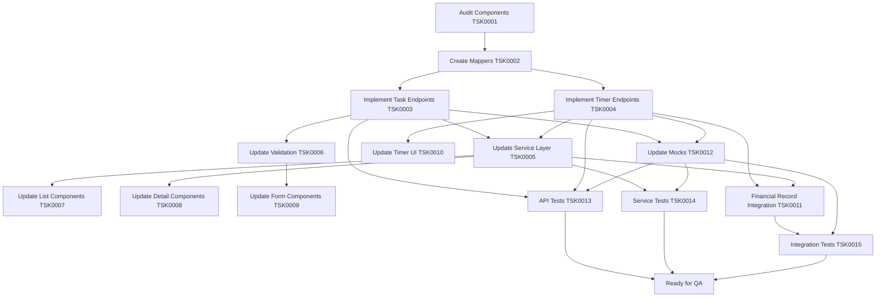
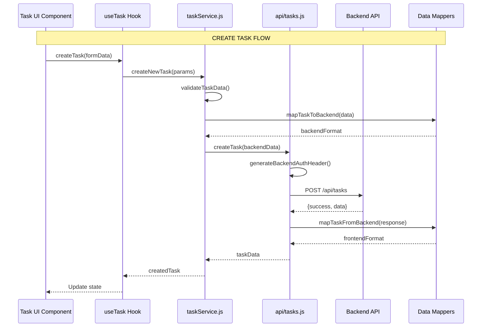
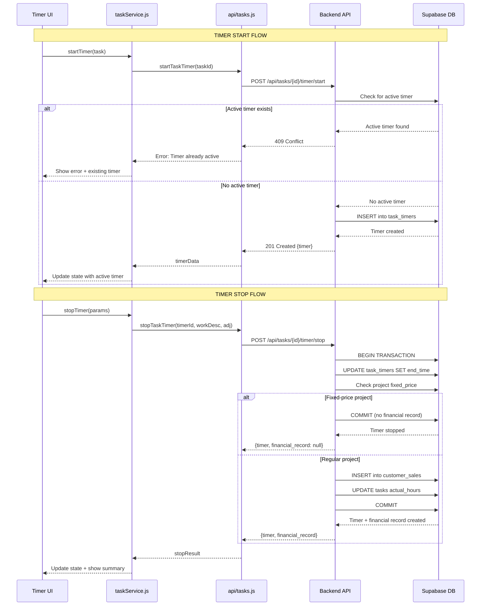
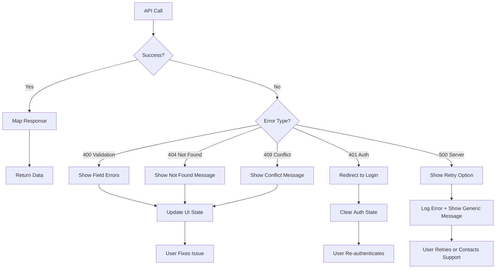
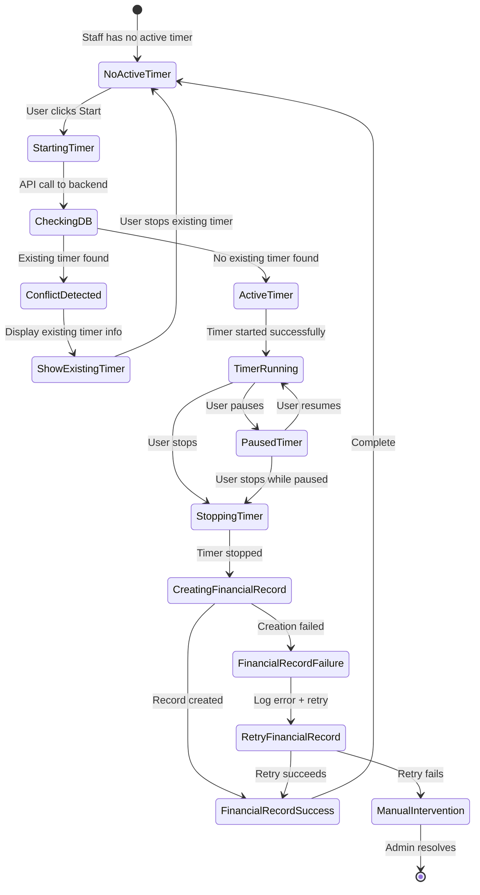
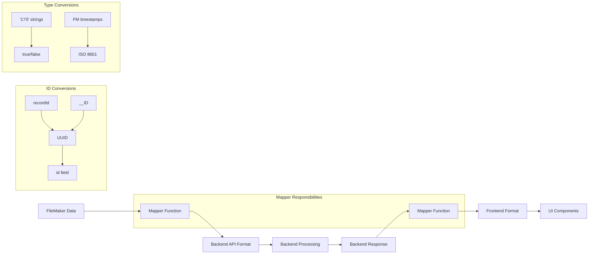
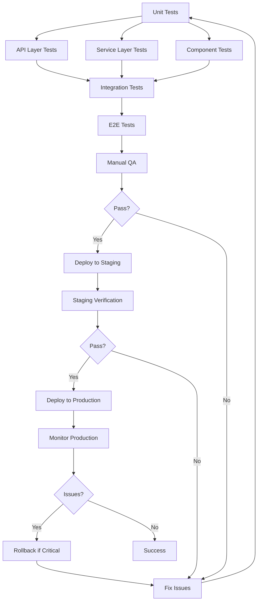
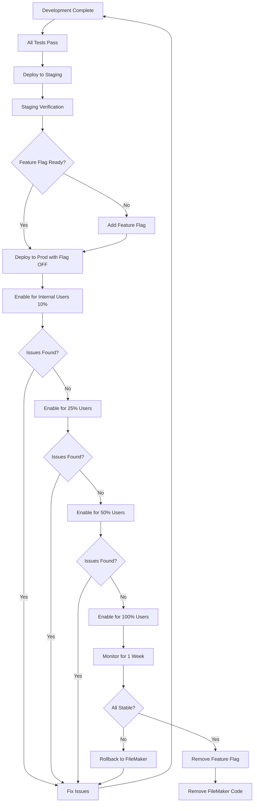

# Tasks Backend Integration - Workflows

## Overall Implementation Flow

## Task Lifecycle Data Flow

## Timer Lifecycle Flow

## Error Handling Flow

## Concurrency Control Flow

## Data Mapping Strategy

## Testing Strategy Flow

## Rollout Strategy

