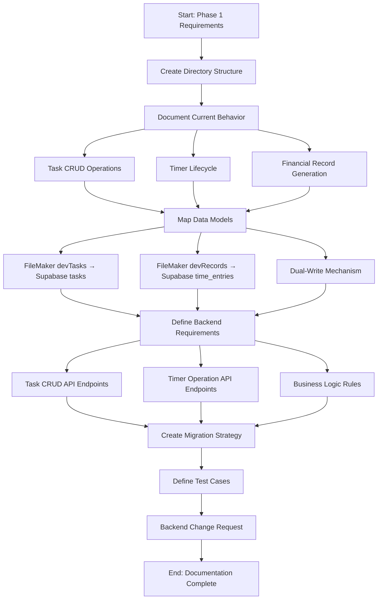
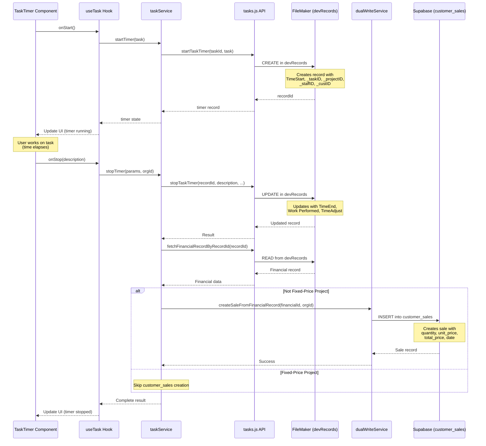
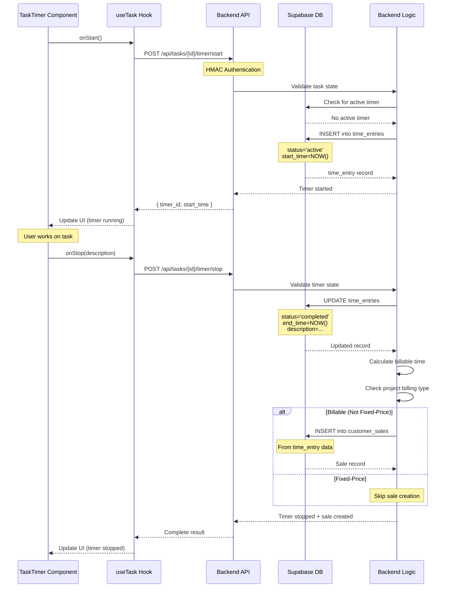
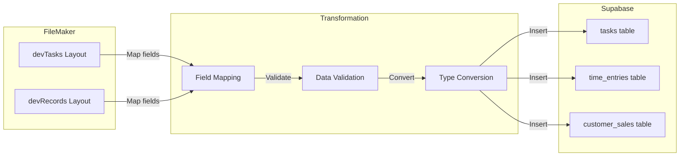
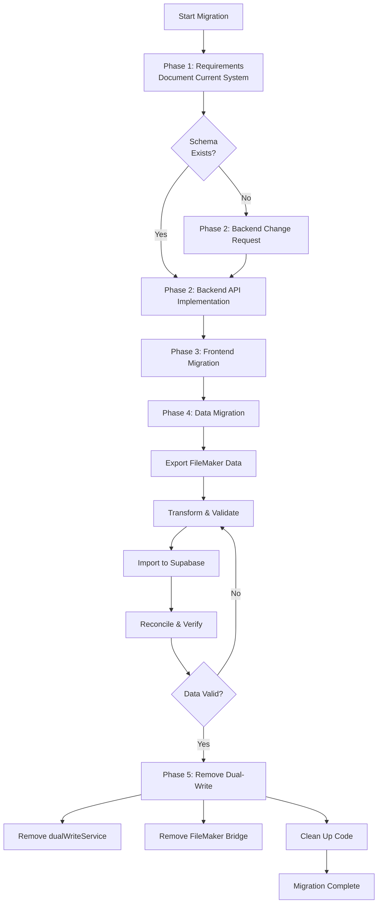
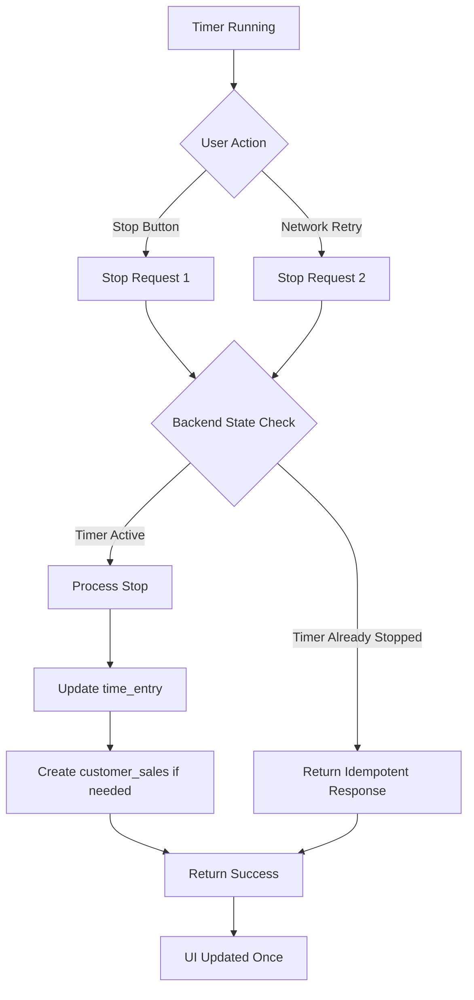
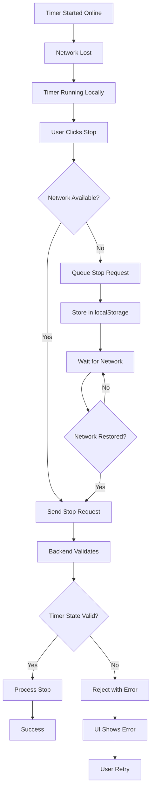
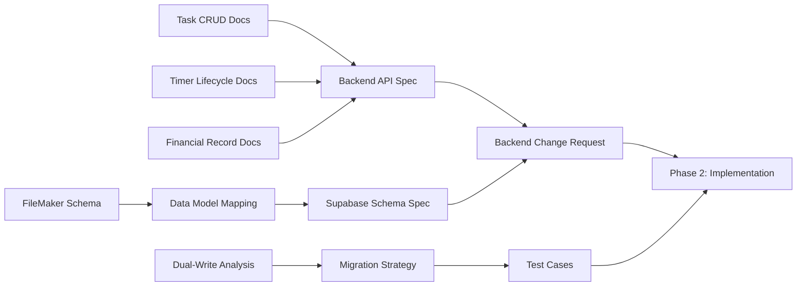

# Tasks + Timer Migration Requirements Workflows

## Documentation Workflow

## Current Timer Operation Flow

## Target Timer Operation Flow (Future)

## Data Model Transformation

## Migration Workflow

## Test Scenario Workflows

### Timer Race Condition Test

### Offline Timer Recovery

## Documentation Dependencies

