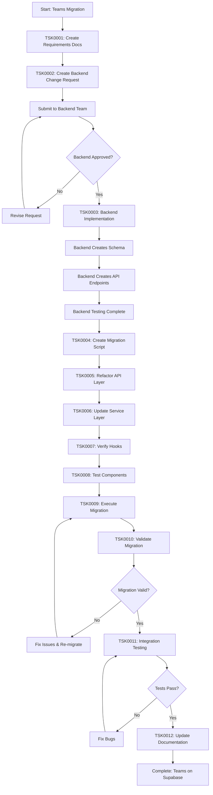
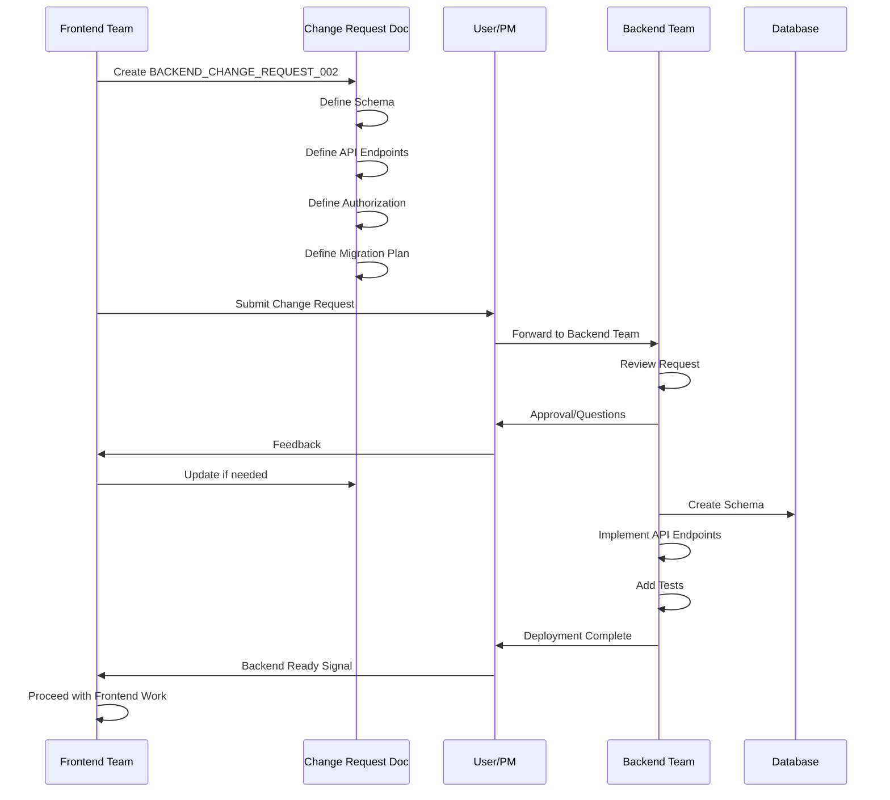
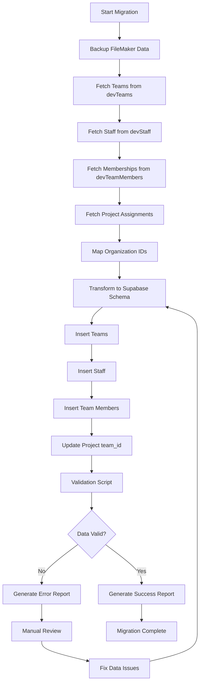
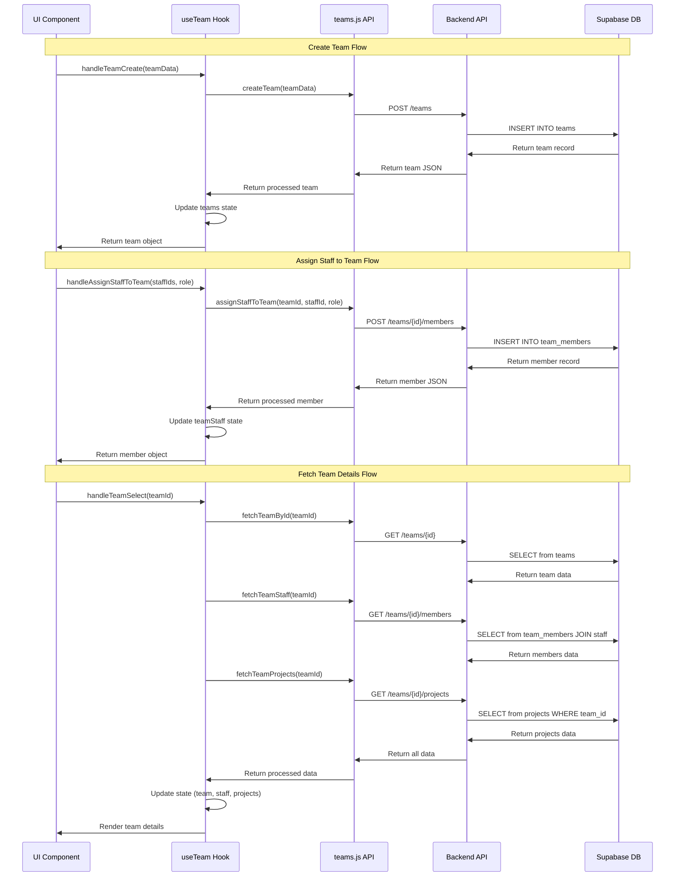
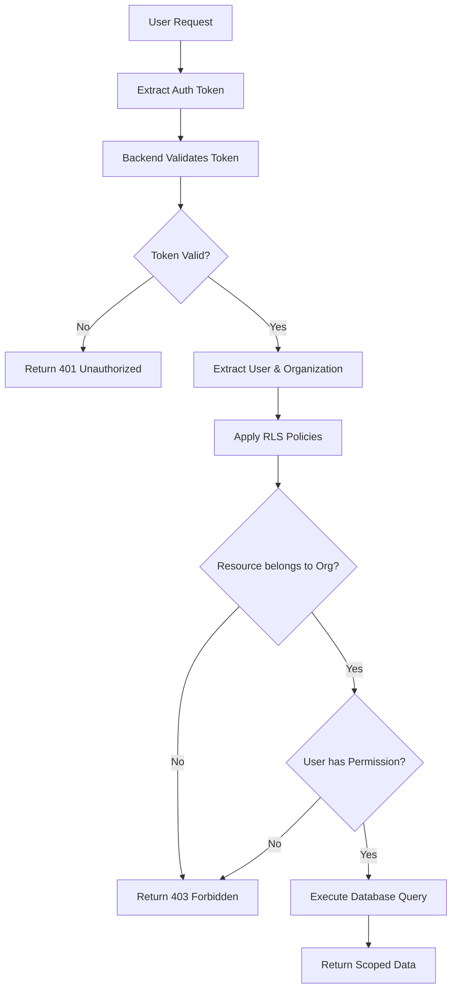
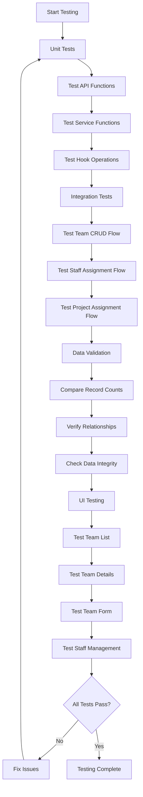
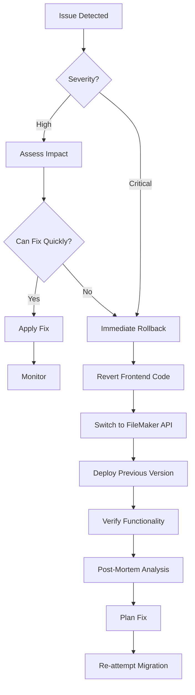
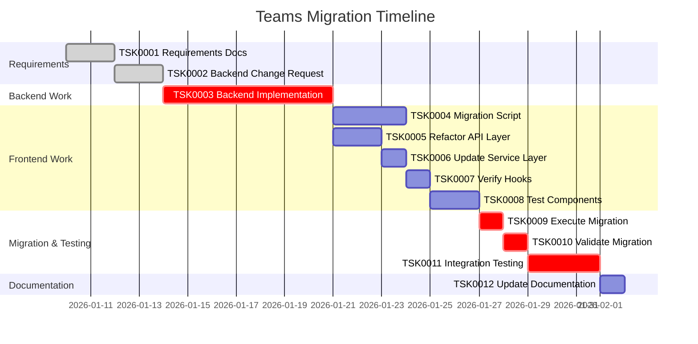

# Teams Supabase Migration - Workflows

## Overview

This document describes the workflows for migrating the Teams feature from FileMaker to Supabase.

## Implementation Flow

## Backend Change Request Flow

## Data Migration Workflow

## Frontend Refactoring Workflow

```mermaid
graph LR
    A[API Layer] --> B[Update teams.js]
    B --> C[Remove FileMaker imports]
    C --> D[Add Backend API calls]
    D --> E[Update error handling]

    E --> F[Service Layer]
    F --> G[Update teamService.js]
    G --> H[Update data processing]
    H --> I[Handle Backend response format]

    I --> J[Hook Layer]
    J --> K[Verify useTeam.js]
    K --> L[Test state management]
    L --> M[Update if needed]

    M --> N[Component Layer]
    N --> O[Test TeamDetails.jsx]
    O --> P[Test TeamForm.jsx]
    P --> Q[Update data rendering]

    Q --> R[Integration Testing]
```

## Team CRUD Operations (Post-Migration)

## Authorization Flow

## Testing Workflow

## Rollback Workflow

## Key Decision Points

### 1. Backend Schema Approval
- **Decision**: Schema design meets requirements
- **Criteria**: Supports all FileMaker operations, proper indexing, RLS policies defined
- **Approvers**: Backend team, database admin
- **Impact**: Blocks all frontend work

### 2. Migration Data Validation
- **Decision**: Migration was successful
- **Criteria**: 100% record transfer, all relationships intact, no data corruption
- **Approvers**: Frontend team, QA
- **Impact**: Determines if we can proceed or must re-migrate

### 3. Integration Testing Approval
- **Decision**: All workflows function correctly
- **Criteria**: CRUD operations work, UI components render correctly, no regressions
- **Approvers**: Frontend team, QA, stakeholders
- **Impact**: Determines production readiness

## Dependencies

### External Dependencies
- Backend team availability (TSK0003)
- Database admin for schema review
- QA team for comprehensive testing

### Internal Dependencies
- TSK0001 → TSK0002 (Requirements must be complete before change request)
- TSK0002 → TSK0003 (Change request must be approved before backend work)
- TSK0003 → TSK0004, TSK0005 (Backend must be ready before frontend/migration work)
- TSK0005 → TSK0006 → TSK0007 → TSK0008 (Frontend layers depend on each other)
- TSK0004 + TSK0008 → TSK0009 (Migration requires both script and frontend ready)
- TSK0009 → TSK0010 (Validation requires migration complete)
- TSK0010 → TSK0011 (Integration testing requires valid data)
- TSK0011 → TSK0012 (Documentation updated after testing passes)

## Timeline

