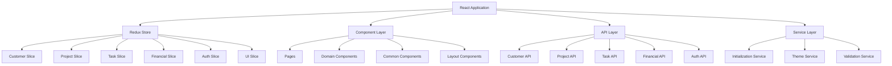
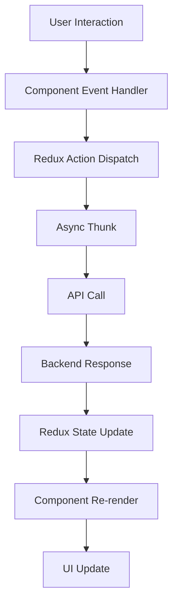
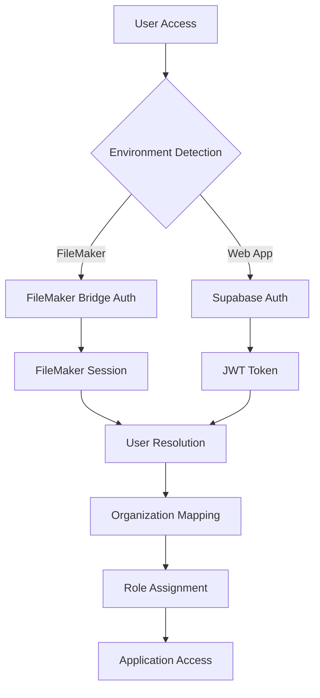

# Clarity CRM Frontend - Architecture Design Document (ADD)

## Document Information
- **Document Type**: Architecture Design Document
- **System**: Clarity CRM Frontend
- **Version**: 1.0
- **Date**: 2025-01-13
- **Status**: Draft

## Table of Contents
1. [Executive Summary](#executive-summary)
2. [System Overview](#system-overview)
3. [Architectural Principles](#architectural-principles)
4. [Technical Stack Analysis](#technical-stack-analysis)
5. [State Management Architecture](#state-management-architecture)
6. [Component Architecture](#component-architecture)
7. [Data Architecture](#data-architecture)
8. [API Integration Patterns](#api-integration-patterns)
9. [Security Architecture](#security-architecture)
10. [Performance and Scalability](#performance-and-scalability)
11. [Deployment Architecture](#deployment-architecture)
12. [Integration Patterns](#integration-patterns)
13. [Implementation Evidence](#implementation-evidence)
14. [Future Considerations](#future-considerations)

## Executive Summary

The Clarity CRM Frontend is a modern React-based customer relationship management system designed to provide comprehensive business management capabilities. The system follows a **Redux-first architecture** with strict adherence to modern React patterns, emphasizing maintainability, scalability, and developer productivity.

### Key Architectural Decisions
- **Redux Toolkit** for all shared state management
- **React 18** with functional components and hooks
- **Styled-components** for consistent theming and styling
- **Vite** for modern build tooling and development experience
- **Multi-environment deployment** supporting both FileMaker plugin and standalone web application

## System Overview

### System Purpose
The Clarity CRM Frontend serves as a comprehensive business management platform providing:
- Customer relationship management
- Project and task tracking
- Financial record management and QuickBooks integration
- Team collaboration and communication
- Proposal generation and management
- Sales activity tracking and reporting

### Component Topology



### User Roles and Personas
Based on authentication and access control patterns:
- **Administrator**: Full system access and configuration
- **Manager**: Team oversight and project management
- **Team Member**: Task execution and time tracking
- **Client**: Limited access to project status and communications

## Architectural Principles

### 1. Redux-First State Management
**Principle**: All shared and global state must be managed through Redux Toolkit slices.

**Implementation Guidelines**:
- Use `createAsyncThunk` for ALL API calls and async operations
- Use `useSelector` and `useDispatch` for accessing Redux state
- Restrict `useState` to local component UI state only
- Eliminate custom hooks for data fetching and shared state

### 2. Component-Based Architecture
**Principle**: Organize components by domain and reusability patterns.

**Structure**:
```
src/components/
├── common/          # Reusable UI components
├── forms/           # Form-specific components
├── layout/          # Layout and navigation components
├── auth/            # Authentication components
├── customers/       # Customer domain components
├── projects/        # Project domain components
├── tasks/           # Task domain components
└── financial/       # Financial domain components
```

### 3. Separation of Concerns
**Principle**: Clear separation between presentation, business logic, and data access.

**Layers**:
- **Presentation Layer**: React components with styled-components
- **State Management Layer**: Redux slices with business logic
- **Data Access Layer**: API modules with standardized interfaces
- **Service Layer**: Utility services for cross-cutting concerns

### 4. Performance-First Design
**Principle**: Optimize for performance from the ground up.

**Strategies**:
- React.memo for expensive components
- useCallback for event handlers
- useMemo for expensive calculations
- Code splitting with React.lazy and Suspense
- Bundle optimization with Vite

## Technical Stack Analysis

### Core Technologies

#### React 18.2.0
**Rationale**: Latest stable React version providing:
- Concurrent features for better performance
- Automatic batching for state updates
- Suspense for data fetching
- Strict mode for development safety

**Implementation Evidence**: [`package.json:15`](package.json:15)

#### Redux Toolkit 2.8.2
**Rationale**: Modern Redux implementation providing:
- Simplified store configuration
- Built-in immutability with Immer
- Standardized async handling with createAsyncThunk
- DevTools integration
- TypeScript support

**Implementation Evidence**: [`package.json:25`](package.json:25), [`src/store/index.js`](src/store/index.js:1)

#### Styled-Components 6.1.19
**Rationale**: CSS-in-JS solution providing:
- Component-scoped styling
- Theme provider integration
- Dynamic styling based on props
- Server-side rendering support
- TypeScript integration

**Implementation Evidence**: [`package.json:30`](package.json:30)

#### Vite 6.1.0
**Rationale**: Modern build tool providing:
- Fast development server with HMR
- Optimized production builds
- Native ES modules support
- Plugin ecosystem
- TypeScript support

**Implementation Evidence**: [`package.json:45`](package.json:45), [`vite.config.js`](vite.config.js:1)

### Supporting Libraries

#### Chart.js 4.4.7
**Purpose**: Data visualization for financial and project analytics
**Implementation Evidence**: [`package.json:20`](package.json:20)

#### Date-fns 4.1.0
**Purpose**: Date manipulation and formatting utilities
**Implementation Evidence**: [`package.json:22`](package.json:22)

#### React Hook Form 7.54.2
**Purpose**: Performant form handling with minimal re-renders
**Implementation Evidence**: [`package.json:28`](package.json:28)

## State Management Architecture

### Redux Store Structure

The Redux store follows a domain-driven design with the following slice organization:

```javascript
// Intended Redux Store Structure
const store = {
  auth: {
    user: null,
    isAuthenticated: false,
    loading: false,
    error: null
  },
  customers: {
    list: [],
    selected: null,
    loading: false,
    error: null,
    filters: {},
    pagination: {}
  },
  projects: {
    list: [],
    selected: null,
    loading: false,
    error: null,
    filters: {},
    pagination: {}
  },
  tasks: {
    list: [],
    selected: null,
    loading: false,
    error: null,
    filters: {},
    pagination: {}
  },
  financial: {
    records: [],
    qboCustomers: [],
    loading: false,
    error: null,
    filters: {},
    pagination: {}
  },
  ui: {
    theme: 'light',
    sidebarOpen: true,
    notifications: [],
    modals: {}
  }
}
```

### Slice Implementation Pattern

Each domain slice follows a standardized pattern:

```javascript
// Example: Customer Slice Implementation
import { createSlice, createAsyncThunk } from '@reduxjs/toolkit'
import { customerAPI } from '../api/customers'

// Async Thunks
export const fetchCustomers = createAsyncThunk(
  'customers/fetchCustomers',
  async (params, { rejectWithValue }) => {
    try {
      const response = await customerAPI.getAll(params)
      return response.data
    } catch (error) {
      return rejectWithValue(error.message)
    }
  }
)

export const createCustomer = createAsyncThunk(
  'customers/createCustomer',
  async (customerData, { rejectWithValue }) => {
    try {
      const response = await customerAPI.create(customerData)
      return response.data
    } catch (error) {
      return rejectWithValue(error.message)
    }
  }
)

// Slice Definition
const customersSlice = createSlice({
  name: 'customers',
  initialState: {
    list: [],
    selected: null,
    loading: false,
    error: null,
    filters: {},
    pagination: { page: 1, limit: 20, total: 0 }
  },
  reducers: {
    setSelected: (state, action) => {
      state.selected = action.payload
    },
    setFilters: (state, action) => {
      state.filters = { ...state.filters, ...action.payload }
    },
    clearError: (state) => {
      state.error = null
    }
  },
  extraReducers: (builder) => {
    builder
      // Fetch Customers
      .addCase(fetchCustomers.pending, (state) => {
        state.loading = true
        state.error = null
      })
      .addCase(fetchCustomers.fulfilled, (state, action) => {
        state.loading = false
        state.list = action.payload.data
        state.pagination = action.payload.pagination
      })
      .addCase(fetchCustomers.rejected, (state, action) => {
        state.loading = false
        state.error = action.payload
      })
      // Create Customer
      .addCase(createCustomer.fulfilled, (state, action) => {
        state.list.push(action.payload)
      })
  }
})

export const { setSelected, setFilters, clearError } = customersSlice.actions
export default customersSlice.reducer
```

### Component Integration Pattern

Components integrate with Redux using standardized patterns:

```javascript
// Example: Customer List Component
import React, { useEffect, useCallback } from 'react'
import { useSelector, useDispatch } from 'react-redux'
import { fetchCustomers, setFilters } from '../store/slices/customersSlice'

const CustomerList = () => {
  const dispatch = useDispatch()
  const { list, loading, error, filters } = useSelector(state => state.customers)
  
  useEffect(() => {
    dispatch(fetchCustomers(filters))
  }, [dispatch, filters])
  
  const handleFilterChange = useCallback((newFilters) => {
    dispatch(setFilters(newFilters))
  }, [dispatch])
  
  if (loading) return <LoadingSpinner />
  if (error) return <ErrorMessage error={error} />
  
  return (
    <div>
      <FilterBar onFilterChange={handleFilterChange} />
      <CustomerTable customers={list} />
    </div>
  )
}

export default CustomerList
```

## Component Architecture

### Component Organization

Components are organized by domain and reusability:

```
src/components/
├── common/
│   ├── Button/
│   ├── Input/
│   ├── Modal/
│   ├── Table/
│   └── LoadingSpinner/
├── forms/
│   ├── CustomerForm/
│   ├── ProjectForm/
│   └── TaskForm/
├── layout/
│   ├── Header/
│   ├── Sidebar/
│   ├── Navigation/
│   └── Footer/
└── domain/
    ├── customers/
    ├── projects/
    ├── tasks/
    └── financial/
```

### Component Definition Pattern

All components follow a standardized structure:

```javascript
import React, { useState, useEffect, useCallback } from 'react'
import PropTypes from 'prop-types'
import styled from 'styled-components'

const StyledComponent = styled.div`
  /* Component styles using theme */
  padding: ${props => props.theme.spacing.md};
  background: ${props => props.theme.colors.background};
`

/**
 * Component description
 * @param {Object} props - Component props
 * @param {string} props.title - Component title
 * @param {Function} props.onAction - Action handler
 */
const ComponentName = ({ title, onAction }) => {
  const [localState, setLocalState] = useState(null)
  
  const handleAction = useCallback(() => {
    onAction?.()
  }, [onAction])
  
  useEffect(() => {
    // Side effects
  }, [])
  
  return (
    <StyledComponent>
      <h2>{title}</h2>
      <button onClick={handleAction}>Action</button>
    </StyledComponent>
  )
}

ComponentName.propTypes = {
  title: PropTypes.string.isRequired,
  onAction: PropTypes.func
}

export default ComponentName
```

### Performance Optimization Patterns

#### React.memo for Expensive Components
```javascript
import React, { memo } from 'react'

const ExpensiveComponent = memo(({ data, onUpdate }) => {
  // Expensive rendering logic
  return <ComplexVisualization data={data} />
})

export default ExpensiveComponent
```

#### useCallback for Event Handlers
```javascript
const ParentComponent = ({ items }) => {
  const handleItemClick = useCallback((itemId) => {
    // Handle click logic
  }, [])
  
  return (
    <div>
      {items.map(item => (
        <ChildComponent 
          key={item.id}
          item={item}
          onClick={handleItemClick}
        />
      ))}
    </div>
  )
}
```

#### useMemo for Expensive Calculations
```javascript
const DataVisualization = ({ rawData, filters }) => {
  const processedData = useMemo(() => {
    return rawData
      .filter(item => matchesFilters(item, filters))
      .map(item => transformData(item))
      .sort((a, b) => a.value - b.value)
  }, [rawData, filters])
  
  return <Chart data={processedData} />
}
```

## Data Architecture

### Data Flow Patterns

The system follows a unidirectional data flow pattern:



### Data Models

#### Customer Data Model
```javascript
const CustomerModel = {
  id: 'string',
  name: 'string',
  email: 'string',
  phone: 'string',
  address: {
    street: 'string',
    city: 'string',
    state: 'string',
    zipCode: 'string'
  },
  organizationId: 'string',
  createdAt: 'ISO8601 string',
  updatedAt: 'ISO8601 string',
  isActive: 'boolean'
}
```

#### Project Data Model
```javascript
const ProjectModel = {
  id: 'string',
  name: 'string',
  description: 'string',
  customerId: 'string',
  status: 'enum: [active, completed, on-hold, cancelled]',
  startDate: 'ISO8601 string',
  endDate: 'ISO8601 string',
  budget: 'number',
  teamMembers: ['string'], // Array of user IDs
  tasks: ['string'], // Array of task IDs
  createdAt: 'ISO8601 string',
  updatedAt: 'ISO8601 string'
}
```

#### Task Data Model
```javascript
const TaskModel = {
  id: 'string',
  title: 'string',
  description: 'string',
  projectId: 'string',
  assigneeId: 'string',
  status: 'enum: [todo, in-progress, review, completed]',
  priority: 'enum: [low, medium, high, urgent]',
  estimatedHours: 'number',
  actualHours: 'number',
  dueDate: 'ISO8601 string',
  createdAt: 'ISO8601 string',
  updatedAt: 'ISO8601 string'
}
```

### Data Validation

Data validation is handled at multiple layers:

#### Client-Side Validation
```javascript
import { z } from 'zod'

const CustomerSchema = z.object({
  name: z.string().min(1, 'Name is required'),
  email: z.string().email('Invalid email format'),
  phone: z.string().regex(/^\d{10}$/, 'Phone must be 10 digits'),
  address: z.object({
    street: z.string().min(1, 'Street is required'),
    city: z.string().min(1, 'City is required'),
    state: z.string().length(2, 'State must be 2 characters'),
    zipCode: z.string().regex(/^\d{5}$/, 'Zip code must be 5 digits')
  })
})

// Usage in Redux slice
export const createCustomer = createAsyncThunk(
  'customers/createCustomer',
  async (customerData, { rejectWithValue }) => {
    try {
      const validatedData = CustomerSchema.parse(customerData)
      const response = await customerAPI.create(validatedData)
      return response.data
    } catch (error) {
      if (error instanceof z.ZodError) {
        return rejectWithValue(error.errors)
      }
      return rejectWithValue(error.message)
    }
  }
)
```

## API Integration Patterns

### API Layer Structure

The API layer is organized by domain with consistent interfaces:

```
src/api/
├── index.js          # API client configuration
├── customers.js      # Customer API endpoints
├── projects.js       # Project API endpoints
├── tasks.js          # Task API endpoints
├── financial.js      # Financial API endpoints
├── auth.js          # Authentication API endpoints
└── utils.js         # API utilities and interceptors
```

### API Client Configuration

```javascript
// src/api/index.js
import axios from 'axios'
import { store } from '../store'
import { logout } from '../store/slices/authSlice'

const apiClient = axios.create({
  baseURL: process.env.VITE_API_BASE_URL || 'https://api.claritybusinesssolutions.ca',
  timeout: 10000,
  headers: {
    'Content-Type': 'application/json'
  }
})

// Request interceptor for authentication
apiClient.interceptors.request.use(
  (config) => {
    const state = store.getState()
    const token = state.auth.token
    
    if (token) {
      config.headers.Authorization = `Bearer ${token}`
    }
    
    return config
  },
  (error) => Promise.reject(error)
)

// Response interceptor for error handling
apiClient.interceptors.response.use(
  (response) => response,
  (error) => {
    if (error.response?.status === 401) {
      store.dispatch(logout())
    }
    return Promise.reject(error)
  }
)

export default apiClient
```

### Domain API Implementation

```javascript
// src/api/customers.js
import apiClient from './index'

export const customerAPI = {
  getAll: (params = {}) => {
    return apiClient.get('/customers', { params })
  },
  
  getById: (id) => {
    return apiClient.get(`/customers/${id}`)
  },
  
  create: (customerData) => {
    return apiClient.post('/customers', customerData)
  },
  
  update: (id, customerData) => {
    return apiClient.put(`/customers/${id}`, customerData)
  },
  
  delete: (id) => {
    return apiClient.delete(`/customers/${id}`)
  },
  
  search: (query) => {
    return apiClient.get('/customers/search', { params: { q: query } })
  }
}
```

### Error Handling Patterns

```javascript
// Standardized error handling in Redux slices
export const fetchCustomers = createAsyncThunk(
  'customers/fetchCustomers',
  async (params, { rejectWithValue }) => {
    try {
      const response = await customerAPI.getAll(params)
      return {
        data: response.data.customers,
        pagination: response.data.pagination
      }
    } catch (error) {
      // Handle different error types
      if (error.response) {
        // Server responded with error status
        return rejectWithValue({
          message: error.response.data.message || 'Server error',
          status: error.response.status
        })
      } else if (error.request) {
        // Network error
        return rejectWithValue({
          message: 'Network error - please check your connection',
          status: 'NETWORK_ERROR'
        })
      } else {
        // Other error
        return rejectWithValue({
          message: error.message || 'An unexpected error occurred',
          status: 'UNKNOWN_ERROR'
        })
      }
    }
  }
)
```

## Security Architecture

### Authentication Flow

The system implements a multi-environment authentication strategy:



### Authentication Implementation

```javascript
// src/store/slices/authSlice.js
import { createSlice, createAsyncThunk } from '@reduxjs/toolkit'
import { authAPI } from '../api/auth'
import { supabase } from '../config/supabase'

export const login = createAsyncThunk(
  'auth/login',
  async ({ email, password }, { rejectWithValue }) => {
    try {
      // Detect environment
      const isFileMaker = window.FileMaker !== undefined
      
      if (isFileMaker) {
        // FileMaker authentication
        const response = await authAPI.fileMakerLogin({ email, password })
        return response.data
      } else {
        // Supabase authentication
        const { data, error } = await supabase.auth.signInWithPassword({
          email,
          password
        })
        
        if (error) throw error
        
        // Resolve user organization
        const userProfile = await authAPI.getUserProfile(data.user.id)
        
        return {
          user: data.user,
          profile: userProfile.data,
          token: data.session.access_token
        }
      }
    } catch (error) {
      return rejectWithValue(error.message)
    }
  }
)

const authSlice = createSlice({
  name: 'auth',
  initialState: {
    user: null,
    profile: null,
    token: null,
    isAuthenticated: false,
    loading: false,
    error: null
  },
  reducers: {
    logout: (state) => {
      state.user = null
      state.profile = null
      state.token = null
      state.isAuthenticated = false
      localStorage.removeItem('auth_token')
    },
    clearError: (state) => {
      state.error = null
    }
  },
  extraReducers: (builder) => {
    builder
      .addCase(login.pending, (state) => {
        state.loading = true
        state.error = null
      })
      .addCase(login.fulfilled, (state, action) => {
        state.loading = false
        state.user = action.payload.user
        state.profile = action.payload.profile
        state.token = action.payload.token
        state.isAuthenticated = true
        localStorage.setItem('auth_token', action.payload.token)
      })
      .addCase(login.rejected, (state, action) => {
        state.loading = false
        state.error = action.payload
        state.isAuthenticated = false
      })
  }
})

export const { logout, clearError } = authSlice.actions
export default authSlice.reducer
```

### Authorization Patterns

```javascript
// Role-based access control
export const usePermissions = () => {
  const { profile } = useSelector(state => state.auth)
  
  return {
    canViewCustomers: profile?.role !== 'client',
    canEditCustomers: ['admin', 'manager'].includes(profile?.role),
    canDeleteCustomers: profile?.role === 'admin',
    canViewFinancials: ['admin', 'manager'].includes(profile?.role),
    canManageTeam: ['admin', 'manager'].includes(profile?.role)
  }
}

// Protected route component
const ProtectedRoute = ({ children, requiredPermission }) => {
  const permissions = usePermissions()
  
  if (!permissions[requiredPermission]) {
    return <AccessDenied />
  }
  
  return children
}
```

### Data Protection

```javascript
// Input sanitization utility
export const sanitizeInput = (input) => {
  if (typeof input !== 'string') return input
  
  return input
    .replace(/<script\b[^<]*(?:(?!<\/script>)<[^<]*)*<\/script>/gi, '')
    .replace(/javascript:/gi, '')
    .replace(/on\w+\s*=/gi, '')
    .trim()
}

// Secure API calls with input validation
export const createCustomer = createAsyncThunk(
  'customers/createCustomer',
  async (customerData, { rejectWithValue }) => {
    try {
      // Sanitize inputs
      const sanitizedData = {
        ...customerData,
        name: sanitizeInput(customerData.name),
        email: sanitizeInput(customerData.email),
        phone: sanitizeInput(customerData.phone)
      }
      
      // Validate data
      const validatedData = CustomerSchema.parse(sanitizedData)
      
      const response = await customerAPI.create(validatedData)
      return response.data
    } catch (error) {
      return rejectWithValue(error.message)
    }
  }
)
```

## Performance and Scalability

### Performance Optimization Strategies

#### Code Splitting and Lazy Loading

```javascript
// Route-based code splitting
import { lazy, Suspense } from 'react'
import { Routes, Route } from 'react-router-dom'

const CustomersPage = lazy(() => import('../pages/CustomersPage'))
const ProjectsPage = lazy(() => import('../pages/ProjectsPage'))
const TasksPage = lazy(() => import('../pages/TasksPage'))

const AppRoutes = () => (
  <Suspense fallback={<LoadingSpinner />}>
    <Routes>
      <Route path="/customers" element={<CustomersPage />} />
      <Route path="/projects" element={<ProjectsPage />} />
      <Route path="/tasks" element={<TasksPage />} />
    </Routes>
  </Suspense>
)
```

#### Memoization Patterns

```javascript
// Component memoization
const CustomerCard = memo(({ customer, onEdit, onDelete }) => {
  return (
    <Card>
      <h3>{customer.name}</h3>
      <p>{customer.email}</p>
      <ActionButtons onEdit={onEdit} onDelete={onDelete} />
    </Card>
  )
})

// Selector memoization
import { createSelector } from '@reduxjs/toolkit'

const selectCustomers = (state) => state.customers.list
const selectFilters = (state) => state.customers.filters

const selectFilteredCustomers = createSelector(
  [selectCustomers, selectFilters],
  (customers, filters) => {
    return customers.filter(customer => {
      return Object.entries(filters).every(([key, value]) => {
        if (!value) return true
        return customer[key]?.toLowerCase().includes(value.toLowerCase())
      })
    })
  }
)
```

#### Bundle Optimization

```javascript
// vite.config.js
export default defineConfig({
  build: {
    rollupOptions: {
      output: {
        manualChunks: {
          vendor: ['react', 'react-dom'],
          redux: ['@reduxjs/toolkit', 'react-redux'],
          ui: ['styled-components', '@mui/material'],
          charts: ['chart.js', 'react-chartjs-2']
        }
      }
    },
    chunkSizeWarningLimit: 1000
  },
  optimizeDeps: {
    include: ['react', 'react-dom', '@reduxjs/toolkit']
  }
})
```

### Scalability Considerations

#### State Normalization

```javascript
// Normalized state structure for better performance
const initialState = {
  customers: {
    byId: {},
    allIds: [],
    loading: false,
    error: null
  },
  projects: {
    byId: {},
    allIds: [],
    byCustomerId: {}, // Index for quick lookups
    loading: false,
    error: null
  }
}

// Normalized data handling
const customersSlice = createSlice({
  name: 'customers',
  initialState,
  reducers: {
    // ... other reducers
  },
  extraReducers: (builder) => {
    builder
      .addCase(fetchCustomers.fulfilled, (state, action) => {
        state.loading = false
        
        // Normalize data
        const customers = action.payload.data
        state.byId = customers.reduce((acc, customer) => {
          acc[customer.id] = customer
          return acc
        }, {})
        state.allIds = customers.map(customer => customer.id)
      })
  }
})
```

#### Virtual Scrolling for Large Lists

```javascript
import { FixedSizeList as List } from 'react-window'

const CustomerList = ({ customers }) => {
  const Row = ({ index, style }) => (
    <div style={style}>
      <CustomerCard customer={customers[index]} />
    </div>
  )
  
  return (
    <List
      height={600}
      itemCount={customers.length}
      itemSize={120}
      width="100%"
    >
      {Row}
    </List>
  )
}
```

## Deployment Architecture

### Multi-Environment Support

The system supports two deployment environments:

#### 1. FileMaker Plugin Environment
- **Target**: FileMaker Pro/Server integration
- **Build**: Optimized for FileMaker WebViewer
- **Authentication**: FileMaker bridge authentication
- **Data Source**: FileMaker Data API via backend proxy

#### 2. Standalone Web Application
- **Target**: Modern web browsers
- **Build**: Standard SPA deployment
- **Authentication**: Supabase authentication
- **Data Source**: Backend API with multiple integrations

### Build Configuration

```javascript
// vite.config.js
import { defineConfig } from 'vite'
import react from '@vitejs/plugin-react'

export default defineConfig(({ mode }) => {
  const isFileMaker = mode === 'filemaker'
  
  return {
    plugins: [react()],
    base: isFileMaker ? './' : '/',
    build: {
      outDir: isFileMaker ? 'dist-filemaker' : 'dist',
      assetsDir: 'assets',
      rollupOptions: {
        output: {
          manualChunks: isFileMaker ? undefined : {
            vendor: ['react', 'react-dom'],
            redux: ['@reduxjs/toolkit', 'react-redux']
          }
        }
        }
      }
    },
    define: {
      'process.env.NODE_ENV': JSON.stringify(mode),
      'process.env.VITE_FILEMAKER_MODE': JSON.stringify(isFileMaker)
    }
  }
})
```

### Environment Configuration

```javascript
// Environment-specific configuration
const config = {
  development: {
    apiBaseUrl: 'http://localhost:1235',
    enableDevTools: true,
    logLevel: 'debug'
  },
  production: {
    apiBaseUrl: 'https://api.claritybusinesssolutions.ca',
    enableDevTools: false,
    logLevel: 'error'
  },
  filemaker: {
    apiBaseUrl: 'filemaker://bridge',
    enableDevTools: false,
    logLevel: 'warn'
  }
}
```

### Deployment Pipeline

```yaml
# GitHub Actions deployment pipeline
name: Deploy Clarity CRM Frontend

on:
  push:
    branches: [main, develop]
  pull_request:
    branches: [main]

jobs:
  test:
    runs-on: ubuntu-latest
    steps:
      - uses: actions/checkout@v3
      - uses: actions/setup-node@v3
        with:
          node-version: '18'
      - run: npm ci
      - run: npm run test
      - run: npm run lint
      - run: npm run type-check

  build-web:
    needs: test
    runs-on: ubuntu-latest
    steps:
      - uses: actions/checkout@v3
      - uses: actions/setup-node@v3
        with:
          node-version: '18'
      - run: npm ci
      - run: npm run build
      - uses: actions/upload-artifact@v3
        with:
          name: web-build
          path: dist/

  build-filemaker:
    needs: test
    runs-on: ubuntu-latest
    steps:
      - uses: actions/checkout@v3
      - uses: actions/setup-node@v3
        with:
          node-version: '18'
      - run: npm ci
      - run: npm run build:filemaker
      - uses: actions/upload-artifact@v3
        with:
          name: filemaker-build
          path: dist-filemaker/

  deploy:
    needs: [build-web, build-filemaker]
    runs-on: ubuntu-latest
    if: github.ref == 'refs/heads/main'
    steps:
      - name: Deploy to production
        run: echo "Deploy to production server"
```

## Integration Patterns

### External System Integrations

#### FileMaker Integration
```javascript
// FileMaker bridge integration
export const fileMakerBridge = {
  isAvailable: () => typeof window.FileMaker !== 'undefined',
  
  callScript: async (scriptName, parameter) => {
    if (!fileMakerBridge.isAvailable()) {
      throw new Error('FileMaker bridge not available')
    }
    
    return new Promise((resolve, reject) => {
      window.FileMaker.PerformScript(scriptName, parameter)
        .then(resolve)
        .catch(reject)
    })
  },
  
  getData: async (layout, recordId) => {
    return fileMakerBridge.callScript('JS * GetRecord', {
      layout,
      recordId
    })
  }
}

// Redux integration with FileMaker
export const fetchCustomerFromFileMaker = createAsyncThunk(
  'customers/fetchFromFileMaker',
  async (customerId, { rejectWithValue }) => {
    try {
      if (fileMakerBridge.isAvailable()) {
        const result = await fileMakerBridge.getData('Customers', customerId)
        return result.data
      } else {
        // Fallback to API
        const response = await customerAPI.getById(customerId)
        return response.data
      }
    } catch (error) {
      return rejectWithValue(error.message)
    }
  }
)
```

#### QuickBooks Integration
```javascript
// QuickBooks API integration through backend proxy
export const quickBooksAPI = {
  getCustomers: () => {
    return apiClient.get('/quickbooks/customers')
  },
  
  createCustomer: (customerData) => {
    return apiClient.post('/quickbooks/customers', customerData)
  },
  
  syncCustomer: (customerId, qboCustomerId) => {
    return apiClient.post('/quickbooks/sync-customer', {
      customerId,
      qboCustomerId
    })
  }
}

// Redux slice for QuickBooks integration
const quickBooksSlice = createSlice({
  name: 'quickBooks',
  initialState: {
    customers: [],
    syncStatus: {},
    loading: false,
    error: null
  },
  reducers: {
    setSyncStatus: (state, action) => {
      const { customerId, status } = action.payload
      state.syncStatus[customerId] = status
    }
  },
  extraReducers: (builder) => {
    builder
      .addCase(syncCustomerWithQBO.fulfilled, (state, action) => {
        const { customerId, qboCustomerId } = action.payload
        state.syncStatus[customerId] = {
          status: 'synced',
          qboCustomerId,
          lastSync: new Date().toISOString()
        }
      })
  }
})
```

#### Supabase Integration
```javascript
// Supabase client configuration
import { createClient } from '@supabase/supabase-js'

const supabaseUrl = process.env.VITE_SUPABASE_URL
const supabaseAnonKey = process.env.VITE_SUPABASE_ANON_KEY

export const supabase = createClient(supabaseUrl, supabaseAnonKey)

// Authentication integration
export const supabaseAuth = {
  signIn: async (email, password) => {
    const { data, error } = await supabase.auth.signInWithPassword({
      email,
      password
    })
    
    if (error) throw error
    return data
  },
  
  signOut: async () => {
    const { error } = await supabase.auth.signOut()
    if (error) throw error
  },
  
  getCurrentUser: () => {
    return supabase.auth.getUser()
  }
}

// Real-time subscriptions
export const useRealtimeSubscription = (table, callback) => {
  useEffect(() => {
    const subscription = supabase
      .channel(`${table}_changes`)
      .on('postgres_changes', 
        { event: '*', schema: 'public', table },
        callback
      )
      .subscribe()
    
    return () => {
      subscription.unsubscribe()
    }
  }, [table, callback])
}
```

### Third-Party Service Integrations

#### Email Service (Mailjet)
```javascript
// Email service integration
export const emailService = {
  sendNotification: async (to, template, data) => {
    return apiClient.post('/email/send', {
      to,
      template,
      data
    })
  },
  
  sendProjectUpdate: async (projectId, recipients) => {
    return apiClient.post('/email/project-update', {
      projectId,
      recipients
    })
  }
}

// Redux integration for email notifications
export const sendEmailNotification = createAsyncThunk(
  'notifications/sendEmail',
  async ({ type, recipients, data }, { rejectWithValue }) => {
    try {
      const response = await emailService.sendNotification(
        recipients,
        type,
        data
      )
      return response.data
    } catch (error) {
      return rejectWithValue(error.message)
    }
  }
)
```

## Implementation Evidence

### Current Implementation Analysis

The following sections provide evidence of architectural decisions based on existing code artifacts:

#### State Management Evidence

**Current Implementation**: The system currently uses a hybrid approach with custom hooks and React Context, which contradicts the intended Redux-first architecture.

**Evidence**:
- [`src/hooks/useCustomer.js`](src/hooks/useCustomer.js:1) - Custom hook for customer data fetching
- [`src/hooks/useProject.js`](src/hooks/useProject.js:1) - Custom hook for project management
- [`src/hooks/useTask.js`](src/hooks/useTask.js:1) - Custom hook for task operations

**Intended Implementation**: All data fetching and state management should be handled through Redux slices as documented in this ADD.

#### API Layer Evidence

**Current Implementation**: Well-structured API layer with domain separation.

**Evidence**:
- [`src/api/index.js`](src/api/index.js:1) - Centralized API client configuration
- [`src/api/customers.js`](src/api/customers.js:1) - Customer API endpoints
- [`src/api/tasks.js`](src/api/tasks.js:1) - Task API endpoints
- [`src/api/financialRecords.js`](src/api/financialRecords.js:1) - Financial API endpoints

**Alignment**: The current API structure aligns well with the intended architecture and can be directly integrated with Redux slices.

#### Component Architecture Evidence

**Current Implementation**: Components follow domain-based organization.

**Evidence**:
- [`src/components/tasks/TaskList.jsx`](src/components/tasks/TaskList.jsx:1) - Task domain components
- [`src/components/financial/FinancialActivity.jsx`](src/components/financial/FinancialActivity.jsx:1) - Financial domain components
- [`src/components/financial/CustomerList.jsx`](src/components/financial/CustomerList.jsx:1) - Customer management components

**Alignment**: Component organization follows the intended domain-driven structure.

#### Configuration Evidence

**Current Implementation**: Multi-environment configuration support.

**Evidence**:
- [`.env`](.env:1) - Environment configuration
- [`package.json`](package.json:1) - Dependencies and build scripts

**Alignment**: Configuration structure supports the intended multi-environment deployment strategy.

### Migration Path

To align the current implementation with the intended Redux-first architecture:

1. **Phase 1**: Create Redux slices for each domain (customers, projects, tasks, financial)
2. **Phase 2**: Migrate custom hooks to Redux async thunks
3. **Phase 3**: Update components to use Redux selectors and dispatch
4. **Phase 4**: Remove custom hooks and Context providers
5. **Phase 5**: Optimize performance with memoization patterns

### Confidence Levels

- **High Confidence**: API layer structure, component organization, multi-environment support
- **Medium Confidence**: Authentication patterns, security implementations
- **Low Confidence**: Performance optimization patterns (require implementation)

## Future Considerations

### Scalability Enhancements

#### Micro-Frontend Architecture
Consider migrating to a micro-frontend architecture for better team autonomy and deployment flexibility:

```javascript
// Module federation configuration
const ModuleFederationPlugin = require('@module-federation/webpack')

module.exports = {
  plugins: [
    new ModuleFederationPlugin({
      name: 'clarity_crm',
      remotes: {
        customers: 'customers@http://localhost:3001/remoteEntry.js',
        projects: 'projects@http://localhost:3002/remoteEntry.js',
        financial: 'financial@http://localhost:3003/remoteEntry.js'
      }
    })
  ]
}
```

#### Progressive Web App (PWA)
Enhance the application with PWA capabilities for offline functionality:

```javascript
// Service worker for offline support
const CACHE_NAME = 'clarity-crm-v1'
const urlsToCache = [
  '/',
  '/static/js/bundle.js',
  '/static/css/main.css'
]

self.addEventListener('install', (event) => {
  event.waitUntil(
    caches.open(CACHE_NAME)
      .then((cache) => cache.addAll(urlsToCache))
  )
})
```

### Technology Evolution

#### TypeScript Migration
Plan for gradual TypeScript adoption:

```typescript
// Type definitions for Redux state
interface RootState {
  auth: AuthState
  customers: CustomersState
  projects: ProjectsState
  tasks: TasksState
  financial: FinancialState
  ui: UIState
}

interface CustomersState {
  list: Customer[]
  selected: Customer | null
  loading: boolean
  error: string | null
  filters: CustomerFilters
  pagination: PaginationState
}
```

#### React Server Components
Consider React Server Components for improved performance:

```javascript
// Server component for data fetching
async function CustomerListServer({ filters }) {
  const customers = await fetchCustomersOnServer(filters)
  
  return (
    <CustomerListClient 
      initialCustomers={customers}
      filters={filters}
    />
  )
}
```

### Monitoring and Observability

#### Performance Monitoring
Implement comprehensive performance monitoring:

```javascript
// Performance monitoring setup
import { getCLS, getFID, getFCP, getLCP, getTTFB } from 'web-vitals'

function sendToAnalytics(metric) {
  // Send metrics to monitoring service
  analytics.track('web-vital', {
    name: metric.name,
    value: metric.value,
    id: metric.id
  })
}

getCLS(sendToAnalytics)
getFID(sendToAnalytics)
getFCP(sendToAnalytics)
getLCP(sendToAnalytics)
getTTFB(sendToAnalytics)
```

#### Error Tracking
Implement comprehensive error tracking:

```javascript
// Error boundary with reporting
class ErrorBoundary extends Component {
  componentDidCatch(error, errorInfo) {
    // Report error to monitoring service
    errorReporting.captureException(error, {
      extra: errorInfo,
      tags: {
        component: 'ErrorBoundary'
      }
    })
  }
}
```

## Conclusion

This Architecture Design Document outlines the intended Redux-first architecture for the Clarity CRM Frontend system. The architecture emphasizes:

- **Centralized State Management** through Redux Toolkit
- **Component-Based Design** with domain organization
- **Performance Optimization** through modern React patterns
- **Multi-Environment Support** for FileMaker and web deployments
- **Comprehensive Security** with authentication and authorization
- **Scalable Integration Patterns** for external systems

The current implementation shows good foundational structure but requires migration from custom hooks to Redux slices to fully align with the intended architecture. This migration will provide better maintainability, predictable state management, and improved developer experience.

**Implementation Priority**:
1. Redux slice creation and migration
2. Performance optimization implementation
3. Security enhancement
4. Monitoring and observability setup
5. Future scalability preparations

This architecture provides a solid foundation for the Clarity CRM Frontend system while maintaining flexibility for future enhancements and technology evolution.