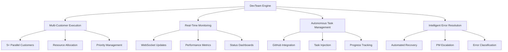
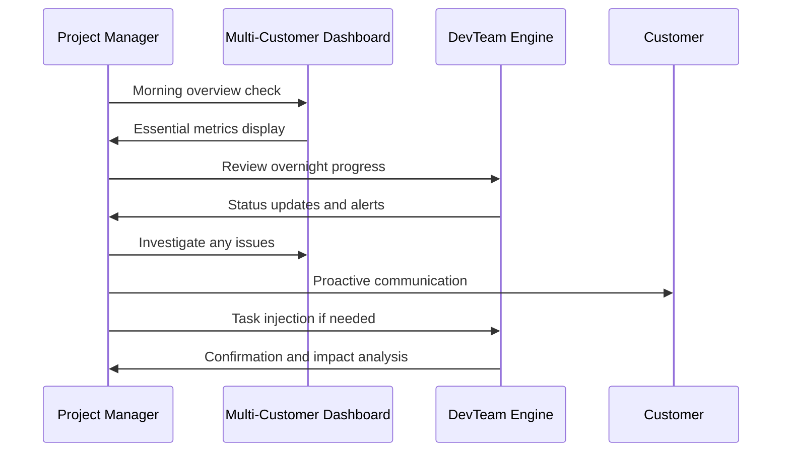
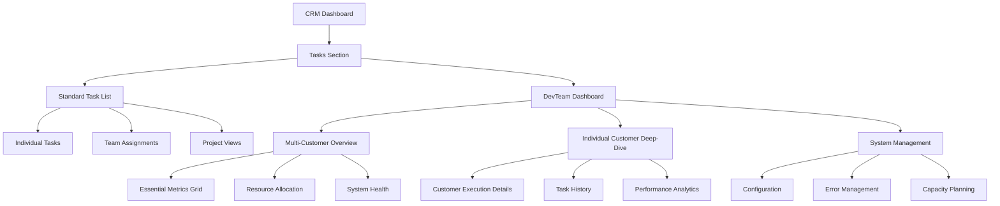
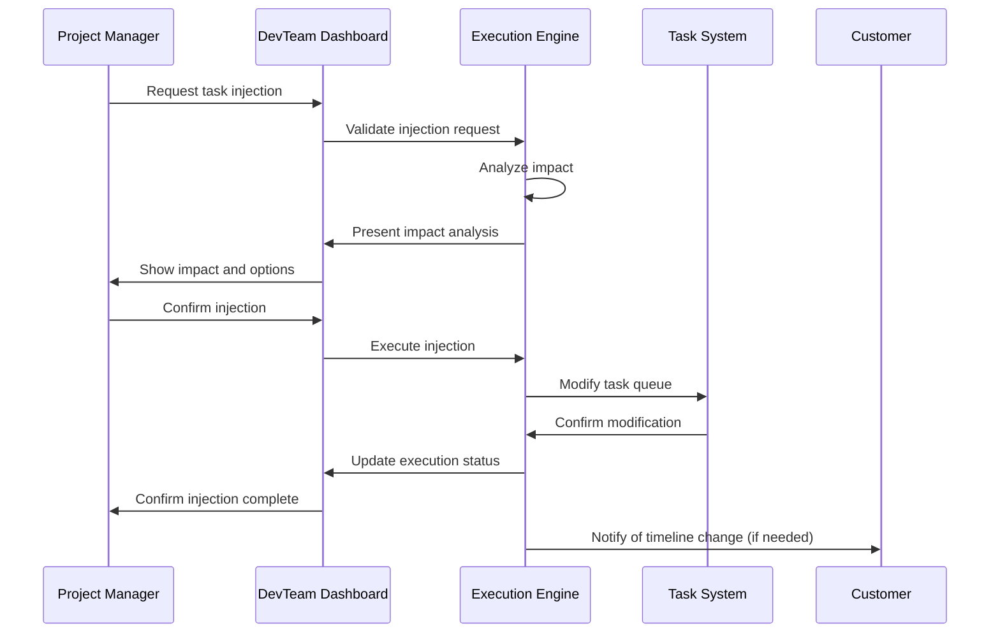
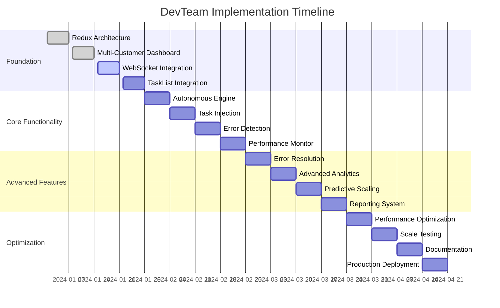

# DevTeam Autonomous Execution Engine - Information Architecture

## Executive Summary

The DevTeam Autonomous Execution Engine represents a revolutionary transformation of manual development workflows into autonomous, multi-customer parallel processing within the existing Clarity CRM platform. This Information Architecture (IA) document provides the comprehensive blueprint for integrating autonomous development capabilities while prioritizing Project Manager oversight and maintaining seamless integration with existing CRM workflows.

### Key Innovation Points
- **Multi-Customer Parallel Processing:** Support for 5+ simultaneous customer executions
- **Project Manager-Centric Design:** Primary focus on PM oversight with Developer access as secondary
- **Autonomous Task Progression:** Self-managing task execution with intelligent error resolution
- **Real-Time Monitoring:** WebSocket-powered dashboard with 5-second update intervals
- **Seamless CRM Integration:** Extends existing TaskList components without disruption

## Table of Contents

1. [System Overview](#system-overview)
2. [User-Centered Design](#user-centered-design)
3. [Information Hierarchy](#information-hierarchy)
4. [Navigation Architecture](#navigation-architecture)
5. [Content Strategy](#content-strategy)
6. [Integration Framework](#integration-framework)
7. [Scalability Architecture](#scalability-architecture)
8. [Workflow Systems](#workflow-systems)
9. [Risk Management](#risk-management)
10. [Implementation Roadmap](#implementation-roadmap)

## System Overview

### Vision Statement
Transform the Clarity CRM into an autonomous development execution platform that enables Project Managers to oversee multiple customer projects simultaneously while maintaining full control, transparency, and accountability.

### Core Capabilities


### Technical Foundation
- **Frontend:** React with Redux Toolkit state management
- **Backend:** Node.js with WebSocket support
- **Integration:** Extends existing TaskList component architecture
- **State Management:** Redux slices for all shared state
- **Styling:** Styled-components with theme integration
- **Real-Time:** WebSocket connections for live updates

## User-Centered Design

### Primary User: Project Manager (Sarah Chen)
**Role:** Strategic oversight and control of multiple customer executions

**Core Needs:**
- **Multi-Customer Visibility:** Monitor 5+ customer projects simultaneously
- **Essential Metrics First:** Critical information immediately visible
- **Control and Intervention:** Ability to pause, redirect, or inject tasks
- **Client Communication:** Proactive status updates and issue resolution
- **Resource Management:** Optimize team allocation across projects

**Daily Workflow Pattern:**


### Secondary User: Developer (Alex Rodriguez)
**Role:** Technical oversight and deep-dive investigation

**Core Needs:**
- **Technical Detail Access:** Comprehensive execution logs and metrics
- **Error Investigation:** Root cause analysis capabilities
- **System Health Monitoring:** Performance and reliability metrics
- **Code Quality Oversight:** Review autonomous code generation
- **Integration Support:** Assist with complex technical issues

### User Experience Principles
1. **Progressive Disclosure:** Essential information first, details on demand
2. **Context Preservation:** Maintain user context across navigation
3. **Predictable Interactions:** Consistent patterns throughout the system
4. **Immediate Feedback:** Real-time updates and confirmation of actions
5. **Error Prevention:** Clear warnings and confirmation for critical actions

## Information Hierarchy

### Primary Grouping: Customer Context
Information is primarily organized by customer to support Project Manager's mental model of managing multiple client relationships simultaneously.

```
Customer-Centric Information Architecture
├── Customer A
│   ├── Essential Metrics (Always Visible)
│   │   ├── Execution Status
│   │   ├── Progress Percentage
│   │   ├── Current Task
│   │   ├── Time Remaining
│   │   └── Health Score
│   ├── Execution Details (On-Demand)
│   │   ├── Task History
│   │   ├── Performance Metrics
│   │   ├── Resource Utilization
│   │   └── Error Log Summary
│   └── Management Actions (Contextual)
│       ├── Pause/Resume
│       ├── Task Injection
│       ├── Priority Adjustment
│       └── Client Communication
├── Customer B
│   └── [Same structure as Customer A]
└── System-Wide Views
    ├── Resource Allocation
    ├── Performance Overview
    ├── Error Trends
    └── Capacity Planning
```

### Secondary Grouping: Execution Phase
Within each customer context, information is organized by execution phase to support workflow understanding.

**Execution Phases:**
1. **Planning Phase:** Task analysis and resource allocation
2. **Active Execution:** Real-time task processing
3. **Quality Assurance:** Testing and validation
4. **Delivery Phase:** Client communication and handoff
5. **Monitoring Phase:** Post-delivery observation

### Information Priority Levels
```javascript
const InformationPriority = {
  ESSENTIAL: {
    description: 'Always visible, critical for PM decision-making',
    examples: ['execution_status', 'progress_percentage', 'health_score'],
    displayRule: 'permanent_visibility'
  },
  IMPORTANT: {
    description: 'Visible in summary, expandable for details',
    examples: ['current_task', 'time_estimates', 'resource_usage'],
    displayRule: 'summary_with_expansion'
  },
  DETAILED: {
    description: 'Available on-demand, supports investigation',
    examples: ['execution_logs', 'performance_metrics', 'error_details'],
    displayRule: 'on_demand_access'
  },
  CONTEXTUAL: {
    description: 'Shown when relevant to current context',
    examples: ['related_tasks', 'historical_patterns', 'recommendations'],
    displayRule: 'context_sensitive'
  }
}
```

## Navigation Architecture

### Integration with Existing TaskList Component
The DevTeam functionality extends the existing TaskList component rather than replacing it, ensuring seamless integration with current CRM workflows.

```javascript
// Enhanced TaskList component structure
const TaskListEnhanced = {
  // Existing TaskList functionality preserved
  existingFeatures: [
    'task_creation',
    'task_editing', 
    'status_updates',
    'assignment_management'
  ],
  
  // New DevTeam integration
  devTeamIntegration: {
    multiCustomerView: 'DevTeamDashboard',
    autonomousExecution: 'ExecutionEngine',
    realTimeUpdates: 'WebSocketManager',
    taskInjection: 'TaskInjectionSystem'
  },
  
  // Navigation enhancement
  navigationModes: {
    standard: 'Traditional task list view',
    devTeam: 'Multi-customer autonomous execution view',
    hybrid: 'Combined view with DevTeam overlay'
  }
}
```

### Navigation Schema


### Redux State Architecture
```javascript
// Redux store structure for DevTeam integration
const devTeamState = {
  // Multi-customer execution state
  customers: {
    byId: {
      'customer-1': {
        id: 'customer-1',
        name: 'Acme Corp',
        executionStatus: 'active',
        currentPhase: 'execution',
        progress: 0.65,
        healthScore: 0.92,
        lastUpdate: '2024-01-15T10:30:00Z'
      }
    },
    allIds: ['customer-1', 'customer-2'],
    activeExecutions: ['customer-1'],
    loadingStates: {},
    errors: {}
  },
  
  // Real-time execution data
  executions: {
    byCustomerId: {
      'customer-1': {
        currentTask: 'Implementing user authentication',
        tasksCompleted: 12,
        tasksTotal: 18,
        estimatedCompletion: '2024-01-15T16:00:00Z',
        resourceUtilization: 0.78
      }
    },
    realTimeUpdates: {
      lastUpdate: '2024-01-15T10:30:00Z',
      connectionStatus: 'connected',
      updateFrequency: 5000
    }
  },
  
  // Task injection system
  taskInjection: {
    pendingInjections: [],
    injectionHistory: [],
    approvalQueue: []
  },
  
  // Error resolution system
  errorResolution: {
    activeErrors: [],
    resolutionHistory: [],
    escalationQueue: []
  },
  
  // System performance
  systemMetrics: {
    overallHealth: 0.95,
    resourceCapacity: 0.72,
    errorRate: 0.02,
    averageResponseTime: 1.2
  }
}
```

## Content Strategy

### Content Inventory and Organization
Based on comprehensive analysis, the DevTeam system manages 184 distinct content elements organized into strategic categories for Project Manager effectiveness.

#### Essential Metrics (Always Visible)
```javascript
const EssentialMetrics = {
  executionStatus: {
    values: ['active', 'paused', 'error', 'completed'],
    displayFormat: 'status_indicator_with_color',
    updateFrequency: 'real_time'
  },
  progressPercentage: {
    range: '0-100%',
    displayFormat: 'progress_bar_with_percentage',
    updateFrequency: 'real_time'
  },
  healthScore: {
    range: '0.0-1.0',
    displayFormat: 'health_indicator_with_trend',
    updateFrequency: '30_seconds'
  },
  currentTask: {
    format: 'task_title_with_phase',
    displayFormat: 'truncated_with_tooltip',
    updateFrequency: 'real_time'
  },
  timeRemaining: {
    format: 'human_readable_duration',
    displayFormat: 'countdown_with_confidence',
    updateFrequency: '1_minute'
  }
}
```

#### Performance Metrics (On-Demand)
- **Execution Performance:** Task completion rates, velocity trends, quality metrics
- **Resource Utilization:** CPU, memory, network usage patterns
- **Error Analytics:** Error frequency, resolution times, impact analysis
- **Client Satisfaction:** Delivery timeliness, quality scores, communication effectiveness

#### Management Controls (Contextual)
- **Execution Control:** Pause, resume, abort, priority adjustment
- **Task Injection:** Priority, replace, positional injection types
- **Resource Management:** Allocation adjustment, capacity scaling
- **Communication Tools:** Client notifications, status reports, escalation triggers

### Content Presentation Patterns

#### Progressive Disclosure Implementation
```javascript
const ProgressiveDisclosure = {
  level1_essential: {
    alwaysVisible: true,
    content: ['status', 'progress', 'health', 'current_task'],
    layout: 'compact_grid'
  },
  level2_important: {
    visibleInSummary: true,
    expandable: true,
    content: ['time_estimates', 'resource_usage', 'recent_activity'],
    layout: 'expandable_sections'
  },
  level3_detailed: {
    onDemandAccess: true,
    content: ['execution_logs', 'performance_charts', 'error_details'],
    layout: 'modal_or_dedicated_view'
  },
  level4_contextual: {
    contextSensitive: true,
    content: ['recommendations', 'related_items', 'historical_patterns'],
    layout: 'contextual_sidebars'
  }
}
```

## Integration Framework

### Seamless CRM Integration Strategy
The DevTeam functionality integrates with existing CRM components through a non-disruptive extension pattern that preserves all current functionality while adding autonomous capabilities.

#### TaskList Component Extension
```javascript
// Integration pattern for existing TaskList component
import { TaskList as BaseTaskList } from '../tasks/TaskList'
import { DevTeamEnhancement } from './DevTeamEnhancement'
import { useDevTeamIntegration } from '../../hooks/useDevTeamIntegration'

const EnhancedTaskList = ({ ...baseProps }) => {
  const { isDevTeamEnabled, devTeamData } = useDevTeamIntegration()
  
  return (
    <TaskListContainer>
      <BaseTaskList {...baseProps} />
      {isDevTeamEnabled && (
        <DevTeamEnhancement 
          customerData={devTeamData.customers}
          executionState={devTeamData.executions}
          onTaskInjection={devTeamData.handleTaskInjection}
        />
      )}
    </TaskListContainer>
  )
}
```

#### Redux Integration Pattern
```javascript
// Redux slice integration with existing task management
import { createSlice, createAsyncThunk } from '@reduxjs/toolkit'
import { taskSlice } from '../tasks/taskSlice'

// Extend existing task slice with DevTeam capabilities
export const devTeamSlice = createSlice({
  name: 'devTeam',
  initialState: {
    // DevTeam specific state
    multiCustomerExecutions: {},
    realTimeConnections: {},
    autonomousProcesses: {}
  },
  reducers: {
    // DevTeam specific reducers
    updateExecutionStatus: (state, action) => {
      const { customerId, status } = action.payload
      state.multiCustomerExecutions[customerId].status = status
    }
  },
  extraReducers: (builder) => {
    // Listen to existing task slice actions
    builder.addCase(taskSlice.actions.updateTask, (state, action) => {
      // Update DevTeam state when regular tasks change
      const { taskId, updates } = action.payload
      if (state.autonomousProcesses[taskId]) {
        state.autonomousProcesses[taskId].lastUpdate = Date.now()
      }
    })
  }
})
```

### API Integration Patterns
```javascript
// API integration with existing backend services
class DevTeamAPIIntegration {
  constructor(existingAPIClient) {
    this.apiClient = existingAPIClient
    this.devTeamEndpoints = {
      executions: '/api/devteam/executions',
      taskInjection: '/api/devteam/task-injection',
      realTimeUpdates: '/ws/devteam/updates'
    }
  }

  // Extend existing task API calls
  async createTaskWithDevTeamIntegration(taskData) {
    // Use existing task creation
    const task = await this.apiClient.createTask(taskData)
    
    // Add DevTeam autonomous execution if enabled
    if (taskData.enableAutonomousExecution) {
      await this.enableAutonomousExecution(task.id, taskData.executionConfig)
    }
    
    return task
  }

  // New DevTeam specific endpoints
  async getMultiCustomerExecutions() {
    return await this.apiClient.get(this.devTeamEndpoints.executions)
  }

  async injectTask(customerId, taskData, injectionType) {
    return await this.apiClient.post(this.devTeamEndpoints.taskInjection, {
      customerId,
      taskData,
      injectionType
    })
  }
}
```

## Scalability Architecture

### Multi-Customer Execution Framework
The system is designed to support 5+ parallel customer executions with linear scalability and performance optimization.

#### Resource Management Strategy
```javascript
const ResourceManagementFramework = {
  // Capacity planning for multiple customers
  capacityAllocation: {
    maxConcurrentCustomers: 10,
    resourcesPerCustomer: {
      cpu: '2 cores',
      memory: '4GB',
      storage: '10GB',
      networkBandwidth: '100Mbps'
    },
    scalingTriggers: {
      cpuThreshold: 0.8,
      memoryThreshold: 0.85,
      responseTimeThreshold: '2 seconds'
    }
  },

  // Load balancing across customers
  loadBalancing: {
    algorithm: 'weighted_round_robin',
    weights: {
      priority_customer: 1.5,
      standard_customer: 1.0,
      low_priority_customer: 0.7
    },
    healthChecks: {
      interval: '30 seconds',
      timeout: '5 seconds',
      failureThreshold: 3
    }
  },

  // Auto-scaling configuration
  autoScaling: {
    scaleUpTriggers: [
      'cpu_usage > 80%',
      'memory_usage > 85%',
      'response_time > 2s',
      'queue_length > 50'
    ],
    scaleDownTriggers: [
      'cpu_usage < 40%',
      'memory_usage < 50%',
      'response_time < 500ms',
      'queue_length < 10'
    ],
    cooldownPeriod: '5 minutes'
  }
}
```

#### Performance Optimization Patterns
```javascript
// Performance optimization for multi-customer scenarios
class PerformanceOptimizer {
  constructor() {
    this.customerPriorities = new Map()
    this.resourcePools = new Map()
    this.performanceMetrics = new Map()
  }

  // Optimize resource allocation based on customer priority
  optimizeResourceAllocation(customers) {
    const sortedCustomers = customers.sort((a, b) => 
      this.getCustomerPriority(b) - this.getCustomerPriority(a)
    )

    return sortedCustomers.map(customer => ({
      customerId: customer.id,
      allocatedResources: this.calculateOptimalResources(customer),
      executionPriority: this.getCustomerPriority(customer),
      performanceTargets: this.getPerformanceTargets(customer)
    }))
  }

  // Dynamic performance monitoring and adjustment
  async monitorAndAdjustPerformance() {
    const currentMetrics = await this.collectPerformanceMetrics()
    
    for (const [customerId, metrics] of currentMetrics) {
      if (this.isPerformanceBelowThreshold(metrics)) {
        await this.adjustResourceAllocation(customerId, metrics)
      }
    }
  }

  // Predictive scaling based on historical patterns
  predictiveScaling(historicalData) {
    const patterns = this.analyzeUsagePatterns(historicalData)
    const predictions = this.generateScalingPredictions(patterns)
    
    return {
      recommendedActions: predictions.scalingActions,
      confidenceLevel: predictions.confidence,
      timeframe: predictions.timeframe
    }
  }
}
```

## Workflow Systems

### Task Injection Workflow
The task injection system provides Project Managers with controlled mechanisms to modify autonomous execution while maintaining system integrity.

#### Injection Types and Controls
```javascript
const TaskInjectionSystem = {
  injectionTypes: {
    PRIORITY: {
      description: 'Insert task at beginning of queue',
      approvalRequired: false,
      impactLevel: 'low',
      executionDelay: '< 1 minute'
    },
    REPLACE: {
      description: 'Replace current task with new task',
      approvalRequired: true,
      impactLevel: 'medium',
      executionDelay: '2-5 minutes'
    },
    POSITIONAL: {
      description: 'Insert task at specific position',
      approvalRequired: true,
      impactLevel: 'high',
      executionDelay: '5-10 minutes'
    }
  },

  approvalWorkflow: {
    autoApproved: ['PRIORITY'],
    requiresApproval: ['REPLACE', 'POSITIONAL'],
    approvers: ['project_manager', 'technical_lead'],
    approvalTimeout: '15 minutes',
    escalationPath: ['senior_pm', 'engineering_manager']
  },

  impactAnalysis: {
    timelineImpact: 'Calculate delay to project completion',
    resourceImpact: 'Assess additional resource requirements',
    dependencyImpact: 'Identify affected downstream tasks',
    clientImpact: 'Evaluate client communication needs'
  }
}
```

#### Injection Workflow Implementation


### Error Resolution Workflow
Intelligent error resolution system with autonomous recovery and Project Manager escalation pathways.

#### Error Classification and Response
```javascript
const ErrorResolutionSystem = {
  errorClassification: {
    RECOVERABLE: {
      examples: ['network_timeout', 'temporary_service_unavailable'],
      autoRecovery: true,
      maxRetries: 3,
      backoffStrategy: 'exponential',
      pmNotification: 'summary_only'
    },
    INTERVENTION_REQUIRED: {
      examples: ['authentication_failure', 'permission_denied'],
      autoRecovery: false,
      maxRetries: 1,
      escalationTime: '5 minutes',
      pmNotification: 'immediate'
    },
    CRITICAL: {
      examples: ['data_corruption', 'security_breach'],
      autoRecovery: false,
      maxRetries: 0,
      escalationTime: 'immediate',
      pmNotification: 'urgent_alert'
    }
  },

  recoveryStrategies: {
    networkTimeout: {
      strategy: 'retry_with_backoff',
      maxAttempts: 3,
      backoffMultiplier: 2,
      fallbackAction: 'switch_to_backup_service'
    },
    serviceUnavailable: {
      strategy: 'circuit_breaker',
      failureThreshold: 5,
      recoveryTimeout: '2 minutes',
      fallbackAction: 'queue_for_later_processing'
    },
    authenticationFailure: {
      strategy: 'credential_refresh',
      maxAttempts: 2,
      escalationDelay: '1 minute',
      fallbackAction: 'manual_intervention_required'
    }
  }
}
```

## Risk Management

### Comprehensive Risk Mitigation Framework
The system implements multi-layered risk mitigation strategies to protect business interests and ensure reliable operation.

#### Business Risk Protection
```javascript
const BusinessRiskMitigation = {
  clientRelationshipProtection: {
    proactiveCommunication: {
      statusUpdates: 'every_4_hours',
      issueNotification: 'within_15_minutes',
      resolutionUpdates: 'real_time'
    },
    transparencyMeasures: {
      systemStatusPage: 'public_dashboard',
      incidentReporting: 'detailed_post_mortems',
      performanceMetrics: 'client_accessible'
    },
    satisfactionMonitoring: {
      npsTracking: 'monthly',
      feedbackCollection: 'post_delivery',
      issueEscalation: 'automated_triggers'
    }
  },

  revenueProtection: {
    timelineManagement: {
      bufferAllocation: '15%_of_estimated_time',
      riskAssessment: 'daily_evaluation',
      contingencyPlanning: 'predefined_scenarios'
    },
    penaltyMitigation: {
      earlyWarningSystem: '48_hour_advance_notice',
      clientNegotiation: 'automated_communication',
      insuranceClaims: 'documented_procedures'
    }
  }
}
```

#### Technical Risk Mitigation
```javascript
const TechnicalRiskMitigation = {
  systemReliability: {
    redundancy: {
      multipleDataCenters: true,
      loadBalancing: 'active_active',
      failoverTime: '< 30_seconds'
    },
    monitoring: {
      healthChecks: 'every_10_seconds',
      performanceMetrics: 'real_time',
      alerting: 'multi_channel'
    },
    backupSystems: {
      dataBackup: 'continuous_replication',
      configurationBackup: 'version_controlled',
      recoveryTesting: 'monthly'
    }
  },

  dataIntegrity: {
    validation: {
      inputValidation: 'comprehensive',
      businessRuleValidation: 'automated',
      crossReferenceValidation: 'real_time'
    },
    protection: {
      encryption: 'at_rest_and_in_transit',
      accessControl: 'role_based',
      auditTrail: 'immutable_logs'
    }
  }
}
```

### Success Criteria and Metrics
```javascript
const SuccessCriteria = {
  primaryMetrics: {
    projectManagerEffectiveness: {
      oversightEfficiency: '50%_reduction_in_monitoring_time',
      decisionQuality: '95%_decisions_supported_by_accurate_data',
      issueResolution: '80%_faster_identification_and_resolution',
      resourceUtilization: '25%_improvement_in_allocation_efficiency'
    },
    customerSatisfaction: {
      deliveryPerformance: '98%_on_time_delivery_rate',
      qualityMetrics: '<2%_defect_rate',
      communication: '100%_proactive_status_communication',
      relationshipStrength: '>95%_client_satisfaction_scores'
    },
    businessPerformance: {
      revenueImpact: '15%_increase_in_project_throughput',
      costEfficiency: '20%_reduction_in_PM_overhead_costs',
      profitMargins: '10%_improvement_in_project_margins',
      marketPosition: 'competitive_advantage_in_autonomous_delivery'
    }
  },

  secondaryMetrics: {
    technicalPerformance: {
      systemReliability: '99.9%_uptime',
      responsePerformance: '<2_second_response_time',
      scalability: '10+_concurrent_customer_support',
      dataAccuracy: '99.99%_data_integrity'
    },
    userExperience: {
      adoptionRate: '>90%_user_adoption_within_60_days',
      satisfaction: '>4.5/5.0_average_satisfaction_score',
      competency: '>95%_user_competency_achievement',
      supportEfficiency: '<4_hour_average_issue_resolution'
    }
  }
}
```

## Implementation Roadmap

### Phase 1: Foundation (Weeks 1-4)
**Objective:** Establish core infrastructure and basic multi-customer support

**Key Deliverables:**
- Redux state architecture implementation
- Basic multi-customer dashboard
- WebSocket real-time updates
- TaskList component integration
- Essential metrics display

**Success Criteria:**
- Support for 3 concurrent customers
- Real-time status updates functional
- Basic PM oversight capabilities operational

### Phase 2: Core Functionality (Weeks 5-8)
**Objective:** Implement autonomous execution and task injection systems

**Key Deliverables:**
- Autonomous task execution engine
- Task injection system with approval workflow
- Error detection and classification
- Performance monitoring dashboard
- Client communication automation

**Success Criteria:**
- Full autonomous execution for simple tasks
- Task injection system operational
- Basic error recovery functional
- PM approval workflows implemented

### Phase 3: Advanced Features (Weeks 9-12)
**Objective:** Add intelligent error resolution and advanced monitoring

**Key Deliverables:**
- Intelligent error resolution system
- Advanced performance analytics
- Predictive scaling capabilities
- Comprehensive reporting system
- Advanced PM control features

**Success Criteria:**
- 80% autonomous error resolution
- Advanced analytics operational
- Predictive capabilities functional
- Full PM control suite available

### Phase 4: Optimization and Scale (Weeks 13-16)
**Objective:** Optimize performance and scale to full capacity

**Key Deliverables:**
- Performance optimization implementation
- Full 5+ customer concurrent support
- Advanced monitoring and alerting
- Complete documentation and training
- Production deployment preparation

**Success Criteria:**
- Support for 5+ concurrent customers
- All performance targets met
- Complete system documentation
- User training completed
- Production readiness achieved

### Implementation Dependencies


## Conclusion

This Information Architecture provides the comprehensive blueprint for transforming the Clarity CRM into an autonomous development execution platform. The design prioritizes Project Manager oversight while enabling autonomous multi-customer parallel processing, ensuring business continuity, client satisfaction, and operational excellence.

### Key Success Factors
1. **User-Centric Design:** Prioritizing Project Manager needs an