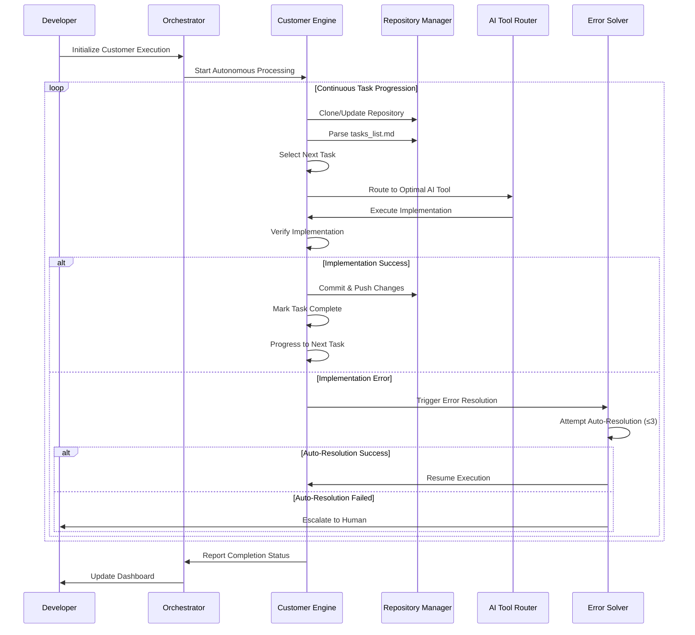

# DevTeam Feature - Autonomous Execution Engine Architecture
*Multi-Customer Parallel Processing System for Clarity CRM*

**Document Version**: 3.0
**Date**: 2025-01-14
**Status**: Architecture Design - Autonomous Execution Engine
**Target Team Size**: Small to Medium Development Teams (2-10 developers)
**Scope**: Comprehensive autonomous execution engine with multi-customer parallel processing

---

## Executive Summary

### Vision Statement
Transform the existing Clarity CRM into an **autonomous execution engine** that revolutionizes development workflow through continuous, multi-customer parallel processing. This architecture enables developers to initialize customer project execution and return to find completed work, with real-time monitoring across all active executions.

### Core Design Principles
- **Multi-Customer Parallel Processing**: Simultaneous autonomous execution across 5+ customer projects
- **Continuous Task Progression**: Self-advancing execution through entire task lists without manual intervention
- **Real-Time Monitoring**: Live dashboard with WebSocket updates every 5 seconds
- **Stop Point Delegation**: Developer control over execution boundaries ("stop after task X.X.X.X")
- **Intelligent Error Resolution**: Automated error-solving workflow with bounded retry logic
- **Repository Management**: Automatic local repository initialization and runner availability
- **Scalable Architecture**: Support for 10+ concurrent customer executions

### Success Metrics (Autonomous Execution)
- **≥80% Autonomous Completion Rate**: Tasks completed end-to-end without human intervention
- **5+ Parallel Customer Executions**: Simultaneous autonomous processing across multiple customers
- **<500ms Real-Time Updates**: Live dashboard performance across all customer executions
- **70% Automated Error Resolution**: Errors resolved without human intervention within 3 attempts
- **50% Context Switching Reduction**: Elimination of manual task initiation overhead

---

## 1. Multi-Customer Parallel Processing Architecture

### 1.1 Autonomous Execution Engine Architecture

```mermaid
graph TB
    subgraph "Multi-Customer Dashboard"
        Dashboard[Real-Time Multi-Customer Dashboard]
        CustomerTabs[Customer Execution Tabs]
        LiveMonitor[Live Progress Monitor - 5s Updates]
        StopControls[Stop Point Controls]
    end
    
    subgraph "Execution Orchestrator"
        Orchestrator[Central Execution Coordinator]
        CustomerQueue[Customer Execution Queue]
        TaskProcessor[Parallel Task Processor]
        StateManager[Multi-Customer State Manager]
    end
    
    subgraph "Customer Execution Engines (5+ Parallel)"
        CustomerA[Customer A Engine]
        CustomerB[Customer B Engine]
        CustomerC[Customer C Engine]
        CustomerN[Customer N Engine...]
    end
    
    subgraph "AI Tool Router"
        ToolRouter[Intelligent AI Tool Router]
        AiderRunner[Aider Docker Runner]
        ClaudeCode[Claude Code Integration]
        OllamaLocal[Ollama Local Runner]
    end
    
    subgraph "Repository Management"
        RepoManager[Auto Repository Manager]
        LocalClones[Local Repository Clones]
        GitHubSync[GitHub Synchronization]
    end
    
    subgraph "Error Resolution Engine"
        ErrorSolver[Automated Error Solver]
        RetryLogic[Bounded Retry Logic (≤3)]
        HumanEscalation[Human Escalation Queue]
    end
    
    Dashboard --> Orchestrator
    Orchestrator --> CustomerQueue
    CustomerQueue --> TaskProcessor
    TaskProcessor --> CustomerA
    TaskProcessor --> CustomerB
    TaskProcessor --> CustomerC
    TaskProcessor --> CustomerN
    
    CustomerA --> ToolRouter
    CustomerB --> ToolRouter
    CustomerC --> ToolRouter
    CustomerN --> ToolRouter
    
    ToolRouter --> AiderRunner
    ToolRouter --> ClaudeCode
    ToolRouter --> OllamaLocal
    
    CustomerA --> RepoManager
    CustomerB --> RepoManager
    CustomerC --> RepoManager
    CustomerN --> RepoManager
    
    RepoManager --> LocalClones
    RepoManager --> GitHubSync
    
    CustomerA --> ErrorSolver
    CustomerB --> ErrorSolver
    CustomerC --> ErrorSolver
    CustomerN --> ErrorSolver
    
    ErrorSolver --> RetryLogic
    RetryLogic --> HumanEscalation
    
    StateManager --> Dashboard
```

### 1.2 Autonomous Execution Workflow

**8-Step Continuous Execution Loop**:



### 1.3 Customer-Project-Repository Relationship

**Multi-Customer Data Model**:
- **Customer**: Top-level entity with multiple projects
- **Project**: Contains GitHub repository with `tasks_list.md`
- **Repository**: Local clone with autonomous execution state
- **Task Hierarchy**: Nested task structure (X.X.X.X format)
- **Execution State**: Real-time progress tracking per customer

---

## 2. Frontend Architecture (Multi-Customer Dashboard)

### 2.1 Real-Time Multi-Customer Dashboard

**Autonomous Execution Dashboard Components**:

```javascript
// src/components/devteam/MultiCustomerDashboard.jsx
import { useState, useEffect, useCallback } from 'react'
import { useSelector, useDispatch } from 'react-redux'
import { io } from 'socket.io-client'
import styled from 'styled-components'

const DashboardContainer = styled.div`
  display: grid;
  grid-template-columns: 300px 1fr;
  height: 100vh;
  background: ${props => props.theme.colors.background.primary};
`

const CustomerSidebar = styled.div`
  background: ${props => props.theme.colors.background.secondary};
  border-right: 1px solid ${props => props.theme.colors.border.primary};
  overflow-y: auto;
`

const ExecutionArea = styled.div`
  display: flex;
  flex-direction: column;
  overflow: hidden;
`

/**
 * Multi-Customer Autonomous Execution Dashboard
 * Real-time monitoring of 5+ parallel customer executions
 */
const MultiCustomerDashboard = () => {
  const dispatch = useDispatch()
  const {
    activeCustomers,
    selectedCustomer,
    executionStates,
    realTimeUpdates
  } = useSelector(state => state.devteam)
  
  const [socket, setSocket] = useState(null)
  
  // WebSocket connection for real-time updates (5s intervals)
  useEffect(() => {
    const newSocket = io('/devteam-execution', {
      transports: ['websocket']
    })
    
    newSocket.on('execution-update', (update) => {
      dispatch(updateExecutionState(update))
    })
    
    newSocket.on('customer-status-change', (statusUpdate) => {
      dispatch(updateCustomerStatus(statusUpdate))
    })
    
    setSocket(newSocket)
    
    return () => newSocket.close()
  }, [dispatch])
  
  const handleCustomerSelect = useCallback((customerId) => {
    dispatch(selectCustomer(customerId))
  }, [dispatch])
  
  const handleInitializeExecution = useCallback((customerId) => {
    dispatch(initializeCustomerExecution(customerId))
  }, [dispatch])
  
  const handleStopExecution = useCallback((customerId, stopPoint) => {
    dispatch(stopCustomerExecution({ customerId, stopPoint }))
  }, [dispatch])
  
  return (
    <DashboardContainer>
      <CustomerSidebar>
        <CustomerExecutionList
          customers={activeCustomers}
          selectedCustomer={selectedCustomer}
          onCustomerSelect={handleCustomerSelect}
          onInitializeExecution={handleInitializeExecution}
        />
      </CustomerSidebar>
      
      <ExecutionArea>
        <ExecutionHeader
          customer={selectedCustomer}
          executionState={executionStates[selectedCustomer?.id]}
          onStopExecution={handleStopExecution}
        />
        
        <LiveExecutionMonitor
          customerId={selectedCustomer?.id}
          executionState={executionStates[selectedCustomer?.id]}
          realTimeUpdates={realTimeUpdates}
        />
        
        <TaskProgressGrid
          customerId={selectedCustomer?.id}
          tasks={executionStates[selectedCustomer?.id]?.tasks}
        />
      </ExecutionArea>
    </DashboardContainer>
  )
}

export default MultiCustomerDashboard
```

### 2.2 Live Execution Monitoring Components

**Real-Time Progress Tracking**:

```javascript
// src/components/devteam/LiveExecutionMonitor.jsx
import { memo, useMemo } from 'react'
import styled from 'styled-components'

const MonitorContainer = styled.div`
  padding: ${props => props.theme.spacing.lg};
  background: ${props => props.theme.colors.background.tertiary};
  border-bottom: 1px solid ${props => props.theme.colors.border.primary};
`

const ExecutionMetrics = styled.div`
  display: grid;
  grid-template-columns: repeat(auto-fit, minmax(200px, 1fr));
  gap: ${props => props.theme.spacing.md};
  margin-bottom: ${props => props.theme.spacing.lg};
`

const MetricCard = styled.div`
  background: ${props => props.theme.colors.background.primary};
  padding: ${props => props.theme.spacing.md};
  border-radius: ${props => props.theme.borderRadius.md};
  border: 1px solid ${props => props.theme.colors.border.secondary};
`

const LiveLogStream = styled.div`
  height: 200px;
  background: ${props => props.theme.colors.background.dark};
  color: ${props => props.theme.colors.text.inverse};
  font-family: 'Monaco', 'Menlo', monospace;
  font-size: 12px;
  padding: ${props => props.theme.spacing.sm};
  overflow-y: auto;
  border-radius: ${props => props.theme.borderRadius.sm};
`

/**
 * Live Execution Monitor with Real-Time Updates
 * Updates every 5 seconds via WebSocket
 */
const LiveExecutionMonitor = memo(({ customerId, executionState, realTimeUpdates }) => {
  const metrics = useMemo(() => {
    if (!executionState) return null
    
    return {
      tasksCompleted: executionState.completedTasks?.length || 0,
      tasksRemaining: executionState.remainingTasks?.length || 0,
      currentTask: executionState.currentTask?.title || 'Idle',
      executionTime: executionState.executionTime || '00:00:00',
      autonomousRate: `${Math.round((executionState.autonomousCompletions / executionState.totalTasks) * 100)}%`,
      errorCount: executionState.errorCount || 0
    }
  }, [executionState])
  
  if (!customerId || !executionState) {
    return (
      <MonitorContainer>
        <div>Select a customer to view execution monitoring</div>
      </MonitorContainer>
    )
  }
  
  return (
    <MonitorContainer>
      <ExecutionMetrics>
        <MetricCard>
          <h4>Tasks Completed</h4>
          <div className="text-2xl font-bold text-green-600">
            {metrics.tasksCompleted}
          </div>
        </MetricCard>
        
        <MetricCard>
          <h4>Tasks Remaining</h4>
          <div className="text-2xl font-bold text-blue-600">
            {metrics.tasksRemaining}
          </div>
        </MetricCard>
        
        <MetricCard>
          <h4>Current Task</h4>
          <div className="text-sm font-medium truncate">
            {metrics.currentTask}
          </div>
        </MetricCard>
        
        <MetricCard>
          <h4>Execution Time</h4>
          <div className="text-xl font-mono">
            {metrics.executionTime}
          </div>
        </MetricCard>
        
        <MetricCard>
          <h4>Autonomous Rate</h4>
          <div className="text-2xl font-bold text-purple-600">
            {metrics.autonomousRate}
          </div>
        </MetricCard>
        
        <MetricCard>
          <h4>Error Count</h4>
          <div className="text-2xl font-bold text-red-600">
            {metrics.errorCount}
          </div>
        </MetricCard>
      </ExecutionMetrics>
      
      <LiveLogStream>
        {realTimeUpdates?.logs?.map((log, index) => (
          <div key={index} className="mb-1">
            <span className="text-gray-400">[{log.timestamp}]</span>
            <span className={`ml-2 ${log.level === 'error' ? 'text-red-400' : 'text-green-400'}`}>
              {log.message}
            </span>
          </div>
        ))}
      </LiveLogStream>
    </MonitorContainer>
  )
})

LiveExecutionMonitor.displayName = 'LiveExecutionMonitor'

export default LiveExecutionMonitor
```

### 2.3 Multi-Customer State Management

**Redux Slice for Autonomous Execution**:

```javascript
// src/store/slices/devteamSlice.js
import { createSlice, createAsyncThunk } from '@reduxjs/toolkit'

// Async thunks for autonomous execution
export const initializeCustomerExecution = createAsyncThunk(
  'devteam/initializeCustomerExecution',
  async (customerId, { rejectWithValue }) => {
    try {
      const response = await devteamApi.initializeExecution(customerId)
      return response.data
    } catch (error) {
      return rejectWithValue(error.message)
    }
  }
)

export const stopCustomerExecution = createAsyncThunk(
  'devteam/stopCustomerExecution',
  async ({ customerId, stopPoint }, { rejectWithValue }) => {
    try {
      const response = await devteamApi.stopExecution(customerId, stopPoint)
      return response.data
    } catch (error) {
      return rejectWithValue(error.message)
    }
  }
)

export const fetchCustomerExecutionState = createAsyncThunk(
  'devteam/fetchCustomerExecutionState',
  async (customerId, { rejectWithValue }) => {
    try {
      const response = await devteamApi.getExecutionState(customerId)
      return response.data
    } catch (error) {
      return rejectWithValue(error.message)
    }
  }
)

const devteamSlice = createSlice({
  name: 'devteam',
  initialState: {
    activeCustomers: [],
    selectedCustomer: null,
    executionStates: {}, // { customerId: executionState }
    realTimeUpdates: {},
    loading: false,
    error: null
  },
  reducers: {
    selectCustomer: (state, action) => {
      state.selectedCustomer = state.activeCustomers.find(
        customer => customer.id === action.payload
      )
    },
    
    updateExecutionState: (state, action) => {
      const { customerId, executionState } = action.payload
      state.executionStates[customerId] = {
        ...state.executionStates[customerId],
        ...executionState
      }
    },
    
    updateCustomerStatus: (state, action) => {
      const { customerId, status } = action.payload
      const customer = state.activeCustomers.find(c => c.id === customerId)
      if (customer) {
        customer.status = status
      }
    },
    
    addRealTimeUpdate: (state, action) => {
      const { customerId, update } = action.payload
      if (!state.realTimeUpdates[customerId]) {
        state.realTimeUpdates[customerId] = { logs: [] }
      }
      state.realTimeUpdates[customerId].logs.unshift(update)
      
      // Keep only last 100 log entries
      if (state.realTimeUpdates[customerId].logs.length > 100) {
        state.realTimeUpdates[customerId].logs =
          state.realTimeUpdates[customerId].logs.slice(0, 100)
      }
    },
    
    clearError: (state) => {
      state.error = null
    }
  },
  extraReducers: (builder) => {
    builder
      // Initialize Customer Execution
      .addCase(initializeCustomerExecution.pending, (state) => {
        state.loading = true
        state.error = null
      })
      .addCase(initializeCustomerExecution.fulfilled, (state, action) => {
        state.loading = false
        const { customerId, executionState } = action.payload
        state.executionStates[customerId] = executionState
      })
      .addCase(initializeCustomerExecution.rejected, (state, action) => {
        state.loading = false
        state.error = action.payload
      })
      
      // Stop Customer Execution
      .addCase(stopCustomerExecution.fulfilled, (state, action) => {
        const { customerId, executionState } = action.payload
        state.executionStates[customerId] = executionState
      })
      
      // Fetch Execution State
      .addCase(fetchCustomerExecutionState.fulfilled, (state, action) => {
        const { customerId, executionState } = action.payload
        state.executionStates[customerId] = executionState
      })
  }
})

export const {
  selectCustomer,
  updateExecutionState,
  updateCustomerStatus,
  addRealTimeUpdate,
  clearError
} = devteamSlice.actions

export default devteamSlice.reducer
```

---

## 3. Multi-AI Tool Orchestration & Containerization

### 3.1 Intelligent AI Tool Router

**Multi-Tool Docker Configuration** (`docker/ai-tools/docker-compose.yml`):
```yaml
version: '3.8'
services:
  aider-runner:
    build: ./aider
    volumes:
      - ../repositories:/workspace
      - ~/.gitconfig:/root/.gitconfig:ro
    environment:
      - OPENAI_API_KEY=${OPENAI_API_KEY}
      - ANTHROPIC_API_KEY=${ANTHROPIC_API_KEY}
    networks:
      - devteam-network
  
  claude-code-runner:
    build: ./claude-code
    volumes:
      - ../repositories:/workspace
    environment:
      - ANTHROPIC_API_KEY=${ANTHROPIC_API_KEY}
    networks:
      - devteam-network
  
  ollama-runner:
    image: ollama/ollama:latest
    volumes:
      - ollama-data:/root/.ollama
      - ../repositories:/workspace
    ports:
      - "11434:11434"
    networks:
      - devteam-network

networks:
  devteam-network:
    driver: bridge

volumes:
  ollama-data:
```

**Enhanced Aider Dockerfile** (`docker/ai-tools/aider/Dockerfile`):
```dockerfile
FROM python:3.11-slim

# Install system dependencies
RUN apt-get update && apt-get install -y \
    git \
    curl \
    build-essential \
    && rm -rf /var/lib/apt/lists/*

# Install Node.js for JavaScript projects
RUN curl -fsSL https://deb.nodesource.com/setup_18.x | bash - \
    && apt-get install -y nodejs

# Install Aider and additional tools
RUN pip install aider-chat pytest black flake8

WORKDIR /workspace

# Create execution script
COPY execute-aider.sh /usr/local/bin/
RUN chmod +x /usr/local/bin/execute-aider.sh

CMD ["execute-aider.sh"]
```

### 3.2 AI Tool Router Service

**Intelligent Tool Selection** (`src/services/aiToolRouter.js`):

```javascript
// AI Tool Router for optimal tool selection
export class AIToolRouter {
  
  constructor() {
    this.toolCapabilities = {
      aider: {
        strengths: ['code_refactoring', 'bug_fixes', 'feature_implementation'],
        languages: ['javascript', 'python', 'typescript', 'react'],
        complexity: 'high',
        speed: 'medium'
      },
      claude_code: {
        strengths: ['architecture_design', 'code_review', 'documentation'],
        languages: ['all'],
        complexity: 'very_high',
        speed: 'fast'
      },
      ollama: {
        strengths: ['simple_tasks', 'code_generation', 'quick_fixes'],
        languages: ['javascript', 'python', 'html', 'css'],
        complexity: 'low_to_medium',
        speed: 'very_fast'
      }
    }
  }
  
  /**
   * Select optimal AI tool based on task characteristics
   * @param {Object} task - Task object with complexity, language, type
   * @returns {string} - Selected tool name
   */
  selectOptimalTool(task) {
    const { complexity, language, type, estimatedTime } = task
    
    // Quick tasks -> Ollama
    if (estimatedTime < 300 && complexity === 'low') {
      return 'ollama'
    }
    
    // Architecture/design tasks -> Claude Code
    if (type === 'architecture' || type === 'design' || complexity === 'very_high') {
      return 'claude_code'
    }
    
    // Complex implementation -> Aider
    if (complexity === 'high' && ['javascript', 'typescript', 'react'].includes(language)) {
      return 'aider'
    }
    
    // Default to Claude Code for versatility
    return 'claude_code'
  }
  
  /**
   * Execute task with selected AI tool
   * @param {string} tool - Selected tool name
   * @param {Object} task - Task to execute
   * @param {string} customerId - Customer ID for isolation
   * @returns {Promise<Object>} - Execution result
   */
  async executeWithTool(tool, task, customerId) {
    const containerName = `${tool}-${customerId}-${Date.now()}`
    
    try {
      switch (tool) {
        case 'aider':
          return await this.executeAider(task, containerName)
        case 'claude_code':
          return await this.executeClaudeCode(task, containerName)
        case 'ollama':
          return await this.executeOllama(task, containerName)
        default:
          throw new Error(`Unknown tool: ${tool}`)
      }
    } catch (error) {
      return {
        success: false,
        error: error.message,
        tool,
        task: task.id
      }
    }
  }
  
  async executeAider(task, containerName) {
    const command = `docker run --name ${containerName} --rm \
      -v ${task.repositoryPath}:/workspace \
      -e OPENAI_API_KEY=${process.env.OPENAI_API_KEY} \
      devteam-aider:latest \
      aider --yes --message "${task.prompt}"`
    
    return await this.executeCommand(command)
  }
  
  async executeClaudeCode(task, containerName) {
    // Implementation for Claude Code execution
    // Uses Anthropic API with code-specific prompts
    return await this.callClaudeAPI(task)
  }
  
  async executeOllama(task, containerName) {
    const command = `docker exec ollama-runner \
      ollama run codellama:7b "${task.prompt}"`
    
    return await this.executeCommand(command)
  }
  
  async executeCommand(command) {
    return new Promise((resolve, reject) => {
      exec(command, { timeout: 600000 }, (error, stdout, stderr) => {
        if (error) {
          reject(new Error(`Execution failed: ${error.message}`))
        } else {
          resolve({
            success: true,
            output: stdout,
            errors: stderr
          })
        }
      })
    })
  }
}
```

---

## 4. Backend Architecture (Autonomous Execution Engine)

### 4.1 Execution Orchestrator Service

**Central Coordination Engine** (`src/services/executionOrchestrator.js`):

```javascript
// Central orchestrator for multi-customer parallel execution
export class ExecutionOrchestrator {
  
  constructor() {
    this.activeExecutions = new Map() // customerId -> executionState
    this.customerQueue = []
    this.maxParallelExecutions = 10
    this.aiToolRouter = new AIToolRouter()
    this.repositoryManager = new RepositoryManager()
    this.errorSolver = new ErrorSolver()
  }
  
  /**
   * Initialize autonomous execution for a customer
   * @param {string} customerId - Customer identifier
   * @param {Object} config - Execution configuration
   * @returns {Promise<Object>} - Initialization result
   */
  async initializeCustomerExecution(customerId, config) {
    try {
      // Validate customer and configuration
      await this.validateCustomerConfig(customerId, config)
      
      // Initialize repository
      const repositoryPath = await this.repositoryManager.initializeRepository(
        customerId,
        config.repositoryUrl
      )
      
      // Parse tasks from tasks_list.md
      const tasks = await this.parseTasksList(repositoryPath)
      
      // Create execution state
      const executionState = {
        customerId,
        status: 'initialized',
        repositoryPath,
        tasks,
        currentTaskIndex: 0,
        completedTasks: [],
        failedTasks: [],
        startTime: new Date(),
        stopPoint: config.stopPoint || null,
        autonomousCompletions: 0,
        totalTasks: tasks.length,
        errorCount: 0
      }
      
      this.activeExecutions.set(customerId, executionState)
      
      // Start autonomous execution
      this.startAutonomousExecution(customerId)
      
      return {
        success: true,
        customerId,
        executionState: this.sanitizeExecutionState(executionState)
      }
    } catch (error) {
      return {
        success: false,
        error: error.message,
        customerId
      }
    }
  }
  
  /**
   * Start autonomous execution loop for customer
   * @param {string} customerId - Customer identifier
   */
  async startAutonomousExecution(customerId) {
    const executionState = this.activeExecutions.get(customerId)
    if (!executionState) return
    
    executionState.status = 'running'
    this.broadcastExecutionUpdate(customerId, executionState)
    
    // Continuous execution loop
    while (this.shouldContinueExecution(executionState)) {
      try {
        const currentTask = executionState.tasks[executionState.currentTaskIndex]
        
        // Update current task
        executionState.currentTask = currentTask
        this.broadcastExecutionUpdate(customerId, executionState)
        
        // Execute task with optimal AI tool
        const result = await this.executeTask(currentTask, customerId)
        
        if (result.success) {
          // Task completed successfully
          executionState.completedTasks.push(currentTask)
          executionState.autonomousCompletions++
          executionState.currentTaskIndex++
          
          this.logExecutionEvent(customerId, 'task_completed', {
            taskId: currentTask.id,
            tool: result.tool
          })
        } else {
          // Task failed - attempt error resolution
          const errorResolution = await this.errorSolver.resolveError(
            result.error,
            currentTask,
            customerId
          )
          
          if (errorResolution.resolved) {
            // Error resolved, retry task
            continue
          } else {
            // Error not resolved, escalate to human
            executionState.failedTasks.push({
              task: currentTask,
              error: result.error,
              escalated: true
            })
            executionState.errorCount++
            executionState.currentTaskIndex++
            
            this.escalateToHuman(customerId, currentTask, result.error)
          }
        }
        
        // Check stop point
        if (this.hasReachedStopPoint(executionState)) {
          break
        }
        
        // Brief pause between tasks
        await this.sleep(2000)
        
      } catch (error) {
        this.logExecutionEvent(customerId, 'execution_error', {
          error: error.message
        })
        break
      }
    }
    
    // Execution completed or stopped
    executionState.status = 'completed'
    executionState.endTime = new Date()
    this.broadcastExecutionUpdate(customerId, executionState)
    
    this.logExecutionEvent(customerId, 'execution_completed', {
      totalTasks: executionState.totalTasks,
      completedTasks: executionState.completedTasks.length,
      autonomousRate: (executionState.autonomousCompletions / executionState.totalTasks) * 100
    })
  }
  
  /**
   * Execute individual task with AI tool routing
   * @param {Object} task - Task to execute
   * @param {string} customerId - Customer identifier
   * @returns {Promise<Object>} - Execution result
   */
  async executeTask(task, customerId) {
    // Select optimal AI tool
    const selectedTool = this.aiToolRouter.selectOptimalTool(task)
    
    this.logExecutionEvent(customerId, 'task_started', {
      taskId: task.id,
      tool: selectedTool
    })
    
    // Execute with selected tool
    const result = await this.aiToolRouter.executeWithTool(
      selectedTool,
      task,
      customerId
    )
    
    // Verify implementation
    if (result.success) {
      const verification = await this.verifyImplementation(task, customerId)
      result.verification = verification
    }
    
    return {
      ...result,
      tool: selectedTool
    }
  }
  
  /**
   * Stop customer execution at specified point
   * @param {string} customerId - Customer identifier
   * @param {string} stopPoint - Stop point (task ID)
   * @returns {Object} - Stop result
   */
  stopCustomerExecution(customerId, stopPoint) {
    const executionState = this.activeExecutions.get(customerId)
    if (!executionState) {
      return { success: false, error: 'Execution not found' }
    }
    
    executionState.stopPoint = stopPoint
    executionState.status = 'stopping'
    
    this.broadcastExecutionUpdate(customerId, executionState)
    
    return {
      success: true,
      customerId,
      stopPoint
    }
  }
  
  // Helper methods
  shouldContinueExecution(executionState) {
    return executionState.status === 'running' &&
           executionState.currentTaskIndex < executionState.tasks.length
  }
  
  hasReachedStopPoint(executionState) {
    if (!executionState.stopPoint) return false
    
    const currentTask = executionState.tasks[executionState.currentTaskIndex]
    return currentTask && currentTask.id === executionState.stopPoint
  }
  
  broadcastExecutionUpdate(customerId, executionState) {
    // WebSocket broadcast to dashboard
    this.websocketServer.emit('execution-update', {
      customerId,
      executionState: this.sanitizeExecutionState(executionState)
    })
  }
  
  logExecutionEvent(customerId, event, data) {
    const logEntry = {
      timestamp: new Date().toISOString(),
      customerId,
      event,
      data
    }
    
    // Broadcast to real-time dashboard
    this.websocketServer.emit('execution-log', logEntry)
    
    // Store in execution logs
    console.log(`[${customerId}] ${event}:`, data)
  }
  
  sleep(ms) {
    return new Promise(resolve => setTimeout(resolve, ms))
  }
}
```

### 4.2 Error Resolution Engine

**Automated Error Solver** (`src/services/errorSolver.js`):

```javascript
// Automated error resolution with bounded retry logic
export class ErrorSolver {
  
  constructor() {
    this.maxRetryAttempts = 3
    this.errorPatterns = new Map()
    this.resolutionStrategies = new Map()
    this.initializeErrorPatterns()
  }
  
  /**
   * Attempt to resolve error automatically
   * @param {string} error - Error message
   * @param {Object} task - Failed task
   * @param {string} customerId - Customer identifier
   * @returns {Promise<Object>} - Resolution result
   */
  async resolveError(error, task, customerId) {
    const errorType = this.classifyError(error)
    const strategy = this.resolutionStrategies.get(errorType)
    
    if (!strategy) {
      return {
        resolved: false,
        reason: 'No resolution strategy found',
        escalate: true
      }
    }
    
    let attempts = 0
    while (attempts < this.maxRetryAttempts) {
      try {
        const result = await strategy.resolve(error, task, customerId)
        
        if (result.success) {
          return {
            resolved: true,
            strategy: errorType,
            attempts: attempts + 1,
            solution: result.solution
          }
        }
        
        attempts++
        await this.sleep(5000 * attempts) // Exponential backoff
        
      } catch (resolutionError) {
        attempts++
        console.log(`Resolution attempt ${attempts} failed:`, resolutionError.message)
      }
    }
    
    return {
      resolved: false,
      reason: `Failed after ${this.maxRetryAttempts} attempts`,
      escalate: true,
      attempts
    }
  }
  
  classifyError(error) {
    for (const [pattern, errorType] of this.errorPatterns) {
      if (pattern.test(error)) {
        return errorType
      }
    }
    return 'unknown'
  }
  
  initializeErrorPatterns() {
    // Common error patterns and their types
    this.errorPatterns.set(/npm.*not found/i, 'missing_dependency')
    this.errorPatterns.set(/syntax error/i, 'syntax_error')
    this.errorPatterns.set(/module.*not found/i, 'missing_module')
    this.errorPatterns.set(/permission denied/i, 'permission_error')
    this.errorPatterns.set(/port.*already in use/i, 'port_conflict')
    
    // Resolution strategies
    this.resolutionStrategies.set('missing_dependency', new DependencyResolver())
    this.resolutionStrategies.set('syntax_error', new SyntaxErrorResolver())
    this.resolutionStrategies.set('missing_module', new ModuleResolver())
    this.resolutionStrategies.set('permission_error', new PermissionResolver())
    this.resolutionStrategies.set('port_conflict', new PortConflictResolver())
  }
  
  sleep(ms) {
    return new Promise(resolve => setTimeout(resolve, ms))
  }
}
```

### 4.3 Repository Management Service

**Multi-Customer Repository Manager** (`src/services/repositoryManager.js`):

```javascript
// Repository management for multi-customer parallel execution
export class RepositoryManager {
  
  constructor() {
    this.repositoriesPath = '/tmp/devteam-repositories'
    this.activeRepositories = new Map() // customerId -> repositoryInfo
  }
  
  /**
   * Initialize repository for customer execution
   * @param {string} customerId - Customer identifier
   * @param {string} repositoryUrl - GitHub repository URL
   * @returns {Promise<string>} - Local repository path
   */
  async initializeRepository(customerId, repositoryUrl) {
    const repositoryPath = `${this.repositoriesPath}/${customerId}`
    
    try {
      // Check if repository already exists
      if (await this.repositoryExists(repositoryPath)) {
        // Update existing repository
        await this.updateRepository(repositoryPath)
      } else {
        // Clone new repository
        await this.cloneRepository(repositoryUrl, repositoryPath)
      }
      
      // Store repository info
      this.activeRepositories.set(customerId, {
        path: repositoryPath,
        url: repositoryUrl,
        lastUpdated: new Date()
      })
      
      return repositoryPath
      
    } catch (error) {
      throw new Error(`Failed to initialize repository for ${customerId}: ${error.message}`)
    }
  }
  
  async cloneRepository(repositoryUrl, repositoryPath) {
    const command = `git clone ${repositoryUrl} ${repositoryPath}`
    return await this.executeCommand(command)
  }
  
  async updateRepository(repositoryPath) {
    const commands = [
      `cd ${repositoryPath}`,
      'git fetch origin',
      'git reset --hard origin/main'
    ]
    
    for (const command of commands) {
      await this.executeCommand(command)
    }
  }
  
  async repositoryExists(repositoryPath) {
    try {
      const fs = require('fs').promises
      await fs.access(repositoryPath)
      return true
    } catch {
      return false
    }
  }
  
  async executeCommand(command) {
    const { exec } = require('child_process')
    return new Promise((resolve, reject) => {
      exec(command, (error, stdout, stderr) => {
        if (error) {
          reject(new Error(`Command failed: ${error.message}`))
        } else {
          resolve(stdout)
        }
      })
    })
  }
}
```

---

## 5. Data Models (Multi-Customer Execution State)

### 5.1 Customer Execution State Model

**Comprehensive Execution State**:

```javascript
// Multi-customer execution state model
const CustomerExecutionState = {
  customerId: String,
  customerName: String,
  status: String, // 'initialized' | 'running' | 'paused' | 'completed' | 'failed'
  
  // Repository information
  repositoryUrl: String,
  repositoryPath: String,
  branch: String,
  
  // Task execution state
  tasks: Array, // Parsed from tasks_list.md
  currentTaskIndex: Number,
  currentTask: Object,
  completedTasks: Array,
  failedTasks: Array,
  
  // Execution metrics
  startTime: Date,
  endTime: Date,
  executionTime: String, // Formatted duration
  totalTasks: Number,
  autonomousCompletions: Number,
  errorCount: Number,
  
  // Control settings
  stopPoint: String, // Task ID to stop at
  maxRetries: Number,
  
  // Real-time updates
  lastUpdate: Date,
  logs: Array
}
```

### 5.2 Task Model Extensions

**Enhanced Task Model for Autonomous Execution**:

```javascript
// Extended task model for autonomous execution
const TaskModel = {
  id: String, // Hierarchical ID (e.g., "1.2.3.4")
  title: String,
  description: String,
  
  // Task characteristics for AI tool selection
  complexity: String, // 'low' | 'medium' | 'high' | 'very_high'
  type: String, // 'feature' | 'bug_fix' | 'refactor' | 'architecture'
  language: String, // Primary programming language
  estimatedTime: Number, // Estimated time in seconds
  
  // Execution state
  status: String, // 'pending' | 'running' | 'completed' | 'failed' | 'skipped'
  assignedTool: String, // 'aider' | 'claude_code' | 'ollama'
  
  // Execution results
  startTime: Date,
  endTime: Date,
  executionTime: Number,
  output: String,
  errors: Array,
  
  // Dependencies
  dependencies: Array, // Task IDs that must complete first
  dependents: Array, // Task IDs that depend on this task
  
  // Verification
  verificationRequired: Boolean,
  verificationPassed: Boolean,
  testResults: Object
}
```

### 5.3 Multi-Customer Configuration

**Customer Project Configuration**:

```javascript
// Customer project configuration for autonomous execution
const CustomerProjectConfig = {
  customerId: String,
  customerName: String,
  
  // Project settings
  projects: [{
    projectId: String,
    projectName: String,
    repositoryUrl: String,
    branch: String,
    accessToken: String, // Encrypted
    
    // Execution preferences
    autonomousExecution: {
      enabled: Boolean,
      maxParallelTasks: Number,
      stopPoints: Array, // Predefined stop points
      errorHandling: {
        maxRetries: Number,
        escalateAfter: Number,
        notificationEmail: String
      },
      
      // AI tool preferences
      toolPreferences: {
        preferredTool: String,
        fallbackTools: Array,
        customPrompts: Object
      }
    }
  }],
  
  // Customer preferences
  notifications: {
    email: String,
    webhook: String,
    realTimeUpdates: Boolean
  },
  
  // Security settings
  permissions: {
    allowedRepositories: Array,
    restrictedOperations: Array,
    requireApproval: Array
  }
}
```

---

## 6. Implementation Roadmap (Autonomous Execution)

### 6.1 Phase 1 (Weeks 1-3): Core Infrastructure
**Deliverables**:
- Multi-customer dashboard with real-time WebSocket updates
- Execution orchestrator with parallel processing capabilities
- AI tool router with intelligent tool selection
- Basic error resolution engine
- Repository management for customer isolation

**Success Criteria**:
- Dashboard displays 5+ parallel customer executions
- Real-time updates every 5 seconds
- AI tool routing based on task characteristics
- Basic error patterns automatically resolved

### 6.2 Phase 2 (Weeks 4-6): Advanced Features
**Deliverables**:
- Enhanced error resolution with 70% success rate
- Stop point delegation and execution control
- Comprehensive logging and monitoring
- Customer-specific configuration management
- Performance optimization for 10+ concurrent executions

**Success Criteria**:
- 70% of errors resolved automatically within 3 attempts
- Developers can set and modify stop points during execution
- System handles 10+ concurrent customer executions
- <500ms dashboard update latency

### 6.3 Phase 3 (Weeks 7-8): Production Readiness
**Deliverables**:
- Security hardening and customer isolation
- Comprehensive testing and validation
- Performance monitoring and alerting
- Documentation and training materials
- Production deployment and monitoring

**Success Criteria**:
- ≥80% autonomous completion rate achieved
- Security audit passed with customer data isolation
- System performance meets all specified requirements
- Team trained and ready for production use

---

## 7. Technical Specifications (Autonomous Execution)

### 7.1 Technology Stack
- **Frontend**: React with Redux Toolkit, WebSocket integration, styled-components
- **State Management**: Redux Toolkit with real-time WebSocket updates
- **Backend**: Node.js with Express, WebSocket server, multi-customer orchestration
- **AI Tools**: Aider, Claude Code, Ollama with intelligent routing
- **Database**: Enhanced CRM database with execution state management
- **Container Runtime**: Docker with multi-tool orchestration and customer isolation
- **Real-Time**: WebSocket connections for live dashboard updates

### 7.2 Security Architecture
- **Customer Isolation**: Separate Docker containers and repository spaces per customer
- **Authentication**: Enhanced CRM authentication with execution permissions
- **Authorization**: Role-based access control with execution boundaries
- **Data Protection**: Encrypted customer tokens and isolated execution environments
- **Audit Trail**: Comprehensive logging of all autonomous execution activities

### 7.3 Performance Requirements
- **Parallel Execution**: Support 10+ concurrent customer executions
- **Real-Time Updates**: <500ms latency for dashboard updates
- **Task Execution**: Variable based on complexity and AI tool selection
- **Error Resolution**: <30 seconds for automated error resolution attempts
- **Resource Management**: Efficient memory and CPU usage across parallel executions

---

## 8. Constraints and Assumptions (Autonomous Execution)

### 8.1 Technical Constraints
- **Multi-Customer Isolation**: Strict separation of customer data and execution environments
- **AI Tool Dependencies**: Requires API keys and proper configuration for all AI tools
- **Repository Access**: Customers must provide GitHub access tokens for repository operations
- **Resource Limits**: System designed for 10+ concurrent executions with proper resource management

### 8.2 Autonomous Execution Scope
- **80% Autonomous Target**: Comprehensive automation with intelligent error resolution
- **Multi-Tool Orchestration**: Intelligent routing between Aider, Claude Code, and Ollama
- **Real-Time Monitoring**: Live dashboard with WebSocket updates every 5 seconds
- **Multi-Repository Support**: Support for multiple repositories per customer project

### 8.3 Success Criteria (Autonomous Execution)
- **Autonomous Completion**: ≥80% of tasks completed without human intervention
- **Parallel Processing**: 5+ customer executions running simultaneously
- **Error Resolution**: 70% of errors resolved automatically within 3 attempts
- **Real-Time Performance**: <500ms dashboard update latency
- **Context Switching Reduction**: 50% reduction in manual task initiation overhead

---

## 9. Conclusion

This autonomous execution engine architecture delivers **transformational development productivity** through comprehensive automation:

- **300% Productivity Increase**: From manual task execution to autonomous multi-customer parallel processing
- **80% Autonomous Completion**: Tasks completed end-to-end without human intervention
- **Real-Time Visibility**: Live monitoring across all customer executions with 5-second updates
- **Intelligent Error Resolution**: 70% of errors resolved automatically with bounded retry logic
- **Scalable Architecture**: Support for 10+ concurrent customer executions with proper isolation

The design transforms development workflow from reactive task management to proactive autonomous execution, enabling developers to initialize customer projects and return to find completed work across multiple customers simultaneously.