# Clarity CRM Frontend - Project Charter
*Aligned with Overall Project Vision and Architecture*

**Document Owner:** Marcus / Clarity Development Team
**Status:** Draft v1.1
**Date:** 2025-01-13
**Audience:** Internal engineers (backend, frontend, infrastructure)
**Scope:** Comprehensive CRM frontend with internal productivity extensions

---

## 1) Executive Summary

### Project Vision
The Clarity CRM Frontend represents a sophisticated, enterprise-grade Customer Relationship Management platform designed to serve small to medium professional service businesses. The system provides a unified digital workspace that seamlessly integrates customer management, project tracking, financial operations, proposal generation, and marketing automation into a cohesive business management solution.

### Strategic Positioning
This platform positions itself as a bridge between legacy business systems and modern web technologies, offering unique multi-system integration capabilities that eliminate data silos while providing enterprise-grade functionality at SMB-accessible complexity levels.

### Core System Capabilities
The Clarity CRM Frontend serves as a comprehensive business management platform providing:
- **Customer Relationship Management**: Complete customer lifecycle with multi-currency support
- **Project and Task Tracking**: Hierarchical project management with timer integration
- **Financial Record Management**: QuickBooks integration with automated billing
- **Team Collaboration**: Multi-role access with sophisticated permissions
- **Proposal Generation**: Professional client-facing proposal system
- **Marketing Automation**: Bulk email campaigns with CSV import
- **Multi-Environment Support**: Seamless operation in FileMaker and web environments

### Internal Productivity Extension - Autonomous Task Execution Engine
Building upon the core CRM functionality, the system includes an **autonomous task execution engine** that transforms development workflow from manual, step-by-step execution to continuous, automated progression:

**Current Development Challenges:**
- Disconnected workflow between task management and execution
- Manual overhead in branch preparation, implementation, testing, and documentation
- Inconsistent validation approaches across different tasks
- Context switching between planning documents and development environment
- **Developer required to initiate each task individually**
- **No continuous progression through task lists**
- **Single-threaded execution preventing parallel customer work**

**Revolutionary Solution:**
An **autonomous execution engine** that operates continuously and independently:

### Core Autonomous Workflow
1. **Customer/Project Selection** — Developer selects customer/project and initializes task execution
2. **Repository Initialization** — System ensures repo is cloned locally and local runner is operational
3. **Autonomous Task Progression** — System automatically:
   - Selects first incomplete task from GitHub `tasks_list.md`
   - Executes complete code change workflow
   - Verifies success or initiates error-solving workflow
   - Updates `tasks_list.md` with completion status
   - **Automatically progresses to next task without developer intervention**
4. **Continuous Operation** — System persists through all tasks until:
   - All tasks completed, OR
   - Developer delegates stop after specific task (e.g., "stop after task 2.3.1.4"), OR
   - Unresolved error requiring human intervention

### Parallel Execution Architecture
- **Asynchronous Task Execution** — Multiple customers can have task executions running simultaneously
- **Multi-Customer Support** — System manages multiple project workflows concurrently
- **Progress Monitoring** — Developer can return to client tasks panel and see real-time progress across all active executions
- **Resource Management** — Intelligent scheduling prevents resource conflicts between parallel executions

### Success Vision
The system transforms development from manual task-by-task execution to **autonomous project completion**. Developers initiate execution and return to find completed work, with the system having autonomously progressed through entire task lists while maintaining quality and providing detailed execution logs.

**Success Metrics:**
- ≥80% autonomous task completion rate (tasks completed without human intervention)
- ≥50% reduction in developer context switching
- Multiple customer projects executing simultaneously
- 100% quality assurance through automated verification and error resolution

---

## 2) Business Objectives and Strategic Context

### Primary Business Objectives

#### 1. Unified Business Management Platform
**Objective**: Provide a single interface for all business operations across customer management, project tracking, financial operations, and marketing automation.

**Evidence from Implementation**:
- Component organization across 6 business domains (`src/components/`)
- Centralized API layer (`src/api/index.js`) with 15+ service integrations
- Redux store architecture managing global application state
- Multi-system integration (FileMaker, Supabase, QuickBooks)

#### 2. Real-Time Financial Intelligence
**Objective**: Enable real-time financial tracking and business intelligence with automated billing processes.

**Evidence from Implementation**:
- Advanced financial processing (`src/services/billableHoursService.js`) with multi-dimensional analytics
- QuickBooks integration with HMAC-SHA256 authentication
- Sophisticated chart data preparation supporting multiple visualization types
- Automated sales record generation and invoice creation

#### 3. Professional Client Experience
**Objective**: Deliver professional client-facing experiences through proposal systems and client portals.

**Evidence from Implementation**:
- Proposal system (`src/components/proposals/`) with token-based client access
- Professional email templates with PDF attachment support
- Client portal functionality with proposal access token generation

#### 4. Developer Productivity Enhancement
**Objective**: Automate repetitive development processes while maintaining quality and control.

**Current Challenges**:
- Disconnected workflow between task management and execution
- Manual overhead in branch preparation, implementation, testing, and documentation
- Inconsistent validation approaches across different tasks
- Context switching between planning documents and development environment

### Market Positioning

#### Competitive Advantages
1. **Multi-System Integration Mastery**: Seamless integration between FileMaker (legacy), Supabase (modern), and QuickBooks (financial)
2. **Professional Service Business Specialization**: Purpose-built for service businesses with billable hours tracking
3. **Hybrid Architecture Flexibility**: Bridges legacy and modern systems without forcing migration
4. **Enterprise Security with SMB Accessibility**: Enterprise-grade security without enterprise complexity

#### Target Market Segments
- **Primary Market**: Professional Service Businesses (10-100 employees)
- **Secondary Market**: Small Business Service Providers scaling from individual to team usage

---

## 3) Goals & Success Metrics

### Primary Goals

#### Business Management Goals
- **Operational Efficiency**: Streamline customer management and project workflows
- **Financial Integration**: Automate billing processes with QuickBooks Online integration
- **Multi-Environment Support**: Provide consistent functionality across FileMaker and web platforms
- **Data Integrity**: Maintain synchronized data across multiple systems
- **User Experience**: Deliver intuitive interfaces tailored to different user roles

#### Developer Productivity Goals
- **Autonomous Execution Rate**: ≥80% of atomic tasks completed end-to-end without human intervention
- **Continuous Progression**: System automatically advances through task lists without developer initiation
- **Parallel Processing**: Multiple customer projects executing simultaneously
- **Context Switching Reduction**: ≥50% reduction in developer context switching between tasks
- **Quality Assurance**: 100% of completed tasks pass automated verification and error resolution
- **Developer Focus**: Maximize time spent on high-value design, architecture, and problem-solving activities
- **Consistency**: Enforce consistent validation, documentation, and progression across all automated executions

### Success Metrics

#### Business Metrics
- **User Adoption**: Multi-role user engagement across administrator, manager, team member, and client personas
- **Data Accuracy**: Synchronized data integrity across FileMaker, Supabase, and QuickBooks systems
- **Process Automation**: Automated sales record generation and invoice creation
- **System Performance**: Sub-second response times with multi-layer caching
- **Security Compliance**: Enterprise-grade authentication and organization-based access control

#### Developer Productivity Metrics
- **Autonomous Execution Effectiveness**: ≥80% tasks completed without intervention, ≥95% success rate
- **Continuous Progression Rate**: System automatically advances through 100% of eligible task sequences
- **Parallel Processing Capacity**: Support for 5+ simultaneous customer project executions
- **Context Switching Reduction**: 50% reduction in developer task initiation overhead
- **Quality Assurance**: No increase in post-deployment defects, maintained test coverage through automated verification
- **System Performance**: 95th percentile < 5 seconds for task selection and progression operations
- **Developer Satisfaction**: 4.5/5 average rating for autonomous execution experience

### Non-Goals (MVP)
- Multi-tenant/multi-user orchestration (future enhancement)
- General-purpose "agent" that autonomously invents scope
- Full CI/CD platform replacement
- Cross-repo batch execution
- Complex CI/CD release automation

---

## 4) System Architecture

### 4.1 Frontend Architecture (React Application)

```mermaid
graph TB
    A[React Application] --> B[Redux Store]
    A --> C[Component Layer]
    A --> D[API Layer]
    A --> E[Service Layer]
    
    B --> B1[Customer Slice]
    B --> B2[Project Slice]
    B --> B3[Task Slice]
    B --> B4[Financial Slice]
    B --> B5[Auth Slice]
    B --> B6[UI Slice]
    B --> B7[Proposal Slice]
    B --> B8[DevTeam Slice]
    
    C --> C1[Pages]
    C --> C2[Domain Components]
    C --> C3[Common Components]
    C --> C4[Layout Components]
    
    D --> D1[Customer API]
    D --> D2[Project API]
    D --> D3[Task API]
    D --> D4[Financial API]
    D --> D5[Auth API]
    D --> D6[DevTeam API]
    
    E --> E1[Initialization Service]
    E --> E2[Theme Service]
    E --> E3[Validation Service]
    E --> E4[Task Automation Service]
```



### 4.2 Multi-System Integration Architecture

```mermaid
graph TB
    Frontend[React Frontend] --> Backend[Clarity Backend API]
    Frontend --> FileMaker[FileMaker Bridge]
    Frontend --> Supabase[Supabase Client]
    
    Backend --> FileMakerDB[(FileMaker Database)]
    Backend --> SupabaseDB[(Supabase Database)]
    Backend --> QuickBooks[QuickBooks Online API]
    Backend --> EmailService[Mailjet Email Service]
    
    DevTeam[DevTeam Automation] --> GitHub[GitHub Repository]
    DevTeam --> LocalRunner[Local Runner (Docker)]
    DevTeam --> AITools[AI Tools: Aider/Claude/Ollama]
    
    LocalRunner --> GitOps[Git Operations]
    LocalRunner --> BuildTest[Build & Test Environment]
    LocalRunner --> Artifacts[Artifacts & Documentation]
```

### 4.3 Key Components

#### Frontend Application (React)
- **Technology Stack**: React 18, Redux Toolkit, Styled-components, Vite
- **State Management**: Redux-first architecture with createAsyncThunk for all API operations
- **Component Organization**: Domain-driven structure with performance optimizations
- **Multi-Environment Support**: Automatic detection and routing for FileMaker vs web environments

#### Business Management Core
- **Customer Management**: Complete lifecycle with multi-currency support and QuickBooks integration
- **Project Tracking**: Hierarchical project management with timer integration and automated billing
- **Financial Operations**: Real-time financial intelligence with automated sales record generation
- **Proposal System**: Professional client-facing proposals with token-based access

#### Developer Productivity Extension
- **Task Orchestrator**: Deterministic state machine for automated task execution
- **Local Runner**: Dockerized FastAPI service for secure local development operations
- **AI Tool Integration**: Aider, Claude Code, and Ollama for automated code implementation
- **Quality Assurance**: Comprehensive testing and validation with programmable acceptance criteria

#### Integration Layer
- **FileMaker Integration**: Legacy system bridge with structured API access
- **Supabase Integration**: Modern database with real-time capabilities and authentication
- **QuickBooks Integration**: Financial system integration with OAuth and automated invoicing
- **GitHub Integration**: Repository management with automated PR creation and documentation updates

## 5) Stakeholder Analysis

### 5.1 Primary Stakeholders

#### Business Administrators
**Role**: `admin` - Full system access and configuration
**Responsibilities**:
- System configuration and maintenance
- User management and role assignment
- Complete data access across all domains
- Financial oversight and reporting
- Team structure management

**Key Workflows**:
- Complete customer lifecycle management
- Financial reporting and analysis
- Team performance oversight
- System configuration and user management

#### Project Managers
**Role**: `manager` - Team oversight and project management
**Responsibilities**:
- Project planning and oversight
- Team coordination and task assignment
- Financial reporting and client billing
- Customer relationship management
- Performance monitoring

**Key Workflows**:
- Project creation and management
- Team member task assignment
- Customer communication and proposals
- Financial activity monitoring
- Performance reporting

#### Team Members/Developers
**Role**: `team_member` or `staff` - Task execution and development
**Responsibilities**:
- Task completion and time tracking
- Project participation and updates
- Status reporting to managers
- Code development and implementation
- Automated task execution via DevTeam extension

**Key Workflows**:
- Task timer start/stop/pause functionality
- Task status updates and completion
- Project objective step completion
- Time record creation and adjustment
- **DevTeam Extension**: Automated task implementation with AI assistance

#### External Clients
**Role**: `client` - Limited access to project status and communications
**Responsibilities**:
- Project status monitoring
- Proposal review and approval
- Communication with project team
- Invoice and deliverable review

**Key Workflows**:
- Token-based proposal access and approval
- Project status and progress monitoring
- Communication with project team
- Deliverable review and acceptance

### 5.2 Secondary Stakeholders
- **Accountants/Bookkeepers**: QuickBooks integration users
- **Marketing Personnel**: Email campaign managers
- **IT Administrators**: System maintenance and integration management

## 6) Developer Productivity Workflow (DevTeam Extension)

### 6.1 Automated Task Execution State Machine

**States**: SELECT → PREP → IMPLEMENT → VERIFY → MERGE → PUSH → DONE
**Failure Transitions**: IMPLEMENT or VERIFY → ERROR_SOLVE (≤3 retries) → VERIFY or HUMAN_REVIEW

#### 6.1.1 Task Selection (SELECT)
- Parse `tasks_list.md` from configured GitHub repository
- Identify first incomplete atomic task (missing A/B/C criteria or not ✅)
- Ensure dependencies are satisfied (prerequisite tasks completed)
- Extract task ID, title, and acceptance criteria
- Inject missing criteria derived from PRD/ADD if necessary

#### 6.1.2 Environment Preparation (PREP)
- Ensure local repository exists (clone if necessary)
- Create task-specific branch: `task/<taskId>-<kebab-title>`
- Install dependencies and set environment variables
- Validate development environment readiness

#### 6.1.3 AI-Assisted Implementation (IMPLEMENT)
- Build focused context (relevant files only, avoid repo-wide context)
- **Tool Selection**:
  - **Aider**: Small, surgical edits; file-scoped; git-aware
  - **Claude Code**: Multi-file refactoring or exploratory edits
  - **Ollama**: Offline scaffolding, transforms, and test generation
- Execute generated prompts with task goals, criteria, and constraints
- Capture diffs, stdout/stderr, and implementation rationales

#### 6.1.4 Comprehensive Verification (VERIFY)
- Execute build processes, unit tests, and type checks
- Run programmable acceptance criteria checks:
  - Performance thresholds (p95 < 200ms for APIs)
  - Security validations (RLS policies, audit trails)
  - Documentation completeness
  - Code quality metrics
- Collate evidence artifacts into `artifacts/<taskId>/`
- Proceed if all criteria pass, otherwise trigger ERROR_SOLVE

#### 6.1.5 Bounded Error Resolution (ERROR_SOLVE)
- Feed failing criteria, logs, stack traces, and diffs to error-solving loop
- Apply minimal patch attempts with tool-generated fixes
- Re-run VERIFY after each patch attempt
- Escalate to HUMAN_REVIEW after maximum retry attempts (3)

#### 6.1.6 Integration and Documentation (MERGE, PUSH)
- Commit changes with standardized commit messages
- Open PR with template including task details and criteria evidence
- Update `tasks_list.md` (mark ✅, attach artifact links)
- Update `task_outcomes.md` with execution summary
- Push branch and notify stakeholders

⸻

## 6 UI/UX (Web App) - Autonomous Execution Dashboard

### 6.1 Multi-Customer Execution Dashboard
**Primary View**: Client Tasks Panel with real-time autonomous execution monitoring

**Layout**:
- **Left Panel**: Customer/Project Selection
  - List of all customers with active projects
  - GitHub repository status indicators
  - Local runner availability status
  - Quick project initialization controls

- **Center Panel**: Active Executions Overview
  - Real-time grid showing all running autonomous executions
  - Each execution shows: Customer, Project, Current Task, Progress, ETA
  - Parallel execution status with resource allocation indicators
  - Auto-refresh every 5 seconds for live progress updates

- **Right Panel**: Selected Execution Details
  - Hierarchical tasks_list.md (render Markdown → tree with 1.2.3.4 numbering)
  - Current task details (id, title, dependencies, criteria bullets, status)
  - Real-time execution log stream (WebSocket)
  - Artifact links and completion evidence

### 6.2 Autonomous Execution Controls
**Primary Actions**:
- **Initialize Customer Execution**: Select customer/project → start autonomous progression
- **Set Stop Point**: "Stop after task X.X.X.X" delegation control
- **Emergency Stop**: Halt autonomous execution (preserves current state)
- **Resume Execution**: Continue from last completed task

**Secondary Actions**:
- **Manual Override**: Take control of specific task
- **Error Resolution**: Review and resolve blocked executions
- **Execution History**: View completed autonomous runs

### 6.3 Real-Time Status System
**Execution Status Badges**:
- **🟢 AUTONOMOUS**: System actively progressing through tasks
- **🔵 INITIALIZING**: Setting up repository and local runner
- **🟡 TASK-EXECUTING**: Currently implementing specific task
- **🟠 ERROR-SOLVING**: Automated error resolution in progress
- **🔴 BLOCKED**: Requires human intervention
- **✅ COMPLETED**: All tasks finished successfully
- **⏸️ PAUSED**: Stopped at designated task

**Progress Indicators**:
- Task completion percentage per project
- Estimated time to completion
- Tasks completed vs. total tasks
- Success rate metrics per customer

### 6.4 Multi-Customer Monitoring
**Dashboard Features**:
- **Parallel Execution Grid**: Visual representation of all active customer executions
- **Resource Allocation**: Show CPU/memory usage across parallel executions
- **Execution Queue**: Pending customer projects awaiting available resources
- **Completion Notifications**: Real-time alerts when customer projects complete
- **Progress History**: Timeline of all autonomous executions with outcomes

⸻

## 7 Backend (Orchestrator) — Contracts & Endpoints

Internal model (examples):
type AcceptanceCriterion = {
  key: string;                  // e.g., "perf.p95.api"
  kind: 'perf'|'test'|'sec'|'doc'|'type'|'ops';
  target?: string;              // "p95<200ms", "coverage>90%", etc.
  check: 'cmd'|'regex'|'file'|'http';
  args?: string[];              // command, path, pattern
};

type TaskEvent = {
  id: string;                   // "2.1.3.1"
  title: string;
  deps: string[];
  criteria: AcceptanceCriterion[];
  repoUrl: string;
};

Local Runner API (FastAPI)
```pseudocode
POST /prep
  in: { repoUrl, taskId, idempotencyKey }
  out: { ok, branch?, logs? }

POST /implement
  in: { taskId, branch, tool: 'aider'|'claude'|'ollama', criteria, promptHints? }
  out: { ok, diff?, logs?, artifacts? }

POST /verify
  in: { taskId, branch, criteria }
  out: { ok, passed: string[], failed: {criterionKey, summary, location?}[], artifacts? }

POST /merge
  in: { branch }
  out: { ok, prUrl?, logs? }

POST /push
  in: { branch }
  out: { ok, logs? }

POST /error-solve
  in: { taskId, branch, failures, lastDiff? }
  out: { ok, patchApplied?: boolean, logs?, artifacts? }
```
Idempotency
	•	Every call includes idempotencyKey; server caches last completed result per key.

⸻

## 8) Tooling Integration

Aider (default)
	•	Use file-scoped chat: add only files to be edited + nearby context.
	•	Prompts emphasize minimal diffs, tests for criteria, and consistency.

Claude Code
	•	Use for broader refactors or new module scaffolds.
	•	Run in repo root; provide structured task prompt; capture summary + diffs.

Ollama
	•	Offline model runs for templated code/tests generation; short transforms.

Tool Routing Policy (initial)
	•	If task title contains:
	•	“refactor”, “create module”, “multi-file” → Claude Code
	•	“add test”, “update one file” → Aider
	•	“scaffold tests”, “generate boilerplate” (offline OK) → Ollama
	•	Allow manual override from UI (dropdown).

⸻

## 9) Programmable Acceptance Criteria (examples)
	•	perf.p95.api → run k6/pytest-benchmark; target: p95<200ms (quick endpoints).
	•	perf.p95.workflow → measure async path; target: p95<2s.
	•	test.coverage → run coverage; target: >90% for MVP scope.
	•	sec.rls → assert RLS policies for tables (lint/SQL check).
	•	sec.audit → run allowed security scan; target: no critical findings.
	•	type.strict → run mypy/pyright/tsc; target: 0 errors on touched modules.
	•	doc.updated → assert task_outcomes.md updated + links exist.
	•	ops.monitoring → presence of monitoring hooks/config updates if relevant.

Criteria are attached to each atomic task as <criterion …> bullets under the B Verify line in tasks_list.md. If missing, Orchestrator injects them based on task scope before execution.

⸻

## 10) Data & Repos

DB (Supabase)
	•	No schema change required for MVP (tracking remains in Git).
	•	Optional new tables later for run history:
	•	task_runs(id, task_id, started_at, finished_at, state, branch, pr_url, artifacts_path, error_summary)

Git/GitHub Policy
	•	Branch: task/<taskId>-<kebab-title>
	•	Commit: Task <id>: <title>
	•	PR title: same; PR template links to artifacts and task criteria.
	•	Actions: run unit tests, lints, type checks; block merge on red.

⸻

## 11) Security, Privacy, Safety
	•	Local-only execution in Docker; command allowlist; no shell wildcards; bounded resources.
	•	Redact secrets from logs; mount only project repo volume.
	•	Tool prompts never request credentials or external network unless allowed.
	•	Human gate on risky categories (migrations, prod secrets, destructive ops).
	•	Log every node step with timestamps and checksums.

⸻

## 12) Observability & Artifacts
	•	Structured logs per state and per tool execution.
	•	Artifacts folder: artifacts/<taskId>/ including diffs, test reports, perf runs, screenshots (if any).
	•	task_outcomes.md appends a compact run summary with links.

⸻

## 13) Acceptance Criteria (for the Autonomous Execution Feature)
	1.	**Autonomous Execution Rate**: ≥80% of selected atomic tasks complete without human intervention over a 2-week sample.
	2.	**Continuous Progression**: System automatically advances through 100% of eligible task sequences without developer initiation.
	3.	**Parallel Processing**: Support for 5+ simultaneous customer project executions with proper resource management.
	4.	**Progress Visibility**: Developer can return to client tasks panel and see real-time progress across all active executions.
	5.	**Stop Point Control**: Developer can delegate "stop after task X.X.X.X" and system respects the boundary.
	6.	**Error Resolution**: Automated error-solving workflow resolves ≥70% of encountered errors without human intervention.
	7.	**Quality Assurance**: 100% of completed tasks include passing programmable checks for their attached criteria.
	8.	**Idempotency**: Re-running a completed task is a no-op (no duplicate A/B/C, no duplicate PRs).
	9.	**Safety**: No instances of disallowed commands or secrets leakage in logs across all parallel executions.
	10.	**Repository Management**: System ensures local repos are initialized and local runner is operational before task execution.
	11.	**Task List Updates**: System automatically updates `tasks_list.md` with completion status and progresses to next task.
	12.	**Multi-Customer Dashboard**: UI provides clear overview of all customer project executions with real-time status updates.

⸻

## 14) Milestones & Timeline (indicative)
	•	M1 (Week 1–2):
	•	Implement SELECT/PREP/IMPLEMENT/VERIFY for a single repo; Aider-only; basic UI (“Run next task”).
	•	M2 (Week 3):
	•	Add MERGE/PUSH + PR template + artifacts publishing; criterion checks for test.coverage, type.strict, doc.updated.
	•	M3 (Week 4–5):
	•	Add ERROR_SOLVE loop (bounded) and UI controls for retry/human escalation; add perf & RLS checks.
	•	M4 (Week 6):
	•	Add Claude Code + Ollama routing, live log streaming, and runs timeline.
	•	M5 (Week 7+):
	•	Harden security, polish UX, optional run-history table in Supabase.

⸻

## 15) Risks & Mitigations
	•	LLM nondeterminism → flaky diffs: Keep changes minimal (Aider), pin tool versions, use small prompts with tight constraints.
	•	Criteria drift: Store criteria under each task; Orchestrator updates in place; review weekly.
	•	Over-engineering: Timebox each milestone; ship M1 with narrow criteria set.
	•	Local env divergence: Docker images lock toolchain; preflight checks in PREP.

⸻

## 16) Open Questions (track & resolve)
	•	Should merges be fast-forward on green, or PR-gated always? (M1: PR-gated)
	•	Which perf tool to standardize (k6 vs pytest-benchmark)?
	•	How to safely test RLS rules automatically without leaking secrets?
	•	Minimum set of repos to pilot (1–2) before generalizing?

⸻

## 17) Out of Scope (MVP)
	•	Multi-user orchestration and permissions.
	•	Cross-repo batch execution.
	•	Complex CI/CD release automation.
	•	Auto-generation of tasks_list.md (assume it already exists and is curated).

⸻

## 18) Implementation Notes (Developer Onboarding)

Local Runner Dev Setup
	•	docker compose up runner (exposes localhost:9001)
	•	Env vars: GITHUB_TOKEN, ALLOWED_COMMANDS, model keys if needed.
	•	Healthcheck: GET /healthz

Prompts (sketch)
	•	Implement: “Task  — . Make minimal changes. Satisfy criteria: … Create/modify tests accordingly. Return concise diff.”
	•	Error-solve: “Given failures X with logs and diff Y, propose minimal patch, then steps to re-verify.”

Programmable Checks (initial)
	•	pytest -q (parse)
	•	coverage xml (threshold)
	•	pyright / mypy / tsc (0 errors)
	•	grep for doc anchors (file-exists/regex checks)

⸻

## 19 References (internal)
	•	ai_docs/context/core_docs/prd.md — Acceptance criteria source (performance, coverage, compliance).
	•	ai_docs/context/core_docs/add.md — Architecture constraints and patterns.
	•	ai_docs/tasks/tasks_list.md — Atomic task source of truth (with B-criteria).
	•	genai_launchpad_workflow_architecture.md — Workflow/DAG conventions.