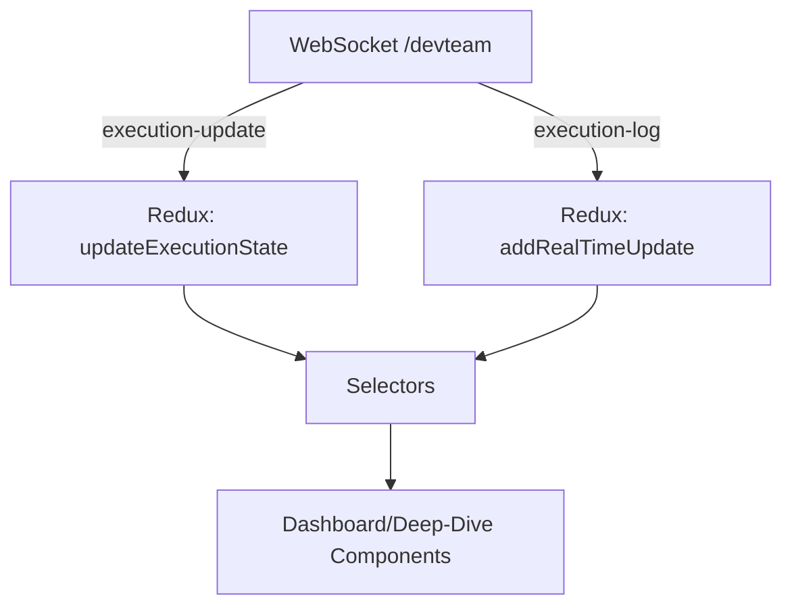
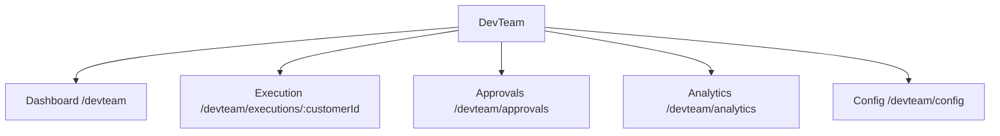

# DevTeam UI/UX Design Blueprint — Autonomous Execution Engine

Source-grounded across: [INFORMATION_ARCHITECTURE.md](docs/DevTeam/core_docs/INFORMATION_ARCHITECTURE.md), [devTeam_architecture_design.md](docs/DevTeam/core_docs/devTeam_architecture_design.md), [devTeam_charter.md](docs/DevTeam/core_docs/devTeam_charter.md), [devTeam_prd.md](docs/DevTeam/core_docs/devTeam_prd.md), [navigation_schema.md](docs/DevTeam/design/navigation_schema.md), [integration_patterns.md](docs/DevTeam/design/integration_patterns.md), [content_inventory.md](docs/DevTeam/design/content_inventory.md), [scalability_framework.md](docs/DevTeam/design/scalability_framework.md), [task_injection_workflows.md](docs/DevTeam/design/task_injection_workflows.md), [error_resolution_workflows.md](docs/DevTeam/design/error_resolution_workflows.md), [user_personas.md](docs/DevTeam/design/user_personas.md), [devTeam_autonomous_execution_workflows.md](docs/DevTeam/workflows/devTeam_autonomous_execution_workflows.md), [devTeam_integration_patterns.md](docs/DevTeam/workflows/devTeam_integration_patterns.md), [FRONTEND_AUTHENTICATION_COMPREHENSIVE_GUIDE.md](docs/FRONTEND_AUTHENTICATION_COMPREHENSIVE_GUIDE.md).

1. Executive Summary
- Purpose: translate the DevTeam Autonomous Execution Engine into concrete UI/UX for PM-centric oversight with developer deep-dive, extending TaskList without disruption.
- Pillars: Multi-Customer Parallel Processing (multi-customer dashboard), Real-Time Monitoring (real-time WebSockets, 5s), Autonomous Task Management (execution deep-dive + stop-point control), Hybrid Error Resolution (task injection; error panels and workflows), Seamless CRM Integration (non-disruptive TaskList extension), plus Resource/Performance analytics and Logs/Artifacts.
- Integration: Feature-flagged augmentation of [TaskList.jsx](src/components/tasks/TaskList.jsx:77) (lines 77–91) per [navigation_schema.md](docs/DevTeam/design/navigation_schema.md) and [devTeam_integration_patterns.md](docs/DevTeam/workflows/devTeam_integration_patterns.md) (aligned with IA Seamless CRM Integration Strategy in [INFORMATION_ARCHITECTURE.md](docs/DevTeam/core_docs/INFORMATION_ARCHITECTURE.md)).

2. User Role Analysis
- Roles (from personas and auth):
  - Project Manager (manager — Sarah Chen): full DevTeam navigation; can approve injections; manage stop-points; view analytics.
  - Developer (team_member — Alex Rodriguez): read dashboard; deep-dive logs/metrics; propose injections; cannot finalize approvals.
  - Admin (admin): all PM abilities + system configuration; capacity toggles.
- Access guard: follow [docs/FRONTEND_AUTHENTICATION_COMPREHENSIVE_GUIDE.md](docs/FRONTEND_AUTHENTICATION_COMPREHENSIVE_GUIDE.md). Gate routes via role-based wrappers.

3. Page Architecture
- Routes
  - /devteam (Dashboard; manager, team_member, admin)
  - /devteam/executions/:customerId (Execution Deep-Dive; manager, team_member, admin)
  - /devteam/approvals (Task Injection Queue & Approvals; manager, admin)
  - /devteam/analytics (Performance & Resource analytics; manager, admin)
  - /devteam/config (System config, feature flags; admin)
- Entry points
  - Top-level nav item “DevTeam” per [navigation_schema.md](docs/DevTeam/design/navigation_schema.md) and augmented link from TaskList cards.
  - Non-disruptive TaskList extension: show “DevTeam Executions” tab if feature flag; integration point [TaskList.jsx:77–91](src/components/tasks/TaskList.jsx:77) per [devTeam_integration_patterns.md](docs/DevTeam/workflows/devTeam_integration_patterns.md).
  - Aligns with IA Navigation Architecture (CRM Dashboard → Tasks → DevTeam Dashboard) per [INFORMATION_ARCHITECTURE.md](docs/DevTeam/core_docs/INFORMATION_ARCHITECTURE.md).
- Page inventory by role
  - PM: all pages; default landing /devteam.
  - Developer: /devteam, /devteam/executions/:customerId (read), limited create injection (sends for approval).
  - Admin: all pages.

4. Component Library Specification
- Status primitives
  - StatusChip: props {status: 'autonomous'|'initializing'|'task-executing'|'error-solving'|'blocked'|'completed'|'paused'}; color semantics from IA; tooltips with definitions.
  - HealthBadge: props {score: 0..1, trend: 'up'|'down'|'flat'}.
- Dashboard
  - SystemOverview: {activeCount, capacity, health, successRate, criticalAlerts, resourceUtilization}.
  - CustomerExecutionCard: {customerId, name, status, progressPct, timelineStatus, successRate, lastUpdate, onPause?, onResume?, onViewDetails}.
- Deep-Dive
  - ExecutionHeader: {customer, executionState, onSetStopPoint, onPause, onResume}.
  - LiveExecutionMonitor: as in LiveExecutionMonitor per [devTeam_autonomous_execution_workflows.md](docs/DevTeam/workflows/devTeam_autonomous_execution_workflows.md); props {customerId, executionState, realTimeUpdates}.
  - TaskProgressGrid: {tasks, currentTaskId, onSelectTask}; virtualized list/grid.
  - LogsViewer: {lines[], levelFilter, followTail}; append-only viewport with 1k line cap.
  - ArtifactsList: {items: {name, href}[]}.
  - StopPointControl: {currentStopPoint?, onSet(stopPointId)}.
- Task Injection
  - TaskInjectionButton: opens modal with types (Priority|Replace|Positional) from [task_injection_workflows.md](docs/DevTeam/design/task_injection_workflows.md).
  - TaskInjectionModal: {type, currentTask?, targetPosition?, onSubmit(request)} with ImpactAssessmentPanel.
  - ApprovalQueue: {items[], onApprove, onReject, onNeedsInfo} reflecting PM workflow.
- Error Resolution
  - ErrorSummaryCard: {severity, category, occurredAt, status}.
  - ErrorDetailPanel: {error, proposedResolutions[], onApproveResolution} per [error_resolution_workflows.md](docs/DevTeam/design/error_resolution_workflows.md).
- Analytics
  - ResourceUtilizationWidget, PerformanceTrendsChart, SLAIndicator.
- Props/state notes
  - Prefer derived UI state via selectors; store only canonical data (see Section 8).

5. Layout System Design
- Dashboard: responsive card grid; first row SystemOverview; cards wrap; 12-column on desktop, 6 on tablet, 1 on mobile.
- Deep-Dive: header (breadcrumbs + controls) + two-panels: metrics/logs stack above task tree; collapsible side info.
- Approvals: split list (left) + details (right).
- Consistency with app layout: reuse [src/components/layout/AppLayout.jsx](src/components/layout/AppLayout.jsx), Sidebar and TopNav.

6. Workflow-Specific Interface Design
- Multi-Customer Dashboard (PM default)
  - Shows essential 6 metrics per card from [content_inventory.md](docs/DevTeam/design/content_inventory.md).
  - Real-time status chips; click-through to deep-dive.
- Execution Deep-Dive
  - LiveExecutionMonitor with metrics (tasksCompleted, tasksRemaining, currentTask, executionTime, autonomousRate, errorCount) per [devTeam_autonomous_execution_workflows.md](docs/DevTeam/workflows/devTeam_autonomous_execution_workflows.md).
  - Controls: Initialize/Resume/Pause, StopPointControl, open TaskInjectionModal.
  - Panels: TaskProgressGrid, LogsViewer (WebSocket stream), ArtifactsList.
- Task Injection & Approvals
  - Modal for injection request; PM-only Approvals page lists pending; ImpactAssessmentPanel shows timeline/resource/dependency impacts (see [task_injection_workflows.md](docs/DevTeam/design/task_injection_workflows.md)).
- Error Resolution
  - ErrorSummary list on Deep-Dive; ErrorDetailPanel supports resolution approval paths and escalation (see [error_resolution_workflows.md](docs/DevTeam/design/error_resolution_workflows.md)).
- Analytics
  - Performance trends, capacity utilization, SLA indicators; drill from dashboard KPIs.

7. Responsive Design Specifications
- Breakpoints: Desktop ≥1200px, Tablet 768–1199px, Mobile <768px; respect theme breakpoints; align with IA Information Hierarchy and UX principles in [INFORMATION_ARCHITECTURE.md](docs/DevTeam/core_docs/INFORMATION_ARCHITECTURE.md).
- Patterns: cards become single-column on mobile; logs viewer height reduces; sticky action bar for controls.
- Touch targets ≥44px; charts simplify labels on mobile.

8. Interaction and State Patterns
- Loading
  - Skeletons for cards and grids; spinner in LogsViewer; optimistic nav render with disabled controls.
- Empty
  - Dashboard: “No active executions” with CTA to initialize; Deep-Dive: “Select a customer”; Approvals: “No pending injections”.
- Error
  - Inline alert bars; retry buttons; DevTeam-only error boundary per [devTeam_integration_patterns.md](docs/DevTeam/workflows/devTeam_integration_patterns.md).
- Progress/Badges
  - Progress bar semantics: % tasksComplete; StatusChip colors: green=autonomous, blue=initializing, yellow=task-executing, orange=error-solving, red=blocked, gray=paused, check=completed (see PRD).
  - IA executionStatus rollup mapping (EssentialMetrics.executionStatus domain ['active','paused','error','completed'] from [INFORMATION_ARCHITECTURE.md](docs/DevTeam/core_docs/INFORMATION_ARCHITECTURE.md)):
    - autonomous → active
    - initializing → active
    - task-executing → active
    - error-solving → error
    - blocked → error
    - completed → completed
    - paused → paused
- Redux slice boundaries (UI vs data)
  - Data: customers (byId, allIds, activeExecutions, loadingStates, errors), executions (byCustomerId, realTimeUpdates), taskInjection, errorResolution, systemMetrics.
  - UI: devTeamNavigation (currentView, filters) — UI-only layer.
- WebSocket events → store
  - execution-update → DevTeam slice progress handler (see [devTeam_integration_patterns.md](docs/DevTeam/workflows/devTeam_integration_patterns.md)).
  - ws-connection → DevTeam slice connection handler (see [devTeam_integration_patterns.md](docs/DevTeam/workflows/devTeam_integration_patterns.md)).
  - execution-log → append to client log buffer (capped; see [devTeam_autonomous_execution_workflows.md](docs/DevTeam/workflows/devTeam_autonomous_execution_workflows.md)).
  - Dispatch target slice: devTeam (progress, connection, error-injection state).
- Selectors
  - Memoized selectors for essential metrics; normalized state per [scalability_framework.md](docs/DevTeam/design/scalability_framework.md) with IA-aligned slice naming.

9. Real-Time Updates and Observability
- WS channel: /devteam; reconnect with backoff; throttle and batch per [integration_patterns.md](docs/DevTeam/design/integration_patterns.md) and [scalability_framework.md](docs/DevTeam/design/scalability_framework.md).
- Client logs: append-only buffer per customer capped to 100–1000 rows.
- Metrics: client-side rollups every 30s for heavy charts; 5s for status — aligned with IA Real-Time Monitoring principles.
- Minimal data flow

10. Accessibility and Compliance
- WCAG 2.1 AA: color contrast on StatusChip/HealthBadge; focus rings; skip links; aria-live for log updates (polite).
- Keyboard: tab order across cards; Esc closes modals; Enter submits approvals; logs support PageUp/PageDown.
- Reduced motion: respect prefers-reduced-motion for progress animations.

11. Technical Implementation Notes (React/Redux/WebSocket)
- React
  - Functional components; memoize card rows; virtualize large lists.
- Redux Toolkit
  - Thunks: initializeProjectAutomation, fetchAutomationStatus (reference [devTeam_integration_patterns.md](docs/DevTeam/workflows/devTeam_integration_patterns.md)).
  - Reducers/actions: devTeam slice actions (updateExecutionProgress, setWebSocketConnected, addInjectedErrorTask, clearError) per [devTeam_integration_patterns.md](docs/DevTeam/workflows/devTeam_integration_patterns.md).
- Store wiring: extend [index.js](src/store/index.js) and include DevTeam slice [devTeamSlice.js](src/store/slices/devTeamSlice.js) with IA-compliant slices (customers, executions, taskInjection, errorResolution, systemMetrics) as per [devTeam_integration_patterns.md](docs/DevTeam/workflows/devTeam_integration_patterns.md).
- WebSocket
  - Service abstraction with reconnect, throttling, and batched dispatch (see [devTeam_integration_patterns.md](docs/DevTeam/workflows/devTeam_integration_patterns.md)).
- Feature flags
  - DEVTEAM_ENABLED, DEVTEAM_MULTI_CUSTOMER, DEVTEAM_TASK_INJECTION; gate tabs and nav. Gating aligns with IA navigation modes (standard/devTeam/hybrid) in [INFORMATION_ARCHITECTURE.md](docs/DevTeam/core_docs/INFORMATION_ARCHITECTURE.md).

12. Validation and Success Criteria
- From PRD/Architecture: ≥80% autonomous completion; 5+ parallel customers; <500ms update latency; ≥70% automated error resolution; real-time dashboard load ≤2s.
- UX acceptance:
  - PM can: see all customer executions; set stop points; approve injections; view analytics; receive completion/violation alerts.
  - Developer can: deep-dive current task, error details, logs, artifacts; propose injection; follow logs in real time.
- Performance and business metrics are governed by IA Success Criteria and Metrics in [INFORMATION_ARCHITECTURE.md](docs/DevTeam/core_docs/INFORMATION_ARCHITECTURE.md).

13. Appendix: Coverage Matrix (Workflows ↔ UI)
- Multi-Customer Dashboard → /devteam → SystemOverview, CustomerExecutionCard, StatusChip, HealthBadge.
- Execution Deep-Dive → /devteam/executions/:customerId → ExecutionHeader, LiveExecutionMonitor, TaskProgressGrid, LogsViewer, ArtifactsList, StopPointControl.
- Task Injection → modal + /devteam/approvals → TaskInjectionModal, ImpactAssessmentPanel, ApprovalQueue.
- Error Resolution → Deep-Dive panels → ErrorSummaryCard, ErrorDetailPanel; escalations per workflows.
- Performance/Resources → /devteam, /devteam/analytics → ResourceUtilizationWidget, PerformanceTrendsChart, SLAIndicator.
- Stop-Point Controls → Deep-Dive → StopPointControl + confirmation dialog.
- Logs/Artifacts → Deep-Dive → LogsViewer, ArtifactsList.

Navigation Map (concise)

Notes
- Implements customer-first IA, progressive disclosure, and non-disruptive TaskList extension.
- Grounded in [devTeam_autonomous_execution_workflows.md](docs/DevTeam/workflows/devTeam_autonomous_execution_workflows.md) and [scalability_framework.md](docs/DevTeam/design/scalability_framework.md).