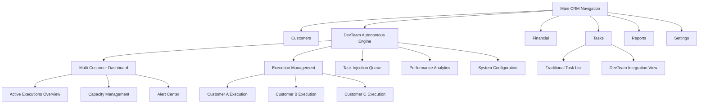

# DevTeam Autonomous Execution Engine - Navigation Schema

## Executive Summary
This document defines the navigation schema for integrating the DevTeam Autonomous Execution Engine with the existing Clarity CRM TaskList component. The design prioritizes Project Manager oversight while maintaining seamless integration with current CRM workflows.

## Integration Strategy

### Existing CRM Navigation Context
Based on the current TaskList component structure, the CRM uses:
- **Main Navigation:** Sidebar with feature-based sections
- **Task Management:** Integrated within customer/project contexts
- **State Management:** Redux Toolkit with centralized state
- **Component Architecture:** Feature-based organization with shared components

### DevTeam Integration Approach
**Extension Pattern:** Enhance existing TaskList component rather than replace
**Navigation Hierarchy:** Add DevTeam as a top-level section with deep integration
**State Integration:** Extend existing Redux patterns for DevTeam-specific state
**Component Reuse:** Leverage existing UI components and patterns

## Navigation Architecture

### Primary Navigation Structure



### Navigation Hierarchy Levels

#### Level 1: Main CRM Navigation
- **DevTeam Autonomous Engine** - New top-level section
- **Integration Point:** Extends existing main navigation sidebar
- **Access Control:** Project Manager and Developer roles
- **Visual Treatment:** Distinct icon and styling to indicate autonomous capabilities

#### Level 2: DevTeam Feature Areas
1. **Multi-Customer Dashboard** (Default Landing)
   - Primary PM interface for system oversight
   - Real-time status of all active executions
   - Essential metrics immediately visible

2. **Execution Management**
   - Customer-specific execution details
   - Individual execution monitoring and control
   - Deep-dive analysis and troubleshooting

3. **Task Injection Queue**
   - Pending task injection requests
   - Approval workflow management
   - Impact assessment tools

4. **Performance Analytics**
   - Historical performance data
   - Trend analysis and optimization insights
   - Executive reporting interface

5. **System Configuration**
   - DevTeam system settings
   - Integration configuration
   - User role and permission management

#### Level 3: Contextual Views
- **Customer-Specific Dashboards**
- **Execution Phase Details**
- **Task-Level Monitoring**
- **Error Resolution Workflows**
- **Resource Allocation Interfaces**

## Integration with Existing TaskList Component

### Current TaskList Enhancement Strategy

#### Component Extension Pattern
```javascript
// Existing TaskList component structure
const TaskList = ({ customerId, projectId }) => {
  // Current implementation
  const tasks = useSelector(state => state.tasks.items)
  
  // NEW: DevTeam integration
  const devTeamExecution = useSelector(state => 
    state.devTeam.executions.find(exec => exec.customerId === customerId)
  )
  
  return (
    <TaskListContainer>
      {/* Existing task list functionality */}
      <TraditionalTaskView tasks={tasks} />
      
      {/* NEW: DevTeam autonomous execution view */}
      {devTeamExecution && (
        <DevTeamExecutionView 
          execution={devTeamExecution}
          onNavigateToDetails={() => navigateToDevTeam(customerId)}
        />
      )}
    </TaskListContainer>
  )
}
```

#### Navigation Integration Points

1. **Customer Context Integration**
   - Add DevTeam execution status to customer profiles
   - Link from customer view to DevTeam execution details
   - Maintain customer context across navigation

2. **Task Context Integration**
   - Show autonomous task progression within traditional task views
   - Enable task injection from existing task management interfaces
   - Provide seamless transition between manual and autonomous task management

3. **Project Context Integration**
   - Display DevTeam execution status in project dashboards
   - Integrate execution timelines with project milestones
   - Maintain project context in DevTeam interfaces

### Navigation State Management

#### Redux Store Extension
```javascript
// Existing store structure
const store = {
  tasks: { /* existing task state */ },
  customers: { /* existing customer state */ },
  // NEW: DevTeam state integration
  devTeam: {
    executions: {
      active: [], // Currently running executions
      completed: [], // Historical executions
      pending: [] // Queued executions
    },
    dashboard: {
      metrics: {}, // Real-time performance metrics
      alerts: [], // System alerts and notifications
      capacity: {} // Resource utilization data
    },
    taskInjection: {
      queue: [], // Pending injection requests
      history: [] // Injection history
    },
    navigation: {
      currentView: 'dashboard', // Current DevTeam view
      selectedCustomer: null, // Selected customer context
      filters: {} // Applied filters and preferences
    }
  }
}
```

## Navigation Patterns and Behaviors

### Primary Navigation Patterns

#### 1. Dashboard-First Approach
- **Default Landing:** Multi-Customer Dashboard
- **Quick Access:** Essential metrics and alerts immediately visible
- **Progressive Disclosure:** Detailed views accessible via drill-down
- **Context Preservation:** Maintain user context across navigation

#### 2. Customer-Centric Navigation
- **Customer Selection:** Prominent customer selector in header
- **Context Switching:** Seamless switching between customer contexts
- **Breadcrumb Navigation:** Clear path showing current customer/execution context
- **Related Actions:** Customer-specific actions available in context

#### 3. Alert-Driven Navigation
- **Alert Notifications:** Prominent alert indicators in navigation
- **Direct Navigation:** Click alerts to navigate directly to relevant context
- **Priority Indication:** Visual priority indicators for urgent issues
- **Dismissal Tracking:** Track alert acknowledgment and resolution

### Secondary Navigation Patterns

#### 1. Execution Phase Navigation
- **Phase Indicators:** Visual progress indicators for execution phases
- **Phase Navigation:** Direct navigation to specific execution phases
- **Dependency Visualization:** Show phase dependencies and blockers
- **Timeline Integration:** Navigate along execution timeline

#### 2. Task-Level Navigation
- **Task Hierarchy:** Navigate through task hierarchies and dependencies
- **Task Status Filtering:** Filter tasks by status, priority, or assignment
- **Task Detail Views:** Deep-dive into individual task details
- **Task Action Menus:** Contextual actions for task management

#### 3. Resource-Based Navigation
- **Team Member Views:** Navigate by team member or skill set
- **Resource Utilization:** View resource allocation across customers
- **Capacity Planning:** Navigate to capacity planning and optimization
- **Performance Tracking:** Individual and team performance views

## Mobile and Responsive Navigation

### Mobile-First Considerations
- **Collapsible Navigation:** Sidebar collapses on mobile devices
- **Touch-Friendly Controls:** Large touch targets for mobile interaction
- **Swipe Gestures:** Support swipe navigation between customer contexts
- **Offline Capability:** Essential navigation available offline

### Responsive Breakpoints
- **Desktop (>1200px):** Full sidebar navigation with all features visible
- **Tablet (768px-1200px):** Collapsible sidebar with icon-based navigation
- **Mobile (<768px):** Bottom navigation bar with essential features

## Accessibility and Usability

### Accessibility Standards
- **WCAG 2.1 AA Compliance:** Full accessibility compliance
- **Keyboard Navigation:** Complete keyboard navigation support
- **Screen Reader Support:** Proper ARIA labels and semantic markup
- **High Contrast Mode:** Support for high contrast accessibility modes

### Usability Enhancements
- **Search Functionality:** Global search across all DevTeam content
- **Favorites/Bookmarks:** Save frequently accessed views
- **Customizable Dashboard:** User-configurable dashboard layouts
- **Keyboard Shortcuts:** Power user keyboard shortcuts

## Performance Considerations

### Navigation Performance
- **Lazy Loading:** Load navigation content on-demand
- **Caching Strategy:** Cache navigation state and preferences
- **Preloading:** Preload likely next navigation destinations
- **Bundle Splitting:** Separate bundles for different navigation sections

### Real-Time Updates
- **WebSocket Integration:** Real-time navigation state updates
- **Optimistic Updates:** Immediate UI feedback for navigation actions
- **Error Recovery:** Graceful handling of navigation failures
- **Offline Support:** Navigation functionality during connectivity issues

## Integration Testing Strategy

### Navigation Testing
- **User Journey Testing:** Test complete user navigation flows
- **Cross-Browser Testing:** Ensure navigation works across browsers
- **Mobile Testing:** Validate mobile navigation experience
- **Accessibility Testing:** Verify navigation accessibility compliance

### Integration Testing
- **CRM Integration:** Test seamless integration with existing CRM navigation
- **State Management:** Validate Redux state integration
- **Component Integration:** Test component reuse and extension
- **Performance Testing:** Validate navigation performance under load

## Future Scalability

### Expansion Considerations
- **Additional Features:** Framework for adding new DevTeam features
- **Role-Based Navigation:** Support for additional user roles
- **Multi-Tenant Support:** Navigation for multiple client organizations
- **API Integration:** Navigation for external system integrations

### Maintenance Strategy
- **Version Control:** Navigation schema versioning and migration
- **Documentation:** Maintain navigation documentation and guidelines
- **User Training:** Training materials for navigation changes
- **Feedback Integration:** User feedback collection and integration

This navigation schema provides a comprehensive framework for integrating the DevTeam Autonomous Execution Engine with the existing Clarity CRM while maintaining usability, performance, and scalability.