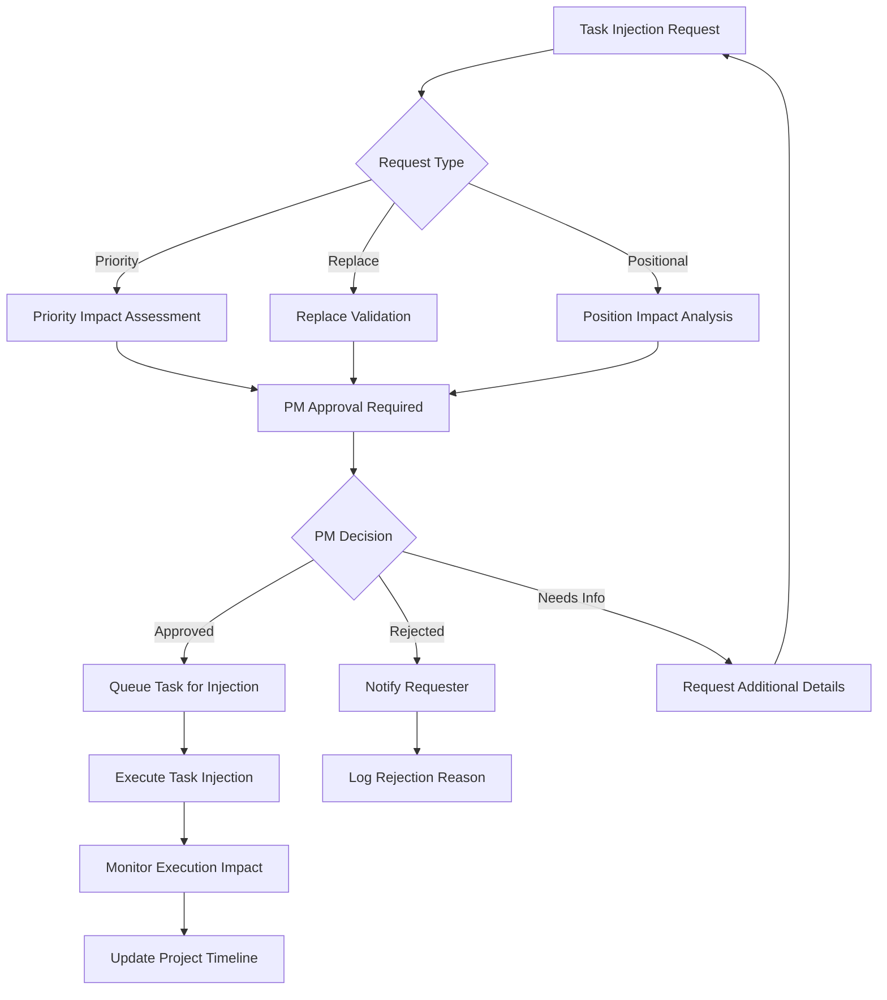

# DevTeam Autonomous Execution Engine - Task Injection Workflows

## Executive Summary
This document defines the task injection workflows for the DevTeam Autonomous Execution Engine, emphasizing Project Manager approval and oversight controls. The workflows ensure that task modifications maintain project integrity while providing flexible response to changing requirements and urgent priorities.

## Task Injection Overview

### Core Principles
- **Project Manager Authority:** All task injections require explicit PM approval before execution
- **Workflow Integrity:** Injected tasks must maintain project timeline and dependency integrity
- **Audit Trail:** Complete tracking of all injection requests, approvals, and outcomes
- **Impact Assessment:** Automatic evaluation of injection impact on existing execution plans
- **Rollback Capability:** Ability to reverse task injections if they cause issues

### Injection Types
```
Task Injection Types
├── Priority Injection
│   ├── Immediate execution (bypasses queue)
│   ├── Requires urgent business justification
│   └── PM approval with impact assessment
├── Replace Injection
│   ├── Replaces existing queued task
│   ├── Maintains timeline position
│   └── Requires dependency validation
└── Positional Injection
    ├── Inserts at specific queue position
    ├── Adjusts subsequent task scheduling
    └── Requires timeline impact analysis
```

## Workflow Architecture

### Task Injection Request Flow


### Project Manager Approval Interface
```javascript
// Task Injection Approval Component
const TaskInjectionApproval = ({ injectionRequest }) => {
  const [approvalDecision, setApprovalDecision] = useState(null)
  const [impactAssessment, setImpactAssessment] = useState(null)
  const [comments, setComments] = useState('')

  useEffect(() => {
    // Load impact assessment when component mounts
    loadImpactAssessment(injectionRequest.id)
  }, [injectionRequest.id])

  const handleApproval = async (decision) => {
    const approvalData = {
      injectionId: injectionRequest.id,
      decision,
      comments,
      timestamp: Date.now(),
      projectManagerId: currentUser.id
    }

    try {
      await dispatch(processInjectionApproval(approvalData))
      onApprovalComplete(decision)
    } catch (error) {
      console.error('Failed to process approval:', error)
    }
  }

  return (
    <ApprovalContainer>
      <InjectionDetails request={injectionRequest} />
      <ImpactAssessment assessment={impactAssessment} />
      <ApprovalControls>
        <CommentBox
          value={comments}
          onChange={setComments}
          placeholder="Add approval comments or requirements..."
        />
        <ButtonGroup>
          <ApproveButton onClick={() => handleApproval('approved')}>
            Approve Injection
          </ApproveButton>
          <RejectButton onClick={() => handleApproval('rejected')}>
            Reject Request
          </RejectButton>
          <InfoButton onClick={() => handleApproval('needs_info')}>
            Request More Info
          </InfoButton>
        </ButtonGroup>
      </ApprovalControls>
    </ApprovalContainer>
  )
}
```

## Task Injection Types and Workflows

### 1. Priority Injection Workflow

#### Use Cases
- **Critical Bug Fixes:** Urgent production issues requiring immediate attention
- **Client Escalations:** High-priority client requests with business impact
- **Security Vulnerabilities:** Security issues requiring immediate remediation
- **Regulatory Compliance:** Time-sensitive compliance requirements

#### Workflow Process
```javascript
// Priority Injection Redux Slice
export const submitPriorityInjection = createAsyncThunk(
  'taskInjection/submitPriorityInjection',
  async (injectionData, { rejectWithValue }) => {
    try {
      // Validate priority injection requirements
      const validation = await validatePriorityInjection(injectionData)
      if (!validation.isValid) {
        return rejectWithValue(validation.errors)
      }

      // Calculate impact on current execution
      const impact = await calculatePriorityImpact(injectionData)
      
      // Submit for PM approval
      const response = await devTeamApi.submitTaskInjection({
        ...injectionData,
        type: 'priority',
        impact,
        urgencyLevel: injectionData.urgencyLevel,
        businessJustification: injectionData.businessJustification
      })

      return response.data
    } catch (error) {
      return rejectWithValue(error.message)
    }
  }
)

// Priority injection validation
const validatePriorityInjection = async (data) => {
  const errors = []
  
  if (!data.businessJustification || data.businessJustification.length < 50) {
    errors.push('Business justification must be at least 50 characters')
  }
  
  if (!data.urgencyLevel || !['critical', 'high', 'medium'].includes(data.urgencyLevel)) {
    errors.push('Valid urgency level is required')
  }
  
  if (!data.estimatedDuration || data.estimatedDuration <= 0) {
    errors.push('Estimated duration is required')
  }

  return {
    isValid: errors.length === 0,
    errors
  }
}
```

#### Priority Injection Interface
```javascript
const PriorityInjectionForm = ({ customerId, onSubmit }) => {
  const [formData, setFormData] = useState({
    title: '',
    description: '',
    urgencyLevel: 'high',
    businessJustification: '',
    estimatedDuration: '',
    requiredSkills: [],
    dependencies: []
  })

  const handleSubmit = async (e) => {
    e.preventDefault()
    
    const injectionRequest = {
      ...formData,
      customerId,
      type: 'priority',
      requestedBy: currentUser.id,
      requestedAt: Date.now()
    }

    try {
      await dispatch(submitPriorityInjection(injectionRequest))
      onSubmit('success')
    } catch (error) {
      onSubmit('error', error.message)
    }
  }

  return (
    <InjectionForm onSubmit={handleSubmit}>
      <FormSection>
        <Label>Task Title *</Label>
        <Input
          value={formData.title}
          onChange={(e) => setFormData({...formData, title: e.target.value})}
          placeholder="Brief, descriptive task title"
          required
        />
      </FormSection>

      <FormSection>
        <Label>Urgency Level *</Label>
        <Select
          value={formData.urgencyLevel}
          onChange={(e) => setFormData({...formData, urgencyLevel: e.target.value})}
        >
          <option value="critical">Critical - Production Down</option>
          <option value="high">High - Major Impact</option>
          <option value="medium">Medium - Moderate Impact</option>
        </Select>
      </FormSection>

      <FormSection>
        <Label>Business Justification * (minimum 50 characters)</Label>
        <TextArea
          value={formData.businessJustification}
          onChange={(e) => setFormData({...formData, businessJustification: e.target.value})}
          placeholder="Explain the business impact and why this task requires priority injection..."
          rows={4}
          required
        />
        <CharacterCount>{formData.businessJustification.length}/50 minimum</CharacterCount>
      </FormSection>

      <SubmitButton type="submit">
        Submit Priority Injection Request
      </SubmitButton>
    </InjectionForm>
  )
}
```

### 2. Replace Injection Workflow

#### Use Cases
- **Requirement Changes:** Client changes requirements for a queued task
- **Technical Pivots:** Technical approach changes based on new information
- **Resource Optimization:** Replacing tasks with more efficient alternatives
- **Scope Adjustments:** Modifying task scope while maintaining timeline position

#### Workflow Process
```javascript
export const submitReplaceInjection = createAsyncThunk(
  'taskInjection/submitReplaceInjection',
  async (injectionData, { rejectWithValue }) => {
    try {
      // Validate replacement compatibility
      const compatibility = await validateReplacement(
        injectionData.targetTaskId,
        injectionData.replacementTask
      )
      
      if (!compatibility.isCompatible) {
        return rejectWithValue(compatibility.issues)
      }

      // Calculate timeline impact
      const timelineImpact = await calculateReplacementImpact(injectionData)
      
      const response = await devTeamApi.submitTaskInjection({
        ...injectionData,
        type: 'replace',
        compatibility,
        timelineImpact
      })

      return response.data
    } catch (error) {
      return rejectWithValue(error.message)
    }
  }
)

// Replacement validation logic
const validateReplacement = async (targetTaskId, replacementTask) => {
  const targetTask = await getTaskDetails(targetTaskId)
  const issues = []
  
  // Check dependency compatibility
  const dependencyCheck = await validateDependencies(
    targetTask.dependencies,
    replacementTask.dependencies
  )
  
  if (!dependencyCheck.isCompatible) {
    issues.push(...dependencyCheck.issues)
  }
  
  // Check resource requirements
  if (replacementTask.estimatedDuration > targetTask.estimatedDuration * 1.5) {
    issues.push('Replacement task duration significantly exceeds original')
  }
  
  // Check skill requirements
  const skillGap = findSkillGaps(targetTask.requiredSkills, replacementTask.requiredSkills)
  if (skillGap.length > 0) {
    issues.push(`Additional skills required: ${skillGap.join(', ')}`)
  }

  return {
    isCompatible: issues.length === 0,
    issues,
    targetTask,
    replacementTask
  }
}
```

### 3. Positional Injection Workflow

#### Use Cases
- **Dependency Insertion:** Adding tasks that other tasks depend on
- **Milestone Preparation:** Inserting preparation tasks before major milestones
- **Quality Gates:** Adding review or testing tasks at specific points
- **Client Deliverables:** Inserting client-facing deliverable tasks

#### Workflow Process
```javascript
export const submitPositionalInjection = createAsyncThunk(
  'taskInjection/submitPositionalInjection',
  async (injectionData, { rejectWithValue }) => {
    try {
      // Analyze position impact
      const positionAnalysis = await analyzePositionImpact(
        injectionData.customerId,
        injectionData.targetPosition,
        injectionData.newTask
      )
      
      // Calculate timeline adjustments
      const timelineAdjustments = await calculateTimelineAdjustments(positionAnalysis)
      
      const response = await devTeamApi.submitTaskInjection({
        ...injectionData,
        type: 'positional',
        positionAnalysis,
        timelineAdjustments
      })

      return response.data
    } catch (error) {
      return rejectWithValue(error.message)
    }
  }
)

// Position impact analysis
const analyzePositionImpact = async (customerId, targetPosition, newTask) => {
  const currentQueue = await getCustomerTaskQueue(customerId)
  const affectedTasks = currentQueue.slice(targetPosition)
  
  const analysis = {
    insertionPoint: targetPosition,
    affectedTaskCount: affectedTasks.length,
    timelineDelay: newTask.estimatedDuration,
    dependencyImpacts: [],
    resourceConflicts: []
  }
  
  // Check for dependency impacts
  for (const task of affectedTasks) {
    const dependencyImpact = await checkDependencyImpact(task, newTask)
    if (dependencyImpact.hasImpact) {
      analysis.dependencyImpacts.push(dependencyImpact)
    }
  }
  
  // Check for resource conflicts
  const resourceConflict = await checkResourceConflicts(newTask, affectedTasks)
  if (resourceConflict.hasConflicts) {
    analysis.resourceConflicts.push(resourceConflict)
  }
  
  return analysis
}
```

## Project Manager Oversight Controls

### Approval Dashboard
```javascript
const InjectionApprovalDashboard = () => {
  const pendingInjections = useSelector(state => state.taskInjection.pending)
  const [selectedInjection, setSelectedInjection] = useState(null)
  
  const approvalStats = useMemo(() => {
    return {
      pending: pendingInjections.length,
      priority: pendingInjections.filter(inj => inj.type === 'priority').length,
      replace: pendingInjections.filter(inj => inj.type === 'replace').length,
      positional: pendingInjections.filter(inj => inj.type === 'positional').length
    }
  }, [pendingInjections])

  return (
    <DashboardContainer>
      <DashboardHeader>
        <Title>Task Injection Approvals</Title>
        <StatsBar>
          <Stat label="Pending" value={approvalStats.pending} />
          <Stat label="Priority" value={approvalStats.priority} color="red" />
          <Stat label="Replace" value={approvalStats.replace} color="orange" />
          <Stat label="Positional" value={approvalStats.positional} color="blue" />
        </StatsBar>
      </DashboardHeader>
      
      <ApprovalQueue>
        {pendingInjections.map(injection => (
          <InjectionCard
            key={injection.id}
            injection={injection}
            onClick={() => setSelectedInjection(injection)}
          />
        ))}
      </ApprovalQueue>
      
      {selectedInjection && (
        <ApprovalModal
          injection={selectedInjection}
          onClose={() => setSelectedInjection(null)}
        />
      )}
    </DashboardContainer>
  )
}
```

### Impact Assessment Display
```javascript
const ImpactAssessmentDisplay = ({ assessment }) => {
  const getSeverityColor = (severity) => {
    switch (severity) {
      case 'high': return 'red'
      case 'medium': return 'orange'
      case 'low': return 'green'
      default: return 'gray'
    }
  }

  return (
    <AssessmentContainer>
      <AssessmentHeader>
        <Title>Impact Assessment</Title>
        <SeverityBadge color={getSeverityColor(assessment.overallSeverity)}>
          {assessment.overallSeverity.toUpperCase()} IMPACT
        </SeverityBadge>
      </AssessmentHeader>
      
      <ImpactMetrics>
        <Metric>
          <Label>Timeline Delay</Label>
          <Value>{assessment.timelineDelay} hours</Value>
        </Metric>
        <Metric>
          <Label>Affected Tasks</Label>
          <Value>{assessment.affectedTaskCount}</Value>
        </Metric>
        <Metric>
          <Label>Resource Conflicts</Label>
          <Value>{assessment.resourceConflicts.length}</Value>
        </Metric>
        <Metric>
          <Label>Dependency Issues</Label>
          <Value>{assessment.dependencyIssues.length}</Value>
        </Metric>
      </ImpactMetrics>
      
      {assessment.risks.length > 0 && (
        <RiskSection>
          <RiskTitle>Identified Risks</RiskTitle>
          {assessment.risks.map((risk, index) => (
            <RiskItem key={index} severity={risk.severity}>
              <RiskDescription>{risk.description}</RiskDescription>
              <RiskMitigation>{risk.mitigation}</RiskMitigation>
            </RiskItem>
          ))}
        </RiskSection>
      )}
    </AssessmentContainer>
  )
}
```

## Approval Workflow States

### State Management
```javascript
const taskInjectionSlice = createSlice({
  name: 'taskInjection',
  initialState: {
    pending: [],
    approved: [],
    rejected: [],
    executed: [],
    loading: false,
    error: null
  },
  reducers: {
    updateInjectionStatus: (state, action) => {
      const { injectionId, status, comments } = action.payload
      
      // Find injection in current state
      let injection = null
      let sourceArray = null
      
      if (state.pending.find(inj => inj.id === injectionId)) {
        injection = state.pending.find(inj => inj.id === injectionId)
        sourceArray = 'pending'
      }
      
      if (injection) {
        // Update injection status
        injection.status = status
        injection.approvalComments = comments
        injection.approvedAt = Date.now()
        
        // Move to appropriate array
        switch (status) {
          case 'approved':
            state.approved.push(injection)
            break
          case 'rejected':
            state.rejected.push(injection)
            break
          case 'executed':
            state.executed.push(injection)
            break
        }
        
        // Remove from source array
        if (sourceArray === 'pending') {
          state.pending = state.pending.filter(inj => inj.id !== injectionId)
        }
      }
    }
  },
  extraReducers: (builder) => {
    builder
      .addCase(processInjectionApproval.fulfilled, (state, action) => {
        const { injectionId, decision, comments } = action.payload
        state.updateInjectionStatus({ injectionId, status: decision, comments })
      })
  }
})
```

### Approval Notifications
```javascript
// Notification system for injection approvals
const InjectionNotificationService = {
  notifyApprovalRequired: (injection) => {
    const notification = {
      type: 'approval_required',
      title: 'Task Injection Approval Required',
      message: `${injection.type} injection requested for ${injection.customerName}`,
      priority: injection.urgencyLevel || 'medium',
      actionUrl: `/devteam/approvals/${injection.id}`,
      recipientRole: 'project_manager'
    }
    
    dispatch(addNotification(notification))
  },

  notifyApprovalDecision: (injection, decision) => {
    const notification = {
      type: 'approval_decision',
      title: `Task Injection ${decision.charAt(0).toUpperCase() + decision.slice(1)}`,
      message: `Your ${injection.type} injection request has been ${decision}`,
      priority: 'medium',
      recipientId: injection.requestedBy
    }
    
    dispatch(addNotification(notification))
  },

  notifyExecutionComplete: (injection) => {
    const notification = {
      type: 'injection_complete',
      title: 'Task Injection Executed',
      message: `Injected task "${injection.title}" has been completed`,
      priority: 'low',
      recipientRole: 'project_manager'
    }
    
    dispatch(addNotification(notification))
  }
}
```

## Execution Monitoring and Rollback

### Injection Execution Tracking
```javascript
const InjectionExecutionMonitor = () => {
  const activeInjections = useSelector(state => state.taskInjection.executing)
  
  useEffect(() => {
    // Monitor execution progress
    const interval = setInterval(() => {
      activeInjections.forEach(injection => {
        monitorInjectionProgress(injection.id)
      })
    }, 10000) // Check every 10 seconds
    
    return () => clearInterval(interval)
  }, [activeInjections])

  const monitorInjectionProgress = async (injectionId) => {
    try {
      const progress = await devTeamApi.getInjectionProgress(injectionId)
      
      dispatch(updateInjectionProgress({
        injectionId,
        progress: progress.completionPercentage,
        status: progress.status,
        issues: progress.issues
      }))
      
      // Check for execution issues
      if (progress.issues.length > 0) {
        handleExecutionIssues(injectionId, progress.issues)
      }
    } catch (error) {
      console.error(`Failed to monitor injection ${injectionId}:`, error)
    }
  }

  const handleExecutionIssues = (injectionId, issues) => {
    const criticalIssues = issues.filter(issue => issue.severity === 'critical')
    
    if (criticalIssues.length > 0) {
      // Notify PM of critical issues
      dispatch(addAlert({
        type: 'error',
        title: 'Critical Injection Execution Issue',
        message: `Injection ${injectionId} has critical execution issues`,
        actions: [
          { label: 'View Details', action: () => viewInjectionDetails(injectionId) },
          { label: 'Consider Rollback', action: () => initiateRollback(injectionId) }
        ]
      }))
    }
  }

  return (
    <MonitorContainer>
      <MonitorHeader>
        <Title>Injection Execution Monitor</Title>
        <StatusIndicator status={getOverallExecutionStatus(activeInjections)} />
      </MonitorHeader>
      
      {activeInjections.map(injection => (
        <ExecutionCard key={injection.id} injection={injection} />
      ))}
    </MonitorContainer>
  )
}
```

### Rollback Capabilities
```javascript
export const initiateInjectionRollback = createAsyncThunk(
  'taskInjection/initiateRollback',
  async ({ injectionId, reason }, { rejectWithValue }) => {
    try {
      // Assess rollback feasibility
      const rollbackAssessment = await assessRollbackFeasibility(injectionId)
      
      if (!rollbackAssessment.feasible) {
        return rejectWithValue(rollbackAssessment.blockers)
      }
      
      // Execute rollback
      const rollbackResult = await devTeamApi.rollbackInjection(injectionId, {
        reason,
        rollbackPlan: rollbackAssessment.plan
      })
      
      return rollbackResult.data
    } catch (error) {
      return rejectWithValue(error.message)
    }
  }
)

const assessRollbackFeasibility = async (injectionId) => {
  const injection = await getInjectionDetails(injectionId)
  const blockers = []
  
  // Check if injection has started execution
  if (injection.executionProgress > 50) {
    blockers.push('Injection is more than 50% complete')
  }
  
  // Check for dependent tasks
  const dependentTasks = await getDependentTasks(injection.taskId)
  if (dependentTasks.some(task => task.status === 'in_progress')) {
    blockers.push('Dependent tasks are already in progress')
  }
  
  // Check for deliverables
  if (injection.deliverables && injection.deliverables.length > 0) {
    blockers.push('Task has produced deliverables that may be in use')
  }
  
  return {
    feasible: blockers.length === 0,
    blockers,
    plan: blockers.length === 0 ? generateRollbackPlan(injection) : null
  }
}
```

This task injection workflow framework provides comprehensive Project Manager oversight while maintaining system flexibility and integrity. The workflows ensure that all task modifications are properly evaluated, approved, and monitored throughout their execution lifecycle.