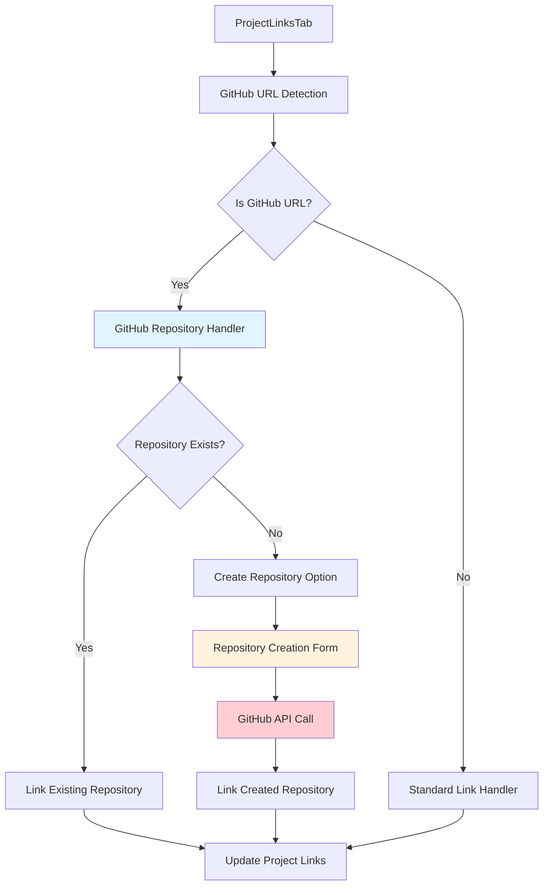

# GitHub Repository Linking - Frontend Implementation Guide

## Overview

This guide provides high-level requirements and success criteria for extending the existing project links functionality to support GitHub repository linking with the ability to create new repositories when they don't exist.

## Architecture Overview

## Requirements

### 1. Extend Existing Project Links Functionality

**Goal**: Enhance the current [`ProjectLinksTab.jsx`](src/components/projects/ProjectLinksTab.jsx) to detect and handle GitHub repository URLs specially.

**Key Requirements**:
- Maintain backward compatibility with existing link functionality
- Detect GitHub URLs using pattern matching
- Provide enhanced UI for GitHub repositories
- Support repository creation workflow

### 2. GitHub URL Detection and Validation

**Implementation Location**: Extend existing link creation logic in [`ProjectLinksTab.jsx`](src/components/projects/ProjectLinksTab.jsx)

**Requirements**:
- Detect GitHub URLs (github.com/owner/repo patterns)
- Validate repository URL format
- Extract owner and repository name from URL
- Check repository accessibility

**Success Criteria**:
- ✅ Correctly identifies GitHub URLs vs regular URLs
- ✅ Extracts owner/repo information accurately
- ✅ Handles various GitHub URL formats (https, ssh, etc.)
- ✅ Provides clear validation error messages

### 3. Repository Existence Check

**Requirements**:
- Check if GitHub repository exists and is accessible
- Handle private repositories appropriately
- Provide clear feedback on repository status

**Success Criteria**:
- ✅ Accurately determines if repository exists
- ✅ Handles authentication requirements for private repos
- ✅ Provides appropriate error messages for inaccessible repos

### 4. Repository Creation Workflow

**Requirements**:
- Present repository creation option when repository doesn't exist
- Collect necessary repository information (name, description, visibility)
- Integrate with GitHub API for repository creation
- Handle creation success/failure scenarios

**UI Components Needed**:
- Repository creation modal/form
- Progress indicators during creation
- Success/error feedback

**Success Criteria**:
- ✅ Clear UI flow for repository creation
- ✅ Proper form validation for repository details
- ✅ Handles GitHub API responses appropriately
- ✅ Updates project links after successful creation

### 5. Enhanced GitHub Repository Display

**Requirements**:
- Display GitHub repositories with enhanced visual indicators
- Show repository metadata (stars, forks, last updated)
- Provide quick actions (open in GitHub, clone URL)

**Success Criteria**:
- ✅ GitHub repositories visually distinct from regular links
- ✅ Repository metadata displayed accurately
- ✅ Quick actions work correctly

## Implementation Strategy

### Phase 1: URL Detection and Basic Linking
1. Extend [`ProjectLinksTab.jsx`](src/components/projects/ProjectLinksTab.jsx) with GitHub URL detection
2. Add GitHub repository validation logic
3. Enhance link display for GitHub repositories

### Phase 2: Repository Creation
1. Add repository creation modal component
2. Integrate GitHub API calls
3. Handle creation workflow and error states

### Phase 3: Enhanced Features
1. Add repository metadata display
2. Implement quick actions
3. Add repository status indicators

## Technical Requirements

### Frontend Components to Modify/Create

1. **Modify**: [`src/components/projects/ProjectLinksTab.jsx`](src/components/projects/ProjectLinksTab.jsx)
   - Add GitHub URL detection logic
   - Enhance link creation workflow
   - Add repository creation option

2. **Create**: `src/components/projects/GitHubRepositoryModal.jsx`
   - Repository creation form
   - Validation and submission logic
   - Progress and error handling

3. **Modify**: [`src/hooks/useLink.js`](src/hooks/useLink.js)
   - Add GitHub-specific link creation logic
   - Handle repository creation API calls

4. **Create**: `src/utils/githubUtils.js`
   - GitHub URL parsing and validation
   - Repository information extraction

### API Integration Requirements

**New API Endpoints Needed** (Backend Implementation Required):
- `POST /api/github/repositories` - Create new GitHub repository
- `GET /api/github/repositories/check` - Check repository existence
- `GET /api/github/repositories/info` - Get repository metadata

### State Management

**Extend Existing Link State**:
- Add GitHub-specific repository information
- Handle repository creation loading states
- Manage repository metadata

## Success Criteria

### Functional Requirements
- ✅ **GitHub URL Detection**: System correctly identifies GitHub repository URLs
- ✅ **Repository Validation**: Validates repository accessibility and format
- ✅ **Repository Creation**: Successfully creates new GitHub repositories when needed
- ✅ **Link Management**: GitHub repositories appear in project links with enhanced display
- ✅ **Error Handling**: Appropriate error messages for all failure scenarios

### User Experience Requirements
- ✅ **Intuitive Workflow**: Clear path from URL input to repository linking/creation
- ✅ **Visual Feedback**: Loading states and progress indicators during operations
- ✅ **Error Recovery**: Clear error messages with actionable next steps
- ✅ **Consistent UI**: GitHub features integrate seamlessly with existing design

### Technical Requirements
- ✅ **Backward Compatibility**: Existing link functionality remains unchanged
- ✅ **Performance**: GitHub operations don't impact overall application performance
- ✅ **Security**: GitHub API credentials handled securely
- ✅ **Reliability**: Robust error handling for GitHub API failures

## Testing Requirements

### Unit Tests
- GitHub URL detection and parsing functions
- Repository validation logic
- Link creation with GitHub repositories

### Integration Tests
- GitHub API integration
- Repository creation workflow
- Link display and management

### User Journey Tests
- Complete workflow: URL input → repository creation → link display
- Error scenarios: invalid URLs, API failures, permission issues
- Edge cases: private repositories, organization repositories

## Dependencies

### External Dependencies
- GitHub API access (requires authentication tokens)
- Existing project links infrastructure
- Backend API endpoints for GitHub operations

### Internal Dependencies
- [`ProjectLinksTab.jsx`](src/components/projects/ProjectLinksTab.jsx) - Base component
- [`useLink.js`](src/hooks/useLink.js) - Link management hook
- Project data structure and API

## Security Considerations

- GitHub API tokens must be handled securely (backend only)
- Repository creation permissions must be validated
- Private repository access must be properly managed
- Input validation for all GitHub-related data

## Performance Considerations

- GitHub API calls should be optimized and cached where appropriate
- Repository metadata should be loaded asynchronously
- Large repository lists should be paginated
- Network failures should be handled gracefully

## Future Enhancements

- Repository synchronization and status updates
- Branch and commit information display
- Integration with DevTeam automation features
- Repository access management and permissions