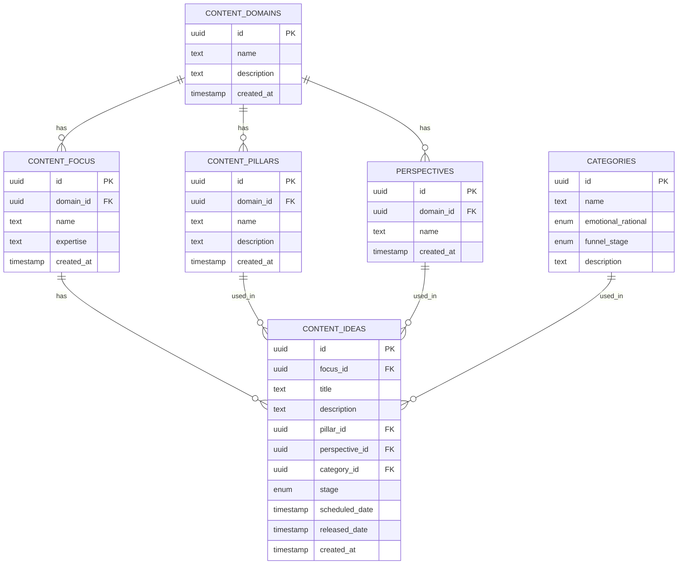

# Content Modules System – Development Plan

## 1. Summary of Requirements

- **Global modules** (not user/org-specific, no multi-tenancy)
- **Content Domains**: e.g., LinkedIn, YouTube, Email
- **User-defined**: Expertise, Content Pillars, Perspectives (with default values: Personal, Expert Advice, General Advice)
- **Predefined Categories**: Entertainment, Inspire, Educate, Convince (2x2 matrix: Emotional/Rational × Awareness/Purchase)
- **Content Ideas**: Created within modules, tracked by stage (idea, selected, scheduled, released)
- **No permissions/roles** for now
- **Scheduling/releasing** is tracked, not automated
- **General marketing assets** (not linked to customers)
- **Adhere to** [DEVELOPMENT_GUIDELINES.md](../DEVELOPMENT_GUIDELINES.md)

---

## 2. Proposed Data Model (Supabase Tables)

### A. content_domains

| Field        | Type      | Description                        |
|--------------|-----------|------------------------------------|
| id           | uuid, PK  | Primary key                        |
| name         | text      | e.g., "LinkedIn", "YouTube", "Email"|
| description  | text      |                                    |
| created_at   | timestamp |                                    |

### B. content_focus

| Field        | Type      | Description                        |
|--------------|-----------|------------------------------------|
| id           | uuid, PK  | Primary key                        |
| domain_id    | uuid, FK  | FK → content_domains.id            |
| name         | text      |                                    |
| expertise    | text      | User-defined broad area of focus   |
| created_at   | timestamp |                                    |

### C. content_pillars

| Field        | Type      | Description                        |
|--------------|-----------|------------------------------------|
| id           | uuid, PK  | Primary key                        |
| domain_id    | uuid, FK  | FK → content_domains.id            |
| name         | text      | User-defined                       |
| description  | text      |                                    |
| created_at   | timestamp |                                    |

### D. perspectives

| Field        | Type      | Description                        |
|--------------|-----------|------------------------------------|
| id           | uuid, PK  | Primary key                        |
| domain_id    | uuid, FK  | FK → content_domains.id            |
| name         | text      | User-defined, defaults: Personal, Expert Advice, General Advice |
| created_at   | timestamp |                                    |

### E. categories

| Field              | Type      | Description                        |
|--------------------|-----------|------------------------------------|
| id                 | uuid, PK  | Primary key                        |
| name               | text      | Entertainment, Inspire, Educate, Convince |
| emotional_rational | enum      | 'emotional', 'rational'            |
| funnel_stage       | enum      | 'awareness', 'purchase'            |
| description        | text      |                                    |

### F. content_ideas

| Field          | Type      | Description                        |
|----------------|-----------|------------------------------------|
| id             | uuid, PK  | Primary key                        |
| focus_id       | uuid, FK  | FK → content_focus.id              |
| title          | text      |                                    |
| description    | text      |                                    |
| pillar_id      | uuid, FK  | FK → content_pillars.id            |
| perspective_id | uuid, FK  | FK → perspectives.id               |
| category_id    | uuid, FK  | FK → categories.id                 |
| stage          | enum      | 'idea', 'selected', 'scheduled', 'released' |
| scheduled_date | timestamp | Nullable                           |
| released_date  | timestamp | Nullable                           |
| created_at     | timestamp |                                    |

---

### Mermaid ER Diagram

---

## 3. Services & API Layer

- **Supabase Service**: Extend `src/services/supabaseService.js` to support CRUD for new tables.
- **Content Module Service**: New service in `src/services/contentModuleService.js` for business logic (create focus areas, add pillars, perspectives, ideas, etc.).
- **API Layer**: If needed, add endpoints in `src/api/contentModules.js` for abstraction and future backend expansion.

---

## 4. React Components

- **ContentModulePanel**: Main UI for managing content domains and focus areas (list, create, edit, delete)
- **ContentDomainSelector**: Dropdown for selecting LinkedIn, YouTube, Email, etc.
- **ContentFocusSetupWizard**: Stepper for defining expertise/focus areas
- **PillarList/PillarEditor**: Manage content pillars (linked to domain)
- **PerspectiveList/PerspectiveEditor**: Manage perspectives (linked to domain, with default values)
- **CategoryMatrix**: Visual 2x2 matrix for category selection
- **ContentIdeaList/IdeaEditor**: Create, edit, and track content ideas and their stage
- **IdeaStageTracker**: Kanban or timeline view for idea stages (idea, selected, scheduled, released)

All components should follow the guidelines in [DEVELOPMENT_GUIDELINES.md](../DEVELOPMENT_GUIDELINES.md) (modular, reusable, accessible, etc.).

---

## 5. Workflow Example

1. **Admin selects a Content Domain** (e.g., LinkedIn).
2. **Creates Content Focus** within that domain (e.g., "B2B SaaS Growth").
3. **Adds Content Pillars** to the domain (e.g., "Productivity", "Leadership").
4. **Sets Perspectives** for the domain (defaults: Personal, Expert Advice, General Advice; can add more).
5. **Creates Content Ideas** within the focus area, assigning pillar, perspective, and category.
6. **Tracks each idea** through its stages (idea → selected → scheduled → released).

---

## 6. Next Steps

- Review and confirm the plan, suggest any changes or additions.
- Once approved, proceed to implementation in code mode.