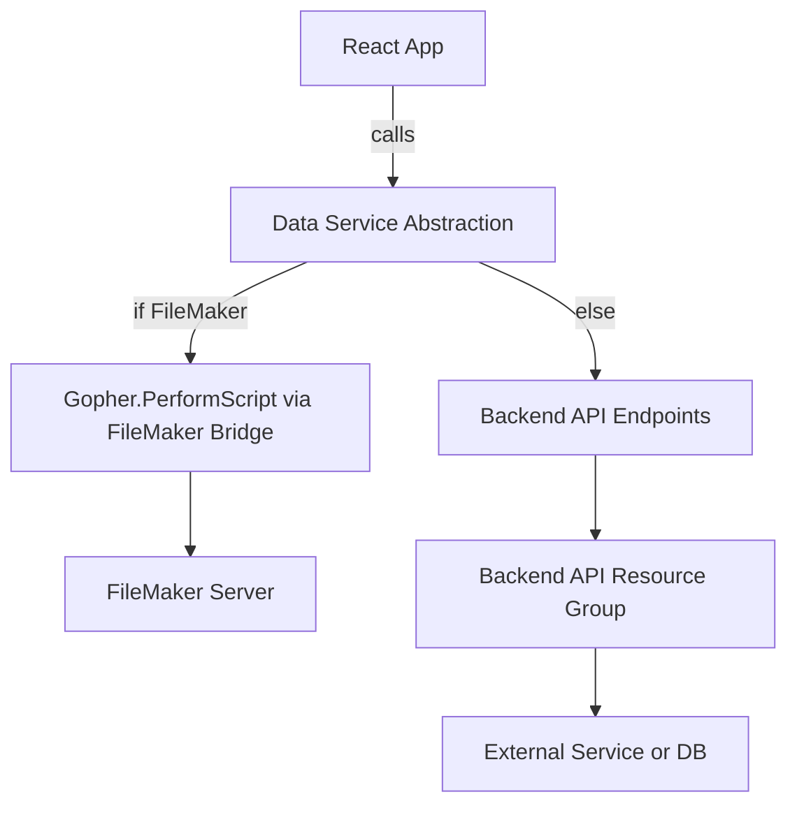

# Plan: Enable Code to Work in Both FileMaker Widget and Standalone Web App

## 1. Summary of Requirements
- **Single codebase**: No separate builds or entry points.
- **UI/Features**: Identical in both environments.
- **Key difference**: Data fetch method—FileMaker uses `Gopher.PerformScript`, standalone uses the Data API (dapi service).
- **No special build/dependency constraints**: Standard Vite/React setup.

---

## 2. Current State Analysis
- **Data Layer**: There are separate modules for FileMaker (`src/api/fileMaker.js`) and for the edge function (`src/api/fileMakerEdgeFunction.js`).
- **Widget Detection**: FileMaker bridge is initialized via window messaging in `src/api/fileMaker.js`.
- **Build**: Uses Vite with `vite-plugin-singlefile` for widget packaging (likely for FileMaker), but also supports regular SPA builds.
- **No UI branching**: All UI logic is shared.

---

## 3. Key Challenges - SOLUTIONS IDENTIFIED
- **Environment Detection**: ✅ **SOLVED** 
- **Fetch Abstraction**: ✅ **SOLVED** - Single axios interceptor will handle 99% of routing based on environment state.
- **Testing**: ✅ **MANAGEABLE** - Global environment designation will handle testing scenarios.

---

## 4. Backend API Resource Groups & Supabase Function Migration

### Current Supabase Functions to Migrate
**IDENTIFIED SUPABASE FUNCTION REFERENCES:**
- **`src/api/fileMakerEdgeFunction.js`**: Uses `${supabaseUrl}/functions/v1/filemaker-api`
- **`src/api/quickbooksEdgeFunction.js`**: Uses `${supabaseUrl}/functions/v1/quickbooks-api`
- **`src/config.js`**: References Supabase URL for edge functions

### Backend API Resource Groups
The backend API exposes the following main resource groups (from `app/api/`):

- **contacts_api**: Contact management endpoints
- **filemaker**: FileMaker integration endpoints ✅ **MIGRATION TARGET**
- **quickbooks_api**: QuickBooks integration endpoints ✅ **MIGRATION TARGET**
- **supabase_api**: Supabase integration endpoints
- **stripe_api**: Stripe payment endpoints
- **twilio_api**: Twilio communication endpoints
- **zoom_api**: Zoom integration endpoints
- **mailjet_api**: Mailjet email endpoints
- **nylas_api**: Nylas calendar/email endpoints
- **blog_api**: Blog management endpoints
- **availability**: Availability/resource endpoints
- **evaluations**: Evaluation/assessment endpoints
- **vapi_api**: Voice API endpoints
- **webhook_***: Webhook handlers for various integrations

### Migration Strategy
- **FileMaker API**: Reroute from `supabase/functions/v1/filemaker-api` → `https://api.claritybusinesssolutions.ca/filemaker`
- **QuickBooks API**: Reroute from `supabase/functions/v1/quickbooks-api` → `https://api.claritybusinesssolutions.ca/quickbooks-api`

---

## 5. AUTHENTICATION-BASED SOLUTION - MOST ELEGANT

### A. Authentication-Driven Environment Detection
- **On app load**: Show new SignIn component
- **FileMaker detection**: Run existing detection logic in parallel
- **If FileMaker detected**:
  - Set context as `'filemaker'`
  - Mark as authenticated (FileMaker handles auth)
  - Load main app immediately
- **If no FileMaker**:
  - Wait for user to authenticate via Supabase
  - Set context as `'webapp'`
  - Load main app after successful authentication

### B. Authentication States & Environment Context
```javascript
// AppStateContext extension
authentication: {
  isAuthenticated: boolean,
  user: object | null,
  method: 'filemaker' | 'supabase' | null
},
environment: {
  type: 'filemaker' | 'webapp' | null,
  detectionComplete: boolean
}
```

### C. App Flow Logic
1. **App Load** → Show SignIn component
2. **FileMaker Detection** (parallel process):
   - If detected → Auto-authenticate + set environment → Load app
   - If not detected → Continue showing SignIn for Supabase auth
3. **Supabase Authentication** → Set environment as webapp → Load app

### D. Single Axios Reference Strategy (Unchanged)
- **Environment-aware axios interceptor** routes based on context
- **FileMaker**: Convert to `Gopher.PerformScript` calls
- **Webapp**: Direct HTTP requests to backend API
- **Authentication headers** handled automatically per environment

### E. Component Structure
- **SignIn Component**: Handles both detection and Supabase auth
- **Main App**: Only loads after authentication is complete
- **Environment context**: Available throughout app for data routing

---

## 6. Mermaid Diagram: Data Flow



---

## 7. IMPLEMENTATION STEPS - AUTHENTICATION-FIRST + BACKEND MIGRATION

### Phase 1: Backend Migration (Day 1)
1. **Update API endpoints** - Reroute Supabase functions to new backend
   - `src/api/fileMakerEdgeFunction.js` → `https://api.claritybusinesssolutions.ca/filemaker`
   - `src/api/quickbooksEdgeFunction.js` → `https://api.claritybusinesssolutions.ca/quickbooks-api`
2. **Update authentication** - Replace Supabase service role with backend auth
3. **Test API connectivity** - Verify backend endpoints work correctly

### Phase 2: Authentication Infrastructure (Day 1)
4. **Create SignIn component** - Handle both FileMaker detection and Supabase auth
5. **Extend AppStateContext** - Add authentication and environment state
6. **Implement FileMaker detection** - Parallel to SignIn component display
7. **Configure Supabase auth** - Integration with SignIn component

### Phase 3: Environment-Aware Data Layer (Day 1-2)
8. **Create dataService.js** - Environment-aware axios interceptor
9. **Route requests by environment** - FileMaker vs new backend API
10. **Handle authentication headers** - Per environment requirements
11. **Test authentication flows** - Both FileMaker and backend paths

### Phase 4: App Integration (Day 2)
12. **Update app entry point** - Show SignIn until authenticated
13. **Integrate existing components** - Use environment-aware data service
14. **Test complete user flows** - From auth to app functionality
15. **Verify data consistency** - Same operations in both environments

### Phase 5: Polish & Testing (Day 2-3)
16. **Add loading states** - During detection and authentication
17. **Error handling** - Authentication failures and network issues
18. **Development tools** - Environment override for testing
19. **End-to-end testing** - Complete user journeys in both environments

## 8. BACKEND MIGRATION DETAILS

### Files Requiring Updates
1. **`src/api/fileMakerEdgeFunction.js`**:
   - **Current**: `${supabaseUrl}/functions/v1/filemaker-api`
   - **New**: `https://api.claritybusinesssolutions.ca/filemaker`
   - **Auth**: Replace Supabase service role with backend auth headers

2. **`src/api/quickbooksEdgeFunction.js`**:
   - **Current**: `${supabaseUrl}/functions/v1/quickbooks-api`
   - **New**: `https://api.claritybusinesssolutions.ca/quickbooks-api`
   - **Auth**: Replace Supabase service role with backend auth headers

3. **`src/config.js`**:
   - **Update**: FileMaker config to point to new backend
   - **Remove**: Supabase edge function references

### Authentication Changes
- **Remove**: `import.meta.env.VITE_SUPABASE_SERVICE_ROLE_KEY`
- **Add**: Backend authentication headers (JWT or API key)
- **Update**: All `getAuthToken()` functions to use backend auth

### API Endpoint Mapping
```javascript
// OLD Supabase Functions
${supabaseUrl}/functions/v1/filemaker-api/records/${layout}
${supabaseUrl}/functions/v1/quickbooks-api/customers

// NEW Backend Endpoints  
https://api.claritybusinesssolutions.ca/filemaker/records/${layout}
https://api.claritybusinesssolutions.ca/quickbooks-api/customers
```

---

---

## 8. RISKS & MITIGATIONS

### Low Risk (Manageable)
- **Edge Cases**: FileMaker-specific features handled by environment-specific code paths
- **Performance**: Minimal overhead from single axios interceptor
- **Maintainability**: Thin abstraction layer, existing patterns preserved

### Mitigated Risks
- **Detection Reliability**: 3-second timeout provides clear fallback
- **Testing Complexity**: Global state flag simplifies test scenarios
- **Refactoring Scope**: Minimal changes required to existing codebase

---

## 10. IMPLEMENTATION READINESS - AUTHENTICATION-FIRST + BACKEND MIGRATION

### Ready to Proceed ✅
- **Backend migration path** clearly identified with specific file changes
- **Authentication-driven approach** provides clear user experience
- **FileMaker auto-authentication** eliminates widget complexity
- **Existing backend API** already available at `https://api.claritybusinesssolutions.ca/`
- **Single data service** handles environment routing transparently

### Success Criteria
- ✅ Successful migration from Supabase functions to backend API
- ✅ Seamless authentication experience in both environments
- ✅ Same UI/UX after authentication regardless of environment
- ✅ Transparent data routing based on authentication method
- ✅ Clear loading states during detection and authentication
- ✅ Robust error handling for authentication failures

### Key Benefits of This Approach
- **Consolidated backend**: All APIs routed through single backend
- **User-centric**: Authentication is natural entry point
- **Secure**: No app access without proper authentication
- **Clean**: Environment detection tied to authentication state
- **Maintainable**: Single authentication flow with environment branching

### Next Action
**APPROVED FOR IMPLEMENTATION** - Begin Phase 1: Backend Migration
