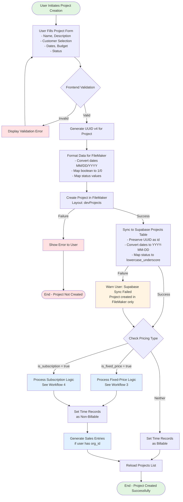
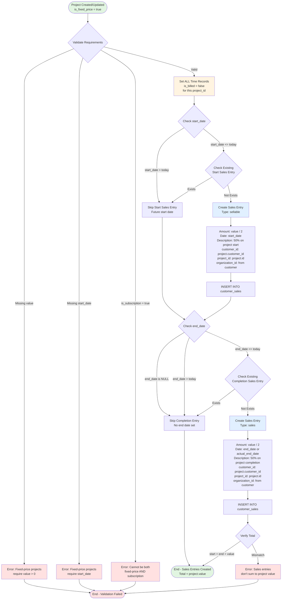
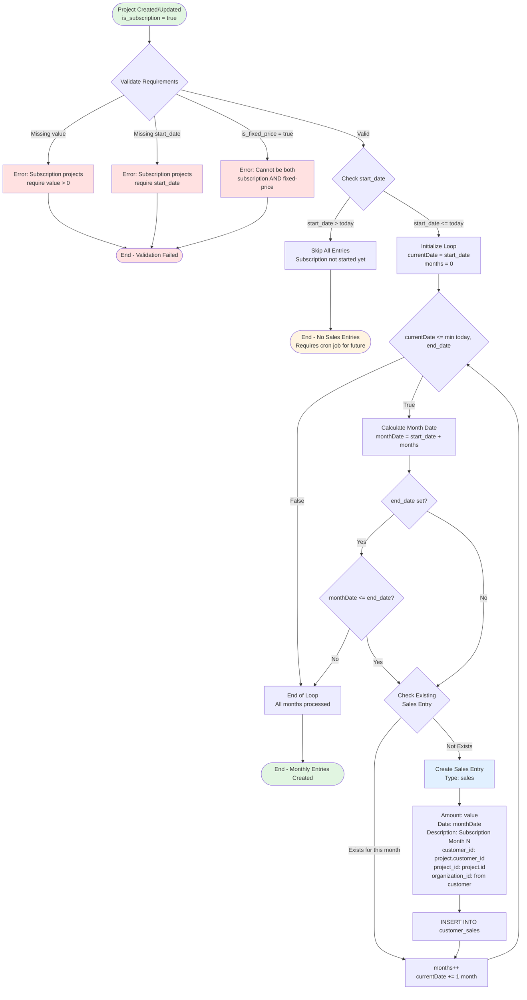
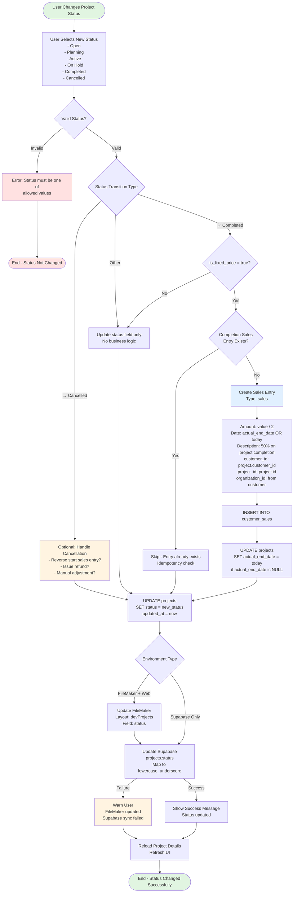
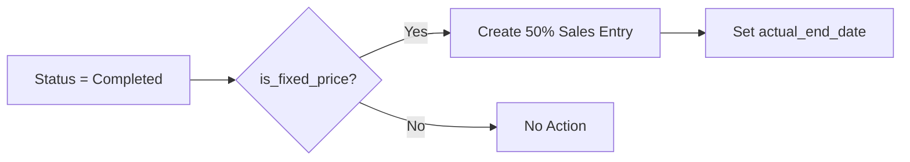
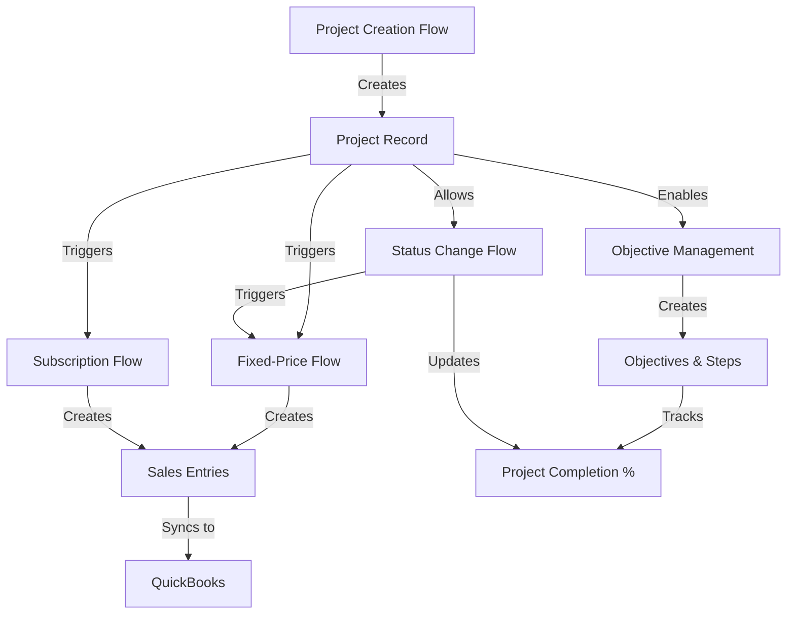
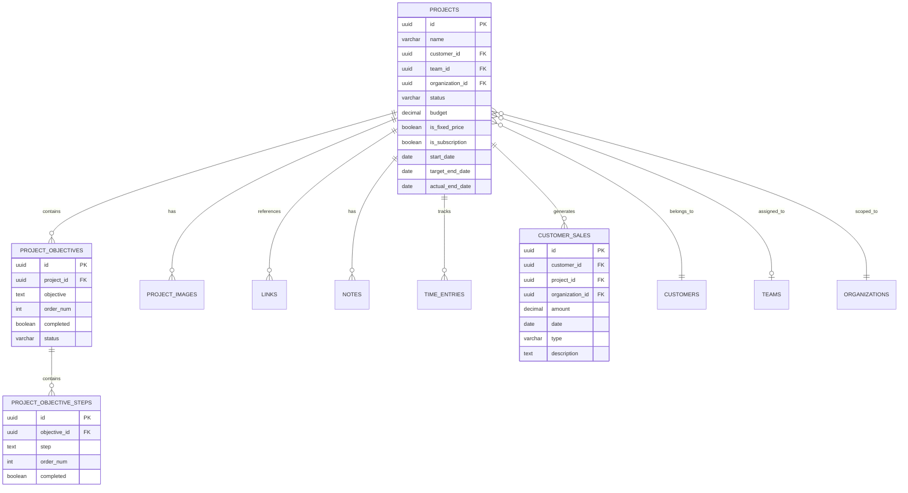

# Projects - Workflow Diagrams

This document provides visual workflow diagrams showing the key operational flows for the Projects feature, including creation, objective management, business logic processing, and status transitions.

## Overview

The Projects feature involves complex workflows with multiple entities and business rules. These diagrams illustrate:

1. **Project Creation Flow** - End-to-end process from user input to database persistence
2. **Objective & Step Management Flow** - Hierarchical task management workflow
3. **Fixed-Price Project Value Processing** - Sales entry generation for fixed-price projects
4. **Subscription Sales Generation Flow** - Recurring revenue processing for subscriptions
5. **Status Change Flow** - State transitions and business logic triggers

---

## 1. Project Creation Flow

This diagram shows the complete workflow for creating a new project, including validation, dual-write synchronization, and business logic execution.



**Code References**:
- Frontend Hook: `src/hooks/useProject.js:185-305` (`handleProjectCreate`)
- Service Logic: `src/services/projectService.js:213-259` (`validateProjectData`)
- FileMaker API: `src/api/projects.js:112-124` (`createProject`)
- Business Logic: `src/services/projectService.js:508-596` (`processProjectValue`)

**Key Decision Points**:
1. **Validation** - Ensures required fields (name, customer_id) are present
2. **Pricing Type** - Determines whether to generate sales entries
3. **Sync Result** - Warns user if Supabase sync fails but FileMaker succeeds

**Error Handling**:
- Validation errors stop the flow immediately
- FileMaker creation failure prevents Supabase sync
- Supabase sync failure doesn't block completion (degrades gracefully)

---

## 2. Objective & Step Management Flow

This diagram illustrates the hierarchical workflow for managing project objectives and their associated steps, including completion tracking.

```mermaid
flowchart TD
    Start([User Views Project Details]) --> ShowObj[Display Objectives List<br/>Ordered by order_num]

    ShowObj --> UserAction{User Action}

    UserAction -->|Add Objective| CreateObjForm[User Enters Objective Text<br/>Status defaults to Open]
    CreateObjForm --> CalcOrder[Calculate order_num<br/>= max(existing orders) + 1]
    CalcOrder --> CreateObjDB[Create in FileMaker<br/>Layout: devProjectObjectives]
    CreateObjDB --> Delay[Wait 500ms<br/>Avoid race condition]
    Delay --> ReloadObj[Reload Project Details<br/>Fetch updated objectives]
    ReloadObj --> ShowObj

    UserAction -->|Edit Objective| EditObjForm[Edit Objective Text/Status]
    EditObjForm --> UpdateObjDB[Update in FileMaker<br/>Layout: devProjectObjectives]
    UpdateObjDB --> ReloadObj

    UserAction -->|Toggle Completion| ToggleObjFlag{Current Status}
    ToggleObjFlag -->|completed = false| SetObjComplete[Set f_completed = 1<br/>Update timestamp]
    ToggleObjFlag -->|completed = true| SetObjIncomplete[Set f_completed = 0<br/>Update timestamp]
    SetObjComplete --> UpdateObjDB
    SetObjIncomplete --> UpdateObjDB

    UserAction -->|Delete Objective| ConfirmDelObj{Confirm Deletion}
    ConfirmDelObj -->|Cancel| ShowObj
    ConfirmDelObj -->|Confirm| CascadeSteps[Delete ALL Steps<br/>for this objective<br/>CASCADE]
    CascadeSteps --> DeleteObjDB[Delete Objective Record<br/>Layout: devProjectObjectives]
    DeleteObjDB --> ReloadObj

    UserAction -->|Reorder Objectives| DragDrop[User Drags Objective<br/>to New Position]
    DragDrop --> UpdateOrders[Update order_num<br/>for affected objectives]
    UpdateOrders --> BatchUpdate[Batch Update Multiple Records<br/>Layout: devProjectObjectives]
    BatchUpdate --> ReloadObj

    UserAction -->|Expand Objective| ShowSteps[Display Steps List<br/>Ordered by order_num]

    ShowSteps --> StepAction{User Action on Steps}

    StepAction -->|Add Step| CreateStepForm[User Enters Step Text]
    CreateStepForm --> CalcStepOrder[Calculate order_num<br/>= max(existing step orders) + 1]
    CalcStepOrder --> CreateStepDB[Create in FileMaker<br/>Layout: devProjectObjSteps]
    CreateStepDB --> ReloadSteps[Reload Objective Steps<br/>Fetch updated steps]
    ReloadSteps --> ShowSteps

    StepAction -->|Edit Step| EditStepForm[Edit Step Text]
    EditStepForm --> UpdateStepDB[Update in FileMaker<br/>Layout: devProjectObjSteps]
    UpdateStepDB --> ReloadSteps

    StepAction -->|Toggle Completion| ToggleStepFlag{Current Status}
    ToggleStepFlag -->|completed = false| SetStepComplete[Set completed = true<br/>Update timestamp]
    ToggleStepFlag -->|completed = true| SetStepIncomplete[Set completed = false<br/>Update timestamp]
    SetStepComplete --> UpdateStepDB
    SetStepIncomplete --> UpdateStepDB

    StepAction -->|Delete Step| ConfirmDelStep{Confirm Deletion}
    ConfirmDelStep -->|Cancel| ShowSteps
    ConfirmDelStep -->|Confirm| DeleteStepDB[Delete Step Record<br/>Layout: devProjectObjSteps]
    DeleteStepDB --> ReloadSteps

    StepAction -->|Reorder Steps| DragDropStep[User Drags Step<br/>to New Position]
    DragDropStep --> UpdateStepOrders[Update order_num<br/>for affected steps]
    UpdateStepOrders --> BatchUpdateSteps[Batch Update Multiple Records<br/>Layout: devProjectObjSteps]
    BatchUpdateSteps --> ReloadSteps

    StepAction -->|Close Steps| ShowObj
    UserAction -->|Close Project| End([End])

    style Start fill:#e1f5e1
    style End fill:#e1f5e1
    style ConfirmDelObj fill:#fff4e1
    style ConfirmDelStep fill:#fff4e1
    style CascadeSteps fill:#ffe1e1
```

**Code References**:
- Objective Creation: `src/hooks/useProject.js:520-552` (`handleObjectiveCreate`)
- FileMaker Layouts:
  - `devProjectObjectives` (objectives)
  - `devProjectObjSteps` (steps)
- API Calls: `src/api/fileMaker.js:413-415`

**Hierarchical Relationship**:
```
Project (1)
  ├── Objective 1 (order_num: 1)
  │   ├── Step 1.1 (order_num: 1)
  │   ├── Step 1.2 (order_num: 2)
  │   └── Step 1.3 (order_num: 3)
  ├── Objective 2 (order_num: 2)
  │   ├── Step 2.1 (order_num: 1)
  │   └── Step 2.2 (order_num: 2)
  └── Objective 3 (order_num: 3)
```

**Key Features**:
- **Order Management** - `order_num` determines display sequence
- **Cascade Deletes** - Deleting objective removes all its steps
- **Completion Tracking** - Toggle completed flag for objectives and steps
- **Race Condition Handling** - 500ms delay after creation before reload

---

## 3. Fixed-Price Project Value Processing Flow

This diagram shows the business logic for fixed-price projects, including sales entry generation at project start and completion.



**Code References**:
- Business Logic: `src/services/projectService.js:508-596` (`processProjectValue`)
- Sales Creation: `src/hooks/useProject.js:285-288` (`createSalesFromProjectValue`)
- Time Record Update: `src/services/billableHoursService.js:288-309`

**Sales Entry Examples**:

**Project**: Website Redesign, Value: $10,000, Start: 2024-01-15, End: 2024-06-30

| Type | Amount | Date | Description |
|------|--------|------|-------------|
| sellable | $5,000 | 2024-01-15 | Fixed price project (Website Redesign) - 50% on start |
| sales | $5,000 | 2024-06-30 | Fixed price project (Website Redesign) - 50% on completion |

**Idempotency Strategy**:
```sql
-- Check if sales entry already exists before creating
SELECT id FROM customer_sales
WHERE customer_id = :project.customer_id
  AND date = :project.start_date
  AND product_name LIKE '%50% on project start%'
  AND total_price = :project.value / 2
LIMIT 1;
```

**Edge Cases Handled**:
1. **Future Start Date** - Entry not created until date arrives (requires cron job)
2. **Future End Date** - Entry created when status changes to "Completed" OR date arrives
3. **Duplicate Prevention** - Idempotency check prevents duplicate sales entries
4. **Non-Billable Hours** - All time records marked `is_billed = false`

---

## 4. Subscription Sales Generation Flow

This diagram illustrates the monthly recurring revenue processing for subscription-based projects.



**Code References**:
- Business Logic: `src/services/projectService.js:562-593` (`processProjectValue` - subscription section)
- Date Calculation: `src/services/projectService.js:598-608` (`calculateMonthsBetweenDates`)

**Subscription Entry Examples**:

**Project**: Monthly Hosting, Value: $500/month, Start: 2024-01-01, End: 2024-06-30

| Month | Amount | Date | Description |
|-------|--------|------|-------------|
| 1 | $500 | 2024-01-01 | Subscription project (Monthly Hosting) - Month 1 |
| 2 | $500 | 2024-02-01 | Subscription project (Monthly Hosting) - Month 2 |
| 3 | $500 | 2024-03-01 | Subscription project (Monthly Hosting) - Month 3 |
| 4 | $500 | 2024-04-01 | Subscription project (Monthly Hosting) - Month 4 |
| 5 | $500 | 2024-05-01 | Subscription project (Monthly Hosting) - Month 5 |
| 6 | $500 | 2024-06-01 | Subscription project (Monthly Hosting) - Month 6 |

**Monthly Calculation Logic**:
```javascript
// Calculate months between dates
function calculateMonthsBetweenDates(startDate, endDate) {
    const start = new Date(startDate);
    const end = new Date(endDate);

    let months = 0;
    let currentDate = new Date(start);

    while (currentDate <= end) {
        if (currentDate.getDate() === start.getDate()) {
            months++;
        }
        currentDate.setMonth(currentDate.getMonth() + 1);
    }

    return months;
}
```

**Background Job Requirements**:
- **Frequency**: Monthly cron job (1st of each month)
- **Query**: Find all projects where `is_subscription = true` AND (`end_date IS NULL` OR `end_date >= today`)
- **Action**: Generate new sales entry for current month if not exists
- **Idempotency**: Check for existing entry before creating

**Edge Cases**:
1. **Perpetual Subscription** (no end_date) - Generate entries month-by-month via cron
2. **Mid-Month Start** - First entry on actual start date, subsequent on same day each month
3. **Value Changes** - Future entries use new value, past entries unchanged
4. **Subscription End** - No entries created after end_date

---

## 5. Status Change Flow

This diagram shows the workflow for updating project status and the business logic triggered by specific status transitions.



**Code References**:
- Status Update: `src/api/projects.js:92-104` (`updateProjectStatus`)
- Hook Handler: `src/hooks/useProject.js:375-415` (`handleProjectStatusChange`)
- Completion Logic: `src/services/projectService.js:543-559` (`processProjectValue` - end date section)

**Status Mapping** (FileMaker → Supabase):
```javascript
const statusMap = {
    'Open': 'active',
    'Active': 'active',
    'Planning': 'pending',
    'Pending': 'pending',
    'On Hold': 'on_hold',
    'Completed': 'completed',
    'Complete': 'completed',
    'Closed': 'completed',
    'Cancelled': 'cancelled'
};
```

**Status Transition Business Rules**:

| From Status | To Status | Business Logic Triggered |
|-------------|-----------|-------------------------|
| Any | Completed | If `is_fixed_price = true`: Create 50% completion sales entry |
| Any | Completed | Set `actual_end_date = today` if NULL |
| Any | Cancelled | Optional: Reverse sales entries or issue refunds |
| Any | On Hold | No special logic |
| On Hold | Active | Resume project - no special logic |
| Active | Completed | Same as any → Completed |

**Completion Sales Entry Trigger**:


**Edge Cases**:
1. **Multiple Completions** - Idempotency check prevents duplicate sales entries
2. **Incomplete to Completed** - Sales entry created immediately with today's date
3. **Completed to Active** - No reversal logic (manual intervention required)
4. **Cancelled Projects** - Business decision: refund start payment or keep as non-refundable

---

## Workflow Integration Summary

These workflows integrate to form the complete Projects feature:



**Integration Points**:
1. **Creation → Pricing Logic** - Project creation triggers fixed-price or subscription flows
2. **Status → Completion Logic** - Status change to "Completed" triggers final sales entry
3. **Objectives → Completion Tracking** - Objective/step completion calculates project progress
4. **Sales Entries → Financial Sync** - Generated sales entries sync to QuickBooks
5. **Time Records → Billing** - Fixed-price projects mark time as non-billable

---

## Database Schema Flow

Entity relationships and cascade behaviors:



**Cascade Behaviors**:
- Delete Project → CASCADE deletes objectives, steps, images, links, notes
- Delete Project → SET NULL on time_entries.project_id (preserve time records)
- Delete Objective → CASCADE deletes all steps
- Delete Team → SET NULL on projects.team_id (preserve project)
- Delete Customer → RESTRICT (cannot delete customer with projects)

---

## Performance Considerations

**Query Optimization**:

```sql
-- Efficient: Uses indexes
SELECT * FROM projects WHERE customer_id = 'uuid-123'; -- Uses idx_projects_customer_id
SELECT * FROM projects WHERE status = 'active'; -- Uses idx_projects_status

-- Inefficient: Full table scan
SELECT * FROM projects WHERE name LIKE '%Website%'; -- No index on name

-- Optimized: Include related data in single query
SELECT
    p.*,
    COUNT(DISTINCT o.id) AS objective_count,
    COUNT(DISTINCT s.id) AS step_count,
    SUM(CASE WHEN s.completed = true THEN 1 ELSE 0 END) AS completed_steps
FROM projects p
LEFT JOIN project_objectives o ON o.project_id = p.id
LEFT JOIN project_objective_steps s ON s.objective_id = o.id
WHERE p.customer_id = 'uuid-123'
GROUP BY p.id;
```

**Recommended Indexes**:
```sql
CREATE INDEX idx_projects_customer_id ON projects(customer_id);
CREATE INDEX idx_projects_status ON projects(status);
CREATE INDEX idx_projects_team_id ON projects(team_id);
CREATE INDEX idx_projects_organization_id ON projects(organization_id);
CREATE INDEX idx_project_objectives_project_id ON project_objectives(project_id);
CREATE INDEX idx_project_objective_steps_objective_id ON project_objective_steps(objective_id);
CREATE INDEX idx_customer_sales_project_id ON customer_sales(project_id);
```

---

## Related Documentation

- **current-implementation.md** - Detailed code analysis and FileMaker integration
- **data-model-mapping.md** - Field-by-field mapping between FileMaker and Supabase
- **api-contracts.md** - Complete API endpoint specifications
- **acceptance-criteria.md** - Testing requirements and success metrics
- **migration-plan.md** - Step-by-step migration strategy
- **authorization.md** - Access control and RLS policies

---

## FileMaker Layout References

**Layouts Used in Workflows**:
- `devProjects` - Main projects table (projectService.js, fileMaker.js:413)
- `devProjectObjectives` - Objectives (fileMaker.js:414)
- `devProjectObjSteps` - Objective steps (fileMaker.js:415)
- `devProjectImages` - Project images (fileMaker.js:416)
- `devProjectLinks` - Project links (fileMaker.js:417)
- `devNotes` - Notes (polymorphic, fileMaker.js:418)
- `devRecords` / `dapiRecords` - Time tracking records (fileMaker.js:420)

---

## Migration Workflow Notes

**Dual-Write Pattern** (Current Implementation):
1. Write to FileMaker (source of truth)
2. Sync to Supabase (for web app access)
3. If sync fails, warn user but don't block

**Future Migration** (Supabase-Only):
1. Write to Supabase only
2. FileMaker becomes read-only
3. Eventually deprecate FileMaker layouts

**Key Migration Challenges**:
- Preserve UUIDs during migration (`__ID` → `id`)
- Convert date formats (MM/DD/YYYY → YYYY-MM-DD)
- Convert boolean flags ("1"/"0" → true/false)
- Map status values (various → standardized lowercase_underscore)
- Ensure sales entries are not duplicated during migration
- Maintain relationship integrity (objectives → steps)
